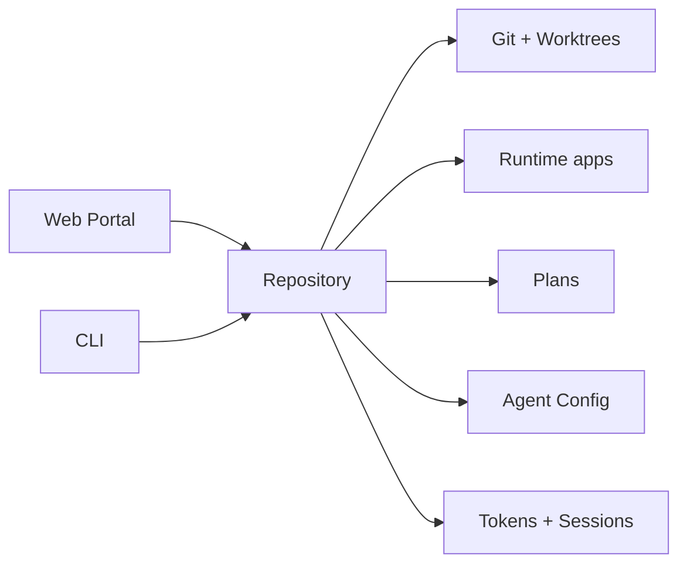
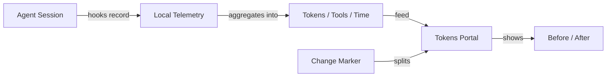
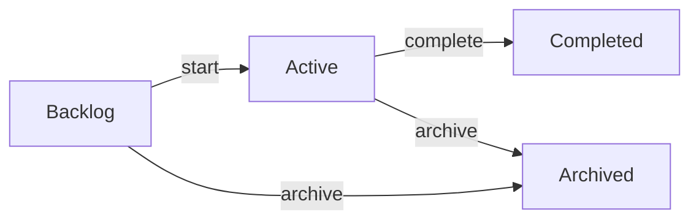

# RoboRepo

**Admin panel for your local dev environment.**

RoboRepo sits at the intersection of **Git**, **runtime activity**, **agent configuration**, **development planning**, and **token/session telemetry**.




---

## Install

Requires **Node.js 20+**.

```sh
npm install -g codethings-roborepo-alpha
roborepo web
```

The first `roborepo web` also runs one-time machine setup. After that, use either entry point:

| Interface  | Start with     |
| ---------- | -------------- |
| Web portal | `roborepo web` |
| Terminal   | `roborepo`     |

[First-time setup →](docs/user/guides/first-time-setup.md)  
[CLI reference →](docs/user/reference/roborepo-cli.md)

---

## Portal


```sh
roborepo web
```


---

## Repositories

RoboRepo keeps one identity per repository, so a checkout, its worktrees, the runtime apps it
runs, its plans, and its agent sessions all resolve to the same repository.

Repository-aware data can include:

| Git            | Runtime      | Development         |
| -------------- | ------------ | ------------------- |
| Branch         | Running apps | Plans               |
| Commit         | Ports / URLs | Plan lifecycle      |
| Dirty state    | Health       | Agent configuration |
| Ahead / behind | Docker       | Token activity      |
| Worktrees      | CPU / memory | Sessions            |
 
---

## Runtime

Discover running local HTTP applications and associate them with repositories. Automatic
discovery currently runs on macOS.

```sh
roborepo runtime
roborepo runtime --open
```

| Observes  | Examples                          |
| --------- | --------------------------------- |
| HTTP      | origin, title, health             |
| Git       | branch, dirty state, ahead/behind |
| Worktrees | linked checkout context           |
| Process   | PID, CPU, memory, uptime          |
| Docker    | container and Compose metadata    |


[Runtime reference →](docs/user/reference/runtime.md)

---


## Agent Configuration

Manage shared agent behavior across supported harnesses. A package bundles skills, commands,
rules, hooks, MCP servers, and permissions; RoboRepo renders each into the native format of
Claude Code, Codex, and Gemini CLI.

Common actions:

```sh
roborepo library
roborepo package list
roborepo package enable <package>
roborepo package disable <package>
```

Automatic helpers:

| Helper                         | Applies when                         |
| ------------------------------ | ------------------------------------ |
| `code-style`                   | Cross-language code conventions      |
| `javascript-typescript`        | JavaScript, TypeScript, ESM, JSX/TSX |
| `react`                        | React components, hooks, and tests   |
| `supabase-integration-testing` | Real Supabase integration tests      |
| `test-harness`                 | Choosing and validating test runs    |


[Config control panel →](docs/user/reference/config-control-panel.md)  
[Supported harnesses →](docs/user/guides/harnesses/supported-harnesses.md)

---

## Tokens + Sessions

Telemetry is **local and opt-in**.

```sh
roborepo telemetry enable
roborepo web
```

Track:

| Usage        | Activity  | Context    |
| ------------ | --------- | ---------- |
| Tokens       | Sessions  | Repository |
| Tool calls   | Testing   | Harness    |
| MCP usage    | Changes   | Model      |
| Context cost | Anomalies | Time       |




[Tokens page user guide →](docs/user/guides/telemetry.md)

---


## Plans

RoboRepo discovers repository planning documents under:

```text
docs/plans/
├── backlog/
├── active/
├── completed/
└── archived/
```

The Plans portal surfaces:

|                 |                                |
| --------------- | ------------------------------ |
| Readiness       | deterministic validation       |
| Priority        | plan metadata                  |
| Dependencies    | blockers and relationships     |
| Git state       | reviewed commit / current HEAD |
| Agent workflows | create, review, start, sync    |




[Plan Suite walkthrough →](docs/user/guides/plan/lifecycle/plan-suite.md)\
[Plans reference →](docs/user/reference/plans-portal.md)

---

## CLI

`roborepo` is the terminal interface to the same system.

```sh
roborepo
```


The README covers common entry points. See the reference for the full command surface.

[Full CLI reference →](docs/user/reference/roborepo-cli.md)

---

## Architecture

| Layer             | Responsibility                        |
| ----------------- | ------------------------------------- |
| Repository domain | canonical repository identity         |
| Domain modules    | Plans, Runtime, telemetry, config |
| Packages          | configurable RoboRepo functionality   |
| Harness providers | harness-specific implementations      |
| Portal            | browser interface                     |
| CLI               | terminal interface                    |

[Architecture →](docs/user/reference/architecture.md)

---

## Development

Requires **Node.js 20+**.

```sh
git clone https://github.com/kirinmurphy/roborepo.git
cd roborepo

npm test
./bin/roborepo --help
```

Use the checkout-local executable while developing:

```sh
./bin/roborepo
```

A separately installed global `roborepo` command can remain pointed at the packaged installation.

Maintainer docs start at the [documentation map](docs/internal/docs-map.md); for how harness
support works, see [How the Harnesses Work](docs/internal/harnesses-explained.md).

---

## Documentation

|                   |                                                                                            |
| ----------------- | ------------------------------------------------------------------------------------------ |
| First-time setup  | [docs/user/guides/first-time-setup.md](docs/user/guides/first-time-setup.md)               |
| CLI               | [docs/user/reference/roborepo-cli.md](docs/user/reference/roborepo-cli.md)                 |
| Runtime       | [docs/user/reference/runtime.md](docs/user/reference/runtime.md)                   |
| Plans             | [docs/user/reference/plans-portal.md](docs/user/reference/plans-portal.md)                 |
| Telemetry         | [docs/user/guides/telemetry.md](docs/user/guides/telemetry.md)                             |
| Agent config      | [docs/user/reference/config-control-panel.md](docs/user/reference/config-control-panel.md) |
| Architecture      | [docs/user/reference/architecture.md](docs/user/reference/architecture.md)                 |
| All user docs     | [docs/user/README.md](docs/user/README.md)                                                 |

---

## License

MIT
