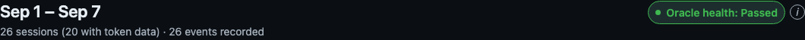
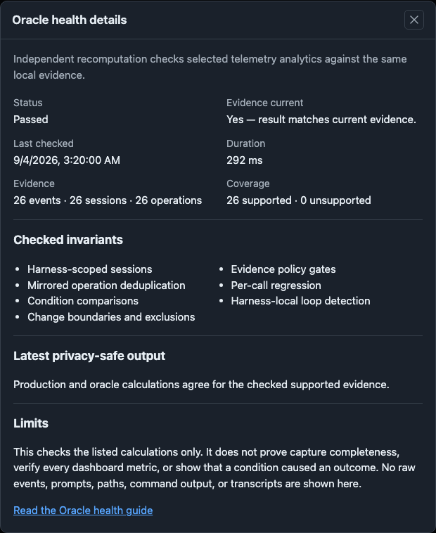

# Tokens page screenshots

These images show the real Tokens UI using **fictional, deterministic sample data**.
They contain no personal telemetry. Both light and dark versions are provided.
Dates use UTC and formatting uses `en-US`.

## Gallery

Click an image to inspect it at full size. Each row shows the same sample in both themes.

| View | Light | Dark |
| --- | --- | --- |
| Conditions: compare known presence with known absence |  |  |
| Comparison detail: 3/12 affected with the condition, 9/12 without; two unknown sessions affect coverage only |  |  |
| Event ledger: observed problems and recorded changes in time |  |  |
| Recorded change: before/after counts and boundary exclusions |  |  |
| Mark a change: effective time, repository scope, and watched problems |  |  |
| Oracle health: the live comparison badge beside the report period |  |  |
| Oracle health details: freshness, aggregate counts, coverage, checked invariants, and limits |  |  |

## Reproduce

From the feature checkout:

```sh
node scripts/test/telemetry-conditions-matrix-check.mjs
TELEMETRY_DOC_SCREENSHOTS="$PWD/docs/images/tokens" npm run test:portal-ui
```

The screenshot tests are opt-in; ordinary browser runs do not overwrite documentation assets.
Fixture: `scripts/test/fixtures/telemetry-conditions-documentation.mjs`.
Capture script: `scripts/test/portal-ui/telemetry-documentation.spec.mjs`.
The same fixture is checked against fixed numerical expectations by the isolated unit matrix.
Screenshots capture actual rendered sections/dialogs; they are not generated illustrations.

## Test coverage

`telemetry-conditions-matrix-check.mjs` checks 2,850 deterministic scenarios:

- 2,592 condition/event cases: all 6³ three-observation states, all six orderings,
  both with and without duplicated observations.
- 10 explicit rate/sample/event-floor golden cases.
- 16 snapshot evaluability cases, including missing snapshots and v2 unavailable evidence.
- 35 invalid token field cases.
- 162 session token-validity cases (valid, missing, invalid) across all small-input orderings.
- 24 mirrored-flow/cross-harness permutations.
- 10 marker-boundary cases, including sequence ties and unrelated sequence domains.
- 1 documentation fixture with independently specified cohort counts and rates.

This is exhaustive for the stated small-input spaces, not a claim to enumerate all
possible telemetry records or browser states. Existing integration/cache/boundary suites
cover larger fixtures and persistence behavior.
