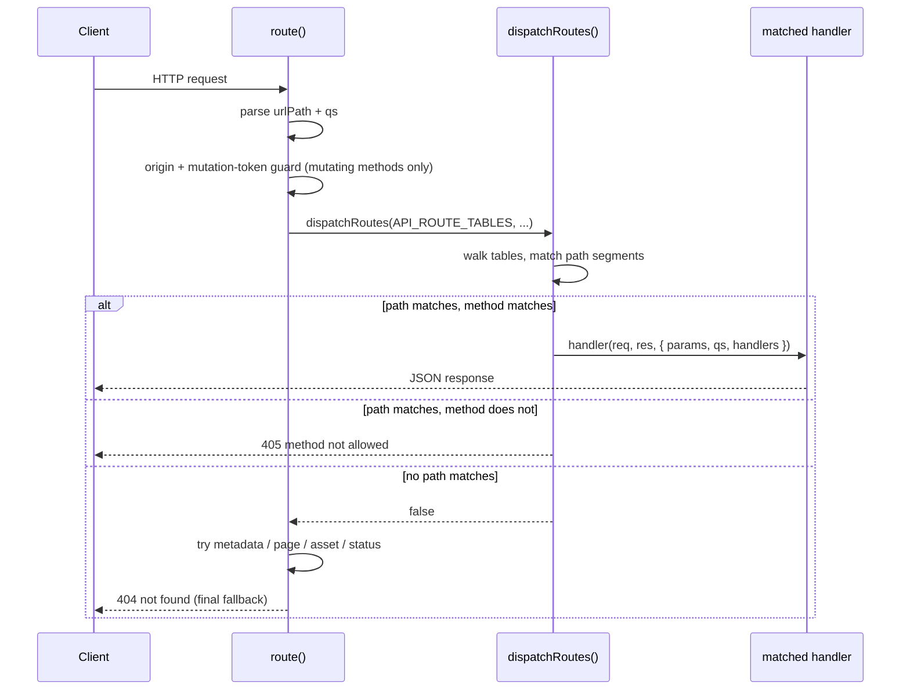

# Portal Architecture

## Purpose

The portal is the local `roborepo web` UI: Home (`/`), Config (`/config`), Plans (`/plans`),
Runtime (`/runtime`), Settings (`/settings`), Tokens (`/tokens`), and bookmarkable repository detail pages
(`/repositories/<urlKey>`). It is static HTML/CSS/browser JavaScript
served by a loopback-only Node HTTP server — no build step, no framework, no bundler. This doc
covers the shared architecture (page manifest, browser API helpers, server route dispatch) that
every page relies on. Page-specific behavior lives in
`docs/user/reference/config-control-panel.md`, `docs/user/reference/plans-portal.md`, and
`docs/user/reference/repositories.md`.

## Directory Layout

```
portal/
  shared/
    base.css     — shared palette + chrome styles
    theme.js     — header/footer/nav/theme-toggle, reads window.PORTAL_MANIFEST
    api.js       — shared fetch/token/clipboard/DOM helpers (ES module)
  home/{index.html,styles.css,app.js,api.js,templates.js}
  repositories/{index.html,styles.css,app.js,api.js,templates.js}
  config/{index.html,styles.css,app.js}
  plans/{index.html,styles.css,app.js}
  developer-runtime/{index.html,styles.css,app.js,api.js,state.js,templates.js}
  settings/{index.html,styles.css,app.js,api.js,templates.js}
  tokens/{index.html,styles.css,app.js}      — /tokens (token report)
scripts/cli/portal-server.mjs   — the server: page manifest, route dispatch, static assets
scripts/cli/portal-router.mjs   — the route table matcher every domain file builds on
scripts/cli/portal-routes-metadata.mjs — /manifest.json, /sitemap.xml, /robots.txt (generated from PAGES)
```

Every page's `index.html` links `/portal/shared/base.css` and loads `theme.js` and its own
`app.js` as `<script type="module">` (module scripts defer by default, so no separate `defer`
attribute is needed).

## How the Manifest Reaches the Browser

`PAGES` in `scripts/cli/portal-server.mjs` is the single source of truth for the six static
navigation entries (`id`, `path`, `title`, `dir`, optional `default`). `PAGE_ROUTES` extends that
table with non-navigation dynamic routes such as `/repositories/:urlKey`. There is no browser-side
copy to hand-sync:

1. `pageManifest()` derives the browser-safe `{ path, id, title }` shape from `PAGES`.
2. `pageHtml()` injects `window.PORTAL_MANIFEST = { token, pages: [...], currentPageId,
   routeParams }` into every served page's `<head>`, right beside the existing
   `<meta name="cli-portal-token">` tag. `currentPageId` lets a dynamic page identify the static
   nav entry it belongs to; `routeParams` carries its decoded segment values.
3. `/api/portal/status` returns the same `pageManifest()` shape, so the terminal-facing status
   check and the browser nav can never drift.
4. `portal/shared/theme.js` reads `window.PORTAL_MANIFEST.pages` to render the nav and uses
   `currentPageId` to mark the active link. Repository detail therefore marks Home active without
   adding a sixth nav item. If the global is missing (e.g. a page opened directly as a file, or a broken
   injection), `theme.js` throws `"portal manifest missing"` immediately instead of silently
   rendering an empty nav.
5. `theme.js` also injects a full-page loading overlay (`#page-loading`) alongside the header and
   footer. Each page hides it (via `portalHideLoading()`) once its own first data fetch resolves;
   it is not shown again on later polls. Page-specific status/metadata (plan counts, telemetry
   stats, etc.) is ordinary in-page markup scoped near what it describes — not a persistent status
   bar.

## Adding a Page

1. For a static navigation destination, add an entry to `PAGES` in
   `scripts/cli/portal-server.mjs` (`id`, `path`, `title`, `dir`). For a parameterized destination,
   add only a `PAGE_ROUTES` entry and point its `navId` at the owning static page.
2. Create `portal/<dir>/{index.html,styles.css}`. `index.html` links
   `/portal/shared/base.css`, then loads `/portal/shared/theme.js` (and, for data-driven pages,
   `/portal/<dir>/app.js`) as `type="module"`.
3. In `app.js`, import what you need from `/portal/shared/api.js` (see below) instead of writing
   page-local fetch/token/clipboard helpers.
4. If the page needs its own read or mutating API routes, add a `scripts/cli/portal-routes-<domain>.mjs`
   exporting a route table built with `defineRoutes()` (see "Server Route Dispatch") and add it to
   `API_ROUTE_TABLES` in `portal-server.mjs`.
5. Run the checks in "Checks to Run" below.

Nothing else needs updating for a static page — the nav and `/api/portal/status` are driven by
`PAGES`. Keep a dynamic page out of `PAGES` so navigation, sitemap, and portal status stay
concrete. Each route is canonical; Home owns `/`, Agents owns `/config`, and repository detail
owns `/repositories/:urlKey`.

## Shared Browser API (`portal/shared/api.js`)

An ES module every page imports from. It owns the mutation-token contract so no page reimplements
it:

| Export | Purpose |
| --- | --- |
| `portalConfig()` | Reads `window.PORTAL_MANIFEST`; throws `"portal manifest missing"` if absent. |
| `portalGetJson(path)` | `fetch` + `.json()`; throws with the server's `error`/`message` on a non-OK response. |
| `portalPostJson(path, body)` | Same, but POST with `Content-Type: application/json` and `X-Cli-Portal-Token` attached from `portalConfig().token`. Also throws if the response body has `ok: false`. |
| `portalCopyText(text, onCopied?)` | Wraps `navigator.clipboard.writeText`; swallows clipboard-blocked errors; calls `onCopied()` on success. |
| `portalSetUpdatedAt(date?, { cadenceMs }?)` | Marks a successful update for the `#portal-updated` freshness indicator. With the page's poll cadence it ages on its own: active (a dot) within 2× the cadence, `Waiting` past 2×, `Not connected` past 10×. Pages that never poll omit the cadence and stay active. `date` only appears in the tooltip. |
| `portalHideLoading()` | Hides the shared full-page loading overlay (`#page-loading`, injected by `theme.js`). Call once after a page's first data fetch resolves — success or handled error — never again after that. |
| `portalTpl(id)` | Clones a `<template>` element's first child by id. The shared render pattern for dynamically-injected markup, so pages keep an HTML anchor instead of building raw strings. |
| `portalFillSlots(node, fills)` | Fills `data-slot` elements in a cloned template with text, a replacement node, or attributes. |

### Shared plan drawer

The plan detail popup is one component on every page that shows it (Plans and Home). Its dialog,
templates, and stylesheet link live in `portal/plans/plan-drawer-partial.html`, injected wherever a
page places `{{PLAN_DRAWER}}`; `portal/plans/plan-drawer.js` (`createPlanDrawer`) fills and opens it.
The page supplies the plan list blockers resolve against and the plan-write package state. Plans
handles the drawer's `plan-change` events with its mutation orchestrator; Home passes `readonly`,
so `<plan-status>` renders lifecycle and priority as chips.

### Adding a Read API

Add an entry to the relevant domain's route table in its `scripts/cli/portal-routes-<domain>.mjs`
file (see "Server Route Dispatch") whose handler returns JSON via
`send(res, 200, "application/json", JSON.stringify(...))`. No token or origin check is required
for GET routes — they stay tokenless on purpose so `curl`/local debugging keeps working. They are
still covered by the loopback Host check described under "Mutation-Token Contract". Call it
from the page with `portalGetJson(path)`.

### Adding a Mutating API

Mutating routes must be POST (or PATCH — see `portal-routes-repositories.mjs`). `route()` already
gates every mutating method with the origin check and the mutation-token check before any handler
runs (see "Mutation-Token Contract" below), so the handler itself only needs to validate its body
shape and return a JSON result. Call it from the page with `portalPostJson(path, body)` — the
token header is attached automatically.

## Server Route Dispatch

Every domain's API surface is declared as a **route table**, not an if-chain — this is the pattern
every new domain must follow. `scripts/cli/portal-routes-<domain>.mjs` exports an array built with
`defineRoutes()` (from `scripts/cli/portal-router.mjs`):

```js
// scripts/cli/portal-routes-usage.mjs
export const usageRoutes = defineRoutes([
  {
    method: "GET",
    path: "/api/usage",
    handler: (req, res, { handlers }) => {
      send(res, 200, "application/json", JSON.stringify(buildUsageResponse()));
      return true;
    },
  },
]);
```

A route entry is `{ method, path, handler }`:

| Field | Value | Notes |
| --- | --- | --- |
| `method` | `GET` / `POST` / `PATCH` / omitted | Omit to match any method — rare; only read-only routes with no side effect should do this. |
| `path` | Literal (`/api/plans`) or `:param` pattern (`/api/repositories/:id/associations`) | Matcher splits pattern and URL on `/` and compares segment-by-segment, so a `:param` only ever captures one segment. |
| `handler` | `(req, res, { params, qs, handlers }) => boolean` | `params` holds decoded `:param` values (repository ids contain `:`/`/`, so they arrive percent-encoded and come out decoded). Returns `true` once it has written a response; may return `false` to let matching continue, mirroring the old `handle<Domain>Api` contract. |

`portal-server.mjs` concatenates every domain's table into one `API_ROUTE_TABLES` array and calls
`dispatchRoutes(API_ROUTE_TABLES, req, res, urlPath, qs, handlers)` once per request:



That single `API_ROUTE_TABLES` array is the entire enumerable API surface of the portal, in one
place — which is what would let a future OpenAPI document be generated straight from it instead of
hand-maintained. Each domain's table:

| File | Export | Routes |
| --- | --- | --- |
| `portal-routes-config.mjs` | `configRoutes` | `/api/config`, `/api/config/source`, `/api/config/packages`, `/api/config/skills`, `/api/config/permissions` |
| `portal-routes-settings.mjs` | `settingsRoutes` | `/api/settings` — path-free derived repository, harness, and telemetry setup state |
| `portal-routes-plans.mjs` | `plansRoutes` | `/api/plans`, `/api/plans/document`, `/api/plans/prompt`, `/api/plans/priority`, `/api/plans/lifecycle`, `/api/plans/refresh` |
| `portal-routes-developer-runtime.mjs` | `developerRuntimeRoutes` | `/api/developer-runtime`, `/api/developer-runtime/refresh`, `/api/developer-runtime/history`, `/api/developer-runtime/metadata`, `/api/developer-runtime/links`, `/api/developer-runtime/association`, `/api/developer-runtime/project`, `/api/developer-runtime/alias`, `/api/developer-runtime/compose-project`, `/api/developer-runtime/repository-visibility`, `/api/developer-runtime/repository-pinned` |
| `portal-routes-repositories.mjs` | `repositoriesRoutes` | `/api/home`, `/api/repositories`, `/api/repositories/sources` (GET/POST), `/api/repositories/sources/refresh` (POST), `/api/repositories/sources/:sourceId/enabled` (POST), `/api/repositories/sources/:sourceId/remove` (POST), `/api/repositories/:id`, `/api/repositories/:id/associations`, `/api/repositories/:urlKey/overview` — Home/detail use the stable browser key; management routes use encoded canonical ids. The `sources` routes are the only ones that carry configured source paths, and are listed before `:id` so `sources` is never read as a repository id |
| `portal-routes-usage.mjs` | `usageRoutes` | `/api/usage`, `/api/usage/refresh` |
| `portal-routes-telemetry.mjs` | `telemetryRoutes` | `/api/data`, `/api/session`, `/api/insights-llm`, `/api/telemetry/markers` (GET/POST), `/api/telemetry/experiments` (GET/POST), `/api/telemetry/experiments/:id/end` (POST), `/api/telemetry/analysis` (POST) — see `docs/user/reference/telemetry.md` for the marker/experiment/analysis domain |
| `portal-routes-metadata.mjs` | `handleMetadataAsset` | `/manifest.json`, `/sitemap.xml`, `/robots.txt` — called separately from `API_ROUTE_TABLES` since these are unauthenticated static assets, not `/api/*` routes (see "Self-Describing Metadata" below) |
| `portal-server.mjs` | `handlePortalPage` | Serves a page's `index.html` (with the injected manifest + token) |
| `portal-server.mjs` | `handlePortalAsset` | Static files under `/portal/` |
| `portal-server.mjs` | `handlePortalStatus` | `/api/portal/status` |

`scripts/cli/portal-routes-http.mjs` holds the `send`/`readJsonBody` helpers every route file
imports.

Adding a new API domain means adding one more `portal-routes-<domain>.mjs` file exporting one more
route table, and one more line in `portal-server.mjs`'s `API_ROUTE_TABLES` array — each domain's
API surface stays in its own file instead of growing a shared one.

`validateRouteTables()` (`portal-router.mjs`) runs once, synchronously, right after
`API_ROUTE_TABLES` is built — before the server binds a port. It rejects a route with no leading
`/` or no handler function, and rejects two routes that resolve to the same `method` + segment
shape (`:param` names are normalized away for this check, so `/api/x/:id` and `/api/x/:foo` count
as the same route and collide). A copy-pasted or malformed entry fails loudly at startup instead of
silently shadowing another route at request time.

## Repository Overview Aggregation

Home and repository detail share `scripts/cli/repository-overview.mjs`. The service anchors its
result on visible canonical registry records and joins domain data by canonical `repositoryId`.
Each source is projected independently into a small envelope:

```json
{ "status": "available|partial|stale|unavailable", "updatedAt": "ISO-8601|null", "data": {} }
```

The aggregate request path reads bounded in-memory projections only:

- Runtime supplies its cached repository/worktree snapshot. The mapper keeps lifecycle, branch and
  Git status, each checkout's `projectRoot` (for the shared tooltip and copy control, never as
  identity), a linked worktree's `worktreeName`, and one promoted `primaryEntrypoint` per checkout,
  including that entrypoint's opaque key for route discovery. It drops every other opaque runtime
  key, secondary ports, PIDs, and container internals.
- Plans supplies its last cached discovery result. Missing scan coverage is `unavailable`, not an
  authoritative zero. Recently changed plans prefer Git last-change time and fall back to mtime.
- Tokens supplies a compact repository/session warning projection retained beside the default
  telemetry analysis cache. The Home request never parses or returns the full Tokens report.
- Agents is explicitly `unavailable` until repository-scoped configuration has a data owner.

A source failure changes only that source's envelope. The repository still renders, and a failed
refresh can retain last-known data with `status: "stale"`. Runtime discovery, Plans scanning, and
telemetry analysis remain background or manual work; a ten-second Home/detail poll does not start
them synchronously.

`urlKey` is the only repository identity placed in browser routes. It is allocated once in registry
v2 and resolves to canonical `repositoryId` at the server boundary. The aggregate payload is an
allowlist. Identity fields (`repositoryId`, `urlKey`, summaries) are path-free; the only absolute
paths it carries are each Runtime checkout's `projectRoot`, which feeds the shared checkout tooltip
and copy control and is never used as identity or placed in a URL.

## Self-Describing Metadata

The portal serves `/manifest.json`, `/sitemap.xml`, `/robots.txt`, and `/openapi.json` at their conventional root
paths (`portal-routes-metadata.mjs`), so `builtin:portal` is itself a live, correct example of the
same same-origin conventions `modules/developer-runtime/metadata.mjs` discovers on other apps (see
`docs/user/reference/runtime.md`'s "Metadata suggestions" section).

| Artifact | Source | Why |
| --- | --- | --- |
| `manifest.json` | Generated from `PAGES` at request time | Can never drift from the real page list — adding or removing a page changes it on the next request, nothing to hand-sync. |
| `sitemap.xml` | Generated from `PAGES` at request time | Same guarantee as `manifest.json`. |
| `robots.txt` | Static: `Disallow: /` for every agent, plus a `Sitemap:` declaration | Deliberate, not a placeholder — the portal only ever binds to loopback (`LOOPBACK` in `portal-server.mjs`) and will never actually be crawled, so the file's job is to be an honest, safe example of the convention rather than to invite indexing. |
| `openapi.json` | Generated from `API_ROUTE_TABLES` at request time | Documents the live `/api/*` route table exposed by the portal server. |

## Telemetry Analysis Performance Model

The portal server is single-threaded (Node stdlib `http`), so any expensive synchronous work on a
request blocks every other request while it runs. The telemetry analysis (~35k events / 31MB spool
→ ~780ms of read + parse + analyze + serialize) used to run on the `/api/data` request path, which
is what made navigating between portal pages feel unresponsive while telemetry was capturing. Three
layers keep that work off the request path (all in `scripts/cli/telemetry.mjs`, main-thread — no
worker):

1. **Incremental spool store** (`readSpoolEventsCached` + `syncSpoolFile`, `_spoolStore`). The spool
   is append-only, so instead of re-reading + re-parsing the whole file each request, parsed events
   are held in memory per file with a byte cursor; each sync reads only newly-appended bytes. A
   partial trailing line (a capture mid-write) is carried, not parsed, until its newline lands. The
   one shrink case is `capSpool` (telemetry-capture.mjs rewrites a file smaller past ~25MB) — the
   store detects `size < offset` and rebuilds that file. Steady-state read drops from ~450-590ms to
   ~1.3ms. The two live-server readers (`cachedAnalysisJson`, `loadInsightsLlm`) use this; the one-shot
   CLI paths (`telemetry report`/`export`) keep the plain full-read `readSpoolEvents`. The incremental
   byte-tail primitive (offset advance, partial-line hold, shrink/rotate detection) lives in
   `scripts/cli/jsonl-tail.mjs` (`readAppendedLines`), shared with the transcript reader.
2. **Serialized-JSON memoization** (`cachedAnalysisEntry`, `_analysisCache`). The serialized report
   JSON is cached per `spoolSignature | window | harness`. The report object is discarded once
   stringified; only the route consumes the string. The same entry retains the compact repository
   warning projection used by Home/detail. The ~10MB default response is not re-`JSON.stringify`'d
   per request — the route sends the cached string via `loadAnalysisJson`.
3. **Debounced background refresh** (`startAnalysisRefresh` / `tickAnalysisRefresh`). A timer polls
   the cheap `spoolSignature`; when it changes it debounces (2s poll / 12s quiet / 60s max-wait) and
   recomputes the **default view** (`window=null, harness=null` — what page loads and the 5s poll
   request) once, keeping it warm. Windowed/panned/harness-filtered requests stay on-demand (cached
   after first compute). The timer is stopped on SIGTERM alongside PID cleanup.

Net: the default `/api/data` is served in ~0.4ms warm; the ~180-270ms analyze runs at most once per
debounce window, between requests, never inside one. The dashboard may lag a new capture by up to
the debounce interval — acceptable, and surfaced by the existing "updated" timestamp.

## Mutation-Token Contract

The server binds to loopback only (`127.0.0.1`), but a browser page can still attempt a
cross-origin POST. Every POST request passes through two checks in `route()` before any handler
runs:

1. **Origin check** — if an `Origin` header is present, it must match `127.0.0.1`/`localhost`
   (any port). Requests with no `Origin` header (e.g. `curl`) are allowed through.
2. **Mutation-token check** — the `X-Cli-Portal-Token` header must match the token generated
   once per server process (`crypto.randomBytes(32)`) and embedded only in served page HTML via
   `window.PORTAL_MANIFEST.token`.

A forged POST from an unrelated site fails the origin check; a POST from a script that never
loaded a portal page fails the token check.

Before either check, every request — reads included — must name a loopback host: a `Host` header of
`127.0.0.1`, `localhost`, or `[::1]` (any port), or no `Host` header at all. Tokenless reads would
otherwise be open to DNS rebinding, where a hostile page re-points its own hostname at `127.0.0.1`
and reads portal JSON under its own origin; its requests still carry that hostname, so they get a
403. `portalPostJson` always attaches the token from
`portalConfig()`, so any page using it automatically satisfies this contract.

## Checks to Run

- `npm test` (`scripts/test/test-cli.sh`) — starts the portal server, asserts
  `/api/portal/status`, token exposure, mutating POST success/400/403 responses, and that each
  served `app.js` parses (`node --check`).
- `roborepo web` — click through Home → repository detail → Home → Agents → Plans → Runtime → Tokens,
  confirm nav highlighting and browser history, and
  exercise each page's mutations (Config toggles, Plans refresh/discovery-root edits, Telemetry
  "turn on telemetry").
- `node --input-type=module --check < portal/<page>/app.js` for a quick module-syntax check on a
  page you edited (page scripts are ES modules, so plain `node --check` on the file path also
  works since `.js` files in this repo are treated as modules by the check).
