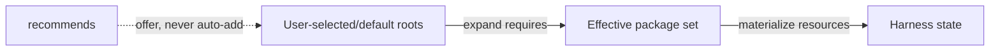
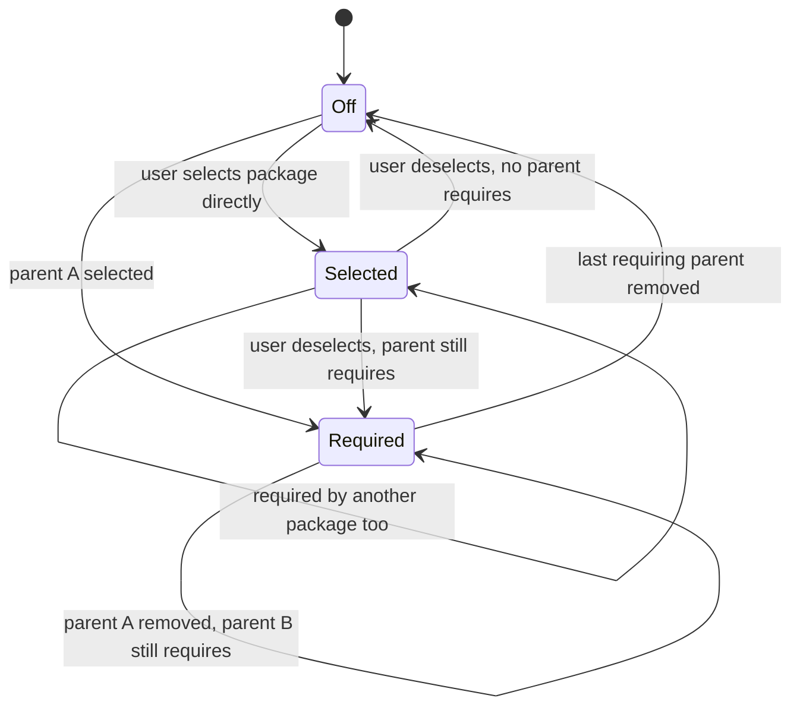

# Derived Package Dependencies and Dependency Presentation

## Summary

RoboRepo packages need to distinguish a feature the user explicitly selects from behavior that is active only because another selected feature depends on it. The existing `requires` relationship recursively enables dependencies, but those dependencies are written into the same enabled-package registry as direct user selections. That makes required dependencies sticky: once enabled through a parent, they become indistinguishable from packages the user chose independently.

This plan makes package activation graph-derived. User selection remains the source of desired root packages; required dependencies are added transitively to effective state and disappear automatically when no selected package requires them. It also adds recommended dependencies, independent package selectability, and presentation visibility so dependency-only skills can be inspectable without becoming standalone toggles.

The Config/Skills surface will show **Required dependencies** and **Recommended dependencies** for relevant package groups. Dependency rows remain clickable so the existing source popup can inspect their skills, even when the dependency itself is not independently selectable.

## Context

The package catalog already supports `requires`, validates dependency cycles and missing references, and enables required packages recursively in `scripts/cli/packages.mjs`. `enabledDependents()` also prevents direct removal of a package while another enabled package depends on it.

The missing distinction is provenance. `enablePackage()` currently calls `setPackageEnabled()` for the dependency as well as the parent, so the enabled registry cannot answer whether a package is active because the user selected it or because another selected package requires it.

The Config page is already data-driven: `scripts/cli/config.mjs` builds `behaviorView`, package categories come from `manifests/inventory/package-categories.json`, and `portal/config/elements/config-item.js` renders a package row with optional inspect and toggle behavior. That shared view is the right layer to expose dependency sections without creating a second client-side package model.

The immediate consumer is the plan suite: `/session-close` and `/plan-close` need a shared implementation-review skill that should be installed only while one of those user-facing workflows requires it. A separate plan owns that consumer work.

## Goals

- [ ] Keep explicit user selection separate from dependency-derived activation.
- [ ] Preserve `requires` as the strong relationship: a parent cannot be active without every required dependency.
- [ ] Add `recommends` as a weak relationship: recommendations are visible and can be enabled by the user, but do not determine whether the parent is valid or active.
- [ ] Add package-level selectability so a dependency package can never be independently toggled.
- [ ] Add presentation visibility so a dependency package can be omitted from normal package rows while remaining inspectable where it is referenced.
- [ ] Recompute effective activation from selected roots plus the transitive required-dependency closure, so shared dependencies remain active until their last active parent is removed.
- [ ] Show required and recommended dependency sections in the shared Config/Skills presentation model.
- [ ] Keep dependency rows clickable through the existing source-inspection popup.
- [ ] Prompt users about disabled recommended dependencies without making them mandatory.
- [ ] Keep CLI, portal, package status, reconciliation, and live-state probing on one dependency model.

## Non-goals

- Backward compatibility for existing package registries, generated package state, or older package manifests. Development/user state can be wiped and rebuilt after this lands; do not add migration or compatibility branches for the old activation model.
- Plan-suite-specific implementation-review behavior. This plan supplies the generic package mechanism only.
- Making every dependency independently user-selectable.
- Converting runtime/conditional skill pairing into static package dependencies when the relationship is genuinely conditional on the task.
- Reworking package resource ownership or the live-state probe model beyond what is necessary to distinguish direct selection from derived activation.

## Current state

| Area | Current behavior | Gap |
| --- | --- | --- |
| Manifest | `requires: []` exists | No `recommends`, selectability, or dependency-specific visibility |
| Enable | Recursively calls `enablePackage()` for `requires` | Required child is recorded as directly enabled |
| Disable | Blocks removal when enabled dependents exist | Last-parent removal does not automatically remove a dependency that was enabled through the parent |
| Effective state | `effectiveEnabledIds()` derives explicit/default package state | Required dependency closure is not the source of effective state |
| Config snapshot | Exposes `requires` and a flat package list | No required/recommended relationship model for presentation |
| Config rows | Every package item gets a package toggle | No package-level way to suppress independent toggling |
| Inspect | Skill/package rows can open source | Dependency-only skills are not modeled as a distinct presentational class |

## Proposed design

### 1. Separate selected roots from effective packages

Treat the package registry as user intent, not as the flattened result of dependency resolution.



Define the effective set as:

```text
effective = selectedRoots + transitiveRequiredDependencies(selectedRoots)
```

`selectedRoots` includes explicitly enabled packages and default-enabled packages that are not explicitly disabled. Required dependencies do not become selected roots merely because dependency resolution activated them.

When one parent is disabled, recompute the closure. A required dependency remains effective when another selected root still requires it and is removed when no selected root reaches it.

### 2. Manifest relationships

Keep `requires` and add `recommends`:

```json
{
  "requires": ["implementation-review"],
  "recommends": ["test-harness"]
}
```

| Relationship | Contract | Activation |
| --- | --- | --- |
| `requires` | Parent is not valid without the dependency | Included automatically in effective state |
| `recommends` | Dependency improves the workflow but parent remains valid without it | Never included automatically without user choice |

Catalog validation must require every referenced package to exist. Required dependencies remain cycle-checked. Recommended relationships do not participate in activation-cycle detection, but self-references and missing package IDs are invalid.

### 3. Selectability and visibility

Add package-level properties rather than creating a second skill-specific enablement model:

```json
{
  "selectable": false,
  "presentation": {
    "visibility": "dependency"
  }
}
```

`selectable` controls whether a user can directly change desired state.

| Value | Meaning |
| --- | --- |
| `true` | Normal package toggle/CLI enable-disable behavior |
| `false` | State is controlled by system/dependency semantics; direct user enable/disable is rejected |

`presentation.visibility` controls where the package appears:

| Value | Meaning |
| --- | --- |
| `catalog` | Normal package/category row |
| `dependency` | Omit as a normal row; show when referenced by a required/recommended dependency section |
| `hidden` | No ordinary UI row; retain programmatic inspection/status only |

The schema defaults are `selectable: true` and `presentation.visibility: catalog`. These are normal package defaults, not compatibility branches. Built-in dependency-only packages must declare their exceptional values explicitly.

A package with `selectable: false` must not expose an ordinary package toggle even if its visibility is `catalog` or `dependency`.

### 4. Enable and disable semantics

Refactor package mutation into two responsibilities:

1. mutate root user intent;
2. reconcile the effective package graph to live harness state.

The user-facing `enable <id>` / `disable <id>` path changes only selectable root state. Reconciliation compares the previous and next effective closures and applies/removes resources accordingly.



Direct `package enable|disable` on `selectable: false` must fail with a clear message naming the packages that control it when known. Internal reconciliation may materialize or remove it without changing root selection state.

### 5. Recommended-dependency prompts

Recommendations remain optional, but the user must not discover them only by reading manifests.

When a selectable package is enabled and one or more recommendations are disabled:

- the portal presents the disabled recommendations in the enable interaction and lets the user enable them or continue without them;
- interactive CLI enablement prompts to enable the recommendations or skip them;
- non-interactive callers never silently add recommendations and receive/report the recommendation metadata instead;
- declining a recommendation does not block the parent.

The package engine owns relationship data and activation; interactive surfaces own the prompt. Do not put terminal prompting inside low-level graph/reconciliation functions.

### 6. Dependency presentation

Extend the shared config view rather than constructing dependency sections directly in browser code.

For each user-facing package section, derive referenced dependencies from its package items and expose:

```text
requiredDependencies[]
recommendedDependencies[]
```

Each dependency item carries the same inspect metadata, status, description, context cost, and labels needed by an ordinary package row, plus:

- relationship type;
- which visible package(s) reference it;
- whether it is selectable;
- whether it is effective;
- whether it is directly selected or dependency-derived.

Render beneath the section's normal package rows:

```text
Plan Suite
  /plan-write                  [toggle]
  /plan-promote                [toggle]
  /plan-start                  [toggle]
  /plan-close                  [toggle]
  /session-close               [toggle]

  Required dependencies
    Implementation Review      required by /plan-close, /session-close

  Recommended dependencies
    Test Harness               recommended by /session-close       [toggle]
```

Dependency labels are clickable and open the same source popup used by ordinary skill/package rows. A non-selectable required dependency has no toggle. A recommended dependency may have a toggle when its own package is selectable.

If the same dependency is already a normal visible row in another category, it may still appear contextually in a dependency section; the contextual row explains the relationship rather than becoming a second source of state.

### 7. Status and inspection

Update package status/inspection output so callers can distinguish:

- directly selected;
- default-selected;
- required/derived;
- recommended but disabled;
- effective vs observed/live status;
- required-by and recommended-by package IDs.

`roborepo package inspect <id>` should include `selectable`, presentation visibility, `requires`, and `recommends`.

The Config snapshot and terminal/web behavior view must consume the same derived relationship state.

## Implementation plan

### Phase 1 — Catalog schema and graph helpers

- [ ] Extend `scripts/cli/package-catalog.mjs` to normalize and validate `recommends`, `selectable`, and `presentation.visibility`.
- [ ] Keep missing-reference validation for both relationship types and activation-cycle validation for `requires`.
- [ ] Extract pure helpers for selected roots, required-dependency closure, inverse `requiredBy`, and inverse `recommendedBy` relationships rather than embedding graph traversal inside mutation orchestration.
- [ ] Add focused fixtures for shared required dependencies, transitive dependencies, selectable/non-selectable packages, missing recommendations, and cycles.

### Phase 2 — Derived activation and reconciliation

- [ ] Change `effectiveEnabledIds()` or its replacement so required dependencies are derived from selected/default roots instead of written as root selections.
- [ ] Refactor `enablePackage()` / `disablePackage()` so dependency application/removal follows before-vs-after effective closures.
- [ ] Remove the current recursive dependency enable behavior that calls `setPackageEnabled()` for child packages.
- [ ] Reject direct mutation of `selectable: false` packages.
- [ ] Ensure a shared dependency stays live until its last selected parent is disabled.
- [ ] Ensure a directly selected package remains live after its last requiring parent is disabled.
- [ ] Update reconciliation, package probes, command ownership, rendered rules, and any other effective-state consumer to use the derived set rather than raw registry membership.

### Phase 3 — Recommended dependency interaction

- [ ] Expose disabled recommendation metadata from package enable planning/mutation APIs.
- [ ] Add the portal enable prompt for optional recommendations.
- [ ] Add interactive CLI prompting while preserving a deterministic non-interactive path that never auto-enables recommendations.
- [ ] Report skipped recommendations without treating them as package drift or partial installation.

### Phase 4 — Config/Skills presentation

- [ ] Extend the package snapshot in `scripts/cli/config.mjs` with selectability, visibility, direct-vs-derived state, and inverse dependency relationships.
- [ ] Update `buildBehaviorView()` to omit `visibility: dependency` packages from normal category rows and derive required/recommended dependency groups for the visible section items.
- [ ] Update `portal/config/elements/config-item.js` and existing HTML templates only as needed to render inspectable dependency rows and suppress unavailable toggles; preserve the repository's HTML-template/light-DOM conventions.
- [ ] Render Required dependencies and Recommended dependencies beneath the owning section.
- [ ] Reuse `loadConfigSource()` and the existing inspect modal for dependency skill details rather than creating a second detail surface.
- [ ] Keep terminal and portal config presentation driven by the same behavior view.

### Phase 5 — Built-in catalog adoption and docs

- [ ] Update built-in package manifests to the new schema where explicit values improve clarity.
- [ ] Do not migrate old local package state; document/reset development fixtures and rebuild generated/live state from current manifests.
- [ ] Update package-development guidance with selected-root vs effective-state semantics and the new manifest fields.
- [ ] Update package/config reference docs and examples that currently describe `requires` as recursively enabling and recording dependencies.

## Validation

- [ ] `roborepo package validate` accepts valid required/recommended graphs and rejects missing required/recommended IDs, invalid visibility values, invalid selectability values, and required cycles.
- [ ] Enabling one parent activates a non-selectable required dependency without recording the dependency as a root selection.
- [ ] Enabling two parents that share one required dependency materializes the dependency once.
- [ ] Disabling one of those parents leaves the dependency active; disabling the last parent removes it.
- [ ] A dependency explicitly selected by the user remains active after its requiring parents are disabled.
- [ ] Direct enable/disable of `selectable: false` is rejected without mutating state.
- [ ] Recommendations never activate without user choice and never make the parent partial/blocked when skipped.
- [ ] Portal and CLI enabling both surface disabled recommendations appropriately.
- [ ] The Config/Skills page omits dependency-only packages from normal rows, shows them under Required/Recommended dependencies, and opens their source popup when clicked.
- [ ] Recommended dependency rows expose a toggle only when the recommended package is selectable.
- [ ] `npm run test:unit` passes the package catalog/state and config-view checks, including new dependency-graph fixtures.
- [ ] `npm run test:portal-ui` passes dependency-section, popup, recommendation-prompt, and bulk-toggle behavior.
- [ ] `npm test` passes the CLI package enable/disable/status/reconcile flows under the derived-state model.
- [ ] `npm run check` passes as the canonical full check because package state, config presentation, CLI mutation, and generated harness behavior are cross-cutting.

## Risks

- Package state has several consumers beyond the portal. Any code that reads the raw enabled registry instead of the canonical effective set can reintroduce sticky or missing dependencies; the implementation should search for and eliminate those reads as part of Phase 2.
- Bulk toggles need to operate on selectable root items only. Dependency rows must never make a category appear partly selected merely because they have no independent toggle.
- Recommended-dependency prompts must remain a presentation concern. Putting prompts in graph helpers would break API/non-interactive callers and make reconciliation nondeterministic.
