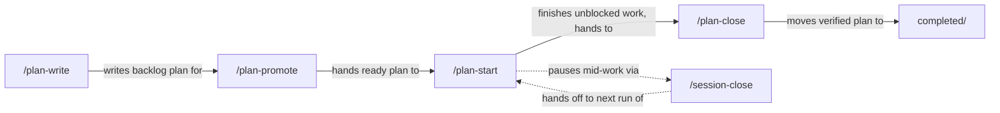
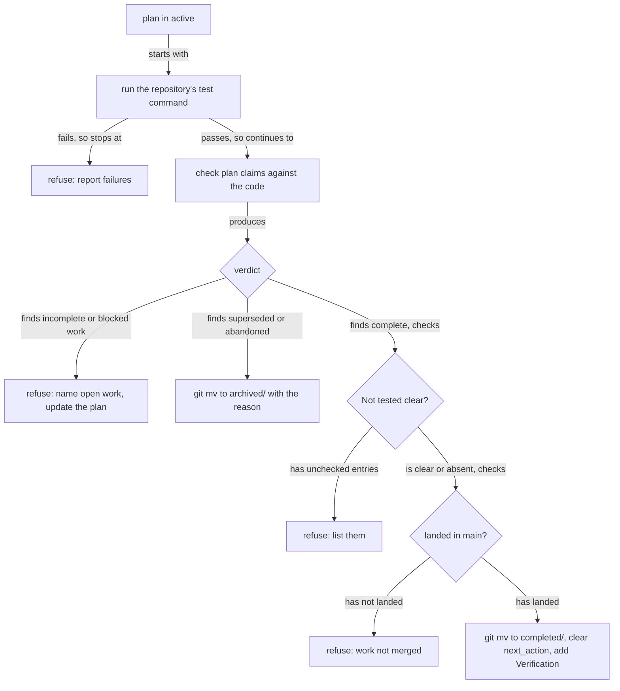

# One Command per Plan Lifecycle Step

## Summary

The plan lifecycle is driven by a family of skills called the **plan suite**. Today one of them,
`/plan-docs`, hides seven behaviors behind subcommands (`create`, `next`, `start`, `sync`,
`validate`, `review`, `handoff`), and two of those overlap other skills. This plan makes every
user-facing step its own top-level command:

| Command | What the user gets |
| --- | --- |
| `/plan-write` | Create a plan, or revise an existing one, including bringing it up to date with the repository |
| `/plan-promote` | Review and prepare a plan for development |
| `/plan-start` | Implement a plan in an isolated worktree until no unblocked work remains |
| `/plan-close` | Verify finished work and move the plan to `completed/` or `archived/` |
| `/session-close` | End a chat: review and commit the session's work, write the handoff note |

`plan-suite` is the name for this family, not a skill. The work also renames `plan-docs` everywhere
(package, code module, portal identifiers, docs), retires the `integration-check` package, moves
deterministic plan rules into CLI commands, and updates the Plans portal's onboarding and actions to
the new commands.

## Context

### Terms

| Term | Meaning |
| --- | --- |
| Plan suite | The lifecycle skills above. A naming convention and a portal section, not a skill or a package. |
| Atomic command | A top-level slash command with one behavior. It takes no mode argument. |
| Ancillary skill | A skill outside the suite that a suite skill pairs with: `technical-writing`, `code-style`, `javascript-typescript`, `test-harness`. Each is its own optional package. |
| Landed | A branch's work is present in `main`, including after a squash or rebase merge. Decided by the landed test in [[a7bslb00]]. |

### Why one command per step

A user who types `/plan-` should see every lifecycle step. Subcommands defeat that: `/plan-docs
review` and `/plan-docs handoff` are invisible unless the user already knows them, and the skill's
description lists nine verbs, so it triggers on almost any plan request. A command with one
behavior has a narrow description and a predictable effect.

### Why rules move into code

`plan-start` previously delegated the `backlog/` to `active/` mutation to `plan-docs`' start workflow,
coupling one skill's transition to another skill's private procedure. Splitting `plan-docs` into
atomic skills would multiply that pattern: every suite skill needs the plan schema, lifecycle
folders, and validation rules. Those rules have one right answer, so they belong in `modules/`
behind CLI commands that every skill runs, not in one skill's references that the others reach into.

## Goals

- [x] Every user-facing plan lifecycle behavior is a top-level command; no suite skill takes a mode
      argument.
- [x] `plan-docs` no longer exists as a name in code, packages, portal, or user docs.
- [x] Deterministic plan rules (schema, lifecycle, naming, the start transition) are CLI commands
      that suite skills run, not prose one skill reads from another.
- [x] Plans record work that was built but never tested, and `/plan-close` refuses to close a plan
      with unconfirmed entries.
- [x] A suite skill never fails silently when an ancillary skill it pairs with is not enabled.
- [x] The `integration-check` package is removed, with the parts worth keeping carried into
      `/plan-close` or [[a7bslb00]].
- [x] The Plans portal's onboarding, actions, and prompts use the new commands, and one action
      enables the whole suite.

## Non-goals

- Backward compatibility. Existing installs are wiped and re-enabled; no migration of package state,
  generated outputs, old command names, or the `plan-docs` state directory. Existing discovery-root
  settings must be configured again under the renamed `plan-suite` state directory.
- A top-level `plan-suite` command or router skill.
- A general "package requires an optional package" mechanism. The ancillary-skill check below is a
  suite convention.
- Resolving Claude's duplicate skill/command presentation. New and renamed suite commands preserve
  the current generated skill-backed command pattern; [[skills-vs-commands-invocation-policy]] owns
  any later presentation change.
- Worktree and branch cleanup, owned by [[a7bslb00]].
- New lifecycle states. Ready, Review, and Icebox belong to
  [[plan-lifecycle-suite-workflow-navigation]].
- Rewriting completed or archived plans that mention old names. They are history.

## Current state

### `plan-docs` modes and where each goes

| Mode today | Reference file | Destination |
| --- | --- | --- |
| `create` | `workflow-create.md` | `/plan-write` |
| `sync` | `workflow-sync.md` | `/plan-write`, run on an existing plan. `/plan-start` and `/session-close` also keep the plan current as they work. |
| `validate` | `workflow-validate.md` | `roborepo plans validate`, run by suite skills. No slash command. |
| `start` | `workflow-start.md` | `/plan-start`, which already owns the backlog-to-active move |
| `review` | `workflow-review.md` | `/plan-close` |
| `handoff` | `workflow-handoff.md` | `/session-close`, which already writes a handoff note |
| `next` | `workflow-next.md` | Removed. The portal's recommended action per plan already answers "what next". |

### Packages and portal

The config portal's `skills-dev-lifecycle` category (`manifests/inventory/package-categories.json`),
labeled "Skills - Development Life Cycle", groups `plan-docs`, `plan-promote`, `plan-start`,
`tighten`, `wrap-up`, and `integration-check`, and has a bulk toggle.

The Plans portal surfaces the old names in four places:

| Surface | Location | Today |
| --- | --- | --- |
| Onboarding banner | `tpl-package-banner` in `portal/plans/plan-drawer-partial.html` | Lists `/plan-docs`, `/plan-promote`, `/plan-start`, `/wrap-up`, but its one button enables only the `plan-docs` package; one "View Skill Details" link opens only `plan-docs` |
| Per-plan action menu | `PLAN_DOCS_ACTIONS` in `portal/plans/templates.js` | Start, Sync, Validate, Review, Handoff, each copying a `/plan-docs <mode>` prompt built by `buildPrompt` in `modules/plan-docs/index.mjs` |
| Recommended action | `recommendedPlanDocsMode` in `portal/plans/templates.js` | Returns a `plan-docs` mode name |
| Page-level next prompt | `openNextPrompt` in `portal/plans/app.js` | Copies a `/plan-docs next` prompt |

The lifecycle dialog (`portal/plans/lifecycle-event-dialog.js`) describes `/plan-docs start` as the
step that begins implementation, and the repair prompt (`modules/plan-docs/repair-prompt.mjs`) tells
the agent to run `/plan-docs validate`.

The internal `plans` CLI namespace currently exposes only `roborepo plans repair`
(`manifests/platform/cli/command-definitions/internal/plans.namespace.json` and
`scripts/cli/plans.mjs`). `roborepo package list` renders human-readable live status, while
`roborepo package inspect` returns static package metadata; neither gives a suite skill a small,
machine-readable answer about one ancillary package.

### No record of untested work

A completed plan must have a `Verification` section with evidence or "an explicit statement of what
was not verified" (`plan-schema.md`). Nothing asks for that statement while the work happens, and
nothing reads it. `agent-config-skill-reference-compliance` closed with every task checked while its
prose `### Not verified` section still listed claims never confirmed in a live session, mixed in with
an unrelated note about a flaky test.

`parsePlanMarkdown` in `modules/plan-docs/index.mjs` currently recognizes headings and checkboxes
inside fenced examples as real plan structure. This plan's own `## Not tested` example is therefore
reported as a real section and its two sample entries count as open tasks. A deterministic
`## Not tested` rule must first make structural parsing ignore fenced code blocks.

### Ancillary skills fail silently

`plan-docs` requires `technical-writing` on every plan it creates and loads `code-style`,
`javascript-typescript`, and `test-harness` by subject matter. They are separate optional packages.
When one is disabled, the pairing instruction cannot be followed, and nothing tells the user.

### `integration-check`

`/integration-check <branch>` checks out an integration branch, syncs it, audits worktrees, validates
active plans against the code, runs the test suite, and reviews every commit. The integration-branch
workflow it serves is retired (see [[plan-lifecycle-suite-workflow-navigation]]). Its plan-validation
logic is worth keeping.

## Proposed design

### Commands and what each owns



| Skill | Owns | Runs |
| --- | --- | --- |
| `plan-write` | Plan content: create, revise, update from repository evidence. Plan schema and writing guidance. | `roborepo plans validate` before delivering |
| `plan-promote` | Keep its review/prepare responsibility; adopt the suite validator and ancillary-status convention | `roborepo plans validate` |
| `plan-start` | Worktree, start transition, implementation, plan updates during work, `## Not tested` entries as gaps appear | `roborepo plans start` |
| `plan-close` | The complete/incomplete/superseded verdict, plan-vs-code checks, test run, the landed check, the move to `completed/` or `archived/` | `roborepo plans validate`, the repository's test command, the landed test from [[a7bslb00]] |
| `session-close` | Today's `wrap-up` behavior, including the handoff note | `roborepo plans validate` when the session touched a plan |

`/plan-write` given an existing plan updates it. The difference between revising and syncing is how
the edit is driven, and the skill states both in its description:

- **Revise:** follows the user's intent, changing scope or design.
- **Sync:** follows evidence, ticking a task only when the code proves it done, and updating
  `next_action` and `reviewed_commit`.

Skills keep internal reference files for procedural depth, loaded unconditionally by the skill
itself. A reference is never a choice the user makes.

### Deterministic commands

| Command | Replaces | Output |
| --- | --- | --- |
| `roborepo plans validate [<plan>] [--json]` | The deterministic checks in `workflow-validate.md` | The findings `lifecycle-policy.mjs`, `naming.mjs`, and relationship resolution already produce, plus the `## Not tested` check, in the `findings.mjs` shape |
| `roborepo plans start <plan> --worktree <name> [--json]` | Start Transition steps 3–6 and the validator in `plan-start`'s `references/start-validation.md` | Writes `worktree`, moves the plan with `git mv`, makes the plan-only commit, runs the six validator checks, prints `APPROVED` or the failed checks |
| `roborepo package status <id> [--json]` | Nothing; `package list` prints text only | `{ id, available, enabled, status }`, using `buildPackageLiveState` so `enabled`, `configured`, `partial`, `disabled`, and `external` are distinguishable |

Domain logic lives in `modules/plan-suite/`; `scripts/cli/plans.mjs` only parses arguments and
prints. The matching command catalog entries live under
`manifests/platform/cli/command-definitions/`; the existing internal `plans` namespace remains
non-browsable but callable by suite skills. `<plan>` accepts a repository-relative plan path or a
stable plan ID, and omission on `plans validate` means every plan in the current repository.

Keep pure parsing, lifecycle, naming, and finding logic separate from filesystem and Git execution.
The start-transition orchestration may compose those modules, but it does not move commit/mutation
logic into a validator or grow the scan/render entry point into a second CLI layer.

The CLI validator owns only deterministic document findings. Suite skills still inspect current
repository code, tests, configuration, and documentation for stale or unsupported claims; a clean
CLI result is not evidence that those model-driven checks ran. `plan-start` keeps the judgment
calls: confirming `worktreeRoot` on a repository's first run, deciding whether an existing worktree
is safe to reuse, and everything after the transition.

### `## Not tested`

An optional plan section of checkboxes for work that exists but that no test covers:

```markdown
## Not tested

- [ ] The reported line renders a per-skill reference tally. Requires a live session; no test can assert what an agent writes.
- [ ] Codex honors `additionalContext` on `PostToolUse`. Shipped on binary-schema evidence, never confirmed in a live Codex session.
```

| Rule | Owner |
| --- | --- |
| Write an entry the moment a gap is known: a check skipped, an assumption not exercised, a claim resting on indirect evidence | `plan-start` during its run; `plan-write` when syncing |
| Each entry states what to check and why a test cannot | `plan-write`'s schema reference |
| Headings and checkboxes inside fenced examples never become plan sections or tasks | `modules/plan-suite/index.mjs` parser and fixtures |
| Unchecked entries are a finding | `roborepo plans validate` |
| An unchecked entry blocks closing | `/plan-close` |

The user clears an entry by confirming it by hand and checking it off, or by deleting it with a
reason recorded in the plan's `## Decision Log`, the section `plan-start` already keeps for decisions
it made on its own.

### `/plan-close`



Tests run first because a red suite changes the code the verdict would judge. The plan-vs-code check
carries over from `integration-check`:

- checked items are really implemented;
- unchecked items that quietly landed are reported;
- requirements the code does not satisfy are reported;
- items the plan marks deliberately deferred are not reported as open;
- UI or manual checks that could not run are reported as unverified, never as passed.

This plan targets the current lifecycle, where `/plan-close` evaluates an `active/` plan and moves
it to `completed/` or `archived/`. [[plan-lifecycle-suite-workflow-navigation]] later inserts a
Review state and changes the eligible source lifecycle to `review/`; `/plan-close` must read the
domain lifecycle policy rather than embedding `active` as an enduring assumption.

### Ancillary skills: ask, never assume

Each suite skill keeps a Paired Skills table. Before loading a row's skill:

1. Run `roborepo package status <id> --json`.
2. If it is available, enabled, and healthy, load it.
3. If it is disabled, ask: "`<skill>` is not enabled. Enable it, or skip it for this run?"
   - **Enable:** run `roborepo package enable <id>` with the user's permission, then load it.
   - **Skip:** continue without it, and name it as skipped in the final report.
4. If desired state and live state disagree, report `status`, offer `roborepo package reconcile`
   or skip, and never describe a drifted package as successfully loaded.

`/plan-start` runs this check before implementation, alongside the first-run `worktreeRoot`
confirmation, so its no-questions run mode is unaffected.

### Portal

| Surface | Change |
| --- | --- |
| Config section | Relabel `skills-dev-lifecycle` as "Plan Suite", describe the family, keep the bulk toggle. Members: `plan-write`, `plan-promote`, `plan-start`, `plan-close`, `session-close`. `tighten` moves to a new `skills-code-quality` category, "Skills - Code Quality". |
| Onboarding banner | Title and lead name the plan suite. Each command in the list gets its own details link; the single "View Skill Details" link is removed. The button enables every suite package through the existing `/api/config/packages/bulk` path. |
| Action menu | Backlog: Promote (`/plan-promote`), Start (`/plan-start`). Active: Update (`/plan-write`), Close (`/plan-close`). Validate and Handoff are removed. |
| Recommended action | Returns a command name. A backlog plan recommends `/plan-start`; an active plan with every task checked recommends `/plan-close`; a stale or never-reviewed one recommends `/plan-write`. |
| Next prompt | `openNextPrompt` and its button are removed. |
| Dialog and repair prompt | Name `/plan-start` and `/plan-write` |

The onboarding rewrite stays in the existing `tpl-package-banner` HTML template and fills slots
from JavaScript. It does not replace visible nested markup with runtime `createElement` builders or
template-literal HTML.

### What carries over from `integration-check`

| Keep | Destination |
| --- | --- |
| Two-tier landed test (ancestry, then content) | Already specified with fixtures in [[a7bslb00]] §3 |
| Plan claims checked against code | `/plan-close` |
| Lifecycle inconsistency findings, such as an active plan with an empty `next_action` | `roborepo plans validate` |
| Tests before review work | `/plan-close` ordering |
| Unverified checks reported as unverified | `/plan-close` |

Dropped with the package: integration-branch checkout, sync, and merge; the single-pass code review
and findings ledger, which `/code-review` covers; matching plans to a diff, since `/plan-close` acts
on one named plan.

## Affected touchpoints

| Area | Existing ownership or planned change |
| --- | --- |
| Package sources | Rename `globals/packages/plan-docs/` and `globals/packages/wrap-up/`; update `plan-promote`, `plan-start`, paired-skill references, trigger fixtures, and package metadata; add `plan-close`; remove `integration-check` |
| Generated commands | Regenerate package-scoped Claude, Codex, and Gemini wrappers under `generated/packages/`; never edit generated files directly |
| Plan domain | Rename `modules/plan-docs/` to `modules/plan-suite/`; extend parsing, lifecycle findings, relationship validation, prompt generation, repair prompts, and start-transition reuse |
| CLI surface | Extend `scripts/cli/plans.mjs` and `scripts/cli/packages.mjs`; add catalog definitions for `plans validate`, `plans start`, and `package status`; update CLI reference and catalog/surface tests |
| Portal | Update Plans snapshot/package state, action/recommendation templates, lifecycle dialog, onboarding banner, and Plans API; reuse the existing config bulk-package endpoint |
| Inventory and generated audit | Update `manifests/inventory/package-categories.json`, `manifests/inventory/skill-trigger-tests.json`, and the generated skill invocation audit |
| Tests | Rename plan-domain tests and update package catalog, bulk-toggle, prompt/state, portal browser, CLI catalog/surface, command-render, and full-suite orchestration coverage |
| Documentation | Replace the plan-docs lifecycle guide and update setup, CLI, Plans portal, skills/commands, internal Plans architecture, docs map, and README references |

## Implementation plan

Each phase leaves the suite usable end to end.

### Phase 1 — Rename

- [x] Rename package `plan-docs` to `plan-write` and its skill directory, slash command, and
      trigger fixtures (`manifests/inventory/skill-trigger-tests.json`).
- [x] Rename `modules/plan-docs/` to `modules/plan-suite/` and update its importers in
      `scripts/cli/`, `portal/plans/`, `modules/repositories/`, and `scripts/test/`.
- [x] Rename portal identifiers such as `planDocsPackage`, `PLAN_DOCS_ACTIONS`, and
      `recommendedPlanDocsMode`.
- [x] Point generated prompts at the renamed command (`buildPrompt`, `repair-prompt.mjs`, the
      lifecycle dialog) and rename the commands the onboarding banner lists, so the portal keeps
      working while `plan-write` still has its modes.
- [x] Rename package `wrap-up` to `session-close`, keeping its trigger phrases ("wrap this up").
- [x] Rename plan-docs test files (`plan-docs-check.mjs` and siblings) and update
      `scripts/test/test-cli.sh` and `scripts/test/check-groups.json`. `check-groups.json` named none
      of them, so only `test-cli.sh` changed.
- [x] Update `docs/plans/plans-config.json`'s `plan` namespace description.
- [x] Rename the on-disk settings directory from `plan-docs` to `plan-suite`; do not add a migration, and
      document that discovery roots must be configured again.
- [x] Update references in backlog and active plans. Plan ids, historical notes of the rename itself, and the `roborepo_lifecycle_epic/` design notes keep the old names.
- [x] Regenerate `generated/packages/` with `roborepo skill render-commands`.

### Phase 2 — Deterministic commands

- [x] Add catalog entries and implementations for `roborepo plans validate`, reusing
      `validateForLifecycle`, `validatePlanNaming`, and relationship resolution; cover plan-path,
      plan-ID, whole-repository, text, and JSON output.
- [x] Add `roborepo plans start`, with fixtures for a backlog plan, an already-active plan, a dirty
      primary checkout, and a reused worktree.
- [x] Add a catalog entry and implementation for `roborepo package status`, backed by
      `buildPackageLiveState`, with enabled, configured, partial, disabled, external, and unavailable
      fixtures.
- [x] Make plan Markdown parsing ignore fenced code blocks before adding section-specific findings;
      prove sample headings and checkboxes do not affect readiness or task counts.
- [x] Point `plan-start`'s Start Transition at `roborepo plans start` and remove the procedure it
      replaces from `references/start-validation.md`.

### Phase 3 — Split the skills

- [x] Reduce `plan-write` to create, revise, and sync. Delete `workflow-next.md`,
      `workflow-start.md`, and `workflow-handoff.md`; move `workflow-review.md` into `plan-close`.
- [x] Add `## Not tested` to `plan-write`'s schema reference and the check to
      `roborepo plans validate`.
- [x] Have `plan-start` write `## Not tested` entries during its run and list them in its report.
- [x] Add the `plan-close` package and skill (category, order, slash command, trigger fixtures).
- [x] Fold `workflow-handoff.md`'s required fields into `session-close`'s handoff note.
- [x] Add the ancillary-skill check to every suite skill's Paired Skills table.
- [x] In the same change, replace the portal action menu, recommended action, dialog copy, and
      repair prompt, and remove the next prompt, since they name the modes this phase deletes.

### Phase 4 — Retire `integration-check`

- [x] Delete `globals/packages/integration-check/` and its generated commands.
- [x] Delete `docs/user/guides/plan/lifecycle/integration-check.md` and update
      `docs/user/README.md` and `docs/internal/docs-map.md`.
- [x] Re-render `docs/internal/skill-invocation-audit.md`.

### Phase 5 — Portal

- [x] Relabel the config section and set its members.
- [x] Add the `skills-code-quality` category to `manifests/inventory/package-categories.json`,
      ordered after `skills-writing`, and move `tighten` into it.
- [x] Rebuild the onboarding banner with per-command details links and an enable-all button that
      reuses `/api/config/packages/bulk` for the five suite package IDs.

### Phase 6 — Docs

- [x] Replace `docs/user/guides/plan/lifecycle/plan-docs.md` with one plan-suite guide that walks
      the commands in lifecycle order, one section per command.
- [x] Update `README.md`, `docs/user/guides/setup-and-daily-use.md`, and
      `docs/user/reference/plans-portal.md`.
- [x] Update `docs/user/reference/roborepo-cli.md`, `docs/internal/plans-portal-internals.md`,
      `docs/internal/skills-and-commands.md`, and every affected docs-map/reference entry.

## Validation

- [x] `rg -l 'plan-docs|wrap-up|(^|[^-])integration-check' -g '!docs/plans/**' .` returns nothing.
      The `[^-]` excludes unrelated test files such as `cli-surface-integration-check.mjs`; plans are
      excluded because some record the old names as history.
- [x] `roborepo plans validate` reports the same findings as the portal for this repository's plans.
- [x] Fenced Markdown examples containing headings and checkboxes do not create plan sections,
      tasks, or `## Not tested` findings.
- [x] `roborepo plans start` fixtures pass, including refusal on a dirty primary checkout.
- [x] `roborepo package status --json` distinguishes enabled, configured, partial, disabled,
      external, and unavailable package state.
- [x] The portal onboarding button enables all five suite packages, and each details link opens
      that command's skill (`scripts/test/portal-ui/`).
- [x] `roborepo package validate` passes for every renamed or added package, and enabling then
      disabling each package leaves no stale skill or command projection.
- [x] CLI command-catalog and surface integration checks cover the new commands and help/usage.
- [x] `roborepo skill render-commands --check`, `roborepo skill audit`, and
      `roborepo skill triggers --check` pass.
- [x] `bash scripts/doctor.sh --quiet` and `git diff --check` pass.
- [x] `npm run check` passes. This change touches package definitions, generated outputs, CLI
      catalog entries, and test orchestration, so the full local CI-parity gate is required.

Manual scenarios, since they exercise agent behavior no test can assert:

1. `/plan-close` refuses on a red suite, an incomplete plan, an unchecked `## Not tested` entry, and
   an unlanded branch.
2. With `technical-writing` disabled, `/plan-write` asks to enable or skip, and names a skip in its
   report.
3. `/plan-start` writes a `## Not tested` entry when it skips a check.

## Risks

| Risk | Mitigation |
| --- | --- |
| A missed reference after a rename across about 70 files | The `rg` gate in Validation |
| Fenced examples become real plan tasks or `## Not tested` sections | Fix structural parsing first and keep a regression fixture with both a sample heading and checkbox |
| The portal's lifecycle move and `roborepo plans start` both move plans to `active/`, and could drift apart | Both call the same move function in `modules/plan-suite` |
| `## Not tested` entries are never written, so `/plan-close`'s refusal never fires | `plan-start` writes them during its run and lists them in its report, where the user sees an empty list next to manual checks |
| `/plan-close` cannot confirm a merge until [[a7bslb00]] Phase 1 lands | Phase 3 builds `/plan-close` after that test exists, or reports "landed: unconfirmed" and refuses |
| The related lifecycle plan later inserts Review between Active and Complete | Read the eligible source lifecycle from domain policy; this plan initially closes Active, and the lifecycle plan changes policy rather than forking `/plan-close` |

## Decision Log

Decisions `/plan-start` made on its own during implementation. Each had one clearly best option with
consequences contained to this feature.

| Decision | Alternatives | Why |
| --- | --- | --- |
| The Plans page still gates on `plan-write` (`planWritePackage`), and its banner enables all five suite packages through `/api/config/packages/bulk` | Gate on all five being enabled | `plan-write` is the package the page's actions need; requiring all five would hide the board after disabling an unrelated step |
| `roborepo plans validate` exits 1 only when a `blocking` finding remains | Exit 1 on any finding | `LEGACY_SLUG_ID` and other advisory findings are permanent on valid plans; failing on them makes the exit code useless to a skill |
| `UNCONFIRMED_NOT_TESTED` is `advisory` and is emitted for active and completed plans | `blocking`; every lifecycle | Severity only orders findings; `plan-start` writes entries mid-run, so blocking would fail validation during normal work. `/plan-close` refuses on the code itself. Backlog and archived plans make no claim about built work |
| Only a literal level-2 `## Not tested` heading opens the section | Match by normalized heading text | Normalized matching treated this plan's own ``### `## Not tested` `` design heading as the section |
| `plans start` fast-forwards the target branch when it has no commits of its own and no uncommitted edits | Fast-forward only a worktree "created in this run" | A CLI cannot know when a worktree was created; "no commits of its own" is the property that makes the fast-forward safe |
| `plans start` reports `staleLinks` instead of editing them; `plan-start` fixes them in the worktree | Edit links in the transition commit | Validator check 4 requires the transition commit to touch only the plan |
| Cross-plan relationship findings are appended to a copy of each cached record's validation | Leave as is | They were pushed onto the cached record, so every rescan in a running portal added another copy (verified: 1, 2, 3 after three scans) |
| `package status` probes a package together with everything it `requires`, reports `missing` and `unavailable` as statuses, and exits 1 only for an unknown id | Probe the package alone | Probing alone reports every dependency missing and the package `partial` |
| `/plan-close` uses Git ancestry as an interim landed test and refuses everything else as `landed: unconfirmed` | Block `/plan-close` until a7bslb00 lands | Matches this plan's own risk mitigation; ancestry can prove a merge, and a7bslb00's content tier replaces the refusal later |
| `/plan-close` stages the closing move but does not commit | Commit on the base branch | Matches `plan-promote` and the suite's commit-only-when-asked convention; the only automatic base-branch commit stays `plans start` |
| The per-action "portable" variant became one **Portable prompt** menu item; `buildPrompt` takes a suite command or none | Keep a portable variant on Close | The variant belonged to Review, which no longer exists; a context-only prompt has no command to name |
| `plan-write` routes references by situation (`create`, `update`); `workflow-sync.md` became `workflow-update.md` (revise and sync); `workflow-validate.md` now runs the CLI first. The matrix test and `skill audit` parse the situation list | Keep a mode-shaped list | The skill takes no mode; an unparsed list would have silently dropped `plan-write` from the reachability audit |
| Order: `plan-close` 40, `session-close` 50; `skills-code-quality` category order 27 with `tighten` at 10 | Other numbers | Lifecycle order within the section; "after `skills-writing`" (25) and before `code-conventions` (30) |
| The next-prompt button, its dialog, `createPromptModal`, and `actionablePlans` were deleted | Keep unused | Nothing else used them |
| **User decision:** `roborepo plans start` prompts for approval. The allow rule narrowed from `roborepo plans` to `roborepo plans validate` and `roborepo plans repair` | Keep it promptless | Answer to Open Question 1 |
| **User decision:** the portal's card buttons copy suite-command prompts and never move a plan. Start (backlog) and Continue, Update, or Close (active) replace the Start and Archive shortcuts; the post-move event dialog is removed; the menu gains Continue (`/plan-start`) for active plans | Make `plans start` accept an uncommitted portal move | Answer to Open Question 2. `/plan-start` and `/plan-close` make and commit their own moves, so a portal move only creates an uncommitted rename the transition then refuses. The lifecycle dropdown stays as a manual override |
| **User request:** `plan-start` enters the worktree after `APPROVED` — one folder grant, then the worktree becomes the session's working directory — and mirrors the plan to the primary checkout once at the end | Widen the Claude write-scope hook to sibling worktrees | The hook deliberately bounds writes to the checkout in use; per-file prompts came from the session staying rooted in the primary checkout. Observed in this run: before the folder grant every `cd` into the worktree was reset, after it the directory change persisted and edits stopped prompting |

## Open Questions

1. **`plan-lifecycle-suite-blockers-dependencies` proposes `/plan-write block` and `unblock`
   modes**, which contradicts this plan's no-mode rule. Deferred by the user: that plan needs its own
   revision to make them CLI commands or separate commands.
2. **`roborepo package status` prompts on every call.** Every suite skill runs it before loading a
   paired skill, but `roborepo package` is in the `ask` bucket, and in Claude an `ask` match wins
   over a more specific `allow`.
   - Split `roborepo package` in `manifests/inventory/agent-permissions.json` into its mutating
     subcommands (`enable`, `disable`, `reconcile`, `adopt-live`, `create`, `manage`, `dev`) under
     `ask`, and allow the read-only ones (`list`, `inspect`, `status`, `validate`).
   - Leave it: one prompt per paired-skill check.
   - Recommendation: split. Blocked because it changes permissions.
   - Blocks: nothing; the check works with a prompt.

## Not tested

- [ ] `/plan-close` refuses on a red suite, an incomplete plan, an unchecked `## Not tested` entry, and an unlanded branch. Agent behavior; needs live sessions.
- [ ] With `technical-writing` disabled, `/plan-write` asks to enable or skip and names a skip in its report. Agent behavior; needs a live session.
- [ ] `/plan-start` writes a `## Not tested` entry when it skips a check, and runs `roborepo plans start` for its transition. This run used the manual transition because the command did not exist yet.
- [ ] Existing installs: a machine with `plan-docs`, `wrap-up`, or `integration-check` enabled is expected to be wiped and re-enabled (non-goal: no migration). Behavior of `roborepo update` against those stale registry ids was not exercised.
- [ ] In the Claude Code CLI, `/add-dir <worktree>` followed by `cd <worktree>` makes the write-scope hook treat the worktree as the checkout in use. Observed only in the Claude desktop app, through its directory-access tool.
