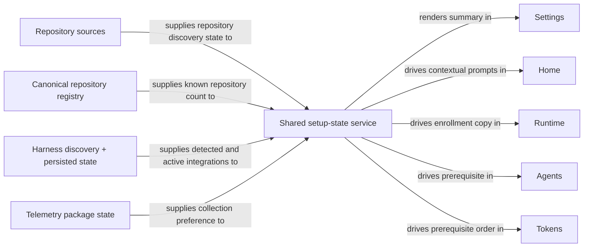

# Unify Portal Onboarding and Settings

## Summary

Give RoboRepo one coherent setup model across Repos, Agents, Plans, Tokens, and Runtime, with a normal **Settings** page for durable cross-module choices and contextual prompts on the pages those choices affect.

The repository-source work in [[pljvmyh]] has now shipped. It already provides the canonical repository-source model, the built-in `auto-discovery` source, source-management APIs, the shared **Manage repositories** dialog, and Plans scanning from canonical repositories. This plan must consume that implementation rather than create another repository-discovery preference or another Plans source model.

The remaining work is now narrower:

- add one shared, derived setup-state read model;
- add a top-level Settings page that composes existing domain controls;
- let users refresh and enable/disable supported harnesses from the portal instead of being sent to `roborepo harness refresh`;
- make token telemetry a clear Settings-level data preference backed by the existing telemetry package;
- make Tokens and other contextual onboarding use one prerequisite order;
- preserve the shipped consent model in which the `auto-discovery` switch controls both Runtime process observation and automatic repository enrollment; explicit repository/folder sources remain available independently.

This plan does not replace first-run `/setup` work. It provides the durable post-install Settings surface and shared state that first-run flows can later consume.

## Context

RoboRepo now has a substantially stronger repository foundation than when this plan was first drafted.

[[pljvmyh]] shipped:

- a versioned repository-sources store under the repository domain;
- one built-in `auto-discovery` source, default off;
- user-added exact-repository and parent-folder sources;
- canonical registry provenance for each source;
- protected repository-source management routes;
- the shared **Manage repositories** dialog;
- shared repository empty-state and auto-discovery prompts used by Home, Plans, and Runtime;
- Plans scanning every eligible canonical repository instead of owning `discoveryRoots`;
- removal of `/api/plans/settings`, Plans project-folder settings, and the old Plans enrollment path.

The portal still has inconsistent setup behavior outside repository discovery:

| Module | Current setup behavior |
| --- | --- |
| Repos / Home | Uses the shipped repository-source model and shared auto-discovery prompt; separately shows a no-harness info prompt |
| Agents | Warns when no supported harness is active and tells the user to install one and run `roborepo harness refresh` |
| Plans | Reads canonical repositories automatically; has repository/scanning/no-plan states and separate `plan-write` package onboarding |
| Tokens | Still checks telemetry before harness availability |
| Runtime | Uses the repository `auto-discovery` source as both permission to observe processes and permission to remember repositories |

The repository-source convergence means **Plans no longer needs its own onboarding configuration**. Once RoboRepo knows a repository, Plans scans it. A repository can become known through active-repository auto-discovery or an explicit repository/folder source.

The remaining cross-portal setup concepts are therefore:

- **repository discovery / enrollment** — existing repository-source state;
- **harness integration** — machine harness discovery and enabled state;
- **token telemetry** — existing optional telemetry package;
- **first-run workflow** — separately owned by [[v6lvuu2]].

## Related-plan reconciliation

`[[pljvmyh]]` is a **landed dependency and stale active story**, not an unlanded
dependency. Its document remains under `docs/plans/active/`, with `next_action` still
describing review and merge of `claude/portal-repository-sources` and `reviewed_commit:
585dedb`. That reviewed commit is not an ancestor of the current checkout, so the plan
metadata alone is insufficient evidence of delivery. The implementation is present on
`main` in `8aef67f3d670edc5214151c80db8b97d97c6afe9` (`Claude/portal repository sources
(#26)`), which is an ancestor of the current `HEAD`; the current source store, management
routes, shared dialog, and canonical Plans scan confirm the landed behavior.

The active story's Runtime contract is compatible with this plan: disabling auto-discovery
stops Runtime process scans and observation, while explicit repository/folder sources remain
available for repository enrollment. The earlier version of this plan proposed separating
observation from enrollment; that proposal is rejected for this story because it would weaken
the consent boundary established by [[pljvmyh]]. The related plan is not rewritten or moved
here; its implementation is already landed, but its remaining lifecycle and `Not tested`
entries need separate plan-close cleanup.

## Code touchpoints

The implementation should extend these existing ownership boundaries rather than create a second
configuration layer:

| Concern | Existing owner | Planned extension |
| --- | --- | --- |
| Repository enrollment | `scripts/cli/repository-sources.mjs`, `scripts/cli/portal-routes-repositories.mjs`, `portal/shared/repository-sources-*` | Keep the source store and management dialog unchanged; Settings mounts the existing partial and calls the existing routes. |
| Runtime observation | `scripts/cli/developer-runtime.mjs`, `modules/developer-runtime/discovery.mjs` | Preserve the shipped gate: run process/HTTP discovery only when the repository `auto-discovery` source is enabled; keep repository recording and observation under the same consent boundary. |
| Harness discovery/state | `scripts/harnesses/refresh.mjs`, `scripts/harnesses/state.mjs`, `scripts/cli/harness.mjs` | Add `scripts/harnesses/service.mjs` as the write-through service for CLI and portal adapters; expose portal actions through `scripts/cli/portal-routes-config.mjs`. |
| Telemetry preference | `scripts/cli/config-mutate.mjs`, `scripts/cli/telemetry.mjs`, `portal/tokens/app.js` | Reuse `POST /api/config/packages` with package id `telemetry`; do not add a Settings-owned boolean. |
| Shared read model | `scripts/cli/portal-server.mjs`, `scripts/cli/telemetry.mjs`, `scripts/cli/portal-router.mjs` | Add `scripts/cli/portal-setup.mjs`, a derived path-free service, and register `GET /api/settings` in a dedicated settings route table. |
| Portal page and navigation | `portal/<page>/`, `scripts/cli/portal-server.mjs`, `portal/shared/theme.js` | Add `portal/settings/{index.html,styles.css,app.js,api.js,templates.js}` and append Settings to the `PAGES` manifest. |
| Regression coverage | `scripts/test/*-check.mjs`, `scripts/test/portal-ui/` | Preserve and extend the Runtime consent-gate assertion, update Tokens precedence checks, add setup/harness route checks, and add Settings browser coverage. |

`portal/settings/app.js` should orchestrate fetches, rendering, and event wiring. Read-model
derivation belongs in `portal-setup.mjs`; route modules adapt requests to domain functions; single-
purpose harness state writes stay below the CLI adapter. New multi-element markup belongs in real
HTML `<template>` elements or the existing server-rendered partials, not nested DOM-builder calls.

## Goals

- Add a top-level **Settings** portal page; do not introduce an “Admin” concept.
- Make Settings the normal place to inspect and change durable cross-module setup.
- Reuse the shipped repository-source model and **Manage repositories** dialog instead of creating a second Runtime or Plans discovery setting.
- Keep repository-source state, harness state, and telemetry state owned by their existing domains.
- Add a shared server-owned setup-state view model consumed by Settings and contextual onboarding.
- Preserve the shipped Runtime consent boundary: when repository auto-discovery is off, Runtime does not observe active apps; explicit repository/folder sources continue to work as separate user-configured sources.
- Let users check for newly installed supported harnesses from the portal without running a CLI command.
- Let users enable or disable detected harness integrations from the portal.
- Let users enable or disable token telemetry from Settings while retaining the existing `telemetry` package as the implementation owner.
- Make Tokens present prerequisites in user order: supported harness, telemetry, captured data.
- Keep contextual onboarding close to the feature it unlocks while preventing pages from inventing independent dependency rules.
- Keep Settings and page-level controls synchronized by mutating the same underlying domain state.
- Follow the portal's framework-less HTML-template, ESM, and server-owned-domain conventions.

## Non-goals

- Recreating Plans `discoveryRoots`, `/api/plans/settings`, project-folder settings, or Plans-specific repository enrollment.
- Adding another `discoverRepositoriesFromRuntime` preference to Developer Runtime settings.
- Replacing the repository-sources store or the shared repository-management dialog shipped by [[pljvmyh]].
- Installing Claude Code, Codex, Gemini, or another third-party harness executable from RoboRepo.
- Running CLI commands in a child process from the portal when an internal domain function already exists.
- Replacing `package-first-run-onboarding.md` ([[v6lvuu2]]) or its future staged `/setup` workflow.
- Changing the separate `plan-write` package onboarding or making Plans depend on a harness for Markdown discovery/rendering.
- Deleting already-known repositories when active-repository auto-discovery is disabled.
- Automatically disabling telemetry when the last harness becomes unavailable.
- Redesigning the package catalog or all of the Agents page.
- Introducing React, another client framework, a build step, or a second configuration database.

## Current State

Verified against `11b0c8a7311f23ff33bc128a630e5f79a9e853a4`.

### Repository sources are now canonical

`modules/repositories/sources-schema.mjs` defines the source model. The fixed built-in source is `auto-discovery`, its default is off, and user sources are exact repositories or directories.

`scripts/cli/repository-sources.mjs` owns repository-source orchestration. It already supports:

- load source-management state;
- enable/disable auto-discovery;
- add/remove/enable/disable exact repository or directory sources;
- refresh one or all configured sources;
- remove source-specific discovery evidence without blindly deleting the canonical repository.

`scripts/cli/portal-routes-repositories.mjs` already exposes protected management routes under `/api/repositories/sources*`.

`portal/shared/repository-sources-dialog.js` and its templates/API modules already provide the global **Manage repositories** UI used from Home, Plans, and Runtime. Settings should mount/reuse this shared surface rather than implement another repository editor.

### Plans no longer owns source configuration

`scripts/cli/plans.mjs` now builds snapshots from canonical repositories. The old Plans settings route and discovery-root model are gone.

The Plans page already distinguishes:

- no canonical repositories;
- known repositories that have not been scanned successfully;
- scanned repositories with no plans;
- repositories with plans.

Therefore there is no longer a meaningful “plan sources configured” setting for the shared setup model. Repository readiness is the upstream state; plan availability is an observed result.

### Runtime currently couples observation and enrollment

`scripts/cli/developer-runtime.mjs` now reads `autoDiscoveryEnabled()` from the repository-source model before running `discoverInstances(...)`:

```text
auto-discovery off → do not scan running apps
auto-discovery on  → scan running apps + record repository discoveries
```

The Runtime UI explicitly says it is not watching running apps while auto-discovery is off, and repository-source onboarding copy says nothing is observed until the user opts in.

That behavior is intentional and remains in scope for this plan. The shared setup model and
Settings page must expose the same combined consent meaning rather than split it into separate
observation and enrollment states:

```text
auto-discovery off → no Runtime process/HTTP observation and no automatic repository enrollment
auto-discovery on  → Runtime observation plus automatic repository enrollment
```

The existing `auto-discovery` source remains the single permission and source of truth for both
Runtime observation and automatic repository enrollment. No second toggle is introduced.

### Harness discovery still has a portal/CLI seam

`roborepo harness refresh` remains a thin wrapper around `scripts/harnesses/refresh.mjs#refreshHarnessState()`.

`refreshHarnessState()` already:

1. discovers supported providers;
2. merges discovery with persisted harness state;
3. preserves explicit user-disabled providers;
4. writes machine-local state;
5. returns `{ state, detected }` without printing.

`setProviderEnabled()` already exists in `scripts/harnesses/state.mjs`, but portal-facing mutation plumbing should be centralized so callers do not each hand-edit harness state.

The shared no-harness warning still instructs users to run `roborepo harness refresh` in a terminal.

### Telemetry is still package-owned

`readConfigSnapshot()` exposes machine harness state, package state, and telemetry state. The optional `telemetry` package remains the authoritative implementation of token/session collection.

Settings must control that same package state. It must not add a separate telemetry boolean.

### Tokens still presents prerequisites in the wrong order

`portal/tokens/page-state.js` currently defines:

```text
telemetry off → no harness → no data → full report
```

For a new user, the useful order is:

```text
no active harness → telemetry off → no data → full report
```

A saved telemetry preference should remain on if the last harness later disappears.

## Proposed Design

### 1. Settings composes existing domains; it does not own new persistence

Settings is a product-level orchestration surface over domain-owned state.

| Settings group | Capability | Source of truth | Settings behavior |
| --- | --- | --- | --- |
| Repositories | Active-repository auto-discovery | Repository sources `auto-discovery` source | Show state; enable/disable through existing source API |
| Repositories | Explicit repositories/folders | Repository sources store | Open the existing **Manage repositories** dialog |
| Integrations | Supported harnesses | Harness discovery/state | Check for installs; enable/disable detected harnesses |
| Data | Token telemetry | Existing `telemetry` package | Enable/disable the same package |

Do not create generic Settings mutation endpoints that duplicate domain writes. The Settings page should call the existing repository-source and package/config mutations, plus the new harness-domain mutations added by this plan.

A small read-only setup snapshot is still useful because multiple pages need the same dependency interpretation.

### 2. Add one shared derived setup-state model

Add a server-side setup service, for example `scripts/cli/portal-setup.mjs`, that reads existing domain state and returns a browser-safe view model. It derives state; it persists nothing.

Conceptually:

```json
{
  "repositories": {
    "knownCount": 0,
    "visibleCount": 0,
    "autoDiscoveryEnabled": false,
    "hasConfiguredSources": false
  },
  "harnesses": {
    "supported": [{ "id": "codex", "displayName": "Codex" }],
    "detected": [{ "id": "codex", "displayName": "Codex", "confidence": "confirmed", "enabled": true }],
    "active": [{ "id": "codex", "displayName": "Codex" }]
  },
  "telemetry": {
    "enabled": false,
    "captureAvailable": false
  }
}
```

`knownCount` counts canonical non-alias, non-fixture repository records, including hidden records;
`visibleCount` is the count used by normal page readiness. `supported` comes from the registered
harness catalog, `detected` is the machine cohort after discovery, and `active` is the detected
cohort with `enabled !== false` and the existing confirmed-confidence rule. `captureAvailable` is
true only when telemetry is enabled and at least one active harness exists. These definitions keep
the setup model aligned with `configSnapshotMachineHarnesses()` and
`activePresentedHarnesses()` instead of inventing another harness cohort.

Do not include source paths in this cross-portal snapshot. Path-bearing repository-source data stays limited to the already protected `/api/repositories/sources*` management contract.

Expose the derived snapshot through `GET /api/settings`. Settings uses it as its summary model;
Home, Runtime, Agents, and Tokens use the same snapshot for dependency copy and ordering while
retaining their domain-specific payloads for feature data. The route is read-only and therefore
does not carry the portal mutation token.



Plans does not need a separate setup-state field for “sources configured.” It consumes canonical repositories and reports its own scan/no-plan state.

### 3. Preserve the Runtime consent gate

Keep the repository `auto-discovery` source and its default-off state. Do not change what its
`enabled` flag authorizes.

Runtime refresh should run supported process/HTTP discovery only while auto-discovery is enabled:

```text
auto-discovery off → no process/HTTP scan and no Runtime observation
auto-discovery on  → process/HTTP scan and canonical repository recording
```

Implementation rules:

- Keep the current `!observing ? emptyDiscovery(...) : discoverInstances(...)` branch in
  `scripts/cli/developer-runtime.mjs`; the source switch must continue to gate observation.
- Keep `recordDiscoveredRepositories(...)` gated by `autoDiscoveryEnabled()` and preserve the
  existing re-check before writing, so disabling the source during a scan cannot restore its
  discovery evidence.
- Turning auto-discovery on should still trigger/await a Runtime refresh so currently running repositories are enrolled immediately.
- Turning it off must stop new developer-runtime discovery evidence and retain the existing source-removal semantics; it must not delete canonical records that are still known through another source.
- Runtime must not show newly observed process/HTTP activity while the consent gate is off.
- Explicit repository/folder sources may still make repositories known while active-process auto-discovery remains off.

Keep repository-source and Runtime copy aligned with the shipped meaning: enabling
**Auto-discovery of active repositories** permits RoboRepo to observe active apps and remember
the repositories they use. When it is off, explain that Runtime observation is paused; users can
still add an explicit repository or folder source.

This preserves the shipped [[pljvmyh]] source, not a new Developer Runtime preference.

### 4. Reuse repository management directly from Settings

Settings should not recreate source rows or folder forms.

Mount the existing repository-source partial and `createRepositorySourcesDialog()` on the Settings page. The repository Settings card can show a path-free summary from the shared setup snapshot and provide:

- auto-discovery on/off;
- **Manage repositories…** to open the existing dialog;
- optional known-repository/source counts.

A successful repository-source mutation should refresh the Settings summary and continue to refresh Home/Plans/Runtime through their existing page behavior when those pages are visited.

Once canonical repositories exist, Settings should not show a separate Plans source control. Plans already follows the registry.

### 5. Move harness refresh into the portal domain API

Add portal-facing harness mutations that call the existing internal functions directly. Prefer extending the config/harness domain routes rather than hiding these writes behind generic Settings routes.

Required operations:

- **Check for installs** → `refreshHarnessState()`;
- **Enable harness** / **Disable harness** → a shared state service around `readHarnessState()`, `setProviderEnabled()`, and `writeHarnessState()`.

Add portal routes to the existing config domain rather than generic Settings writes:

- `POST /api/config/harnesses/refresh` calls `refreshHarnessState()` and returns only the fresh
  browser-safe config snapshot plus detected provider ids; it must not return persisted state or
  discovery evidence, because that evidence can contain executable paths;
- `POST /api/config/harnesses/:id/enabled` validates the registered provider id, calls the shared
  write-through service, and returns the fresh config snapshot.

CLI and portal adapters should use the same harness-domain functions. Settings must re-read
`GET /api/settings` after either mutation so it renders authoritative state.

Do not spawn `roborepo harness refresh`.

For automatic detection while an onboarding prompt is visible, do not poll a read-only persisted snapshot and claim it can detect an external install: persisted state cannot change until discovery runs. The first implementation should use an explicit **Check for installs** button. If lightweight auto-checking is added, it must invoke the same bounded harness refresh/probe only while the unresolved harness prompt is visible and stop immediately after resolution; it must not become a permanent background loop.

Replace shared warning copy that tells the user to run a terminal command with portal-native guidance and the check action.

### 6. Make telemetry a Settings-level data preference

Settings should expose **Collect token telemetry** using the existing telemetry package lifecycle.

The Settings control must delegate to the same `POST /api/config/packages` mutation path already
used by Agents/Tokens. There is one telemetry state.

Dependency behavior:

- With no active supported harness, Tokens leads with the harness prerequisite.
- Settings can still show the saved telemetry preference even if capture is currently unavailable.
- Removing/disabling the last harness does not silently turn telemetry off.
- Once an active harness exists, telemetry can be enabled and capture can begin through the existing package/hooks implementation.
- Tokens then moves to “no data yet” until real captures arrive.

Update `portal/tokens/page-state.js` and Tokens rendering to use:

```text
no harness → telemetry off → no data → full
```

### 7. Simplify contextual onboarding after repository convergence

The repository-source work removes the old “configure Plans folders” rung.

Contextual pages must not each derive a different prerequisite cascade. They should read the shared
setup snapshot (or a server-composed copy of it) and only add their own feature-specific state:
Home/Runtime add repository activity, Agents adds config/package details, and Tokens adds whether
real captures exist.

Use these contextual rules:

| Surface | Contextual behavior |
| --- | --- |
| Home / Repos | If no repositories are known, use the shipped shared repository empty state. Once repositories exist, repository auto-discovery is optional rather than a blocking prerequisite. Then show harness/telemetry setup only when useful. |
| Runtime | Always show observable Runtime activity. If repository auto-discovery is off, explain that active apps are visible but unknown repositories will not be remembered; offer the enrollment action. |
| Plans | Consume canonical repositories. Keep existing no-repository / not-scanned / no-plans states. Do not reintroduce source settings. Harness setup is unrelated to finding/rendering Markdown plans. |
| Agents | If no active harness exists, show install + **Check for installs** guidance before agent configuration. |
| Tokens | 1. Connect supported harness  2. Enable telemetry  3. Run a session / wait for data. |
| Settings | Show all durable controls and current state; no cascading onboarding mode is needed. |

A manually configured repository/folder source is sufficient for Home and Plans even if active-repository auto-discovery remains off. Do not keep presenting auto-discovery as a required unresolved setup step once repositories are already known.

### 8. Keep presentation shared without building a client framework

Add reusable setup prompt descriptors/renderers under `portal/shared/` only where two or more pages truly reuse behavior. Keep dependency derivation server-side.

For new markup:

- author multi-element structures as real `<template>` elements in page HTML or a shared partial;
- keep page `app.js` files focused on orchestration and event wiring;
- use named ESM exports;
- promote a light-DOM custom element only when the setup control owns reusable behavior or in-flight state that would otherwise be duplicated.

The Settings page can follow the existing portal structure:

```text
portal/settings/
  index.html
  styles.css
  app.js
  api.js
  templates.js
```

Reuse `repository-sources-partial.html` instead of duplicating repository-source markup.

## Implementation Plan

### Phase 1 — Preserve Runtime consent and align enrollment

- [ ] Preserve the Developer Runtime refresh gate so supported process/HTTP discovery runs only when repository `auto-discovery` is on.
- [ ] Keep canonical repository recording gated by `autoDiscoveryEnabled()` and retain the existing post-scan re-check before writing.
- [ ] Ensure the off state produces no newly observed Runtime activity while explicit repository/folder sources remain usable.
- [ ] Keep enabling auto-discovery wired to an immediate Runtime refresh/enrollment pass.
- [ ] Keep Runtime and repository-source copy explicit that the switch controls both active-process observation and automatic repository enrollment.
- [ ] Retain `scripts/test/developer-runtime-auto-discovery-check.mjs`'s assertion that no activity is observed when the source is off, and add coverage that an explicit repository/folder source remains usable while active-process auto-discovery is disabled.
- [ ] Add a race regression proving a scan that started before disable cannot write developer-runtime evidence after the source is turned off.

### Phase 2 — Shared setup-state read model

- [ ] Add `scripts/cli/portal-setup.mjs` as the derived read model, with dependency-injected loaders for repository, harness, and telemetry tests.
- [ ] Add `scripts/cli/portal-routes-settings.mjs` with `GET /api/settings` and register its route table in `scripts/cli/portal-server.mjs`.
- [ ] Keep repository source paths out of this response.
- [ ] Add `scripts/test/portal-setup-check.mjs` for repository, harness, telemetry, optional/independent cases, hidden-versus-visible counts, and a recursive path-leak assertion.

### Phase 3 — Harness controls without CLI handoff

- [ ] Add `scripts/harnesses/service.mjs` as the shared harness enable/disable service and route both `scripts/cli/harness.mjs` and the portal adapter through it.
- [ ] Add `POST /api/config/harnesses/refresh` backed directly by `refreshHarnessState()`.
- [ ] Add `POST /api/config/harnesses/:id/enabled` for provider state changes and return the fresh config snapshot.
- [ ] Return detected and active harness status without treating every registered provider as installed.
- [ ] Replace portal copy that tells the user to run `roborepo harness refresh` with a portal-native action.
- [ ] Do not add permanent harness-discovery polling; any later auto-check must be scoped to an unresolved visible prompt.
- [ ] Add `scripts/test/harness-portal-api-check.mjs` for refresh, enable/disable, unknown-provider rejection, and registered-versus-detected cohort behavior.

### Phase 4 — Settings page

- [ ] Add `/settings` after Runtime in `PAGES` so routing, global navigation, manifest, and sitemap derive it from the same six-page manifest.
- [ ] Add the Settings page using existing `<template>` + slot-fill conventions.
- [ ] Render **Repositories**, **Integrations**, and **Data** groups from the shared setup snapshot.
- [ ] Reuse the shipped repository-source dialog and repository-source mutations directly.
- [ ] Wire harness refresh/enable/disable to the harness-domain mutations.
- [ ] Wire telemetry to the existing package mutation path.
- [ ] Re-render from authoritative post-mutation state and surface in-flight/error state locally; do not optimistically invent a second state cache.
- [ ] Update `scripts/test/portal-pages-check.mjs` for the sixth navigable page and add Settings navigation/mutation coverage under `scripts/test/portal-ui/`.

### Phase 5 — Contextual onboarding consistency

- [ ] Update Home (`portal/home/`) so repository auto-discovery is not treated as a mandatory unresolved step once repositories are already known through another source.
- [ ] Update Runtime (`portal/developer-runtime/`) to explain the combined observation/enrollment consent boundary and point users to explicit repository/folder sources when appropriate.
- [ ] Update Agents (`portal/config/` and `portal/shared/harness-warning.js`) to use the portal-native harness prerequisite/check action.
- [ ] Reverse `portal/tokens/page-state.js` and `portal/tokens/app.js` precedence to harness → telemetry → data and remove the independent prerequisite interpretation.
- [ ] Have Home, Runtime, Agents, and Tokens consume `GET /api/settings` for shared dependency interpretation while retaining their existing domain payloads for repository, Runtime, config, and report data.
- [ ] Keep telemetry package state synchronized across Settings, Tokens, and any advanced Agents/package control that remains.
- [ ] Confirm Plans keeps the shipped canonical-repository onboarding and gains no new source configuration.

### Phase 6 — Documentation and regression coverage

- [ ] Keep [[v6lvuu2]] responsible for staged first-run `/setup`; update its relationship note only if the shared setup read model becomes a consumed dependency.
- [ ] Update `docs/user/reference/repositories.md`, `docs/user/reference/runtime.md`, and `docs/internal/portal-architecture.md` to preserve the combined Runtime observation and repository-enrollment consent model.
- [ ] Update `docs/user/guides/harnesses/supported-harnesses.md` and `docs/user/guides/first-time-setup.md` to remove terminal-only refresh requirements where they describe portal onboarding.
- [ ] Add/adjust the setup-state, Runtime, harness, Tokens page-state, and Settings navigation checks named in Phases 1–4.
- [ ] Extend Playwright coverage in `scripts/test/portal-ui/` for Settings and the main onboarding transitions.
- [ ] Run the repository's full checks because the change crosses shared portal, server routing, Runtime discovery, harness state, and Tokens setup.

## Validation

### Acceptance criteria

- [ ] The repository-source `auto-discovery` source remains the persisted consent switch controlling both Runtime activity observation and automatic developer-runtime repository discovery evidence.
- [ ] No `discoverRepositoriesFromRuntime` field is added to Developer Runtime settings.
- [ ] With repository auto-discovery off, Runtime does not scan or display newly observed active supported apps/processes.
- [ ] With repository auto-discovery off, a previously unknown running repository is not observed or added to the canonical registry.
- [ ] With repository auto-discovery off, explicit repository and folder sources remain available and continue to make repositories known through their own configured scans.
- [ ] Enabling auto-discovery causes currently running identifiable repositories to become eligible for immediate registry enrollment.
- [ ] Disabling auto-discovery does not hard-delete repositories that remain known through another source.
- [ ] Settings appears in global portal navigation and reflects authoritative repository, harness, and telemetry state.
- [ ] Settings reuses the existing **Manage repositories** dialog; there is no duplicate repository-source editor.
- [ ] Plans has no Plans-specific source setting and scans repositories known through either auto-discovery or explicit sources.
- [ ] A user can install a supported harness externally, click **Check for installs**, and have RoboRepo detect it without running a terminal command.
- [ ] Harness enable/disable changes are reflected consistently in Settings, Agents, Home onboarding, and Tokens prerequisites.
- [ ] Tokens shows missing harness before telemetry-off, then no-data after both prerequisites are satisfied.
- [ ] Telemetry remains backed by the existing `telemetry` package and has no duplicate boolean/state store.
- [ ] Cross-portal setup state contains no configured repository source paths.
- [ ] No portal flow shells out to `roborepo harness refresh`.

### Repository checks

Run the smallest focused checks added for setup-state derivation, Runtime consent gating, harness refresh, and Tokens prerequisite ordering, then run:

```bash
npm run test:unit
npm run test:portal-ui
npm run check
```

Manual browser verification should cover:

- a fresh state with no repository sources enabled;
- Runtime observation paused while repository auto-discovery is off;
- adding an explicit repository/folder source while auto-discovery remains off;
- enabling auto-discovery with an already-running dev server;
- external harness installation followed by **Check for installs**;
- harness disable/re-enable;
- telemetry disable/enable;
- Tokens transitioning through harness → telemetry → no-data → report states.

## Risks

- **Runtime semantic regression:** [[pljvmyh]] intentionally made auto-discovery the permission to observe processes and enroll repositories. Settings and contextual onboarding must preserve that combined consent boundary rather than imply that Runtime can observe while auto-discovery is off.
- **Duplicate configuration:** Settings must reuse `/api/repositories/sources*`, harness-domain state, and package mutations. A generic Settings write store would immediately create drift.
- **Path leakage:** the shared setup snapshot must stay path-free even though the repository management dialog legitimately uses path-bearing protected routes.
- **Dual telemetry controls:** Settings and Agents can both expose telemetry only if they mutate the same package state and render from authoritative snapshots.
- **Harness detection cost:** permanent filesystem/process probing is unnecessary. Keep discovery user-triggered first; scope any future auto-check tightly.
- **Optional auto-discovery pressure:** once a user has explicit repository sources, Home must not present active-repository auto-discovery as if the rest of RoboRepo is incomplete without it.

## Decision Log

- Settings is the durable cross-module configuration surface; “Admin” is not introduced.
- [[pljvmyh]] is now an implemented dependency, not future source-convergence work.
- Repository sources are canonical. Plans no longer owns plan-source configuration.
- The repository `auto-discovery` source remains the one persistence/enrollment opt-in; no Developer Runtime discovery preference is added.
- Runtime observation and automatic repository enrollment remain under the same auto-discovery consent switch.
- Settings reuses the shipped **Manage repositories** dialog and domain APIs instead of recreating repository management.
- `[[v6lvuu2]]` continues to own staged first-run `/setup`; this plan owns normal post-init Settings and shared setup state.
- Harness refresh is an internal portal action backed by `refreshHarnessState()`, never a spawned CLI command.
- The first implementation uses explicit **Check for installs**. Read-only polling alone cannot discover a new external install because persisted harness state does not change until discovery runs.
- Telemetry remains implemented by the existing `telemetry` package; Settings adds a product-level control over that same state.

## Open Questions

None are blocking promotion. The plan treats canonical records as “known” even when hidden, uses
visible count for page readiness, places Settings last in the global navigation, and lets the
portal use the same registered-provider validation as the existing CLI state mutation.
