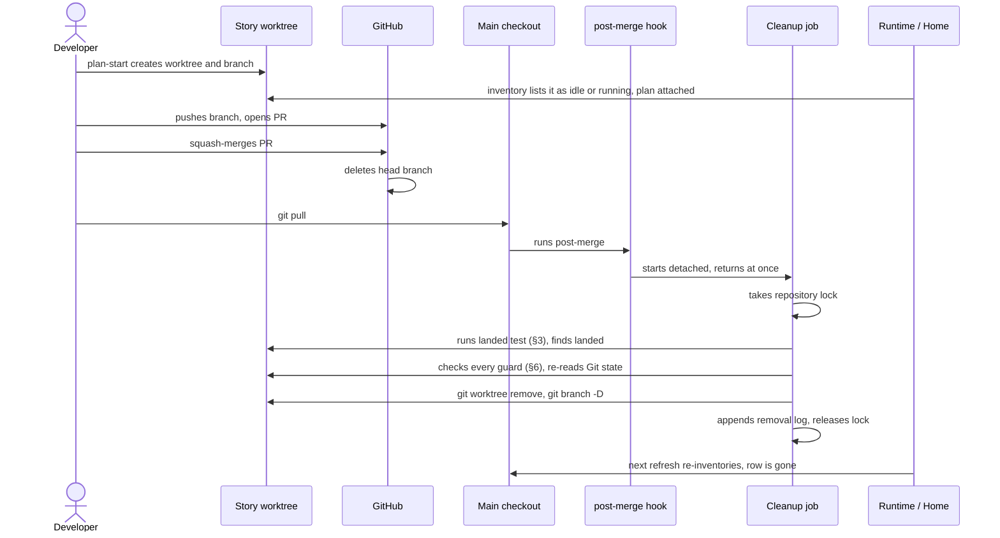
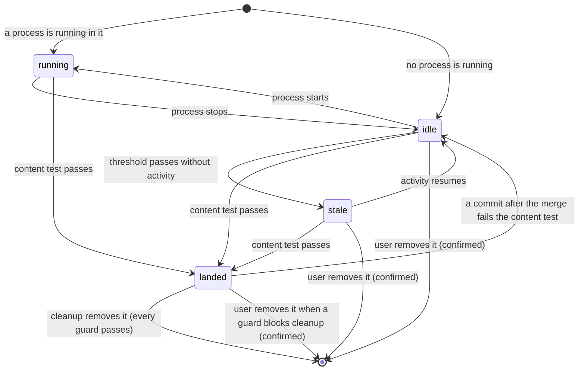
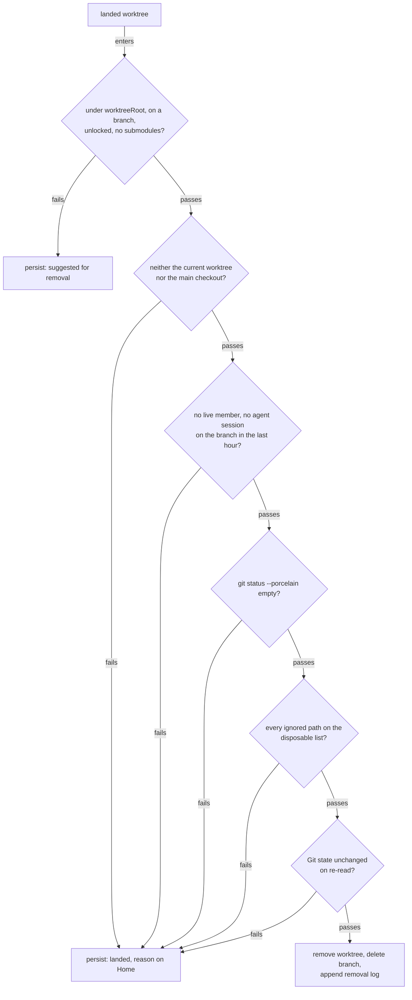
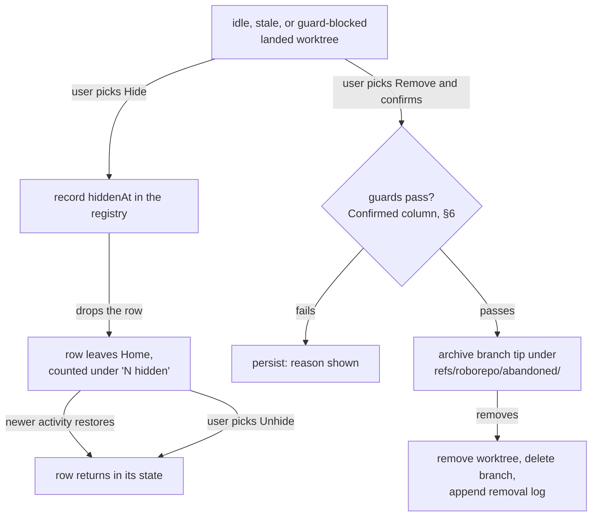

# Retire Story Worktrees When Their Work Lands

## Summary

Each story gets its own linked worktree, created by `plan-start`, and the work stays there until
its branch merges. Nothing removes the worktree afterward, and Home stops showing a worktree as soon
as nothing is running in it. The result is the state this repository was in when this plan was
written: seven linked worktrees and twelve local branches, four of those branches already landed in
`main`, and every worktree without a running process missing from Home.

This plan gives every worktree a lifecycle state that Home shows, and splits removal by whether the
work landed:

| Worktree | Removed by | How |
| --- | --- | --- |
| Landed and clean | the cleanup job, automatically | pulling `main` triggers cleanup behind the guards in §6 |
| Never landed (abandoned, superseded, an experiment) | the user, explicitly | hide it from Home, or remove it with confirmation; the branch tip stays restorable |

Worktrees untouched past a configurable threshold are marked `stale` and suggested for removal. It
all works on plain Git; the GitHub CLI is not required.

## Goals

- [ ] Show every linked worktree of a known repository on Home, running or not and without
      collapsing them behind a count, so a story's worktree and its associated plan stay visible for
      the whole story.
- [ ] Derive one lifecycle state per worktree: `running`, `idle`, `stale`, or `landed`.
- [ ] Decide "landed" from content, so squash and rebase merges count, without the `gh` CLI.
- [ ] Remove landed, clean worktrees and their local branches automatically, along with landed
      local branches that have no worktree, behind the guards in this plan.
- [ ] Let the user hide a worktree from Home, or remove one that will never land, keeping its
      branch tip restorable.
- [ ] Suggest stale worktrees for removal after a threshold that defaults to 7 days and is
      configurable in settings and through an environment variable.
- [ ] Trigger automatic removal from an opt-in Git `post-merge` hook, so a pull of `main` after a
      GitHub merge cleans up.

## Non-goals

- Deleting remote branches. GitHub's **Automatically delete head branches** repository setting
  owns that, and `fetch.prune` keeps local remote-tracking refs in step with it.
- Automatically removing a worktree that has not landed. Stale means not merged; it is suggested,
  and only the user removes it.
- Collapsing idle and stale worktrees behind a count on Home. The user decided on 2026-10-02 that
  Home lists every worktree; hiding is a per-worktree user action instead (§7).
- Installing a global `core.hooksPath`. That would disable every repository's own hooks.
- Plan closeout. Closing a plan belongs to `/plan-close` ([[age4cm7r]]); see §9.
- Requiring the `gh` CLI, or treating its presence as changing which worktrees are eligible.

## Current State

Verified on `main` at `14b1ed6`, except where a subsection gives its own measurement.

### Home shows only running worktrees

For a running repository, the Runtime snapshot lists each checkout that has a live member plus the
main checkout, and nothing else (`modules/developer-runtime/snapshot.mjs`, the `idleMainCheckouts`
loop: "other stopped worktrees stay off the card"). Home's checkout list is built from those roots
in `scripts/cli/repository-overview-sources.mjs#projectWorkspace`.

The plan↔worktree association from `wk7p4n2` joins only against those listed checkouts (its
decision 6), so a plan whose worktree has nothing running falls back to Additional Plans. Observed
on 2026-10-02: Home listed `main` plus the two worktrees with listeners (ports 59468 and 4317), while
`codex/telemetry-analytics-oracle` and `claude/plan-worktree-home-association` existed on disk with
nothing running and did not appear.

### What is already persisted

| Fact | Where | Granularity |
| --- | --- | --- |
| Checkouts seen, with `firstSeenAt` / `lastSeenAt` | `modules/repositories/schema.mjs` (`localRoot`, `localRootPath`) | per checkout |
| `active` / `idle` / `stale` lifecycle, 30-day age-out | `modules/repositories/lifecycle.mjs` (`deriveLifecycle`, `AGE_OUT_MS`) | per repository |
| Agent session events with `repository_id` and `branch` | `scripts/cli/telemetry-capture.mjs` | per event |

Checkouts are recorded only by `recordRepositoryDiscovery` in `scripts/cli/developer-runtime.mjs`,
for projects Runtime sees running, so a worktree used only for editing is never recorded at all.

### Nothing removes a worktree, and nothing hooks Git

No skill, command, or script runs `git worktree remove` or deletes a merged branch outside test
fixtures. The repository installs no Git hooks and never sets
`core.hooksPath`.

### Ancestry cannot see squash merges

This repository squash-merges pull requests, so a landed branch's commits are never ancestors of
`main`. A content test settles it instead:

```bash
git merge-tree --write-tree origin/main <branch>   # prints a tree id on its first line
git rev-parse origin/main^{tree}                   # equal ⇒ everything on <branch> is in main
```

Run against every local branch at `14b1ed6`:

| Branch | Worktree | Content test |
| --- | --- | --- |
| `claude/plan-worktree-home-association` | yes | landed |
| `claude/localhost-runtime-ui-updates-14cbbd` | yes | landed |
| `claude/plan-localhoster-row-layout-2b92cb` | no | landed |
| `claude/runtime-row-layout-skill-f8086e` | no | landed |
| 8 other branches | 4 with worktrees | not landed |

A detached worktree (`.claude/worktrees/runtime-row-layout-skill-f8086e`) sits on the same commit
as a landed branch.

The test is conservative: `codex/portal-repository-home-and-detail`, merged as #22, reports not
landed, plausibly because `main` later changed the same lines. A false "not landed" keeps a
worktree; it never removes one.

`git merge-tree --write-tree` needs Git 2.38 or later; the machine these measurements came from runs
2.50.1.

### `git worktree remove` deletes ignored files without asking

Git calls a worktree clean when it has no tracked modifications and no untracked files. Ignored
files do not count, so `git worktree remove` deletes them even without `--force`. Measured on
2026-10-02 with Git 2.50.1, in a scratch repository whose `.gitignore` lists `.env`:

```console
$ echo SECRET > ../w1/.env
$ git -C ../w1 status --porcelain     # prints nothing: the worktree counts as clean
$ git worktree remove ../w1           # exits 0
$ ls ../w1
ls: ../w1: No such file or directory
```

The ignored files actually present in this repository's worktrees are disposable. Both
`codex/telemetry-analytics-oracle` and `.claude/worktrees/localhost-runtime-layout-b3215c` list only
these under `git status --ignored --porcelain`:

```text
!! node_modules/
!! test-results/
```

A worktree holding a local `.env`, a SQLite file, or `.claude/settings.local.json` would lose it
silently. §6's ignored-files guard exists for exactly this.

## Proposed Design

### 1. Happy path: a story from start to removal



Every other path in this design is a branch off this one: a guard that fails keeps the worktree
(§6), and a story that never merges never reaches the hook's removal and waits for the user (§7).

### 2. Inventory every linked worktree

For each known repository with a readable main checkout, run `git worktree list --porcelain` and
record every linked worktree: path, branch or detached commit, locked flag. This replaces "seen
running" as the way a worktree becomes known, so a story worktree is listed from the moment
`plan-start` creates it.

### 3. Decide "landed" from content, never from a fresh branch

A branch with no work of its own trivially passes the content test, because its tree already
equals `main`. A brand-new story worktree would therefore read as landed and be removed. Landed
requires both conditions:

| Condition | Test |
| --- | --- |
| The branch carried its own work | at least one commit in `<start>..<branch>` is not on `<base>`'s first-parent history (`git rev-list --first-parent <base>`) |
| That work is in the base | `git merge-tree --write-tree <base> <branch>` exits 0 and prints `<base>`'s tree |

`<start>` is where the branch began: the oldest entry of its reflog (`git reflog show <branch>`),
falling back to `git merge-base <base> <branch>` when the reflog has expired or never existed.
`<base>` is the remote's default branch (`refs/remotes/origin/HEAD`), falling back to the local
default branch.

How the own-work condition classifies common histories:

| History | Own work? | Why |
| --- | --- | --- |
| Fresh worktree, no commits | no | `<start>..<branch>` is empty |
| `plan-start` fast-forwarded a fresh worktree to its transition commit | no | that commit is on `main`'s first-parent history |
| Created from another branch's tip, no commits since | no | `<start>..<branch>` is empty |
| Squash- or rebase-merged on GitHub | yes | the branch's own commits never reach `main` |
| Merged with a merge commit, reflog present | yes | its commits are reachable from `main` only through a second parent |
| Merged with a merge commit, reflog expired | no | the fallback `<start>` is the branch tip, so the range is empty; it ages into `stale` instead |
| Fast-forwarded into `main` locally | no | its commits are now first-parent history; it ages into `stale` instead |
| Merged into another feature branch (stacked PR) | yes | own work exists, but the content test fails against `<base>`, so not landed |

### 4. One state per worktree



Each state decides what Home shows and what may remove the worktree:

| State | Meaning | Home | Automatic action | User may |
| --- | --- | --- | --- | --- |
| `running` | A Runtime member runs in it | today's row | none | nothing; it is in use |
| `idle` | No process, recent activity, not landed | dimmed row; its plan attaches | none | hide, or remove with confirmation |
| `stale` | Idle past the threshold, not landed | dimmed row, "suggested for removal" | none | hide, or remove with confirmation |
| `landed` | Passes §3 | row marked "landed", plus the reason when a guard blocks removal | removed when every guard passes | hide; remove with confirmation when a guard blocks automatic removal |

`landed` takes precedence over the others, but a running landed worktree is never removed (§6).
Hidden is not a state: a hidden worktree keeps its state and returns to Home when that state's
activity moves past the moment it was hidden (§7).

### 5. Last activity is the latest of several signals

"Last run" alone would mark a story stale while it is being edited without a dev server.

| Signal | Source |
| --- | --- |
| Runtime last saw a member running in it | registry `localRoot.lastSeenAt` |
| Last commit on the branch | `git log -1 --format=%cI <branch>` |
| Last agent session on the branch | telemetry events matching `repository_id` and `branch` |

The threshold defaults to 7 days. Precedence: the `ROBOREPO_WORKTREE_STALE_DAYS` environment
variable, then a settings value, then the default. A non-positive or non-numeric value is rejected
with a finding rather than silently ignored.

### 6. Removal guards

Two kinds of removal share one set of guards. Automatic removal applies only to `landed` worktrees;
confirmed removal (§7) applies to any worktree the user picks. They differ where the user's
confirmation can stand in for evidence, and agree wherever data could be lost.

The gates automatic removal passes through, in order:



A persisted worktree is reconsidered on the next pull or cleanup run, so clearing the reason (say,
committing the stray file) is enough for the next pass to remove it.

Every guard, with its outcome for each kind of removal:

| Edge case | Guard | Automatic | Confirmed (§7) |
| --- | --- | --- | --- |
| Not landed: brand-new, commits after the merge, or never merged | §3's landed test | not a candidate | allowed; the confirmation replaces the test and the branch tip is archived |
| Outside the repository's `worktreeRoot` from `docs/plans/plans-config.json`, such as the desktop app's `.claude/worktrees/` | path check; a repository without `worktreeRoot` gets suggestions only | suggest only | allowed |
| Detached HEAD | `git worktree list --porcelain` reports `detached` | suggest only | allowed; there is no branch to delete, so HEAD is archived under the worktree's directory name |
| Locked, or has submodules | `locked` flag; `.gitmodules` present | suggest only | refused; Git itself requires `--force` |
| The current worktree or the main checkout (the hook also fires when merging `main` into a feature branch) | path comparison | refused | refused |
| A dev server or agent session is using it | Runtime reports a live member, or an agent session touched the branch within the last hour | skipped, reason shown | refused, reason shown |
| Uncommitted or untracked changes | `git status --porcelain` is empty | skipped, reason shown | refused, reason shown |
| Valuable ignored files (`.env*`, local databases, `.claude/settings.local.json`) | `git status --ignored --porcelain` lists only paths on the disposable list; see Current State for why | skipped, blocking path shown | refused, blocking path shown |
| Another session changed the state after the survey | re-read Git state immediately before each removal | skipped | refused |
| Its plan is still `active` | plan lookup through the `wk7p4n2` association | removed, flagged "branch landed, plan not completed" | removed, flagged "plan still active" |
| Two cleanups start together (quick successive pulls, or pulls in two worktrees) | a per-repository lock file under the state root | second run exits | refused while the lock is held |

The disposable list starts as the paths observed in this repository's worktrees: `node_modules/`
and `test-results/`. Anything else ignored blocks removal and names itself in the reason.

Removal runs `git worktree remove <path>` (never `--force`), then `git branch -D <branch>`, because
squash-merged branches need `-D`. A landed local branch with no worktree is deleted the same way,
unless it is checked out anywhere. Each removal appends path, branch, and commit to a removal log
under the state root, so `git branch <branch> <commit>` and `git worktree add <path> <branch>` can
restore it.

### 7. Worktrees that never land: hide or remove

A story can end without merging: abandoned, superseded by another branch, or an experiment. Nothing
automatic ever removes it, so the user needs a way to put it away. Home offers two actions on any
`idle`, `stale`, or guard-blocked `landed` row, and the cleanup command offers the same two for a
named branch:



| Action | Changes Git | Reversible by | Best when |
| --- | --- | --- | --- |
| Hide | no | Unhide on Home, or new activity on the branch | the work might come back, or another tool owns the worktree |
| Remove | yes: worktree removed, local branch deleted | `git branch <branch> refs/roborepo/abandoned/<branch>`, then `git worktree add <path> <branch>` | the work is abandoned and the disk space or clutter matters |

The archive ref keeps an unmerged branch's commits reachable, so `git gc` cannot collect them after
the branch is deleted. Archive refs stay until the user deletes them; they do not appear in
`git branch` output. A remote copy of the branch is never touched.

Hidden worktrees still count toward the repository: the card shows "N hidden", which lists them
with Unhide. This is the only aggregation on the card; everything not hidden is listed in full.

Remove on Home opens a confirmation that names the branch, its unmerged commit count, and the
archive ref it will write. The Home actions call token-guarded `POST` routes in
`scripts/cli/portal-routes-repositories.mjs`, which share the cleanup orchestrator with the command,
so Home and the CLI cannot disagree about a guard.

### 8. Triggers

| Trigger | When it fires | Does |
| --- | --- | --- |
| `post-merge` hook (opt-in) | after `git merge` completes, which includes the merge step of `git pull` | starts the cleanup detached, with output to a log, and returns at once |
| `roborepo` cleanup command | when invoked | dry run by default; applies with an explicit flag; hides, unhides, or removes a named branch on request |
| Home row actions | when the user picks Hide, Unhide, or Remove | the same as the command for that one worktree |
| Runtime refresh | each snapshot | derives and displays states; never removes |

The hook does not fire on `git fetch`, on the GitHub merge button itself, or on a merge stopped by
conflicts. Its behavior on a fast-forward `git pull` is expected but unmeasured here, and on
`git pull --rebase` it is unverified; Phase 4 measures both. Because worktrees share one hooks
directory, the hook also fires in feature worktrees, which is why the current-worktree guard exists.

Installation is per repository and opt-in. The installer writes into the repository's hooks
directory, which is `core.hooksPath` when that is set (Husky sets it, for example) and the common
Git directory's `hooks/` otherwise. If a foreign `post-merge` hook is already present, the installer
does not overwrite it; it prints the one line to add instead.

The hook calls absolute paths to `node` and the roborepo CLI entry, recorded at install time.
Git clients run hooks with their own `PATH`, and GUI clients often omit the npm prefix where
`roborepo` lives.

### 9. Relationship to `/plan-close`

This plan owns worktree and branch lifecycle end to end: the inventory, the landed test, the
guards, automatic removal of landed work, and the hide and confirmed-remove actions for work that
never lands.

`/plan-close` ([[age4cm7r]]) closes a plan only after its work reached `main`, and answers that
question with §3's landed test. Phase 1 exposes the test as a function other modules can call, so
the two never disagree about what "landed" means.

## Affected Repository Files

| Area | Path | Change |
| --- | --- | --- |
| Inventory and landed test | `modules/repositories/worktree-inventory.mjs` | New: execution functions for §2 and §3 |
| State derivation | `modules/repositories/worktree-state.mjs` | New: §4 and §5, a pure function of inventory, activity, threshold, hidden flags, and clock |
| Guards | `modules/repositories/worktree-guards.mjs` | New: §6 guards as single-purpose checks, each taking the removal kind and returning pass or a reason |
| Removal | `modules/repositories/worktree-removal.mjs` | New: worktree and branch removal, archive ref, removal log, lock |
| Cleanup orchestration | `scripts/cli/worktree-cleanup.mjs` | New: the command, hook, and Home-action entry; sequences inventory → state → guards → removal |
| Registry | `modules/repositories/schema.mjs` | Allow recording linked worktrees found by inventory, with an optional `hiddenAt` |
| Runtime snapshot | `scripts/cli/developer-runtime.mjs`, `modules/developer-runtime/snapshot.mjs` | The CLI reads the inventory and injects it, as it already injects `idleMainCheckouts`; the snapshot adds those worktrees as roots |
| Home projection | `scripts/cli/repository-overview-sources.mjs` | Carry worktree state, the guard reason, and the hidden count |
| Home actions | `scripts/cli/portal-routes-repositories.mjs` | New token-guarded `POST` routes for hide, unhide, and remove, calling the cleanup orchestrator |
| Home and Runtime rows | `portal/shared/repository-row-template.js`, `portal/developer-runtime/repository-root-row.js`, `portal/developer-runtime/styles.css` | Dimmed idle row; stale and landed markers, row actions, and the "N hidden" list as template slots |
| CLI | `manifests/platform/cli-commands.json` | Register the cleanup command and hook install/uninstall |
| Settings | `modules/developer-runtime/settings-schema.mjs` or the repositories config | Stale threshold |
| Checks | `scripts/test/worktree-lifecycle-check.mjs` (new), `scripts/test/check-groups.json`, `scripts/test/portal-ui/portal-ui.spec.mjs` | Fixture-repository coverage in the `ci` group; Home rows and actions |
| Docs | `docs/user/reference/repositories.md` | Worktree states, hide and remove, restoring from, listing, and deleting archive refs, the hook, the threshold |

## Implementation Plan

### Phase 1 — Inventory and landed test

- [ ] Add `modules/repositories/worktree-inventory.mjs` with the inventory from §2 and the landed
      test from §3.
- [ ] Add `scripts/test/worktree-lifecycle-check.mjs`, building temporary repositories for every
      row of §3's classification table, plus detached and locked worktrees and an expired reflog.
- [ ] List the check in the `ci` group of `scripts/test/check-groups.json`, which `npm run check`
      runs through `scripts/test/ci.sh`.

### Phase 2 — States, activity, and threshold

- [ ] Add `modules/repositories/worktree-state.mjs` deriving the four states from §4 and §5, taking
      the clock as an argument so the check can age a worktree without waiting.
- [ ] Add the threshold setting and `ROBOREPO_WORKTREE_STALE_DAYS`, with a finding for invalid
      values; cover default, setting, and environment precedence in the check.
- [ ] Record inventoried worktrees in the registry so Runtime and Home share one list.

### Phase 3 — Home and Runtime presentation

- [ ] Inject the inventory from `scripts/cli/developer-runtime.mjs` and add idle, stale, and landed
      worktrees as roots in the Runtime snapshot.
- [ ] Add the dimmed idle row and the stale and landed markers to the shared row template, keeping
      `repository-root-row.js` free of Plans knowledge.
- [ ] Add Home cases to `portal-ui.spec.mjs` using `patchRoboRepo`: an idle worktree is listed with
      its plan beneath it, and stale and landed rows show their markers, selected by role and text.

### Phase 4 — Automatic removal and triggers

- [ ] Add `modules/repositories/worktree-guards.mjs` with every guard in §6, and
      `modules/repositories/worktree-removal.mjs` with removal, the removal log, and the lock,
      re-reading Git state before each removal.
- [ ] Add `scripts/cli/worktree-cleanup.mjs` as the orchestrator the command and the hook share.
- [ ] Add the cleanup command: dry run by default, apply on an explicit flag, one line per worktree
      with its state and any guard that blocked it.
- [ ] Add hook install and uninstall, honoring `core.hooksPath` and refusing to overwrite a foreign
      hook.
- [ ] Measure whether `post-merge` fires on a fast-forward `git pull` and on `git pull --rebase`
      with no local commits, and record both results in this plan.
- [ ] Write the removal log and document restoring from it.
- [ ] Extend the check with a bare remote and a clone: install the hook, squash-merge on the remote
      side, `git pull` in the clone, and assert the landed worktree is removed and logged while the
      worktree the pull ran in survives.

### Phase 5 — Hide and confirmed removal

- [ ] Add `hiddenAt` to the registry's worktree record, and make §4's derivation return a hidden
      worktree to Home once its latest activity is newer than `hiddenAt`.
- [ ] Add hide, unhide, and confirmed remove to the cleanup command, with confirmed removal running
      the Confirmed column of §6 and writing `refs/roborepo/abandoned/<branch>` before deleting.
- [ ] Add the token-guarded `POST` routes in `scripts/cli/portal-routes-repositories.mjs`, calling
      the same orchestrator.
- [ ] Add the row actions, the remove confirmation, and the "N hidden" list to the shared row
      template.
- [ ] Extend the fixture check: remove an unmerged branch, restore it from the archive ref, and
      compare the restored tip; hide a worktree, add a commit, and assert it is no longer hidden.
- [ ] Add a Home case to `portal-ui.spec.mjs`: Hide moves a row under "N hidden", and Unhide
      restores it, selecting the actions by role and name.

### Phase 6 — Verify against this repository

- [ ] Dry run here, against the worktrees and branches deliberately kept for this. Expected:
      `claude/plan-worktree-home-association` (worktree under `worktreeRoot`) and the two landed
      branches without worktrees are removed; `claude/localhost-runtime-ui-updates-14cbbd`, whose
      worktree is under `.claude/worktrees/`, is suggested only; no unlanded branch is offered.
- [ ] Install the hook, merge a throwaway PR on GitHub, pull `main`, and confirm the worktree is
      removed and logged.
- [ ] Hide one unlanded worktree from Home and confirm it is listed under "N hidden".
- [ ] Update `docs/user/reference/repositories.md`.

## Validation

- [ ] A fresh worktree with no commits is never `landed`.
- [ ] Squash- and rebase-merged branches are `landed`, and so is a merge-commit-merged branch
      whose reflog is present; with its reflog expired it is not.
- [ ] A branch with a commit after its merge is not `landed`.
- [ ] A landed branch with no worktree is deleted and logged; one checked out in any worktree is
      kept.
- [ ] Each guard in §6 produces its stated outcome for both automatic and confirmed removal, in the
      fixture check.
- [ ] A worktree holding an ignored `.env` is kept by both kinds of removal, with `.env` named in
      the reason.
- [ ] Confirmed removal of an unmerged branch writes `refs/roborepo/abandoned/<branch>`, and
      restoring from it yields the original tip.
- [ ] A hidden worktree leaves Home and returns when a commit lands on its branch.
- [ ] The candidate list is identical with `gh` absent from `PATH`.
- [ ] Home lists every linked worktree of a known repository that is not hidden, including ones
      with nothing running.
- [ ] `ROBOREPO_WORKTREE_STALE_DAYS=1` makes a two-day-idle worktree `stale`; unset, it is `idle`.
- [ ] In the fixture check, the hook removes a landed worktree after `git pull` and never removes
      the worktree it runs in.
- [ ] A second cleanup started while one holds the lock exits without acting.
- [ ] `npm run test:portal-ui` and `npm run check` pass.

## Risks

| Risk | Mitigation |
| --- | --- |
| Automatic removal deletes work that only looks landed | Content test plus own-work condition; clean-tree and ignored-file guards; never `--force`; removal log |
| Confirmed removal discards unmerged work the user later wants | Archive ref keeps the commits; same clean-tree and ignored-file guards; the confirmation names the unmerged commit count |
| Deleting a large `node_modules` blocks `git pull` | The hook backgrounds the cleanup and returns immediately |
| The content test misses old merges | Accepted: a miss keeps the worktree, which then ages into `stale` |
| Telemetry is off, so session activity is unknown | Activity falls back to commits and Runtime; worktrees may read stale sooner |
| Listing every worktree crowds a repository card | Accepted on 2026-10-02; the user hides what they no longer want to see |
| Archive refs accumulate | They cost a ref each and hold no checkout; the reference doc shows how to list and delete them |

## Open Questions

- Should the disposable list of ignored paths be fixed, or configurable per repository?
  Recommendation: fixed for now. A path missing from the list only keeps a worktree and names the
  path on Home, so the cost of a short list is a manual cleanup, never lost data. Add a
  per-repository extension (for example in `docs/plans/plans-config.json`, beside `worktreeRoot`)
  once a real repository's build output blocks removal repeatedly.
