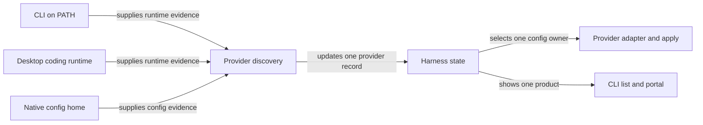

# Recognize desktop coding runtimes as existing harnesses

## Summary

`roborepo harness refresh` should recognize local Claude Code and Codex sessions run from their
macOS desktop apps. Each product remains one harness with one enabled state and one configuration
owner. Discovery records whether the working runtime came from the terminal, a desktop app, or
both, so operations that need an executable can select one and UI-specific features can be
described accurately.

## Context

The Claude and Codex manifests in `globals/harnesses/` require `confirmed` confidence.
`scripts/harnesses/discovery.mjs` reaches that level only when a validated executable is found
by name on `PATH` **and** the provider's home or config exists. A desktop-only installation can
therefore leave `harness refresh` at `possible` even while its coding runtime works. The persisted
state then marks the provider disabled, and the portal's machine harness cohort omits it.

Inspection of a macOS installation established two bounded runtime shapes. These are observed
paths, not guarantees that future app releases will retain the same layout:

| Product | Observed coding runtime | Config owned by the existing provider |
| --- | --- | --- |
| Claude Code in Claude Desktop | `~/Library/Application Support/Claude/claude-code/<version>/[<build>/]claude.app/Contents/MacOS/claude`; nested bundle ID `com.anthropic.claude-code` and a `.verified` marker beside the nested app | `~/.claude/settings.json` and Claude Code's MCP store |
| Codex in the desktop app | `ChatGPT.app/Contents/Resources/codex`; outer bundle ID `com.openai.codex` | `~/.codex/config.toml` |

Both observed binaries returned a product version from `--version`. Claude Desktop's general
chat MCP file, `~/Library/Application Support/Claude/claude_desktop_config.json`, is separate
from Claude Code's configuration; its existence alone must not enable the Claude Code provider.
Anthropic [documents shared Code/CLI configuration](https://code.claude.com/docs/en/desktop).

`scripts/cli/harness.mjs` also exposes `harness detected`, whose `present` column intentionally
means **native home directory exists** for installer, repair, and uninstall scripts. This is a
different question from whether a coding runtime is installed. The adjacent
`harness-presence-signal-expansion` plan owns a general redesign of that shell signal; this plan
will change only the install/apply decisions necessary to deliver configuration to a validated
desktop runtime.

## Goals

- A working desktop coding runtime makes its existing `claude` or `codex` provider eligible for
  discovery without requiring a separately installed CLI on `PATH`.
- `harness list`, `harness inspect`, and the portal show one provider per product. Inspect exposes
  the detected runtime source, path, and version for diagnosis.
- CLI-only, desktop-only, and combined installations receive the same provider-owned settings,
  rules, skills, hooks, and supported MCP configuration exactly once.
- An explicit `harness disable <id>` continues to survive refresh.
- Terminal or desktop UI features report their actual effect without creating duplicate providers
  or pretending that a shared config key produces the same UI in both surfaces.

## Non-goals

- Managing Claude's general chat or Cowork configuration as Claude Code configuration.
- Creating independent desktop provider IDs, settings stores, or package enablement switches.
- Adding a custom Codex footer hook; `usage-statusline-codex-hook-parity` owns that work.
- Treating a desktop app icon or leftover config as proof that its local coding runtime works.
- Broadening Gemini or Windows discovery without platform-specific evidence.

## Proposed design

### One provider with several runtime observations

Keep `claude` and `codex` as the provider IDs and adapter owners. Extend discovery with
provider-declared, macOS-only runtime candidates. A result remains keyed by provider ID; each
validated executable observation records its source (`cli` or `desktop`), resolved path, and
version. Retain all valid observations when both surfaces exist. Choose a `PATH` CLI for
command-oriented operations when available, then a validated desktop binary. Never persist a
second enabled flag for the same product.

Keep the existing confidence meanings: a validated runtime alone is `probable`; runtime plus
native home or config is `confirmed`; config alone is `possible`. Set the Claude and Codex
minimum to `probable` so a newly installed runtime is visible before its first local session.
Preserve the current minimum for other providers. The app bundle without a validated coding
runtime is diagnostic evidence only and must not enable the provider. Preserve that evidence or
a specific warning for `harness inspect` and the portal's setup guidance. If Claude Desktop has
not downloaded or initialized its Code runtime, tell the user to open the Code tab and refresh.

Discovery must stay bounded and data-driven. For Claude, inspect only the version/build levels
under its known `claude-code` support directory, accept both observed nesting shapes, validate
the nested bundle identity and executable, and choose the newest **working** candidate. For
Codex, inspect supported app locations such as `/Applications` and `~/Applications`, check the
outer bundle identity, and validate its resource executable. Record a useful warning when a
candidate exists but fails validation; avoid a broad filesystem search. A moved app outside the
supported locations remains a documented discovery limitation. Let tests inject candidate roots
so they never depend on or write to real application directories. Bound version probes by a
timeout and verify that `harness refresh` does not change user configuration or app files.

### Configuration delivery and executable operations

`refresh` only updates harness state; it does not itself install provider configuration. Trace
`config apply`, `update`, and the installer paths through `harness detected` so a validated
desktop-only runtime with no native home can receive its first managed configuration. Make the
new-home creation an explicit, idempotent apply decision while retaining the existing home-only
signal for withdrawal and uninstall ownership checks. The same provider config path must be
written once when both CLI and desktop are present.

Most adapter methods work on shared files. Claude's MCP helpers in
`scripts/harnesses/mcp-claude-cli.mjs` currently invoke the literal `claude` command, while
`scripts/cli/packages.mjs` has a separate `claude --version` gate before preset installation.
Route both through the selected validated executable and verify `mcp add`, `list`, and `remove`
work with the desktop-bundled runtime under an isolated home. If they do not, implement an
explicitly tested file-based path for the supported scopes and report unsupported scopes rather
than silently claiming MCP parity. Codex's MCP adapter already edits its TOML store directly.

### Feature effects by surface

Provider configuration remains shared. A surface-specific feature is an observed effect of that
configuration, not a separate provider or package switch. Record only distinctions that tests
or product documentation support:

| Feature | Required check | User-facing outcome |
| --- | --- | --- |
| Claude `statusLine` package | Verify whether a local Desktop Code session invokes the configured command and displays its output | Describe the actual desktop effect; keep the one shared setting |
| Codex `tui.status_line` | Confirm it affects the CLI TUI and whether the desktop app renders any equivalent | Label it as a terminal footer where appropriate |
| Hooks and telemetry | Run one local session in each desktop app and verify the configured hooks and transcript capture | Report captured versus unavailable data by session source if distinguishable |
| Session launch | Check the currently stubbed `session.launch` adapters before exposing a launch choice | Do not infer launch support from discovery alone |

No general per-surface capability matrix is needed until a consumer has a verified distinction
to act on. `Usage Statusline` remains a single provider-targeted package; this work may need
documentation or presentation changes after the desktop check, but must not install competing
statusline configurations into the same file.

## Implementation plan

### Phase 1 — Runtime discovery and state

- [ ] Extend `provider-manifest.schema.json` and `contract.mjs` with bounded platform-specific
      desktop runtime candidates; keep manifests responsible for locations and identities.
- [ ] Add a macOS candidate resolver under `scripts/harnesses/` and feed validated paths into
      `discovery.mjs` without making the CLI or portal rescan independently.
- [ ] Extend `schemas.mjs` and state evidence with optional source/path/version fields and an
      app-only diagnostic that cannot raise confidence by itself; read existing state files
      without migration and preserve user-disabled selections.
- [ ] Update Claude and Codex manifests, including the `probable` minimum and both observed
      Claude cache layouts. Keep one provider result when two runtimes validate.
- [ ] Show runtime sources in `harness inspect` and a concise provider-level summary in
      `harness list` and the portal; never add a second provider card. When the Claude app is
      found without a working Code runtime, show setup guidance rather than an enabled harness.

### Phase 2 — Apply and MCP behavior

- [ ] Trace every consumer of `harness detected` and update only paths that must configure a
      validated runtime before its native home exists. Preserve uninstall/withdraw ownership
      checks and coordinate overlapping changes with `harness-presence-signal-expansion`.
- [ ] Use the selected Claude executable in MCP add/list/remove and test desktop-only operation
      under an isolated home. Replace the separate CLI availability probe in
      `scripts/cli/packages.mjs`. Resolve any scope incompatibility before claiming MCP delivery.
- [ ] Prove `config apply` and `update` write the existing provider paths once for desktop-only,
      CLI-only, and combined installations, including first-run home creation.

### Phase 3 — Package effects and guidance

- [ ] Exercise `Usage Statusline`, hooks, and telemetry in local sessions from both desktop apps;
      record which effects actually occur. Use the result to correct package and portal wording.
- [ ] Update `docs/user/guides/harnesses/supported-harnesses.md`, provider interface guidance,
      at `docs/internal/harness-provider-interface.md`, and refresh/install documentation with
      the supported app locations and setup diagnostics.

## Validation

- [ ] Focused discovery tests use isolated `HOME`, `PATH`, and fixture app bundles. Cover CLI
      only, desktop only, both, stale config only, app without coding runtime, invalid bundle ID,
      failed `--version`, two Claude cache versions, and a moved/absent app.
- [ ] CLI integration tests prove `harness refresh`, `list`, and `inspect` produce one enabled
      provider for a validated desktop runtime and honor explicit disable after refresh.
- [ ] Installer/apply tests prove native config is delivered once on a clean desktop-only home and
      preserve unrelated user config. Exercise Linux behavior to ensure macOS probes are inert.
- [ ] MCP tests prove the selected desktop Claude executable or a supported fallback can add,
      list, and remove a server without a standalone CLI on `PATH`.
- [ ] Manual macOS checks on the installed apps verify the candidate layouts, one provider per
      product in the portal, and the statusline/hook/telemetry effects. Record exact app versions
      and observed results in the implementation verification report.
- [ ] Run `node scripts/test/harness-registry-check.mjs`,
      `node scripts/test/harness-cli-check.mjs`, relevant MCP and package tests,
      `bash scripts/doctor.sh --quiet`, `git diff --check`, and `npm run check`. Provider and
      install behavior are cross-cutting, so the full local parity gate is required before handoff.

## Risks and decisions

| Risk or decision | Planned treatment |
| --- | --- |
| Desktop runtime locations change across releases | Discover bounded candidates, validate executable identity/version, and keep layout fixtures for both observed Claude shapes. |
| A newly installed desktop app has no coding runtime yet | Show setup guidance without enabling the provider from the general app bundle alone. |
| Validated runtime has no native config home | Allow configuration delivery to create it deliberately; keep uninstall ownership independent of detection. |
| CLI and desktop versions differ | Retain both observations and select a working executable for command operations; do not infer one version from the other. |
| Shared config has a UI-specific effect | Keep one config owner, test the effect in each UI, and describe availability accurately. |
| A bundled binary's version probe has side effects | Bound the probe, capture its result, and verify discovery leaves native config and app files unchanged. |
