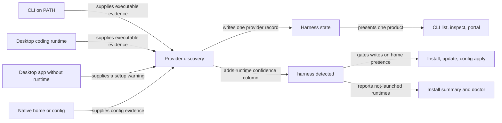

# Recognize desktop coding runtimes as existing harnesses

## Summary

Claude Code and Codex both ship a working coding runtime inside their macOS desktop apps. RoboRepo
only recognizes a runtime that sits on `PATH`, so a machine that uses the desktop apps alone shows
both harnesses as disabled. That happens even though their config homes exist and RoboRepo already
writes managed config into them.

This plan makes a validated desktop runtime count as the provider's executable. Each product stays
one harness with one enabled state and one config owner. Every surface that reports harness
presence also learns to say "installed, not launched yet" instead of "not installed": the CLI,
portal, install summary, and `doctor`.

This plan absorbs the former `harness-presence-signal-expansion` backlog plan. The Decision Log
records what was kept and what was dropped.

## Context

### Two presence checks

RoboRepo answers "is this harness here?" in two places, with different rules:

| Check | Source | Rule today | Consumers |
| --- | --- | --- | --- |
| Discovery confidence | `scripts/harnesses/discovery.mjs` | `confirmed` = validated executable on `PATH` **and** home or config; `probable` = executable only; `possible` = home or config only | `harness refresh`/`list`/`inspect`, persisted `~/.roborepo/harnesses/state.json`, the portal machine cohort (`configSnapshotMachineHarnesses` in `scripts/cli/config.mjs`), Settings and telemetry `captureAvailable` (`scripts/cli/portal-setup.mjs`) |
| Home presence | `harness detected` in `scripts/cli/harness.mjs` | Native home directory exists, nothing else | Every `harness_detected_rows` reader: `scripts/install/{main,install-harness,repair,withdraw,uninstall,uninstall-lib}.sh`, `scripts/doctor.sh`, `scripts/build/link-global-skills.sh` |

The Claude and Codex manifests in `globals/harnesses/*/provider.json` require `confirmed`.
`discovery.mjs` resolves executables only by name through `which`. Install, `update`, and
`config apply` all run the installer, which gates on home presence and never reads the persisted
`enabled` flag.

### Observed defect

On a desktop-only Mac at the reviewed commit (`claude` and `codex` absent from `PATH`, both homes
present):

```text
$ roborepo harness list
claude	Claude Code	disabled	possible
codex	Codex	disabled	possible
gemini	Gemini CLI	disabled	possible
```

Both homes still contain RoboRepo-managed files, because the installer's home check passes. The
user-visible failures are:

- the portal and Settings treat both harnesses as not installed, and telemetry reports capture as
  unavailable;
- the Claude MCP preset step in `scripts/cli/packages.mjs` gates on `spawnSync("claude",
  ["--version"])` and skips;
- every Claude MCP operation in `scripts/harnesses/mcp-claude-cli.mjs` spawns the literal `claude`
  command, and `scripts/harnesses/claude/mcp.mjs` gates on `hasClaudeCli()`.

The Codex MCP adapter edits `~/.codex/config.toml` directly and does not need an executable.

### Desktop runtime layouts

These paths come from inspecting installed apps. They are not guarantees that future releases
keep the same layout.

| Product | Coding runtime | Identity check | Verified at reviewed commit |
| --- | --- | --- | --- |
| Claude Code in Claude Desktop | `~/Library/Application Support/Claude/claude-code/<version>/<build>/claude.app/Contents/MacOS/claude` | Nested bundle ID `com.anthropic.claude-code`; `.verified` marker beside `claude.app` | Yes: versions `2.1.293` and `2.1.295`; `--version` printed `2.1.295 (Claude Code)` in about 20 ms |
| Claude Code, flat layout | `.../claude-code/<version>/claude.app/...` (no build directory) | Same | No. Seen in an earlier install, absent from this machine now |
| Codex in the desktop app | `/Applications/ChatGPT.app/Contents/Resources/codex` | Outer bundle ID `com.openai.codex` | Yes: `--version` printed `codex-cli 0.155.0-alpha.16.3` |

The Claude Desktop app itself has bundle ID `com.anthropic.claudefordesktop`. Its general chat MCP
file, `~/Library/Application Support/Claude/claude_desktop_config.json`, is separate from Claude
Code's configuration, and its existence must not count as Claude Code evidence. Anthropic
[documents that Code and CLI share configuration](https://code.claude.com/docs/en/desktop).

### Existing platform override, not yet honored

`provider-manifest.schema.json` and `contract.mjs` already validate a `platforms.<os>.detection`
override. `paths.mjs` layers `platforms.<os>.paths` onto the base path map, but `discovery.mjs`
reads `manifest.detection` directly and ignores the detection override. `contract.mjs` also
restricts `homeCandidates`/`configCandidates` to `~/`-relative paths, which cannot express
`/Applications`.

## Goals

- A validated desktop coding runtime supplies executable evidence for its existing `claude` or
  `codex` provider, so a desktop-only machine that has launched the app reaches `confirmed`.
- `harness list`, `harness inspect`, and the portal show one provider per product. `inspect`
  exposes each runtime's source, path, and version.
- A runtime that is installed but has never been launched, and a Claude Desktop app with no Code
  runtime yet, produce specific setup guidance on every presence surface. They are never reported
  as "not installed" and never enable the provider.
- Claude MCP add, list, and remove work through the desktop runtime when no CLI is on `PATH`.
- An explicit `harness disable <id>` continues to survive refresh.

## Non-goals

- Creating `~/.claude` or `~/.codex` for a runtime that has never been launched. Install stays
  home-gated (see Decision Log).
- Managing Claude's general chat or Cowork configuration as Claude Code configuration.
- Separate desktop provider IDs, settings stores, or package enablement switches.
- A custom Codex footer hook; `usage-statusline-codex-hook-parity` owns that.
- Gemini, Linux, or Windows desktop discovery.
- Migrating harness state written before this change.

## Proposed design

### One provider, several runtime observations



Confidence meanings and the `confirmed` minimum for Claude and Codex stay as they are. A desktop
runtime is just one more kind of executable evidence:

| Machine | Evidence | Confidence | Enabled | Guidance |
| --- | --- | --- | --- | --- |
| CLI or desktop runtime, home exists | executable + home | `confirmed` | yes | none |
| CLI or desktop runtime, never launched | executable | `probable` | no | Launch it once, then run `roborepo update` |
| Claude Desktop app, no Code runtime downloaded | home or nothing, plus a warning | `possible` or `absent` | no | Open Claude's Code tab, then refresh |
| Leftover home only | home | `possible` | no | none |

### Candidate discovery

Discovery applies `platforms[process.platform].detection` key-by-key on top of the base
detection, the way `paths.mjs` already layers paths. Claude and Codex declare their desktop
candidates under `platforms.darwin.detection`, so other platforms never evaluate them. Each
candidate declares:

| Field | Claude Code | Codex |
| --- | --- | --- |
| Search roots | `~/Library/Application Support/Claude/claude-code` | `/Applications`, `~/Applications` |
| Bounded shape | `<version>/[<build>/]claude.app` | `ChatGPT.app` |
| Bundle ID to match | `com.anthropic.claude-code` (nested app) | `com.openai.codex` (outer app) |
| Executable inside the bundle | `Contents/MacOS/claude` | `Contents/Resources/codex` |
| Parent app, for the warning case | Claude Desktop, bundle ID `com.anthropic.claudefordesktop` | none |

The resolver lives in its own module under `scripts/harnesses/`. It reads only declared roots and
levels and never searches the filesystem broadly. It validates bundle identity and then runs the
existing bounded `--version` probe. Among working candidates it keeps the newest version. A
candidate that exists but fails validation produces a warning, not evidence. Candidate roots must
be injectable so tests never read or write real application directories. Extend `contract.mjs` and
the JSON schema so desktop roots may be absolute; plan `windows-provider-path-schema` needs the
same relaxation for environment-variable roots, so the two should share one path form.

### State and presentation

Since no legacy state needs to survive, the state shape changes directly:

- Executable evidence records `source` (`cli` or `desktop`), `resolvedPath`, and `version`. When
  both surfaces validate, both observations are kept.
- Each provider entry persists the discovery result's `warnings` array. `warnings` exists on the
  in-memory result today but is not saved.
- `schemaVersion` becomes `2`. `readHarnessState` treats any other version as empty state, and the
  next refresh rebuilds it. User-disabled selections recorded under version 1 are not carried over.

`harness inspect` prints runtime observations and warnings. `harness list` adds a short runtime
summary per provider, for example `cli+desktop`. The portal keeps `machineHarnesses`
minimum-gated. The setup snapshot additionally reports providers that are below the minimum but
have a setup warning or `probable` confidence. `portal/shared/harness-warning.js` uses that to
replace "Install a supported harness" with the specific next step. A second provider card is never
added.

### Install-side presence report

`harness detected` gains a sixth column holding the provider's live discovery confidence. Column 3
keeps its exact meaning, home presence, and every write decision keeps gating on it.

Bash `read -r a b c d e` puts all remaining columns into the last variable, so a sixth column would
corrupt `root_config_path` in any reader that names only five. Every `harness_detected_rows` loop
listed in Context must name the new column or end with a discard variable. The bash-3.2 fallback
in `scripts/lib/manifests-data.sh` must emit six columns. The row assertions in
`scripts/test/harness-cli-check.mjs` (including its row-ends-with-rootConfig regex) and
`scripts/test/clean-machine-container-check.mjs` must expect the new last field.

The new column is consumed in two places only:

- **Install summary** (`scripts/install/main.sh`): name each `probable` provider and tell the user
  to launch it once, then run `roborepo update`, in place of the generic "install it" line.
- **`doctor`** (`scripts/doctor.sh`): report the same condition as a hint, not a failure.

### Selected executable for Claude operations

Add one resolver that returns the executable for command operations. It prefers a validated `PATH`
CLI and falls back to the newest validated desktop runtime. It resolves live through the same
candidate discovery and does not trust a persisted path, because desktop runtime directories are
versioned and get pruned on update. `mcp-claude-cli.mjs`, the `hasClaudeCli()` gate in
`claude/mcp.mjs`, and the preset gate in `packages.mjs` all use it. Verify desktop-runtime `mcp
add`, `list`, and `remove` under an isolated home. If a scope does not work through the desktop
binary, report that scope as unsupported rather than claiming parity.

### Feature effects by surface

Provider configuration stays shared. A surface-specific feature is an observed effect of that
config, not a separate provider or package switch.

| Feature | Required check | User-facing outcome |
| --- | --- | --- |
| Claude `statusLine` (`Usage Statusline` package) | Does a local Desktop Code session run the command and show its output? | Describe the actual desktop effect; keep one shared setting |
| Codex `tui.status_line` | Does the desktop app render anything equivalent? | Label it as a terminal footer where appropriate |
| Hooks and telemetry | Run one session in each desktop app and check hooks fire and transcripts are captured | Report captured versus unavailable data |
| Session launch | `session.launch` is still a `notYetMigrated` stub in both adapters | Do not expose a launch choice from discovery |

## Implementation plan

### Phase 1: Discovery and state

- [ ] Make `discovery.mjs` apply `platforms[process.platform].detection` overrides, layered the way
      `paths.mjs` layers paths. Cover the layering in `scripts/test/harness-registry-check.mjs`.
- [ ] Extend `provider-manifest.schema.json` and `contract.mjs` with desktop runtime candidates,
      allowing absolute roots for them only.
- [ ] Add the bounded macOS candidate resolver under `scripts/harnesses/` with injectable roots,
      and feed its validated observations into `discovery.mjs` as `desktop` executable evidence.
- [ ] Declare the Claude and Codex desktop candidates in their manifests, covering both Claude
      layouts.
- [ ] Update `schemas.mjs` and `state.mjs`: evidence `source`/`version`, persisted `warnings`,
      `schemaVersion` 2, other versions read as empty.
- [ ] Show runtime observations and warnings in `harness inspect`, and a runtime summary in
      `harness list`.

### Phase 2: Presence report and guidance

- [ ] Add the confidence column to `harness detected`. Update every `harness_detected_rows`
      reader, the bash fallback in `scripts/lib/manifests-data.sh`, and the two tests that parse
      the rows.
- [ ] Replace the generic install-summary line in `scripts/install/main.sh` with
      not-launched guidance, and add the matching hint to `scripts/doctor.sh`.
- [ ] Expose below-minimum providers with guidance in the setup snapshot and render them through
      `portal/shared/harness-warning.js`.

### Phase 3: Claude executable selection

- [ ] Add the selected-executable resolver and route `mcp-claude-cli.mjs`, `claude/mcp.mjs`, and
      the preset gate in `scripts/cli/packages.mjs` through it.
- [ ] Prove desktop-only MCP add, list, and remove under an isolated home, and record any scope
      that does not work.

### Phase 4: Surface effects and docs

- [ ] Run the feature-effect checks above in both desktop apps and correct package and portal
      wording to match the results.
- [ ] Update `docs/user/guides/harnesses/supported-harnesses.md` and
      `docs/internal/harness-provider-interface.md` with the supported app locations, the
      not-launched guidance, and the moved-app limitation.

## Validation

- [ ] Discovery tests extend `scripts/test/harness-refresh-simulation-check.mjs` with isolated
      `HOME`, `PATH`, and injected fixture app bundles. Cover CLI only, desktop only, both, leftover
      home only, never-launched runtime, Claude app without a Code runtime, wrong bundle ID, failed
      `--version`, two Claude versions in each layout, and an app outside the supported roots.
- [ ] Discovery on a non-darwin platform (forced `platform` in a unit test) never evaluates the
      desktop candidates.
- [ ] CLI tests in `scripts/test/harness-cli-check.mjs` prove refresh, `list`, and `inspect` show
      one enabled provider for a desktop runtime with a home, keep an explicit disable after
      refresh, and print the sixth `harness detected` column while column 3 still reflects home
      presence only.
- [ ] An installer test on a clean home with a fixture runtime and no native home proves install
      writes nothing into that home and prints the not-launched guidance. `doctor` prints the
      matching hint.
- [ ] MCP tests prove the desktop Claude executable can add, list, and remove a server with no
      `claude` on `PATH`.
- [ ] A refresh run leaves native config files and app bundles unchanged (compare checksums before
      and after).
- [ ] Manual macOS check on the installed apps: candidate layouts, one provider per product in the
      portal, guidance copy, and the feature-effect table. Record app versions and results in the
      implementation verification report.
- [ ] Run `node scripts/test/harness-registry-check.mjs`, `node scripts/test/harness-cli-check.mjs`,
      `node scripts/test/harness-refresh-simulation-check.mjs`, the MCP checks under
      `scripts/test/mcp-*-check.mjs`, `bash scripts/doctor.sh --quiet`, `git diff --check`, and
      `npm run check`. Discovery and install behavior are cross-cutting, so the full local parity
      gate is required before handoff.

## Risks

| Risk | Treatment |
| --- | --- |
| Desktop runtime locations change across releases | Bounded, manifest-declared candidates; identity and version validation; fixtures for both Claude layouts |
| A sixth TSV column silently corrupts a five-variable reader | Update every reader in one change; tests assert the last field of each row |
| A version probe has side effects or hangs | Existing timeout; checksum test proves refresh leaves config and app files unchanged |
| Portal snapshots run live discovery, so probes add latency | Probes measured at about 20 ms each; keep candidate count bounded |
| CLI and desktop versions differ | Keep both observations; select per operation; never infer one version from the other |
| Shared config has a UI-specific effect | One config owner; test the effect per surface; describe it accurately |
| App moved outside supported roots | Documented limitation; no broad search |

## Decision Log

- **Install stays home-gated.** A validated runtime with no native home is reported with guidance
  but never gets `~/.claude` or `~/.codex` created for it. This keeps CLI and desktop behavior
  identical and leaves home creation to the harness. As a result, Claude and Codex keep the
  `confirmed` minimum; the earlier draft lowered it to `probable`.
- **Merged `harness-presence-signal-expansion` into this plan and deleted it.**
  - *Absorbed:* the confidence column on `harness detected`, install-summary and `doctor`
    guidance, and the `testDetectedReflectsHomeDirOnly` update.
  - *Resolved by the decision above:* whether skill linking and root-config export should broaden
    their presence check. They stay home-gated.
  - *Dropped as stale:* its blocker on the completed `discoverable-harness-provider-architecture`
    plan, and its four-column description of `harness detected` (it has five columns now).
  - *Repointed:* `related` entries in `infra-packaging-02-install-lifecycle`,
    `infra-portable-user-profile-backup`, and `package-first-run-onboarding` now name `3jp3yhtq`.
    The home-only comments in `scripts/cli/harness.mjs` and `scripts/test/harness-cli-check.mjs`
    now point here. Prose mentions inside completed plans remain as history.
- **No legacy state support.** Harness state moves to `schemaVersion` 2 without migration.
- **Desktop candidates use the existing `platforms.darwin.detection` override.** No new top-level
  manifest key.
- **Related-plan coordination.**
  - `windows-provider-path-schema` (backlog, unlanded) also relaxes the `~/`-only path rule, so the
    two share one absolute-root form.
  - `package-resource-provider-delivery` (`7k3m9qd`, backlog, unlanded) asks to keep the manifest
    shape stable for its baseline. This plan only adds detection fields and renames none.
