# Verify installation, updates, and removal on Windows

## Summary

Add automated Windows lifecycle coverage that runs real installation, update, and uninstall
commands and checks their filesystem effects. A green Windows job should establish that managed
configuration is applied correctly and user-owned files survive removal.

## Context

[Platform coverage](../../internal/testing.md#platform-coverage) describes the existing macOS,
Linux, and Windows checks. The current Windows job in `.github/workflows/ci.yml` runs
`scripts/test/windows-installer-check.ps1`: it checks PowerShell syntax and provider-list parity,
but does not install or remove anything. The supported setup prerequisites are documented in
[First-Time Setup](../../user/guides/first-time-setup.md#windows).

The related [provider path-schema plan](os-windows-provider-path-schema.md) concerns manifest-based
path resolution. Lifecycle tests can begin against the current installer independently; any path
failure should first be reproduced before deciding whether that separate change is needed.

## Goals

- Exercise checkout installation and the shipped package's lifecycle on real Windows.
- Verify repeat installation/update, configuration ownership, and removal through public commands.
- Make missing Windows prerequisites and incomplete scenarios visible failures in the CI job.
- Preserve the existing fast PowerShell syntax/provider check and macOS/Linux coverage.

## Proposed design

Use a disposable `windows-latest` runner with Node, PowerShell, and Git Bash. Each scenario receives
a fresh profile, app-data directories, npm prefix/cache, state root, workspace, and command path.
Establish which environment variables and OS profile APIs the actual commands read before relying
on redirection. Seed a sentinel outside the scenario roots and assert it is unchanged afterward.
If profile redirection is incomplete, use a separate disposable Windows account or VM boundary.

```mermaid
flowchart LR
    runner[Disposable Windows runner] -->|create isolated roots| scenario[Lifecycle scenario]
    scenario -->|invoke public commands| install[Install]
    install -->|verify managed files and repeat| update[Update or apply]
    update -->|preserve user edits and remove managed state| uninstall[Uninstall]
    uninstall -->|assert retained and removed paths| checks[Filesystem assertions]
    checks -->|publish failures and destroy roots| finish[Job result]
```



| Proposed owner | Responsibility |
| --- | --- |
| `scripts/test/windows-lifecycle-check.ps1` | Preflight, scenario selection, timeout handling, and result summary. |
| `scripts/test/windows-lifecycle/environment.ps1` | Isolated environment setup/restoration, child-process execution, and cleanup in `finally`. |
| `scripts/test/windows-lifecycle/checkout.ps1` | Checkout installer and update scenarios using `scripts/install/install-windows.ps1` and the public lifecycle commands. |
| `scripts/test/windows-lifecycle/package.ps1` | Local tarball installation, package initialization/apply/update, uninstall, and npm removal. |
| `scripts/test/windows-lifecycle/ownership.ps1` | Assertions for managed links/config and user-owned sentinels, shared where the two install modes have the same contract. |
| `.github/workflows/ci.yml` | Separate Windows lifecycle job with required prerequisites and bounded failure artifacts. |
| `docs/internal/testing.md` | Verified platform matrix and the Windows reproduction command. |

The proposed files are new. Keep each focused and below 150 lines; split scenario families when
setup or failure meaning differs. Invoke shipping commands instead of reproducing installer logic
inside the tests. Pack the checkout once and use that local tarball for package scenarios.

## Implementation plan

- [ ] Inventory public install/update/uninstall dispatch on Windows for checkout and package modes;
      record the exact commands and prerequisites as the scenario matrix.
- [ ] Prove isolation, symlink capability, Git Bash discovery, and cleanup using an intentionally
      failing child process before running installation.
- [ ] Add a failing clean-install scenario, then make it pass through the production entry points.
      Check configured harness roots, managed links, generated configuration, and CLI availability.
- [ ] Cover repeated install/update and a local fixture change. Assert convergence without duplicate
      hooks or links, preserving unrelated user config and handling owned-file edits explicitly.
- [ ] Cover uninstall and repeated uninstall. Assert managed state is removed, user-owned sentinels
      remain, and package removal deletes app files without deleting retained user resources.
- [ ] Add a path containing spaces, existing user configuration, and missing symlink permission
      cases. Check the documented failure/recovery behavior rather than skipping these cases.
- [ ] Wire the Windows lifecycle job and upload bounded synthetic logs on failure. Keep the static
      Windows check separate so parser/provider drift stays quick to diagnose.
- [ ] Update platform coverage only after the real Windows scenarios pass; record remaining gaps.

## Validation

Proposed Windows command after implementation:

```powershell
pwsh -File scripts/test/windows-lifecycle-check.ps1
```

Run the existing static check as well:

```powershell
pwsh -File scripts/test/windows-installer-check.ps1
```

Acceptance requires both checkout and package scenarios passing on Windows, including update,
uninstall, idempotence, ownership, paths with spaces, expected prerequisite failure, and cleanup
after failure. No prerequisite or lifecycle scenario may silently skip in the required CI job.
Run `npm run check` on the existing macOS/Linux matrix after shared lifecycle changes; a local
PowerShell parser pass alone does not satisfy this plan.

## Risks

| Risk | Mitigation |
| --- | --- |
| A process resolves the real runner profile despite environment overrides. | Prove sentinel isolation first; use a disposable account/VM when redirection cannot contain writes. |
| Runner symlink privileges hide normal-user failures. | Exercise both a supported setup and an explicit missing-permission case. |
| Bash and PowerShell disagree on paths or quoting. | Run public entry points against roots with spaces and inspect resulting paths. |
| Tests drift into a second installer implementation. | Assert observable files and command results; keep setup limited to synthetic prerequisites. |

## Open questions

The initial inventory must establish whether package-mode dispatch runs unchanged under Git Bash
on Windows and whether all profile reads can be isolated. Failures discovered there determine the
implementation effort; the current estimate is 1–3 days for initial coverage and fixes, not a
commitment to resolve every platform discrepancy within that time.
