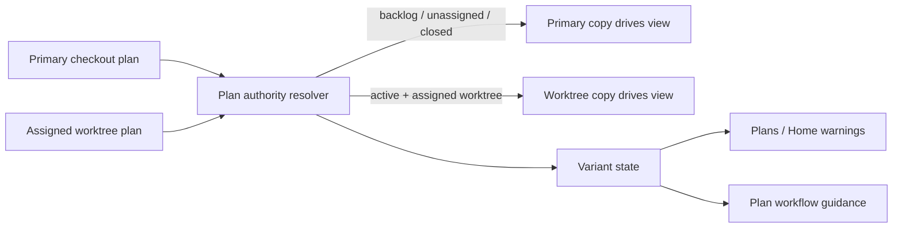

# Make Active Plan State Follow Its Assigned Worktree

## Summary

RoboRepo already scans every known checkout for plan documents, merges copies by stable plan `id`, treats the primary checkout as canonical, and reports when the copy in a plan's assigned worktree differs. That observer is useful, but the authority rule still works against normal Git development: `/plan-start` establishes the active plan on the base branch, implementation then happens in the linked worktree, while plan progress is expected to be mirrored back into the primary checkout so the portal can stay current.

Make the assigned worktree the **working source of truth for an active plan**. The primary checkout remains the published/base copy, and it remains authoritative for backlog plans and for plans after their implementation has landed. The observer compares the two copies and classifies whether only the worktree changed, only the primary checkout changed, both changed, or neither changed. Normal worktree-only progress is not a conflict. A primary-checkout change made after active work began, or a true two-sided divergence, is surfaced explicitly.

This uses the feature worktree as the plan's existing draft branch. It does not add a database, lockfile, CI file mover, in-app Markdown editor, or dedicated `roborepo/plans` branch. A dedicated plan branch remains a possible follow-up if cross-machine plan collaboration or build-trigger cost proves that the worktree-authority model is insufficient.

## Context

Plan Markdown is intentionally repository-owned source material rather than data in a RoboRepo database. Git worktrees therefore create legitimate copies of the same plan file. The system cannot prevent a user, agent, editor, or another Git workflow from changing any one of those copies, and hostile enforcement would work against the filesystem-first model.

The useful invariant is narrower:

> RoboRepo must know which copy should drive the current plan view, and it must not silently hide competing edits.

The repository already has most of the required identity and observation primitives:

- `modules/plan-suite/canonical-scan.mjs` scans every checkout of each known repository, merges plans by stable `id`, and reads the main checkout first.
- The current scan keeps the main copy when both main and a worktree contain a plan. Only the plan's assigned worktree can add the advisory `PLAN_DIFFERS_IN_WORKTREE` finding.
- `modules/plan-suite/checkouts.mjs` resolves the true main checkout and linked worktrees from Git administrative state rather than assuming the registry's first root is main.
- `modules/plan-suite/index.mjs` already separates the global Plans snapshot from repository-local validation and carries stable IDs, lifecycle, worktree association, optimistic `mtimeMs` checks, and structured findings.
- `scripts/test/plan-suite-canonical-check.mjs` already proves that identical copies collapse, an unrelated behind worktree does not create a divergence finding, the main copy currently wins when an assigned worktree differs, and a worktree-only plan remains discoverable.
- `globals/packages/plan-start/skills/plan-start/SKILL.md` currently instructs implementation runs to mirror active plan updates back into the primary checkout at the end of a run so global Plans can see them.
- The Plans drawer already renders structured validation warnings, so plan-authority warnings have an existing user-visible surface.

The remaining problem is that a raw content mismatch cannot say **which side changed**. It also makes the system depend on copying active plan progress back to main even though the implementation branch is the natural place for those edits.

## Goals

- [ ] Make one authority rule explicit for every plan state instead of treating every filesystem copy as equally meaningful.
- [ ] Use the assigned linked worktree as the working authority for an active plan when that exact worktree exists.
- [ ] Keep the primary checkout authoritative for backlog plans, unassigned plans, and post-landing/closed plan state.
- [ ] Distinguish normal worktree progress from a primary-checkout edit and from true two-sided divergence.
- [ ] Make the global Plans snapshot and plan document reads show the active worktree's current plan content without copying that content into main.
- [ ] Route RoboRepo-owned active-plan edits to the same authoritative worktree copy so the portal and deterministic commands do not recreate the split they observe.
- [ ] Remove the plan-start convention that mirrors active plan progress into the primary checkout.
- [ ] Surface ambiguous or competing edits as structured findings without blocking ordinary local editing or adding CI failures.
- [ ] Preserve stable plan identity, lifecycle folders, worktree association, Markdown source of truth, and the existing no-database architecture.
- [ ] Keep the authority and divergence logic in shared plan-domain code so Home, Plans, CLI commands, and skills consume one result.

## Non-goals

- Creating a dedicated `roborepo/plans` or documentation branch.
- Adding `canonicalPlanRef`, branch protection, remote push/fetch orchestration, or a general Git-ref-backed document store.
- Adding a database, local shadow database, lockfile, lease, or distributed locking protocol.
- Preventing users or agents from editing plan Markdown directly.
- Adding CI that moves plan files, fails builds because a plan copy exists in a worktree, or automatically commits plan changes.
- Building a Markdown editor in the portal.
- Automatically merging a true two-sided plan conflict.
- Changing the meaning of the existing `worktree` frontmatter field.
- Changing the plan lifecycle or introducing new lifecycle states.
- Solving cross-machine real-time collaboration. Git remains the transport between machines.

## Authority Model

The plan observer should choose one **effective record** while retaining enough metadata to explain other known copies.

| Plan condition | Effective source | Expected treatment |
| --- | --- | --- |
| Backlog plan | Primary checkout | Primary copy is authoritative |
| Active plan with no `worktree` | Primary checkout | Primary copy is authoritative |
| Active plan with an exact live assigned worktree | Assigned worktree | Worktree copy is the working authority |
| Active plan whose assigned worktree is unavailable | Primary checkout fallback | Show a worktree-unavailable finding |
| Active plan present only in its exact assigned worktree | Assigned worktree | Show it, but mark it worktree-only/unpublished |
| Completed or archived plan | Primary checkout | Closed history is read from the landed/base copy |
| Copy in an unrelated worktree | Never authoritative | Ignore it for authority and divergence |

The lifecycle-aware choice is intentionally asymmetric. The primary checkout is the stable baseline; the assigned active worktree is where implementation and plan progress are expected to evolve.



## Directional Variant State

Replace the current hash-only "different" result with a directional comparison against the plan's Git base.

For an active plan with an assigned worktree, compare:

1. the plan at the relevant common Git base;
2. the current primary-checkout copy, including uncommitted changes;
3. the current assigned-worktree copy, including uncommitted changes.

Stable plan `id`, not path, identifies the document when lifecycle moves or renames make paths differ across revisions.

| State | Primary vs. base | Worktree vs. base | Meaning | Finding |
| --- | --- | --- | --- | --- |
| `synced` | unchanged | unchanged/equal | No competing plan edits | none |
| `worktree-changed` | unchanged | changed | Normal active-plan progress | none |
| `primary-changed` | changed | unchanged | Base copy changed after active work began | advisory |
| `diverged` | changed | changed differently | Both sides edited the plan | advisory, prominent |
| `worktree-only` | missing | present | Assigned worktree contains a plan not published to primary | advisory |
| `worktree-missing` | present | missing/unavailable | Assigned plan has no readable worktree copy | advisory |
| `unknown` | unknown | unknown | Git cannot establish a trustworthy comparison base | advisory |

A branch merely being behind is not enough to call a plan divergent. The comparison is about whether that plan changed on each side relative to the common base.

### Git comparison rules

- Reuse the repository Git execution boundary in `modules/repositories/` rather than scattering `spawnSync("git", ...)` calls through portal or plan UI code.
- Resolve the common base from the assigned worktree branch and the primary checkout's current branch/HEAD.
- Resolve the historical plan at the base by stable `id`; do not assume its current lifecycle path existed at the base.
- Hash normalized raw Markdown bytes for equality. Do not parse and reserialize documents merely to compare them.
- Compare working-tree bytes, not only committed blobs, so unsaved-to-Git plan edits remain observable.
- If Git cannot establish a trustworthy base, return an explicit `unknown`/unavailable comparison result rather than guessing which side changed.
- Do not expose absolute checkout paths through `/api/plans`.

## Proposed Design

### 1. Separate authority selection from checkout discovery

Keep `modules/plan-suite/checkouts.mjs` responsible for discovering the primary checkout and linked worktrees.

Move copy classification and authority selection out of the scan loop into a focused plan-domain unit, for example `modules/plan-suite/plan-authority.mjs`. The exact filename may follow local ownership conventions, but the responsibilities should stay separate:

- collect the copies for one stable plan `id`;
- identify the primary copy and exact assigned-worktree copy;
- classify their directional state;
- choose the effective record from lifecycle plus worktree evidence;
- return structured metadata/findings to the caller.

`canonical-scan.mjs` should remain orchestration: enumerate repositories/checkouts, collect plan copies, ask the authority unit to resolve each plan, then build the public snapshot.

### 2. Make the active worktree record drive the global view

Today `canonical-scan.mjs` retains the first/main record and mutates it with `divergentCheckouts`. Change that composition rule so an active plan with an exact, readable assigned worktree returns the worktree record as the effective plan.

The public plan still belongs to the same canonical repository identity. Existing repository grouping, stable IDs, relationships, lifecycle counts, and Home worktree joins must continue to work.

Add compact runtime metadata sufficient for consumers to explain the state, for example:

```json
{
  "authority": {
    "source": "worktree",
    "worktree": "plan-active-worktree-authority",
    "variantState": "worktree-changed"
  }
}
```

The exact field names are implementation details, but the API must not leak absolute paths, branch-local filesystem identifiers, or a second plan identity.

Retire `divergentCheckouts` if the directional authority object fully replaces it; do not maintain two overlapping representations.

### 3. Keep normal worktree progress quiet

`worktree-changed` is the expected state while implementation is active. It should not make the plan invalid and should not produce a warning badge.

Add structured findings for the cases that need attention:

- primary changed after work began;
- both copies changed;
- assigned worktree is unavailable/missing its copy;
- the plan exists only in the assigned worktree.

The existing warning pipeline in `modules/plan-suite/findings.mjs` and the Plans drawer should render these without a new notification framework.

A true divergence warning must say which two sources disagree and what the user should do next. It must not claim that main is automatically correct.

### 4. Route RoboRepo-owned active-plan writes to authority

Any RoboRepo path that begins from the global plan snapshot must mutate the effective record's checkout, not automatically the main copy.

Cover at least:

- plan document reads;
- editable plan frontmatter fields exposed by the portal;
- portal lifecycle mutations where the existing product still allows them;
- deterministic plan commands that accept a plan selected from the global snapshot.

Keep operation-specific lifecycle rules intact:

- `roborepo plans start` still runs from the primary checkout. It establishes `worktree`, performs the backlog-to-active transition, commits that plan-only start transition on the base branch, and fast-forwards/reconciles the fresh worktree as it does today.
- Once start has succeeded and the worktree is authoritative, implementation-time plan edits stay in that worktree.
- `/plan-close` continues to judge the landed base branch. Closing is post-landing behavior, so completed/archived state belongs in the primary checkout.
- A generic portal lifecycle move that would take an assigned plan out of `active/` must not simply rename the worktree copy. Treat leaving `active/` as an authority handoff: if the worktree is the only changed side, reconcile its current plan content into the primary checkout and perform the lifecycle move there; if the primary also changed or the comparison is unknown, refuse that mutation with the structured conflict state instead of guessing. This keeps a manual lifecycle move from leaving main and the worktree in contradictory lifecycle folders.

The authority handoff is the exceptional operation that may update the primary plan from worktree state. It is tied to an explicit lifecycle transition, not continuous progress synchronization. Do not add automatic commits or pushes for implementation-time plan progress.

### 5. Update suite skills to follow the authority rule

Update the plan-suite instructions that currently encode primary-checkout mirroring.

At minimum:

- `globals/packages/plan-start/skills/plan-start/SKILL.md`
  - remove the requirement to mirror active plan-document updates into the primary checkout at the end of the run;
  - state that after the approved start transition, the assigned worktree owns active plan progress until landing.
- `globals/packages/plan-write/skills/plan-write/SKILL.md`
  - when revising/syncing an active assigned plan, resolve the exact assigned worktree and edit that copy;
  - when the worktree is unavailable or the observer reports `primary-changed`/`diverged`, preserve the condition and report it rather than silently choosing a different copy.
- `globals/packages/session-close/skills/session-close/SKILL.md`
  - when it invokes `plan-write`, inherit the same authority behavior rather than copying the result to main.
- `globals/packages/plan-close/skills/plan-close/SKILL.md`
  - keep closure on the landed base copy; clarify only if needed so it does not inherit active-worktree authority after landing.

Where a deterministic resolver exists, skills should call it instead of independently reconstructing the authority rule.

### 6. Surface the state without turning it into a roadblock

The portal already displays plan warnings. Extend that existing surface rather than adding a modal, editor, or blocking workflow.

For an active plan:

- `worktree-changed`: no warning; this is normal.
- `primary-changed`: warn that the primary/base copy changed after the worktree baseline and should be reconciled.
- `diverged`: warn that both copies changed and require explicit reconciliation.
- `worktree-only`: warn that the active plan has not landed/published to the primary checkout.
- `worktree-missing`: warn that the assigned worktree cannot currently supply the working copy.

Home may consume the same compact authority state for a small badge only if that can be added through its existing plan projection without duplicating the classification rules. The Plans drawer remains the detailed explanation surface.

Do not disable editing globally because a variant exists. Only an operation that would overwrite an ambiguous competing copy should refuse and return a structured stale/conflict result.

## Implementation Plan

### Phase 1 — Directional variant classifier

- [ ] Add a focused plan-authority/variant module under `modules/plan-suite/`.
- [ ] Represent the primary and exact assigned-worktree copies by stable plan `id`.
- [ ] Resolve a Git common base and historical plan copy by ID rather than current path.
- [ ] Classify `synced`, `worktree-changed`, `primary-changed`, `diverged`, `worktree-only`, `worktree-missing`, and unknown Git-base cases.
- [ ] Include uncommitted working-tree plan edits in the comparison.
- [ ] Keep unrelated worktrees out of the classification.
- [ ] Add fixture-repository tests for every state before changing which copy the portal returns.

### Phase 2 — Lifecycle-aware authority selection

- [ ] Refactor `modules/plan-suite/canonical-scan.mjs` to collect copies before choosing an effective record.
- [ ] Select the assigned worktree copy for active plans with an exact live worktree match.
- [ ] Keep the primary copy for backlog, unassigned, completed, and archived plans.
- [ ] Define the fallback record and finding when an assigned worktree is unavailable.
- [ ] Preserve repository identity, relationships, lifecycle counts, plan keys/IDs, and path-free API output.
- [ ] Replace `PLAN_DIFFERS_IN_WORKTREE`/`divergentCheckouts` with the directional model if they no longer add independent information.

### Phase 3 — Mutation and workflow routing

- [ ] Audit `modules/plan-suite/index.mjs`, `scripts/cli/plans.mjs`, and Plans API routes for assumptions that a globally selected plan lives in the primary checkout.
- [ ] Route ordinary active-plan reads and supported non-lifecycle mutations to the effective worktree record.
- [ ] Add an explicit authority-handoff path for a generic portal move from `active/` to another lifecycle: reconcile worktree-only changes into the primary checkout, or refuse when the primary also changed / comparison is unknown.
- [ ] Preserve current optimistic stale-write checks at the selected file.
- [ ] Keep `roborepo plans start` as a primary-checkout transition and `/plan-close` as a post-landing primary-checkout workflow.
- [ ] Remove end-of-run primary-checkout plan mirroring from `plan-start`.
- [ ] Update `plan-write` and `session-close` guidance to edit the active authoritative worktree copy.
- [ ] Ensure a conflicting primary/worktree state is reported rather than silently overwritten.

### Phase 4 — Portal presentation

- [ ] Add structured finding definitions for primary-only change, true divergence, worktree-only, and unavailable worktree cases.
- [ ] Reuse the existing Plans warning section for detailed messages and resolutions.
- [ ] Expose only the compact authority metadata the UI needs.
- [ ] Add a Home badge only if the existing repository projection can consume the same state without reimplementing the rules.
- [ ] Keep `worktree-changed` visually quiet.

### Phase 5 — Documentation and cleanup

- [ ] Update the plan-suite user/reference documentation to define active-worktree authority.
- [ ] Remove stale prose that calls the primary checkout the authoritative copy throughout active implementation.
- [ ] Document that direct edits remain allowed and that RoboRepo detects rather than prohibits competing variants.
- [ ] Record the dedicated documentation-branch approach as deferred architecture, not as an available setting.

## Validation

Use the repository's existing focused checks first:

```text
node scripts/test/plan-suite-canonical-check.mjs
node scripts/test/plan-suite-check.mjs
node scripts/test/plan-suite-commands-check.mjs
node scripts/test/plan-promote-plan-start-check.mjs
node scripts/test/plans-portal-state-check.mjs
node scripts/test/repository-overview-check.mjs
```

Add or extend fixture coverage proving:

- [ ] An active assigned worktree that alone edits its plan becomes the effective global record and produces no conflict warning.
- [ ] A primary-only plan edit after work begins produces `primary-changed` rather than generic divergence.
- [ ] Independent edits on both sides produce `diverged`.
- [ ] An unrelated old worktree copy produces no finding.
- [ ] Uncommitted plan edits are classified correctly.
- [ ] A lifecycle/path move is still matched by stable plan `id`.
- [ ] A missing assigned worktree falls back predictably without hiding the plan.
- [ ] A worktree-only active plan is visible and explicitly identified as unpublished.
- [ ] Portal priority/frontmatter mutation of an active assigned plan changes the worktree copy and leaves the primary copy untouched.
- [ ] A generic portal move out of `active/` hands authority back to the primary checkout when reconciliation is one-sided, and refuses when the two copies genuinely compete.
- [ ] Backlog plan mutation still changes the primary checkout copy.
- [ ] The public API exposes no absolute checkout paths.

Because this changes shared Plans behavior and portal-visible state, finish with the repository's broader gate:

```text
npm run check
```

## Success Criteria

- An active plan can evolve normally in its implementation worktree without RoboRepo copying the file back to main merely to keep the portal current.
- The Plans portal shows that active worktree copy as the current plan.
- A normal worktree-only plan edit is not presented as a conflict.
- An edit made to the primary copy after active work begins is distinguishable from a worktree edit.
- Two-sided edits are surfaced as a true divergence with neither side silently discarded.
- RoboRepo-owned mutations follow the same authority rule as reads.
- Starting and closing retain their existing base-branch responsibilities.
- No database, dedicated plan branch, lockfile, CI mover, or portal Markdown editor is introduced.
- The design remains Git-native: implementation plus its active plan progress land together through the repository's ordinary branch integration.

## Risks

### Squash, rebase, and changing merge bases

A worktree branch may be rebased or merged from main while implementation is active. The classifier must recompute from current Git state and never persist a merge-base assumption as plan metadata.

### Uncommitted changes

The important plan state can exist outside commits. Comparing only Git blobs would miss the exact edits the observer is meant to surface, so working-tree bytes are part of the authority calculation.

### Missing worktrees

An active plan can outlive its local worktree. The portal must remain usable by falling back to the primary copy while clearly saying the working authority is unavailable.

### Worktree-only plans

A manually created active plan may exist only in a worktree. Showing it is better than hiding it, but it must not look as though it has already been published to the primary branch.

### Cross-machine state

This plan improves consistency among checkouts visible to one RoboRepo installation. Another machine can still hold unpushed plan edits. A dedicated remote plan branch would address a different problem and should be justified separately if that becomes common.

## Decision Log

### Use the assigned worktree as the draft/working branch

**Decision:** During active implementation, the exact worktree already associated with the plan is the working source of truth.

**Alternatives considered:** continuously mirror to main; add a dedicated plan branch; store mutable plan state in a database.

**Reason:** The worktree already provides isolated Git history, conflict detection, and eventual merge into main. Reusing it removes synchronization writes and build-trigger pressure without introducing another persistence layer.

### Detect competing edits instead of blocking them

**Decision:** Direct file editing remains valid. RoboRepo observes and classifies variants rather than installing CI failures or filesystem locks.

**Reason:** RoboRepo does not own every editor or agent that can change Markdown. Advisory detection preserves the filesystem-first model and avoids hostile false positives.

### Defer a dedicated plan branch

**Decision:** Do not add `roborepo/plans` or a configurable canonical plan ref in this story.

**Reason:** A dedicated branch adds remote synchronization, push/fetch policy, branch lifecycle, permissions, and conflict handling before the simpler active-worktree model has been tested. Revisit it if cross-machine collaboration or deployment/build triggers remain a demonstrated problem after this plan lands.
