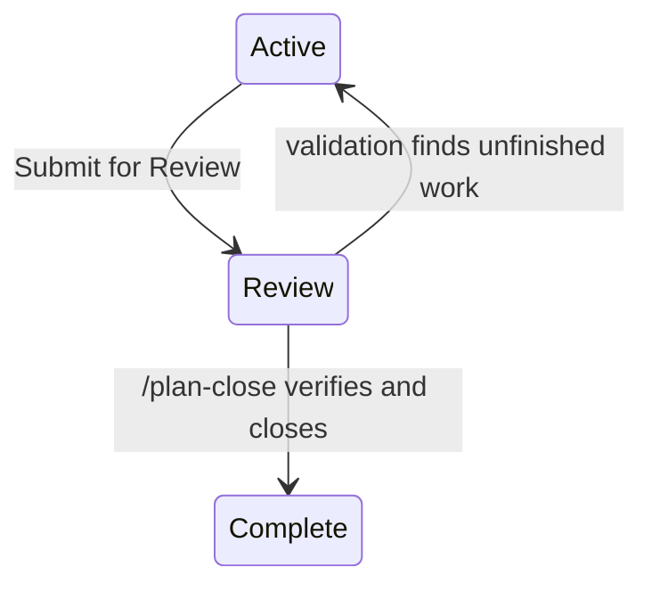

# Plan Lifecycle Suite 04 — Workflow and Navigation Expansion

## Summary

Expand the plan suite from its current four-folder lifecycle into a manifest-driven workflow:

```text
Icebox → Backlog → Ready → Active → Review → Complete
```

Archived remains a lifecycle off-ramp stored under `docs/plans/archived/`. Unclassified remains a recovery classification for misplaced files and is never a destination. Blocked remains an orthogonal condition owned by the companion blocker-management plan.

The lifecycle manifest becomes the source of truth for state identity, folder, display order, navigation placement, validation profile, responsibility, action availability, and transition presentation. The Plans portal also gains a responsive workflow visualization that explains lifecycle, execution artifacts, responsibility, blockers, and archiving.

The commands named here (`/plan-start`, `/plan-close`, `/session-close`) are the atomic plan-suite
commands defined by [[age4cm7r]] (`plan-suite-atomic-commands`), which replaces the `/plan-docs`
modes and `/wrap-up`.

## Context

The current implementation supports Backlog, Active, Completed, Archived, and Unclassified. Lifecycle controls, guarded file movement, stale-state conflict handling, and readiness findings already exist. The missing layer is an explicit operating workflow that distinguishes:

- planning work waiting for human review;
- approved work available for agent pickup;
- implementation underway in a feature worktree;
- implemented work awaiting validation, testing, and acceptance;
- completed work whose merge has been verified.

The workflow also needs to coordinate future agent sessions and worktrees without embedding machine-specific paths in plan documents.

## Goals

- Add Icebox, Ready, and Review as first-class lifecycle states.
- Rename the product label `Completed` to **Complete** while retaining `completed/` as the canonical folder.
- Keep Archived as a folder-derived lifecycle destination outside the successful delivery path.
- Keep Unclassified as recovery-only.
- Define one manifest-backed action model for portal, CLI, API, and plan-suite skills.
- Distinguish who initiates an action from which executor performs it.
- Support Start, Submit for Review, and Close workflow contracts.
- Allow many Ready and Active plans.
- Leave the merge to `main` to the human in this iteration.
- Store only portable execution identifiers in plan frontmatter.
- Compute machine-local worktree paths with cross-platform path utilities.
- Add a clear lifecycle infographic to the Plans portal.

## Non-goals

- Do not implement arbitrary bespoke behavior solely through manifest data.
- Do not make Blocked a lifecycle folder.
- Do not make Unclassified a normal destination.
- Do not commit absolute worktree paths to plan documents.
- Do not automatically merge feature branches into `main`.
- Do not add an Integration state or integration branches in this iteration. See "Review" below.
- Do not add deployment environments or release management.
- Do not require React or TypeScript.
- Do not duplicate the full blocker-management feature owned by Suite 05.

## Current State

### Existing foundation

The completed lifecycle-control plan already owns:

- folder-derived lifecycle;
- lifecycle and priority mutations;
- stable ID resolution after file movement;
- repository-boundary and destination-collision checks;
- stale browser-state detection;
- rebuilt plan records after mutation;
- shared plan-status rendering;
- transition dialogs and passive outcomes.

The readiness plan already owns:

- lifecycle destination profiles;
- normalized findings;
- repair prompts;
- fresh disk validation before movement.

### Current gaps

- Backlog conflates rough planning with approved work.
- Active does not prove a feature branch, worktree, or implementation session exists.
- Completed conflates integrated work, human acceptance, and terminal completion.
- The portal cannot explain the full workflow or responsibility handoffs.
- Start and session closeout are agent prompts rather than deterministic orchestration contracts.
- Worktree metadata has no portable runtime model.
- The session-close skill is chat-oriented and not yet backed by a harness-neutral closeout controller.

## Proposed Design

### Canonical lifecycle

| ID | Folder | Label | Waiting on | Meaning |
|---|---|---|---|---|
| `icebox` | `docs/plans/icebox/` | Icebox | Human or agent | Intentionally idle; not yet submitted for active planning |
| `backlog` | `docs/plans/backlog/` | Backlog | Human | Plan is being reviewed and prepared |
| `ready` | `docs/plans/ready/` | Ready | Agent or scheduler | Approved and eligible for implementation pickup |
| `active` | `docs/plans/active/` | Active | Agent | Feature implementation is underway |
| `review` | `docs/plans/review/` | Review | Human | Implementation is finished; validation, testing, and acceptance are underway |
| `completed` | `docs/plans/completed/` | Complete | None | Human merge is verified and resources are finalized |
| `archived` | `docs/plans/archived/` | Archived | None | Abandoned, superseded, obsolete, or retained as history |
| `unclassified` | `docs/plans/*.md` | Unclassified | Human | Recovery classification; never a destination |

### Archive behavior

Archived is a lifecycle destination because lifecycle is physically represented by folders.

When archiving, preserve historical context:

```yaml
archived_from: active
archived_reason: abandoned
archive_note: Replaced by plan-example-v2
```

Restore defaults to `archived_from` after current destination validation. If the stored state is no longer valid, offer Backlog as the safe fallback.

Archiving Active or Review work is guarded because Git branches, worktrees, or sessions may still exist. Archive does not silently discard execution state.

### Blocked overlay

Blocked is not a lifecycle state. The lifecycle manifest exposes action policy such as:

```json
{
  "id": "start",
  "requiresUnblocked": true
}
```

Suite 05 owns blocker storage, mutation, relationship validation, and UI management. This plan owns only the generic action-policy hook and visual treatment.

### Navigation

Primary tabs:

```text
Backlog | Ready | Active | Review | Complete | ⋯
```

Overflow:

```text
Icebox
Unclassified
Archived
```

Selecting an overflow item renders a temporary selected tab before the overflow trigger. URL state remains authoritative across refresh and browser navigation.

### State actions

| Current state | Primary action | Destination | Initiator | Executor |
|---|---|---|---|---|
| Icebox | Submit for Planning | Backlog | Human or agent | Lifecycle mutation |
| Backlog | Mark Ready | Ready | Human | Lifecycle mutation |
| Ready | Start | Active | Human or scheduler | `/plan-start` |
| Active | Submit for Review | Review | Agent or human | Lifecycle mutation once `/plan-start` reports every unblocked objective done |
| Review | Close | Complete | Human | `/plan-close` |
| Complete | Archive | Archived | Human | Archive workflow |
| Any canonical state | Archive | Archived | Human | State-aware archive workflow |

Use separate fields for responsibility:

```json
{
  "initiators": ["human", "scheduler"],
  "executor": "agent-start-workflow",
  "waitingOn": "agent"
}
```

Do not use a single ambiguous trigger type.

### Start workflow

Start operates on Ready plans:

1. Re-read the plan and current repository state.
2. Confirm Ready lifecycle and no blocking condition.
3. Check explicit dependencies and likely overlap with Active or Ready work.
4. Fetch and synchronize the configured base branch.
5. Confirm the canonical control checkout is clean and on the expected base branch.
6. Create a feature branch.
7. Create a feature worktree under the configured worktree root.
8. Record portable execution identifiers.
9. Move the plan to Active.
10. Commit lifecycle metadata through the control checkout.
11. Launch or attach the selected harness session.

`Start Eligible` replaces “Start All.” It evaluates Ready plans, builds a conflict graph, respects concurrency limits, and starts only the conflict-safe subset.

### Cross-platform worktrees

Use platform APIs rather than literal path concatenation:

```js
path.join(os.homedir(), ".worktrees")
```

The worktree root is configurable. Runtime behavior must account for macOS, Linux, and Windows path separators, drive letters, spaces, case sensitivity, symlinks, and different home directories.

Portable frontmatter:

```yaml
execution:
  worktree_id: wt-plan-123
  feature_branch: feature/plan-123
```

The current parser does not support nested YAML, so the implementation may initially use flat keys:

```yaml
worktree_id: wt-plan-123
feature_branch: feature/plan-123
```

Machine-local registry:

```json
{
  "worktreeId": "wt-plan-123",
  "repositoryId": "git:github.com/kirinmurphy/roborepo",
  "absolutePath": "/Users/example/.worktrees/roborepo/plan-123",
  "platform": "darwin",
  "hostId": "host-abc"
}
```

Reconcile the registry against `git worktree list --porcelain`; never treat the registry as sole authority.

### Review

Review is the state between finished implementation and a closed plan. It holds the validation and
testing that `/plan-start`'s own verification does not cover: manual checks, smoke testing, and
acceptance against the plan's success criteria.

An earlier draft of this plan defined Review as a sealed integration branch: finished feature
branches joined one shared `integration/<date>-<seq>` branch, which was validated with
`/integration-check`, sealed, and merged by a human. That integration step is retired for this
iteration, along with the Integration state and the `integration-check` package ([[age4cm7r]]).
Each plan's own branch now reaches `main` on its own. A future integration step may return, built on
this Review state rather than replacing it.



Review no longer implies any branch or worktree change, which leaves decisions this plan must make
before Phase 5:

| Implication | Why it matters |
| --- | --- |
| Is Review before or after the merge to `main`? | `/plan-close` refuses to close work that has not landed. Review before the merge keeps the worktree and branch alive through testing; Review after the merge tests `main` itself. |
| What moves a plan from Active to Review? | `/plan-start` ends when no unblocked tasks remain, which may leave blocked objectives and open questions. Submitting for Review needs a rule for that partial state. |
| What does Review test that `/plan-start` did not? | Without a distinct contract, Review is a waiting room. Candidates: the plan's `## Not tested` entries, manual UI checks, and acceptance by the human. |
| Where do findings go? | A failed Review check either returns the plan to Active or records a new task. The transition and the plan edit must happen together. |

Confirming that work reached `main` uses the landed test owned by [[a7bslb00]]
(`git-worktree-lifecycle-cleanup`), which counts squash and rebase merges. This plan does not define
a second one.

### Session closeout controller

Keep `/session-close` separate from the plan lifecycle because it also serves ad hoc, documentation-only, and non-plan sessions.

For an Active plan, `/session-close` delegates deterministic work to a RoboRepo closeout controller.

The controller owns:

- repository and plan resolution;
- locks;
- Git status and explicit-path staging;
- commit operations;
- lifecycle movement;
- structured recovery after partial failure.

The harness task owns reasoning-heavy work:

- review scoped session changes;
- apply safe cleanup fixes;
- synchronize affected documentation;
- run required validation;
- classify stray or unrelated work;
- return structured evidence.

Claude and Codex providers translate the same harness-neutral task contract and return the same result schema. A Markdown skill calling another skill is not the orchestration mechanism.

### Existing session-close requirements

The plan-associated closeout must preserve the current `/session-close` sequence:

1. Review files actually changed in the session.
2. Apply safe cleanup fixes.
3. Synchronize affected project documentation.
4. Run required validation.
5. Stage explicit paths only.
6. Audit stray, unrelated, staged, and untracked work.
7. Commit the intended candidate set.
8. Report status and handoff context when appropriate.

The lifecycle handler adds lifecycle movement after successful closeout; it does not replace these steps with a shorter checklist.

### Lifecycle manifest

Add:

```text
manifests/platform/plan-lifecycle.json
```

It declares:

- IDs, folders, and labels;
- navigation placement and ordering;
- validation profile;
- priority visibility;
- waiting responsibility;
- primary and ancillary actions;
- initiators and executor;
- unblocked requirements;
- standard outcome presentation.

Compile it in a filesystem-free module and publish a safe projection in the Plans snapshot. A generic test-only state proves that ordinary lifecycle extensions require manifest changes only.

### Workflow visualization

Add a first-class responsive Lifecycle Overview to the Plans portal.

It must visualize:

1. **Lifecycle lane** — Icebox through Complete, with Archive as an off-ramp.
2. **Execution-artifact lane** — no execution, feature branch/worktree/session, human merge, cleanup.
3. **Responsibility lane** — human, agent, scheduler, system.
4. **Condition overlays** — Blocked.
5. **Concurrency** — many Ready and Active plans in flight at once.

Use semantic HTML and CSS with SVG connectors where needed. On narrow screens, render a vertical timeline. Include concise explanations, state counts, primary action, required artifacts, and advancement blockers.

## Affected Touchpoints

- `manifests/platform/plan-lifecycle.json`
- `modules/plan-suite/index.mjs` (renamed from `modules/plan-docs/` by [[age4cm7r]])
- `modules/plan-suite/lifecycle-policy.mjs`
- new lifecycle manifest loader/compiler
- `scripts/cli/plans.mjs`
- `scripts/cli/portal-routes-plans.mjs`
- `portal/plans/state.js`
- `portal/plans/templates.js`
- `portal/plans/app.js`
- `portal/plans/elements/plan-status.js`
- `portal/plans/elements/plan-card.js`
- `portal/plans/lifecycle-event-dialog.js`
- shared overflow-tabs/menu/popover components
- plan-suite skills (`plan-write`, `plan-promote`, `plan-start`, `plan-close`)
- `session-close` closeout contract
- plan domain and portal tests

## Implementation Plan

### Phase 1: Manifest and domain model

- [ ] Add the canonical manifest and schema validation.
- [ ] Compile immutable state/action lookups.
- [ ] Add all lifecycle folders and labels.
- [ ] Preserve `completed/` while displaying Complete.
- [ ] Publish the public lifecycle model in snapshots.
- [ ] Add generic manifest-extension fixtures.

### Phase 2: Validation profiles and migration

- [ ] Map every state to a destination validation profile.
- [ ] Update readiness findings and repair prompts.
- [ ] Add archive history fields and restore policy.
- [ ] Migrate existing plans and tests safely.
- [ ] Keep Unclassified recovery-only.

### Phase 3: Portal navigation and actions

- [ ] Add primary and overflow navigation.
- [ ] Replace lifecycle dropdown behavior with manifest-backed actions.
- [ ] Preserve card/drawer parity.
- [ ] Add responsibility and disabled-reason presentation.
- [ ] Add Start Eligible queue action.

### Phase 4: Execution registry and Start contract

- [ ] Add portable execution identifiers.
- [ ] Add cross-platform worktree-root configuration. Partially landed ahead of this plan: a
      `worktreeRoot` key on `docs/plans/plans-config.json` (absolute, `~`-relative, or relative to
      repo root; defaults to `~/.worktrees` when absent, matching this plan's spec) plus a
      `plan-start` skill preflight step that resolves worktrees to
      `<worktreeRoot>/<repo-name>/<branch>` and states the resolved default to the user the first
      time a repository has none configured. Still missing from this bullet's full scope: portable
      frontmatter (`worktree_id`, `feature_branch`) and verified Windows behavior — the skill
      instructs `~` expansion and path joining via platform APIs (not literal string
      concatenation), but that instruction has not been exercised on Windows.
- [ ] Add machine-local runtime registry and reconciliation. Not started: no `worktreeId`/
      `repositoryId`/`absolutePath` registry file, no reconciliation against
      `git worktree list --porcelain`. The worktree-root config above has no registry behind it.
- [ ] Define overlap and conflict graph rules.
- [ ] Integrate harness-provider session launching.
- [ ] Add partial-failure recovery.

### Phase 5: Review and closeout

- [ ] Implement the harness-neutral closeout controller.
- [ ] Preserve all current `/session-close` steps.
- [ ] Resolve the Review implications table, then add the Active → Review and Review → Active
      transitions with their rules.
- [ ] Define Review's test contract, starting from the plan's `## Not tested` entries.
- [ ] Wire Review → Complete to `/plan-close`, which confirms the work landed with the landed test
      from [[a7bslb00]].

### Phase 6: Visualization and documentation

- [ ] Add the portal lifecycle infographic.
- [ ] Add Mermaid state and sequence diagrams to reference docs.
- [ ] Update plan-suite and `session-close` skill references.
- [ ] Document macOS, Linux, and Windows behavior.
- [ ] Document repair procedures for interrupted workflows.

### Phase 7: Verification

- [ ] Extend domain lifecycle tests.
- [ ] Extend readiness/finding tests.
- [ ] Extend portal state tests.
- [ ] Add worktree and branch fixtures.
- [ ] Add harness-provider contract tests.
- [ ] Add browser smoke tests.
- [ ] Run the full suite and package dry run.

## Validation

Targeted:

```bash
npm run test:plans
npm run test:plans-findings
npm run test:plans-portal-state
```

Add focused checks for lifecycle manifests, worktrees, Review transitions, and closeout orchestration.

Before completion:

```bash
npm test
npm run pack:dry-run
git diff --check
```

Manual scenarios:

1. Move Icebox to Backlog and Backlog to Ready.
2. Start one Ready plan on macOS, Linux, and Windows path fixtures.
3. Exclude a blocked Ready plan from Start Eligible.
4. Submit an Active plan for Review, then return it to Active when a Review check fails.
5. Human-merge a reviewed plan's branch and close it with `/plan-close`.
6. Attempt `/plan-close` on a plan whose branch has not landed, and confirm it refuses.
7. Archive and restore plans from multiple lifecycle states.
8. Recover an Unclassified plan.
9. Refresh and navigate all primary and overflow tabs.
10. Verify the lifecycle infographic on desktop and narrow screens.

## Acceptance Criteria

- Lifecycle is folder-derived and manifest-driven.
- The final successful path is Icebox → Backlog → Ready → Active → Review → Complete.
- Archived is a guarded lifecycle off-ramp.
- Unclassified is recovery-only.
- Blocked remains an orthogonal condition.
- Start creates a feature branch, worktree, runtime record, and agent session before Active is considered valid.
- Worktree metadata is portable across macOS, Linux, and Windows.
- Review has a defined contract for what it tests and what moves a plan into and out of it.
- The human merges to `main`.
- `/plan-close` verifies the work landed and closes the plan.
- Current `/session-close` review, documentation, validation, explicit staging, commit, and handoff behavior is preserved.
- Claude and Codex use one harness-neutral closeout contract.
- The portal includes an informative responsive workflow visualization.
- Tests prove manifest-only extension for ordinary new states.

## Risks

### Review can become a waiting room

Without the integration branch, nothing forces work through Review. If Review has no contract of its own, plans will sit there untested or skip it. Resolve the implications table in "Review" before building Phase 5.

### Worktree operations differ by host

Use Node path APIs, argument-array process spawning, canonical repository identity, and runtime reconciliation. Never persist absolute paths in repository plans.

### Agent instructions are not deterministic orchestration

Put Git mutation, locking, state transitions, and recovery in RoboRepo controllers. Use harness skills only as entry points and reasoning tasks.

### Scope can become too broad

Keep manifest/navigation, agent startup, and Review/closeout as explicit phases with bounded contracts. Future implementation may split phases into separate plan documents without changing this suite's dependency graph.

## Open Questions

- Is Review before or after the merge to `main`? See the implications table in "Review".
- What may move a plan from Active to Review while it still has blocked objectives or open questions?
- What does Review test that `/plan-start` did not, beyond the plan's `## Not tested` entries?
- Should archived Active work offer Pause, Cancel, or Preserve Worktree options?
- Should the primary control checkout later be replaced by a managed control worktree?
