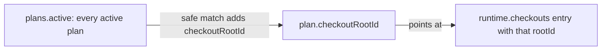

# Make Plans Primary Without Hiding Checkout Activity

## Summary

On Home today, a repository card is organized around checkouts. A plan with a matching worktree
appears as a footer under that worktree's row. Every other active plan goes into a separate
**Additional Plans** section. This plan makes active plans the main way the card is organized,
while every checkout stays visible.

The repository row and the main checkout row stay the same. Below main, Home lists every active
plan first, then every linked worktree that no plan claimed. A plan with a safe worktree match
renders as that worktree's checkout row. The plan title, completion indicator, and a
worktree-details dropdown replace the branch label on the left. The port/origin link and Links
dropdown on the right stay exactly as they are. A plan with no match shows a badge explaining why.
The **Additional Plans** section is removed. The plan counts move to one unlabeled summary line
after the plan rows.

Repositories without plans see no change: with no active plans, every linked worktree renders as
it does today.

On the server, the matching rules don't change. What changes is the output: the projection keeps
both lists complete and adds a reference from each matched plan to its Runtime checkout. It no
longer splits plans between checkouts and a leftover list.

## Goals

- Keep the repository row and main checkout row visually and behaviorally unchanged.
- Render every active plan exactly once, before unmatched linked-worktree rows.
- Keep every linked worktree that Runtime lists on Home. A matched worktree appears as its plan's
  row. An unmatched worktree stays a normal checkout row.
- Keep Home fully useful when a repository has no Plans data or no active plans.
- Make the plan title the main left-side label, and have it open the existing plan drawer.
- Keep the existing completion indicator (ring and percent, or **done**) beside every plan title.
- Move a matched worktree's branch and worktree identity into a worktree-details dropdown,
  instead of giving the worktree its own row.
- Keep the matched checkout row's right side exactly as it is. The port/origin link and the Links
  dropdown, and the rules for when they show, come from the same checkout rendering path as today.
- Keep the inline Git warning (behind remote, base-branch drift) on matched plan rows and on
  unmatched worktree rows. On a plan row it may wrap to a second line.
- Label unmatched plans truthfully. Show **not started** only for a plan that names no worktree.
  Show **worktree not running** for a plan that names a worktree Home cannot match.
- Let the dropdown copy the full branch name, Git's administrative worktree name, and the
  worktree path, each with its own copy action.
- Reuse the shared copy behavior and **Copied** confirmation. Don't add a second clipboard or timer
  implementation.
- Show a short Git summary in the dropdown without repeating the full checkout tooltip.
- Keep the repository-wide plan counts, the **all plans** link, and the partial-coverage note
  visible on Home, with no section heading.
- Keep the existing exact-name matching rules.

## Non-goals

- Changing the repository row, repository menu, or main checkout row.
- Changing plan frontmatter or the meaning of `worktree`.
- Matching plans to worktrees by branch name, filesystem path, plan title, or prose.
- Adding an **Active Plans** heading or any replacement for the **Additional Plans** section.
- Hiding linked worktrees just because no plan claims them.
- Listing stopped worktrees on Home. That is the job of the worktree lifecycle plan
  ([[a7bslb00]]).
- Reimplementing checkout process controls for plan rows.
- Changing the plan drawer or the Plans page.
- Showing the full checkout tooltip inside the new dropdown.
- Changing plan lifecycle semantics. The match badges describe whether Home found the plan's
  worktree. They are not lifecycle states.

## Current State

The work in [[wk7p4n2]] (completed) made checkouts the main structure of a Home repository card.
Verified on `main` at `56ab25a`.

### Server projection

- `scripts/cli/repository-overview-projections.mjs#associatePlans()` takes the full active-plan
  list. Each plan that has a unique exact match becomes `checkout.plan`. Every other active plan
  goes into `plans.additionalActive`. `plans.active` is removed from the payload, so each plan
  reaches the browser only once.
- A plan matches only when its `worktree` name is claimed by exactly one active plan and exactly
  one Runtime checkout has that `worktreeName`. Main checkouts never carry a `worktreeName`.
- `scripts/cli/repository-overview-sources.mjs#planSummary()` orders `active` by most recent
  change, then by title. `projectWorkspace()` maps each Runtime root to a checkout whose `rootId`
  can be `null`.
- `portal/repositories/templates.js#plansBody()` (the repository detail page) reads
  `plans.counts` and `plans.recent`. It doesn't read `additionalActive` or `checkout.plan`.

### Which checkouts Runtime lists

For a running repository, Runtime lists the main checkout plus every checkout that has a running
member. Stopped worktrees are left out (`modules/developer-runtime/snapshot.mjs`, the
`idleMainCheckouts` handling). For an idle repository, Runtime lists the checkouts persisted in the
registry. Either way, the main checkout comes first, then worktrees sorted alphabetically by
branch.

So when a plan's worktree exists on disk but has nothing running, the plan has no match today.
[[a7bslb00]] proposes listing every worktree, running or not.

### Home rendering

- `portal/home/templates.js` renders every Runtime checkout through `buildRootSection()`. A matched
  worktree gets its plan as a `footer` node, built from `tpl-checkout-plan`. Home is the only
  caller that passes `footer`.
- `portal/home/domains.js#additionalPlansRow()` renders the **Additional Plans** domain row. It
  shows the `N Active · M Backlog` counts, the **all plans** link, the partial-coverage note, and
  the unclaimed plans. `planItem()` renders a plan title button and its completion indicator.
- `portal/home/app.js` opens the plan drawer (`portal/plans/plan-drawer.js`, a `<dialog>`) when a
  plan title is clicked. Its polling refresh skips re-rendering while
  `.menu-button-panel` or `dialog[open]` is present.

### Shared row and copy components

- `portal/developer-runtime/repository-root-row.js#buildRootSection()` (392 lines) owns the
  checkout row. Left side: glyph, branch label with the checkout tooltip, copy control, inline
  drift warning. Right side: primary origin/port link and the Links slot. In `home` mode it mounts
  Links through `onMountLinks` only when `primaryEntrypoint.opaqueKey` is present.
- The row's copy control (`mountCopyDropdown`) copies the branch name (not on default branches) and
  the worktree's filesystem path. It doesn't copy Git's administrative worktree name.
- `portal/shared/menu-button.js` (`<portal-menu-button>`) provides a trigger with a caret that
  opens a positioned panel with caller-supplied content. It handles outside-click and Escape.
- `portal/shared/copy-button.js` (`<portal-copy-button>`) owns clipboard writes and the in-place
  **Copied** confirmation. The timer is `COPIED_DURATION_MS` (5 s). Nothing outside the button can
  currently see the copied state.

## Proposed Design

### 1. Keep Plans and Runtime as complete parallel lists

The projection stops splitting the data and records only the safe match between the two lists:



The matching rules stay the same, plus one rule for null ids:

- Only active plans participate.
- Only linked worktrees with a non-empty `worktreeName` **and a non-null `rootId`** participate.
- A match needs exactly one active plan and exactly one linked worktree with the same name.
- Duplicate plan claims, duplicate Runtime names, stale names, missing worktrees, and empty names
  produce no match.
- Main checkouts never match.
- If Plans or Runtime data is unavailable, no match is ever invented.

`plans.active` carries the complete active list in its existing order. `runtime.checkouts` carries
the complete checkout list. A matched plan gets one extra field, `checkoutRootId`. The projection
copies no branch, path, process, Links, or Git fields onto the plan, so the checkout object stays
the only source for those fields.

Remove `checkout.plan` and `plans.additionalActive`. `counts` and `recent` stay unchanged for the
repository detail page.

### 2. Build one hybrid display list on Home

Home builds the rows below the repository row in this order:

1. Non-worktree checkouts, in Runtime order, unchanged. If there are no checkouts at all, the
   existing **No known checkout** row.
2. Every entry in `plans.active`, in its existing order. A plan whose `checkoutRootId` points at a
   checkout in the list uses that checkout, and the checkout is marked as consumed.
3. Every linked worktree that wasn't consumed, in Runtime order, through the existing checkout-row
   path.
4. The plan summary line (§5), when the repository has at least one active plan.

```text
repository
main branch                                                [port] [Links ▾]
plan A  42%   [worktree ▾]                                 [port] [Links ▾]
plan B  done  [not started]
plan C  10%   [worktree not running]
unmatched worktree / branch                                [port] [Links ▾]
2 active · 5 backlog · all plans
```

There is no section heading.

| Repository state | Home below main |
| --- | --- |
| Active plans with matched worktrees | Plan rows with checkout controls, unmatched worktrees, summary line |
| Active plans without matches | Plan rows with a match badge, all worktrees, summary line |
| No active plans | All linked worktrees exactly as today; no summary line |
| Plans unavailable | All linked worktrees exactly as today; no summary line |
| Runtime unavailable | **No known checkout**, every plan row with a match badge, summary line |

### 3. A matched plan row is still a checkout row

A matched plan row is built by `buildRootSection()` from the matched checkout, so its controls work
exactly like an ordinary worktree row.

Add a generic `identity` option to `buildRootSection()`, and remove the `footer` option, which only
Home uses. When the caller passes `identity`:

- the row uses the caller's glyph name and accessible label;
- it skips the branch label and checkout tooltip (`fillIdentity`) and the copy control;
- it mounts the caller's node at the start of the identity line, before the `git-drift` slot;
- it still runs `applyGitDrift()`, so the row's Git warning (`N behind remote`, or base-branch
  drift) follows the plan identity. The identity line already wraps, so when the plan title and
  trigger fill the line, the warning drops to the next line as a unit, just as it does after a
  long branch name today;
- the right side is unchanged: the port/origin link appears only when `primaryEntrypoint.origin` is
  present, and Links mounts through `onMountLinks` only when `primaryEntrypoint.opaqueKey` is
  present. No placeholder is added.

The option is generic: `repository-root-row.js` gets no Plans imports or Plans logic. A generic
option is preferred over having Home remove the shared row's internal slots after the fact. That
would make Home depend on `repository-row-template.js` markup it doesn't own.

For a matched plan, Home passes the plans glyph and an identity node. The node holds the plan title
button, the completion indicator, and the worktree-details trigger (§6). The title opens the plan
drawer. A matched plan row with drift reads:

```text
plan A  42%   [worktree ▾]   ⚠ 3 days behind main (4 commits)      [port] [Links ▾]
```

or, when the line is too narrow:

```text
plan A with a long title  42%   [worktree ▾]                       [port] [Links ▾]
⚠ 3 days behind main (4 commits)
```

Unmatched worktree rows keep their Git warning unchanged, because they don't use `identity`.

### 4. Unmatched plan rows say why there is no checkout

An unmatched plan renders as a Home-owned row on the same glyph rail, with the plan glyph, title,
and completion indicator. It has no checkout process controls. The badge depends on whether the
plan names a worktree:

| Plan `worktree` | Badge | Hover title |
| --- | --- | --- |
| empty | **not started** | `No worktree is associated with this plan` |
| set, but no safe match | **worktree not running** | `Home has no running checkout for worktree "<name>"` |

The second case covers a stopped worktree, a missing worktree, a stale name, and an ambiguous
claim. While Runtime only lists running worktrees, a stopped worktree is the common cause.

### 5. Plan summary line

After the unmatched worktree rows, render one unlabeled line:

```text
2 active · 5 backlog · all plans
```

**all plans** links to `/plans`. When the plans envelope reports partial coverage, the line adds
the envelope's message (`Plans coverage is incomplete`). The counts are repository-wide, as they
are today. The line appears only when the plans domain is available and `counts.active > 0`, which
is the same condition that shows the **Additional Plans** row today.

### 6. The matched-plan worktree dropdown

The trigger is a `<portal-menu-button>` with the `tree` icon and its caret. Its accessible name is
`Worktree details for <plan title>`. Positioning, outside-click, and Escape come from the shared
element. Because its panel uses `.menu-button-panel`, the existing guard in `app.js` already pauses
polling re-renders while the dropdown is open.

The panel content comes from a `<template>` in `portal/home/index.html`, filled with
`portalFillSlots`. Don't build it with `createElement` chains or HTML strings. It starts with
three copyable identity rows that show full values without truncation:

```text
[BRANCH_ICON]   feature/example                         [COPY]
[TREE_ICON]     example                                 [COPY]
[FOLDER_ICON]   <worktree path>                         [COPY]
```

- **Branch**: the current branch name, or the detached-HEAD identity (`detached at <sha>`). The
  copy action copies the branch name or short SHA.
- **Worktree**: the exact Git administrative `worktreeName`.
- **Path**: `projectRoot`, which keeps today's **Copy worktree path** behavior. Omitted when the
  path didn't resolve.

Below the identity rows, show only the useful summary facts that are already on the checkout. Omit
a fact when it is empty or at its default value:

- checkout state when it isn't `present` (`checkout missing`, or the unreadable reason);
- **dirty** when the working tree has uncommitted changes;
- upstream ahead/behind when either is non-zero;
- base-branch drift when `baseBehind` is non-zero.

The port/origin link and Links stay outside the panel, in the row's right side.

### 7. Reuse the shared copied feedback with a row presentation

Each identity row uses an icon-only `<portal-copy-button>`. When copied, the button already
switches in place to a check plus **Copied**. Add one backwards-compatible hook: the element sets a
`copied` attribute on itself while the confirmation is showing, and removes it when the existing
timer resets.

The panel's CSS uses `:has(portal-copy-button[copied])` on the identity row to hide the value text.
While the confirmation shows, the row reads `[BRANCH_ICON] ✓ Copied`, and the leading icon tells
the user which value was copied. The clipboard path, duration, disabled state, and `aria-label`
stay inside the button. Existing callers see no change, because nothing currently styles the new
attribute.

## Code Touchpoints

| Area | Files | Change |
| --- | --- | --- |
| Projection | `scripts/cli/repository-overview-projections.mjs` | Non-destructive match; `plans.active` plus `checkoutRootId` |
| Projection check | `scripts/test/repository-overview-check.mjs` | Replace every `additionalActive` and `checkout.plan` assertion |
| Shared row | `portal/developer-runtime/repository-root-row.js` | Add `identity`, remove `footer` |
| Copy button | `portal/shared/copy-button.js` | Set and clear the `copied` attribute |
| Home ordering | `portal/home/templates.js` | Main rows, then plan rows, then unmatched worktrees, then summary line |
| Home plan rows | `portal/home/plan-rows.js` (new) | Matched and unmatched plan rows, badges, summary line |
| Worktree dropdown | `portal/home/worktree-details.js` (new) | Fills the panel template and mounts copy buttons |
| Home domains | `portal/home/domains.js` | Remove `additionalPlansRow`; move `planItem` to `plan-rows.js` |
| Home markup/style | `portal/home/index.html`, `portal/home/styles.css` | Plan-row, badge, summary, and panel templates; remove `tpl-checkout-plan` |
| UI tests | `scripts/test/portal-ui/portal-ui.spec.mjs` | Replace Additional Plans and footer cases; move drawer fixtures to `plans.active` |
| Unchanged consumer | `portal/repositories/templates.js` | Still reads `counts` and `recent`; no edit expected |

The new Home files keep `templates.js` (96 lines) and `domains.js` (112 lines) under the ~150-line
soft limit. `repository-root-row.js` is already over the limit, so the `identity` option should be
a small branch in `buildRootSection()`, not a new subsystem.

## Implementation Sequence

### Phase 1 — Change association output without losing either source list

- [ ] In `associatePlans()`, keep `plans.active` complete and leave Runtime checkouts unmodified.
- [ ] Add `checkoutRootId` to plans with a unique exact match; require a non-null `rootId`.
- [ ] Remove `checkout.plan` and `plans.additionalActive`; keep `counts` and `recent`.
- [ ] Update `scripts/test/repository-overview-check.mjs` for matched, unmatched, stale,
      duplicate-claim, duplicate-worktree, null-`rootId`, main-checkout, partial, Plans-unavailable,
      and Runtime-unavailable cases.

### Phase 2 — Shared row and copy hooks

- [ ] Add the generic `identity` option to `buildRootSection()` and remove `footer`; keep
      `applyGitDrift()` running for rows that pass `identity`.
- [ ] Set and clear the `copied` attribute in `<portal-copy-button>` alongside its existing state.
- [ ] Confirm that the Runtime page and existing copy buttons render as before (Runtime page
      Portal UI cases).

### Phase 3 — Hybrid Home list and plan rows

- [ ] Move `planItem()` into `portal/home/plan-rows.js` and add matched and unmatched plan rows.
- [ ] In `templates.js`, order the rows as in §2, using a set of consumed `rootId`s so no worktree
      renders twice.
- [ ] Add the summary line and remove `additionalPlansRow()`, `tpl-checkout-plan`, and its styles.
- [ ] Add `index.html` templates and `styles.css` rules for plan rows, badges, and the summary
      line, keeping the alignment of today's checkout rows.

### Phase 4 — Worktree-details dropdown

- [ ] Add the panel `<template>` and `portal/home/worktree-details.js`, mounted through
      `<portal-menu-button>`.
- [ ] Render the branch, worktree, and path rows with icon-only copy buttons and the `:has()`
      copied presentation.
- [ ] Render only the non-default summary facts listed in §6.

### Phase 5 — Regression coverage and cleanup

- [ ] Update `portal-ui.spec.mjs` for the behavior listed under Validation; delete the Additional
      Plans and **Plan in this worktree** cases.
- [ ] Move the plan-drawer cases (which currently seed `additionalActive`) to `plans.active`
      fixtures, so drawer coverage is kept.
- [ ] Remove dead Home helpers, templates, and styles left from the old layout.

## Validation

### Repository projection

`node scripts/test/repository-overview-check.mjs` must prove:

- every active plan appears exactly once in `plans.active`, in the existing order;
- every Runtime checkout appears in `runtime.checkouts`, with no `plan` field;
- a unique exact `worktree`/`worktreeName` match adds only `checkoutRootId` to the plan;
- unmatched, ambiguous, and null-`rootId` cases add no `checkoutRootId`;
- `counts` and `recent` are unchanged;
- `plans.additionalActive` is absent.

### Home behavior

`npm run test:portal-ui` must cover the following, selecting by role and accessible name:

- the repository row and the main checkout row, with its actions, are unchanged;
- every active plan title appears once and opens the plan drawer;
- each plan row shows its completion indicator, or **done** at 100%;
- no **Active Plans** or **Additional Plans** heading is rendered;
- plan rows appear before unmatched worktree rows;
- a matched plan row has the same port/origin link and Links dropdown its checkout row would show;
- a matched checkout with no `primaryEntrypoint` gets no process controls or placeholders;
- a matched plan row whose checkout is behind its remote or has drifted from its base shows the
  same Git warning text its checkout row would show, and an unmatched worktree row still shows its
  own;
- an unmatched plan with no `worktree` shows **not started**; one with a `worktree` shows
  **worktree not running**; neither has process controls;
- the worktree-details dropdown shows branch, worktree, and path with separate copy actions;
- copying a value shows **Copied** in place of that value, and the value comes back after the
  shared interval;
- dirty, ahead/behind, drift, and checkout-state facts appear only when applicable;
- an unmatched worktree renders the same checkout row as today, including its tooltip, copy
  control, port/origin link, and Links;
- a matched worktree doesn't also render below the plans;
- with zero active plans, or with Plans unavailable, linked worktrees render as today and there is
  no summary line;
- the summary line shows the counts and **all plans**, and adds the partial-coverage note only
  when coverage is partial;
- the Runtime page's checkout rows still show their branch label, tooltip, and copy control.

### Final checks

Run `npm run check` (`scripts/test/ci.sh`) after the focused projection and Portal UI tests. If a
command is blocked by the environment, record the exact command and reason, and don't count it as
passed.

## Risks

| Risk | Mitigation |
| --- | --- |
| Runtime lists only running worktrees, so an active plan whose worktree is stopped shows **worktree not running** instead of a full checkout row | The badge describes this accurately. Once [[a7bslb00]] lists every worktree, the same match turns these plans into checkout rows with no change to this plan's code |
| [[a7bslb00]] Phase 3 also edits the shared row template and expects an idle worktree "listed with its plan beneath it" | Whichever plan lands second updates its Home assertions. If this plan lands first, [[a7bslb00]]'s Phase 3 test should assert the plan row instead of a footer |
| `repository-root-row.js` grows further past the file-size limit | Keep `identity` to a branch around the existing identity steps; splitting the file is out of scope |
| A matched row loses the checkout tooltip's full detail (members, fetch time, commit) | The dropdown keeps the facts used most; the full tooltip stays on the Runtime page and on unmatched rows |
