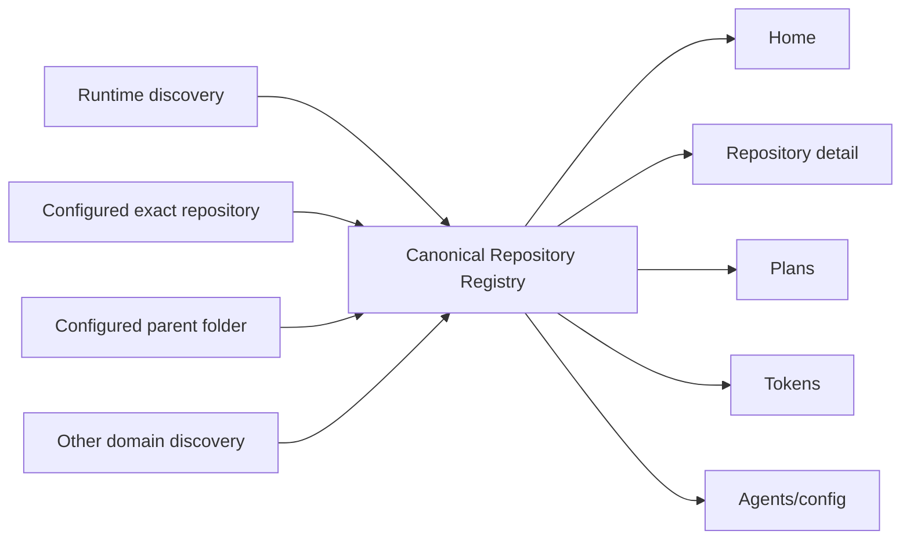

# Canonical Repository Sources and Portal Scope

## Summary

Make the canonical repository registry the one place that decides which repositories RoboRepo knows about and which repository a Portal page is showing.

This story owns two related user-facing capabilities that form one repository model:

1. **Defining/broadening** which repositories RoboRepo knows about — global repository sources (an exact repository, or a parent folder to discover repositories in).
2. **Consistently selecting** one of those canonical repositories across the Portal — a shared `?repository=<urlKey>` scope.

The coherent user story: *I can tell RoboRepo where my repositories live, and then use those same repositories consistently throughout the Portal.* RoboRepo already works with zero configuration when Runtime discovers a running project (shipped in [[h4tqm2wz]]); this story lets the user add repositories RoboRepo has not encountered, and then makes repository selection uniform across Plans, Tokens, and Agents. Runtime stays intentionally unscoped.

Source configuration and repository scope live in one story because they are one user-facing model, but they stay architecturally distinct: **discovery** decides what exists; **scope** decides what you are looking at.

## Relationship to [[jqi1dof]]

```text
Existing canonical repository knowledge
        ↓
Repository-first Home + detail        ← jqi1dof, ships first
        ↓
Global repository sources
        ↓
Shared canonical repository filtering ← this story (pljvmyh), ships second
```

[[jqi1dof]] ships first and works with zero setup, consuming the repositories RoboRepo already knows and introducing the stable browser `urlKey`. This story ships second and is **additive to Home**: when a user adds a source and new repositories are discovered, they appear on Home automatically because Home already reads the canonical registry. Home needs no source-management data model or discovery of its own, and no Home redesign.

`urlKey` is **established by [[jqi1dof]]**, not invented here. The detail route `/repositories/<urlKey>` requires it, so [[jqi1dof]] resets the legacy registry, then allocates and persists keys on v2 records. This story *consumes* `urlKey` for `?repository=<urlKey>` scope and extends its tests/guarantees where scope needs more; it does not create a second slug/key concept. The seam points one way — [[jqi1dof]] produces `urlKey`, this story consumes it — so the two stories do not form a cycle.

## Goals

- Keep Runtime discovery the zero-configuration baseline (already shipped by [[h4tqm2wz]]).
- Let users add one exact repository or a parent folder of repositories from a global repository-management surface.
- Make all repository discovery converge on one canonical registry — no per-domain repository universe.
- Move repository-source configuration out of Plans; retire Plans `discoveryRoots`.
- Make known local repositories automatically eligible for plan discovery without a separate Plans enrollment step.
- Add the shared `?repository=<urlKey>` scope and give Plans, Tokens, and (where repository-aware) Agents one selector.
- Keep Runtime unscoped.
- Preserve path privacy: ordinary repository payloads/URLs carry no absolute paths; only the protected source-management settings surface may read/display configured paths.

## Non-goals

- Building Home or the repository detail route ([[jqi1dof]]).
- Allocating `urlKey` ([[jqi1dof]] owns it; this story consumes it).
- Building the private local-root index or Runtime discovery persistence ([[h4tqm2wz]] shipped both).
- Implementing repository-level agent configuration.
- Filtering Runtime to a single repository.
- Making every discovery source user-configurable.
- Reworking canonical Git identity, alias resolution, or cross-domain `repositoryId` joins ([[canonical-repository-identity-plan-v2]]).
- Exposing local checkout paths through ordinary repository APIs.

## Core concept model

| Concept | Meaning | Source of truth |
| --- | --- | --- |
| Canonical repository | One logical repository known to RoboRepo | Registry `repositoryId` |
| Repository source | A user-configured location/mechanism to discover repositories (exact repo or parent folder) | New global repository-source settings |
| Repository discovery | Evidence that creates/updates/associates a canonical repository (Runtime activity, configured source, Plans migration, telemetry, future agent activity) | Registry discovery provenance |
| Canonical identity/resolution | Resolving many discovery mechanisms to one repository | `modules/repositories/identity.mjs` |
| Local root | One checkout/worktree path for a canonical repository | Private `rootId -> path` index (`registry.localRootPaths`) |
| Repository scope | The canonical repository a scope-aware page is showing | Browser `repository=<urlKey>` |

### One canonical repository universe

There must be no Runtime universe, Plans universe, Tokens universe, or manually-configured universe — everything converges on the registry.



Runtime keeps consuming the registry while remaining operationally unscoped.

### Automatic discovery stays primary

The system stays useful with zero configuration. [[h4tqm2wz]] already persists a Runtime-discovered repository and its checkout root beyond the process lifetime. Automatic discovery and manual source configuration must not create separate records for the same repository — canonical identity/resolution deduplicates them.

### Repository recognition rule

A repository recognized through either automatic Runtime discovery or an explicit source becomes globally known. When RoboRepo has a valid local root for it, Plans inspects that repository for `docs/plans` without a separate "Include plans" action. The relationship is bidirectional: discovering a repository can expose its plans; discovering a repository through an explicit source registers it even with no plan documents; plan files never create a second repository identity.

## Current State

Verified against `85390e9`.

**Already shipped — depend on it, do not rebuild:**

- The canonical registry (`modules/repositories/`) stores discovery provenance, opaque local-root IDs, visibility, resolution, activity, aliases, `pinned`, and enrollments. Browser-safe summaries omit paths.
- [[canonical-repository-identity-plan-v2]] (completed): canonical `repositoryId`, normalized remote, alias resolution.
- [[h4tqm2wz]] (completed): the private `rootId -> absolute path` index (`registry.localRootPaths`, validated in `modules/repositories/schema.mjs`), Runtime discovery persisting resolved checkout roots, the `active`/`idle`/`stale` lifecycle (`deriveLifecycle`), `lastSeenAtFor`, the 30-day `ageOutCandidates` sweep, and visibility-based hiding. The local-root persistence that earlier drafts of this story scheduled is therefore **done** — the `localRootPaths` index and its invariants exist; configured-source refresh (below) writes to that same index.
- Atomic registry writes: `updateRegistry` is one read-mutate-write with a revision bump, and the local-root index lives in the registry file so identity and path commit together.

**Gaps this story fills:**

- There is no global repository-source settings model; sources cannot be user-configured.
- Plans still owns `discoveryRoots` and `ignoredDirectories` in `~/.roborepo/plan-suite/settings.json` (`modules/plan-suite/index.mjs`), recursively searching those roots and reading `ROBOREPO_PLAN_ROOTS`.
- `scripts/cli/repositories.mjs` still exposes `enrollRepositoryInPlans()`, and `scripts/cli/portal-routes-repositories.mjs` still serves `POST /api/repositories/:id/plans-enrollment`, which add an exact path to Plans discovery roots.
- Plans has a page-local repository filter. Tokens has no repository control: the legacy dashboard that owned a `repo` cohort selector was removed, though `/api/data` still accepts both a canonical `repository` id and the legacy `repo` label.
- Shared portal navigation does not preserve repository scope between pages.
- `urlKey` does not exist yet (allocated by [[jqi1dof]]).

**Stale assumption now corrected:** the current `/` page is **Home**, not Agents. `scripts/cli/portal-server.mjs` `PAGES` serves `home` at `/` (default) and Agents at the canonical `/config`. Earlier drafts described `/` as an Agents compatibility/default route and spoke of a follow-up story "claiming `/`"; that already happened. Scoped Agents links use `/config?repository=<urlKey>` and Home is simply another scope-clearing destination.

## Proposed Design

### 1. Global repository sources

Introduce server-owned repository-source settings in the repository subsystem (not Plan Docs). Each source has one of two intents:

| Source kind | Example | Behavior |
| --- | --- | --- |
| `repository` | `<projects>/client-a/app` | Register only that repository |
| `directory` | `<projects>/personal` | Discover eligible repositories beneath that directory with bounded traversal |

The UI may infer the kind only for a path it can read and classify confidently. A missing/unreadable path is `unresolved` at entry; do not auto-classify it. Require the user to choose the intent for an unresolved path, persist that intent, and honor it unchanged on later refreshes — a path becoming readable later must not broaden discovery beyond what the user configured.

Sources need stable opaque IDs so provenance/removal do not depend on the path string. The path is machine-local private state and must never cross the browser boundary except as user-entered/readable settings data in the protected management surface.

### 2. Bounded folder traversal (reuse, don't reinvent)

Parent-folder discovery must stay bounded. Preserve the existing safety constraints from Plans source traversal (`modules/plan-suite/index.mjs` currently honors `ignoredDirectories` and bounded walking):

- stop descending once an eligible repository root is found;
- ignore configured heavy/generated directories;
- guard symlink cycles;
- enforce depth, time, and repository-count limits;
- report truncated/unreadable branches rather than pretending discovery is complete.

Move the reusable repository walk to the repository domain and let Plans consume its result. Do not convert `~/projects` into an unlimited recursive crawler, and do not leave two independently configured ignore lists — migrate the Plan Docs ignore policy with the source model unless inspection finds a genuine Plan-only use that still needs its own list.

### 3. Canonical identity and deduplication

Configured sources resolve into the same canonical identity used everywhere. The same repository discovered through Runtime activity, a `~/projects` parent source, an exact `~/projects/foo` source, and a Plans migration must still be **one** canonical repository. Preserve/strengthen the existing identity mechanisms (canonical ID, normalized remote, local roots, aliases, discovery evidence, resolution/confidence). Never use a filesystem path alone as public repository identity.

Overlapping sources must not duplicate repositories: `~/projects` and `~/projects/foo` may both be configured, and `foo` still resolves to one canonical repository.

### 4. Source provenance and removal

Keep enough provenance to explain *why* RoboRepo knows about a repository:

```text
foo
known through:
- ~/projects source
- Runtime activity
```

This need not be prominent in the UI, but the data model preserves it — it matters when a source is removed.

Removal semantics: removing a configured source must not blindly delete a canonical repository still known through other evidence. If the user removes `~/projects`, `foo` stays known because Runtime still provides evidence. Removing a source must not destroy repository history, visibility state, or other metadata unnecessarily. For a repository left with no remaining source/evidence, prefer the existing registry lifecycle over immediate destructive deletion — let the 30-day `ageOutCandidates` sweep ([[h4tqm2wz]]) mark it stale/aged-out rather than deleting it. Define this explicitly in implementation; do not hard-delete.

### 5. Source errors and missing paths

Source management must gracefully handle: missing path, moved folder, inaccessible folder, repository no longer present, permission failure, traversal timeout, malformed configuration, duplicate source, and overlapping sources. Represent per-source state (`healthy`/`unavailable`/`partial`/`stale`/`error`). One failed source must not invalidate the whole registry; canonical identity is more stable than any one source or domain.

### 6. Filesystem path privacy (deliberate boundary)

Ordinary browser-safe repository payloads carry no absolute paths (already enforced in `modules/repositories/summary.mjs`). Source management creates a legitimate need to show user-configured filesystem locations, so address the tension deliberately rather than leaking paths into general contracts:

- the path-bearing data lives in a dedicated protected local settings/management contract, distinct from the general repository-summary APIs;
- decide which path data may appear in source-management UI, which routes may carry it, and whether paths are referenced elsewhere only through labels/source IDs;
- ensure ordinary Home/detail/list/scope payloads and URLs stay path-free.

**Decision — source settings follow the existing path/browser-safe discipline, not a new one.** The registry already demonstrates the pattern this surface must copy: the private `localRootPaths` index (`rootId -> absolute path`) lives server-side, while `repositorySummary`/`repositoryListPayload`/`repositoryDetailPayload` whitelist fields and never emit a path. The source-settings model does the same: configured source paths stay in the protected settings/management contract and reach the browser only through the management surface's own routes; everything else (summaries, scope, Home/detail) references a source by its opaque source ID or a display label, never its path. Implementation must **confirm** this split holds for the new settings routes — verifying ordinary payloads stay path-free is an explicit review/test step (§Validation), not an assumption — and must not introduce a parallel, leakier contract because source management happens to need paths.

### 7. Shared repository scope (`?repository=<urlKey>`)

Once the canonical universe is shared, add one Portal-wide repository scope using the stable `urlKey` from [[jqi1dof]] — never a filesystem path or page-specific repository ID.

Canonical scoped URLs:

```text
/plans?repository=roborepo
/tokens?repository=roborepo
/config?repository=roborepo
```

Resolve `urlKey -> repositoryId` once at the server boundary (the resolver [[jqi1dof]] adds) and pass canonical `repositoryId` to domain loaders. Do not persist `urlKey` as a foreign key in domain data. Include repository scope in analysis/cache signatures so two repositories cannot share a cached filtered report.

A shared page-header selector offers:

- **All repositories** (removes only the `repository` parameter);
- visible resolved repositories (selecting one preserves compatible page-local parameters);
- **Manage repositories…** (opens the global management surface).

Unknown/hidden/unavailable keys show an explicit unavailable state — never silently broaden an invalid scoped URL into **All repositories**.

### 8. Repository management surface

**Manage repositories…** opens one global management surface — not a Plans-specific panel. The same surface is what Home's "Manage repositories" affordance (added in [[jqi1dof]]) links to. It supports:

- showing automatically discovered repositories with activity/source summary;
- adding an exact repository or a parent folder;
- showing configured sources and how many repositories each yields;
- removing/disabling a source;
- globally ignoring/restoring repositories (registry `visibility`);
- reporting unreadable/stale/truncated scans;
- triggering/observing discovery refresh.

Path-bearing management data is the protected local settings surface from §6; ordinary list/detail payloads stay path-free. Plans links to this surface rather than owning duplicate settings.

### 9. Global ignore vs Runtime hide

Use registry `visibility: hidden` for the global "Ignore repository" action. A globally ignored repository is omitted from the selector, Home directory, normal Plans entries, and normal Tokens/Agents scope; it stays in the registry, can be restored, and is not silently un-hidden by later Runtime discovery. Runtime's per-app/per-compose hide stays an operational display preference — label the two clearly so "Hide from Runtime" is distinct from global "Ignore repository". (The ignore/hide distinction and restore behavior were largely settled by [[h4tqm2wz]]; confirm the labeling.)

### 10. Migrate Plans repository discovery

Plans should stop owning the repository universe. The behavior changes from *Plans asks which folders to search* to *Plans discovers plans inside repositories RoboRepo knows about.*

Plans keeps: plan discovery within a repository, plan parsing, lifecycle/status, Plans-specific filters. Plans loses: which repositories constitute the user's universe.

Migration (idempotent, loss-free):

1. read existing Plan Docs `discoveryRoots`;
2. normalize each path;
3. classify an eligible repository root as `repository`, otherwise `directory`;
4. create equivalent global repository-source records;
5. run global discovery and verify every previously discovered repository remains represented;
6. only then retire `discoveryRoots` and remove the Plans Project Folders UI.

Do not delete or broaden a configured path. Handle `ROBOREPO_PLAN_ROOTS` through the same source normalization (or retain it as an explicit legacy input feeding global sources) — it must not create a second ongoing universe.

After migration, Plans scans the canonical set:

```text
Canonical repositories → Plans scanning → plans associated by repositoryId
```

For every visible, resolved repository with a valid local root, Plans inspects its roots (dedup by plan identity and content hash), reports divergent plan sets across roots as warnings, and associates records by canonical `repositoryId`. A repository without `docs/plans` is still valid and contributes zero plans. If a canonical repository has not yet been successfully scanned, retain an explicit coverage/indexing state rather than returning an authoritative zero — **this resolves the temporary coverage ambiguity [[jqi1dof]] has to tolerate.**

### 11. Page semantics

| Page | All repositories | Selected repository | Behavior |
| --- | --- | --- | --- |
| Plans | Plans across visible known repositories | Plans for canonical `repositoryId` | Replace local repo filter |
| Tokens | All eligible telemetry | Telemetry for canonical `repositoryId` | Add the shared repository control, which the page does not have today; `/api/data` already scopes by `repository` |
| Agents (`/config`) | Global agent configuration | Repository-config placeholder | Show "coming soon" and a link back to global config |
| Runtime | Operational repository/runtime list | Not supported | No selector; scoped navigation drops `repository` |
| Home (`/`) | Repository directory | N/A — Home is the unscoped directory | Scope-clearing destination |

The Agents placeholder must not pretend mixed/global configuration is repository-specific:

```text
Repository-level agent config coming soon.

View global agent config
```

The link clears scope and returns to global Agents.

### 12. Runtime stays unscoped

`/runtime` remains an environment-wide operational view answering *what is running right now across my environment?* Selecting a repository elsewhere must not filter Runtime. A repository-specific Runtime subset belongs on `/repositories/<urlKey>` ([[jqi1dof]]); `/runtime` stays global. A future explicit Runtime filter can be considered independently. Runtime participates in this story only as a discovery producer, a writer of persisted local-root paths, and a consumer of global ignore state.

### 13. Navigation scope rules

| Navigation | Result |
| --- | --- |
| Plans → Tokens while scoped | Preserve `repository` |
| Plans → Agents while scoped | Preserve `repository`, using `/config` |
| Tokens → Plans while scoped | Preserve `repository` |
| Any scoped page → Runtime | Drop `repository` (Runtime is global) |
| Any scoped page → Home (`/`) | Drop `repository` (Home is the unscoped directory) |
| → `/repositories/<urlKey>` | Repository identity carried by the path |
| Clear scope | Remove only `repository`; preserve page-local filters |
| Back/forward | Restore shared scope and page-local state from the URL |

### 14. Existing filter migration

**Plans.** Repository scope comes from the shared header; source management from **Manage repositories…**; lifecycle/priority/search stay page-owned. The Plans header may show `N plans in M repositories`, with the count opening the management/selector surface. Remove the Project Folders panel (`portal/plans/panels.js`) and the page-local repository filter (`portal/plans/state.js`) once shared scope and global management land. Plan snapshots consume globally known local repositories instead of discovering a separate set. Do not leave a Plans-local filter and a Portal canonical filter as competing systems.

**Tokens.** Introduce `repository=<urlKey>` as shared canonical scope without mechanically renaming the historical telemetry `repo` cohort metadata. New canonical associations filter by `repositoryId`; historical records predating canonical IDs may use an explicit bounded fallback, but ambiguous display-name matching is not acceptable. `/api/data` already accepts a canonical `repository` id alongside the legacy `repo` label and includes both in the analysis cache key; the page itself has no repository control, so this story adds the shared one. [[nl40n9vr]] adds the time, harness, and model controls beside it.

**Agents.** Global view unchanged with no scope. When `repository` resolves, replace the global presentation with the placeholder — do not partially filter resources or imply repository-specific config exists before its dedicated story.

## Server and API changes

Extend the existing repository service/API rather than creating parallel state. Required capabilities:

- list visible repositories with `urlKey`;
- resolve `urlKey -> repositoryId` (the resolver from [[jqi1dof]]);
- list/add/remove/disable configured repository sources;
- refresh configured-source discovery;
- globally hide/restore repositories;
- resolve private local roots server-side while exposing only path-free root counts/status to browser summaries;
- preserve mutation origin/token protection.

Current repository routes key on encoded `repositoryId` (`/api/repositories/:id`, `GET`/`PATCH`, `GET …/associations`, `POST …/plans-enrollment`). Browser-facing scope uses `urlKey`; internal service functions may keep taking canonical IDs after boundary resolution. Retire or redirect `POST /api/repositories/:id/plans-enrollment` once known repositories automatically participate in plan discovery.

## Code Touchpoints

### Repository domain

- `modules/repositories/schema.mjs` — version the registry for source settings if required; preserve identity/visibility and the existing `localRootPaths` index.
- `modules/repositories/registry.mjs` — source-settings persistence; keep local-root metadata keyed by opaque IDs.
- `modules/repositories/enrollment.mjs` — replace `plansSourceCoverage`/`planPlansEnrollment` Plans-root orchestration with global source orchestration (or retire it).
- `modules/repositories/summary.mjs` — source/root status in browser-safe payloads without paths.
- New focused repository module(s) — global source settings + bounded traversal, consuming the existing `localRootPaths` index rather than a new store.

### Repository service and routes

- `scripts/cli/repositories.mjs` — replace `enrollRepositoryInPlans()` orchestration with global source/local-root orchestration; keep it dependency-injectable.
- `scripts/cli/portal-routes-repositories.mjs` — add path-safe source-management/refresh routes; accept `urlKey`; retire `/plans-enrollment` after migration.
- `scripts/cli/portal-server.mjs` — wire shared repository handlers; preserve mutation guards.

### Plans

- `modules/plan-suite/index.mjs` — stop treating `discoveryRoots` as the universe; consume visible repositories + resolved local roots; preserve parsing, lifecycle, and canonical `repositoryId`.
- `scripts/cli/plans.mjs`, `scripts/cli/portal-routes-plans.mjs` — build all/scoped snapshots from canonical repositories.
- `portal/plans/state.js` — remove page-local repository filter ownership.
- `portal/plans/app.js` — consume shared scope; preserve lifecycle/history.
- `portal/plans/panels.js`, `portal/plans/index.html` — remove the Project Folders panel and redundant repository/source controls; keep Plan-specific filters.

### Tokens

- `portal/tokens/app.js`, `portal/tokens/index.html`
- `scripts/cli/portal-routes-telemetry.mjs`, `scripts/cli/telemetry.mjs`, `scripts/cli/telemetry-cohort.mjs`
- Separate shared canonical scope from legacy `repo` semantics. The page has no range/harness/model/marker filter UI (the legacy dashboard that owned it was removed); `/api/data` still accepts those parameters.

### Shared portal chrome

- `portal/shared/theme.js` — compose navigation URLs with shared scope only for scope-aware destinations.
- `portal/shared/chrome-partial.html`, `portal/shared/base.css` — host the reusable page-header selector and the global repository-management entry point.
- New focused shared ESM modules/templates for repository URL state and selector behavior, using real HTML `<template>` markup.

### Agents and Runtime

- `portal/config/*` — accept shared scope; render the repository-config placeholder.
- `portal/developer-runtime/*` — stay unscoped; keep writing discovered roots through the repository service; keep Runtime-only hide distinct from global Ignore. (Most of this shipped in [[h4tqm2wz]]; confirm, don't rebuild.)

## Implementation Plan

### Phase 1 — Global repository source model

- [ ] Add versioned global repository-source settings with stable source IDs and explicit `repository`/`directory` kinds.
- [ ] Persist and validate source records; require a chosen intent for unresolved paths.
- [ ] Define per-source status/provenance.

### Phase 2 — Source discovery engine

- [ ] Extract/reuse bounded repository walking from Plan Docs under the repository domain.
- [ ] Resolve exact repositories and discover repositories under directory sources with depth/time/count limits, symlink guards, and ignore rules.
- [ ] Deduplicate against canonical identity; handle overlapping sources without duplicates.
- [ ] Write discovered repositories and local roots to the existing `localRootPaths` index; report errors/timeouts; update provenance.
- [ ] Add a concurrent-refresh regression test exercising Runtime discovery and configured-source refresh updating the same repository.

### Phase 3 — Source management APIs

- [ ] List/add/remove/disable sources; refresh/re-resolve.
- [ ] Establish the protected path-bearing settings contract distinct from browser-safe summaries (§6).
- [ ] Preserve mutation origin/token protection.

### Phase 4 — Source management UX

- [ ] Build **Manage repositories…**: add exact repository, add parent folder, show source status/errors, remove source, globally ignore/restore.
- [ ] Link it from Home ([[jqi1dof]]'s affordance) and from Plans.

### Phase 5 — Plans settings migration

- [ ] Convert existing `discoveryRoots` into global sources idempotently, preserving exact-vs-parent intent.
- [ ] Migrate the repository-traversal ignore rules with the source model; remove duplicate Plan Docs ownership.
- [ ] Decide `ROBOREPO_PLAN_ROOTS` compatibility through the same source model.
- [ ] Remove Plan Docs repository-source settings only after coverage equivalence is verified.

### Phase 6 — Plans canonical repository consumption

- [ ] Change Plan snapshots to iterate visible known repositories with valid local roots.
- [ ] Add explicit per-repository plan coverage/indexing state (resolving [[jqi1dof]]'s coverage ambiguity).
- [ ] Remove Plans enrollment as a prerequisite for plan discovery.
- [ ] Retire `enrollRepositoryInPlans()` and `/plans-enrollment` when no consumer needs them.

### Phase 7 — Shared repository scope infrastructure

- [ ] Add shared URL parse/compose helpers for `repository`, consuming the `urlKey` resolver from [[jqi1dof]].
- [ ] Add the non-sticky repository selector to scope-aware page headers with an **All repositories** state.
- [ ] Handle invalid/hidden keys with an explicit unavailable state (never silent broadening).
- [ ] Include canonical scope in analysis/cache signatures.

### Phase 8 — Shared scope navigation

- [ ] Preserve repository scope between Plans, Tokens, and Agents.
- [ ] Drop scope when navigating to Runtime and to Home.
- [ ] Add `popstate`/back-forward and deep-link tests.

### Phase 9 — Plans filter migration

- [ ] Remove the page-local Plans repository filter and consume shared scope.
- [ ] Render `N plans in M repositories` with repository-management access.
- [ ] Remove the Project Folders panel.

### Phase 10 — Tokens filter migration

- [ ] Add canonical repository scope distinct from legacy `repo`.
- [ ] Filter canonical events by `repositoryId` with bounded historical fallback.
- [ ] Add the shared repository control to the Tokens page; preserve session-detail semantics.

### Phase 11 — Agents/config integration

- [ ] Render global Agents with no scope; show the repository-config placeholder when scoped.
- [ ] Provide a clear action returning to global Agents.

### Phase 12 — Cleanup and docs

- [ ] Remove obsolete Plans discovery-root UI/code and duplicate repository controls.
- [ ] Remove duplicate selectors/helpers once shared scope is established.
- [ ] Update portal/Plans/repository reference docs for global sources, `urlKey`-based scope, and source management.
- [ ] Remove stale docs instructing users to configure repository coverage from Plans.
- [ ] Verify no public payload or URL contains an absolute repository path.

Adjust sequencing if implementation inspection identifies a stronger order.

## Validation

Use focused tests during implementation, then the full suite because this story changes shared repository, portal, Plans, Runtime, and telemetry behavior.

Existing repo-native checks to preserve and extend:

```text
npm run test:repositories
npm run test:repositories-service
npm run test:repositories-api
npm run test:plans
npm run test:plans-portal-state
npm run test:developer-runtime-repository-merge
node scripts/test/telemetry-cohort-check.mjs
npm test
```

Add focused coverage for:

- migration from multiple Plan Docs roots, including one exact repository plus one parent folder, run twice (idempotent);
- a Runtime-discovered repository remaining usable for Plans after its process goes offline;
- global source add/remove/refresh, bounded-traversal limits, and overlapping sources not duplicating repositories;
- source removal leaving a repository known through other evidence intact;
- missing/inaccessible/moved source paths failing gracefully with per-source state;
- automatic plan discovery for a known repository without Plans enrollment, with explicit coverage state before first scan;
- concurrent Runtime discovery + configured-source refresh updating the same repository;
- global ignore/restore surviving Runtime rediscovery; Runtime-only hide remaining distinct;
- `urlKey`-based scope resolution and invalid/hidden keys never broadening silently;
- shared scope preservation between Plans/Tokens/Agents and scope-dropping to Runtime and Home;
- Plans selected/all behavior; Tokens canonical-vs-legacy semantics; Agents scoped placeholder;
- no absolute paths in ordinary repository payloads or scope URLs; path exposure confined to the protected settings surface.

## Acceptance Criteria

- Runtime-discovered repositories and explicitly configured repositories share one canonical registry.
- Users can globally add an exact repository and a parent repository folder.
- Directory discovery is bounded; overlapping sources do not create duplicate canonical repositories.
- Source removal does not delete repositories still known through other evidence.
- Missing/inaccessible sources fail gracefully with per-source state.
- Plans no longer owns the repository-universe setting; existing `discoveryRoots` migrate safely and idempotently.
- Plans consumes canonical repositories and exposes explicit coverage state before a repository is scanned.
- Home automatically benefits from newly discovered/configured repositories with no Home redesign.
- Source configuration is managed globally, not independently inside Plans.
- Stable `urlKey` (from [[jqi1dof]]) is used for browser repository identity; canonical IDs remain the internal join key.
- Plans and Tokens use the shared canonical repository selector; Agents consumes it with a placeholder when repository-aware.
- Selecting an invalid/hidden key never silently shows all repositories.
- Relevant navigation preserves repository scope; navigating to Runtime and Home drops it.
- Runtime remains intentionally global/unscoped; `/repositories/<urlKey>` remains repository-specific.
- Absolute filesystem paths do not leak through ordinary repository APIs; any source-management path exposure is isolated to the protected local settings boundary.
- Legacy per-domain repository settings/filter mechanisms are removed or clearly deprecated.
- Targeted tests and `npm test` pass.
