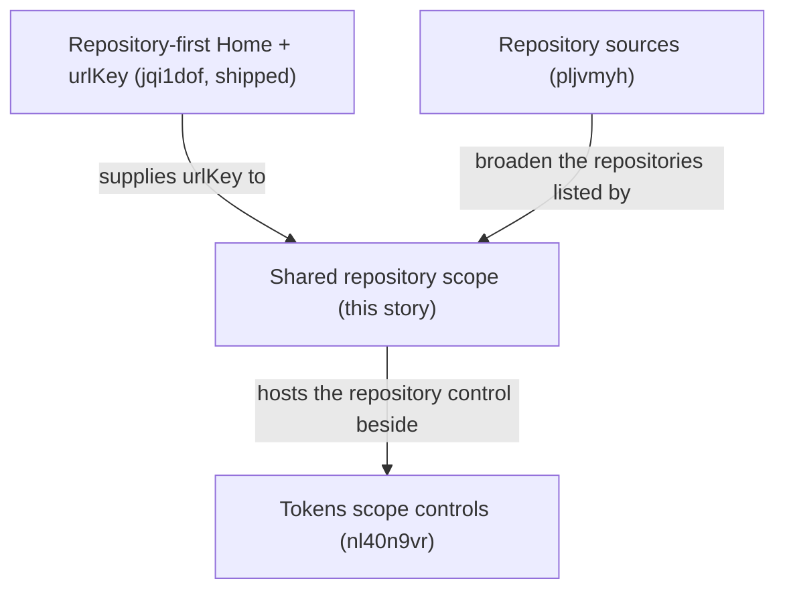

# Shared Repository Filter Across Portal Pages

## Summary

Let the user pick one repository once and see Plans, Tokens, and Agents for that repository, through a shared `?repository=<urlKey>` scope and one header selector.

Today each page decides on its own: Plans has a page-local repository filter, Tokens has none, and navigation forgets any selection. After this story, the scope lives in the URL, every scope-aware page reads it the same way, and moving between those pages keeps it. Runtime and Home stay unscoped.

This story only selects among repositories RoboRepo already knows. How repositories become known — auto-discovery and folders — is [[pljvmyh]].

## Relationship to other stories



- [[jqi1dof]] shipped `urlKey` and its resolver; this story consumes them and creates no second key concept.
- [[pljvmyh]] can ship before or after this story. Whichever lands second wires the selector's **Manage repositories…** item to [[pljvmyh]]'s dialog. Its registry v3 reset re-allocates `urlKey`s, so scoped URLs bookmarked before it lands may stop resolving.
- [[nl40n9vr]] adds the Tokens time, harness, and model controls beside this story's repository control.

## Goals

- Add one Portal-wide repository scope, `?repository=<urlKey>`, read by Plans, Tokens, and Agents.
- Give scope-aware pages one shared header selector.
- Preserve scope when navigating between scope-aware pages; drop it for Runtime and Home.
- Never silently broaden an invalid scope into all repositories.
- Keep scope URLs and selector data path-free.

## Non-goals

- Adding, removing, or discovering repositories ([[pljvmyh]]).
- Filtering Runtime to a single repository.
- Implementing repository-level agent configuration.
- Un-parking the repository detail route ([[jqi1dof]]).
- Tokens time, harness, and model controls ([[nl40n9vr]]).

## Core concept model

| Concept | Meaning | Source of truth |
| --- | --- | --- |
| Canonical repository | One logical repository known to RoboRepo | Registry `repositoryId` |
| `urlKey` | Stable, URL-safe browser key for one canonical repository (`roborepo`, or `roborepo-a31f` on a name collision) | Registry record `urlKey` |
| Repository scope | The canonical repository a scope-aware page is showing | Browser `repository=<urlKey>` |
| Scope-aware page | A page that reads and preserves the scope: Plans, Tokens, Agents | This story |

## Current State

Verified against `585dedb`.

| Area | Today | Where |
| --- | --- | --- |
| `urlKey` | Allocated at record creation; `repositoryIdForUrlKey(registry, urlKey, { includeHidden })` resolves it | `modules/repositories/url-key.mjs`, `registry.mjs` |
| Repository list | `GET /api/repositories` returns path-free summaries including `urlKey` | `scripts/cli/portal-routes-repositories.mjs`, `modules/repositories/summary.mjs` |
| Plans | Page-local repository filter over the Plans snapshot's own repositories, serialized as `?repo=<repositoryId>`. Plan records carry a canonical `repositoryId`, but Plans-discovered repositories are not written to the registry | `portal/plans/state.js` (`FILTER_IDS`, `FILTER_LABELS`, `FILTER_OPTION_DEFS`) |
| Tokens | No repository control; the page requests `/api/data` with no parameters. `/api/data` accepts a canonical `repository` id and the legacy `repo` label, and keys its analysis cache on both | `portal/tokens/app.js`, `scripts/cli/portal-routes-telemetry.mjs` |
| Agents | Global configuration at `/config`; no repository awareness | `portal/config/*` |
| Navigation | Each nav link is the bare page path; nothing carries query parameters across pages | `portal/shared/theme.js` |
| Global ignore | Registry `visibility: hidden`; hidden repositories resolve only with `includeHidden: true` | `modules/repositories/registry.mjs` |
| Pages | `PAGES` serves Home at `/`, Agents at `/config`, Plans, Tokens, Runtime; the parked detail route redirects to Home | `scripts/cli/portal-server.mjs` |

## Proposed Design

### 1. Scope in the URL

Canonical scoped URLs:

```text
/plans?repository=roborepo
/tokens?repository=roborepo
/config?repository=roborepo
```

Resolve `urlKey -> repositoryId` once at the server boundary with `repositoryIdForUrlKey` (default `includeHidden: false`) and pass canonical `repositoryId` to domain loaders. Do not persist `urlKey` as a foreign key in domain data. Include repository scope in analysis/cache signatures so two repositories cannot share a cached filtered report.

Unknown, hidden, or unavailable keys show an explicit unavailable state with a way to clear the scope — never silently broaden an invalid scoped URL into **All repositories**.

### 2. Shared selector

A shared page-header selector on scope-aware pages offers:

- **All repositories** (removes only the `repository` parameter);
- visible repositories from `GET /api/repositories` (selecting one preserves compatible page-local parameters);
- **Manage repositories…**, once [[pljvmyh]]'s dialog exists.

When two repositories share a display name, the selector disambiguates them by provider owner or `urlKey`, never by filesystem path. Build the selector on the shared `<option-dropdown>` element (`portal/shared/option-dropdown.js`) rather than a new listbox, with surrounding markup in real HTML `<template>` elements.

### 3. Page semantics

| Page | All repositories | Selected repository | Behavior |
| --- | --- | --- | --- |
| Plans | Plans across all scanned repositories | Plans whose `repositoryId` resolves to the selected repository | Replaces the page-local repository filter |
| Tokens | All eligible telemetry | Telemetry for the selected `repositoryId` | Adds the shared control; `/api/data` resolves `repository=<urlKey>` |
| Agents (`/config`) | Global agent configuration | Repository-config placeholder | "Coming soon" with a link back to global config |
| Runtime | Operational list across the environment | Not supported | No selector |
| Home (`/`) | Repository directory | Not applicable | Scope-clearing destination |

Until [[pljvmyh]] makes Plans read the registry, a Plans-scanned repository that is not in the registry has no `urlKey`: its plans appear under **All repositories** but it is not selectable.

The Agents placeholder must not pretend mixed/global configuration is repository-specific:

```text
Repository-level agent config coming soon.

View global agent config
```

The link clears scope and returns to global Agents.

### 4. Runtime stays unscoped

`/runtime` answers *what is running right now across my environment?* Selecting a repository elsewhere must not filter it.

### 5. Navigation scope rules

| Navigation | Result |
| --- | --- |
| Plans → Tokens while scoped | Preserve `repository` |
| Plans → Agents while scoped | Preserve `repository`, using `/config` |
| Tokens → Plans while scoped | Preserve `repository` |
| Any scoped page → Runtime | Drop `repository` |
| Any scoped page → Home (`/`) | Drop `repository` |
| Clear scope | Remove only `repository`; preserve page-local filters |
| Back/forward | Restore shared scope and page-local state from the URL |

### 6. Page migrations

**Plans.** Repository scope comes from the shared header; lifecycle, priority, search, and the other filters stay page-owned. Remove the `repository` entry from the page-local filters in `portal/plans/state.js`; its `?repo=` URL parameter goes with it, with no redirect (clean cutover). Do not leave a Plans-local filter and the shared filter as competing systems.

**Tokens.** `/api/data`'s `repository` parameter changes from a canonical id to a `urlKey` resolved at the route; no browser caller sends it today. Keep the historical telemetry `repo` cohort label distinct from canonical scope. New canonical associations filter by `repositoryId`; historical records predating canonical IDs may use an explicit bounded fallback, but ambiguous display-name matching is not acceptable.

**Agents.** Global view unchanged with no scope. When `repository` resolves, replace the global presentation with the placeholder — do not partially filter resources or imply repository-specific config exists before its dedicated story.

## Code Touchpoints

- `portal/shared/theme.js` — compose nav URLs with the scope only for scope-aware destinations.
- `portal/shared/chrome-partial.html`, `portal/shared/base.css` — host the selector.
- New shared ESM modules: repository URL state (parse/compose/clear) and the selector.
- `portal/plans/state.js`, `portal/plans/app.js`, `portal/plans/index.html` — drop the local repository filter; consume shared scope.
- `scripts/cli/plans.mjs`, `scripts/cli/portal-routes-plans.mjs` — scoped snapshots resolved from `urlKey`.
- `portal/tokens/app.js`, `portal/tokens/index.html` — shared repository control.
- `scripts/cli/portal-routes-telemetry.mjs` — resolve `repository=<urlKey>`.
- `scripts/cli/telemetry.mjs`, `scripts/cli/telemetry-cohort.mjs` — canonical scope separate from legacy `repo`.
- `portal/config/*` — accept shared scope; render the placeholder.
- `docs/internal/portal-architecture.md`, `docs/user/reference/plans-portal.md` — document the shared filter.

## Implementation Plan

### Phase 1 — Scope infrastructure

- [ ] Add shared URL parse/compose/clear helpers for `repository`.
- [ ] Add the selector to scope-aware page headers with **All repositories**.
- [ ] Handle invalid/hidden keys with an explicit unavailable state.
- [ ] Include canonical scope in analysis/cache signatures.

### Phase 2 — Navigation

- [ ] Preserve scope between Plans, Tokens, and Agents; drop it for Runtime and Home.
- [ ] Restore scope on back/forward and deep link.

### Phase 3 — Plans

- [ ] Remove the page-local repository filter and `?repo=`; consume shared scope.

### Phase 4 — Tokens

- [ ] Resolve `/api/data?repository=<urlKey>`; keep legacy `repo` distinct.
- [ ] Filter canonical events by `repositoryId` with bounded historical fallback.
- [ ] Add the shared repository control; preserve session-detail semantics.

### Phase 5 — Agents

- [ ] Render global Agents with no scope; show the placeholder when scoped, with a link back to global Agents.

### Phase 6 — Manage link and docs

- [ ] Add **Manage repositories…** to the selector if [[pljvmyh]]'s dialog has landed; otherwise leave it for [[pljvmyh]] to wire.
- [ ] Remove duplicate selectors/helpers; update docs.

## Validation

Use focused checks while iterating, then the exhaustive unit run and the CI gate. `npm run check`'s `ci` group does not include the repository, Plans, or Tokens checks, so `npm run test:unit` must run separately.

```text
npm run test:unit -- --filter repositories-api
npm run test:unit -- --filter plans-portal-state
npm run test:unit -- --filter telemetry-cohort
npm run test:unit -- --filter tokens-page-state
npm run test:unit -- --filter portal-pages
npm run test:portal-ui
npm run test:unit
npm run check
```

Add focused coverage for observable behavior:

- `urlKey` scope resolution, and unknown/hidden keys rendering the unavailable state instead of all repositories;
- Plans selected/all behavior, including plans from a repository with no `urlKey` appearing only under all;
- Tokens canonical-vs-legacy semantics and distinct cache entries per repository;
- the Agents scoped placeholder and its link back to global config;
- no absolute paths in selector data or scope URLs.

Cover scope preservation between Plans, Tokens, and Agents, scope-dropping to Runtime and Home, and back/forward/deep-link restoration in the Playwright suite (`scripts/test/portal-ui/`), because unit checks cannot exercise browser history.

## Risks

| Risk | Mitigation |
| --- | --- |
| [[pljvmyh]]'s registry reset re-allocates `urlKey`s, breaking bookmarked scoped URLs | Accepted; invalid keys show the unavailable state rather than wrong data |
| Before [[pljvmyh]], some Plans repositories are not selectable | Their plans still appear under **All repositories** |

## Acceptance Criteria

- Plans, Tokens, and Agents read one shared `?repository=<urlKey>` scope through one header selector.
- `urlKey` is used for browser repository identity; canonical IDs remain the internal join key.
- An invalid or hidden key never silently shows all repositories.
- Navigation between scope-aware pages preserves scope; navigating to Runtime and Home drops it; back/forward restores it.
- Plans has no page-local repository filter.
- Tokens filters canonical events by `repositoryId` and keeps the legacy `repo` label distinct.
- Agents shows the placeholder when scoped.
- Runtime remains global/unscoped.
- Selector data and scope URLs carry no absolute paths.
- `npm run test:unit`, `npm run test:portal-ui`, and `npm run check` pass.
