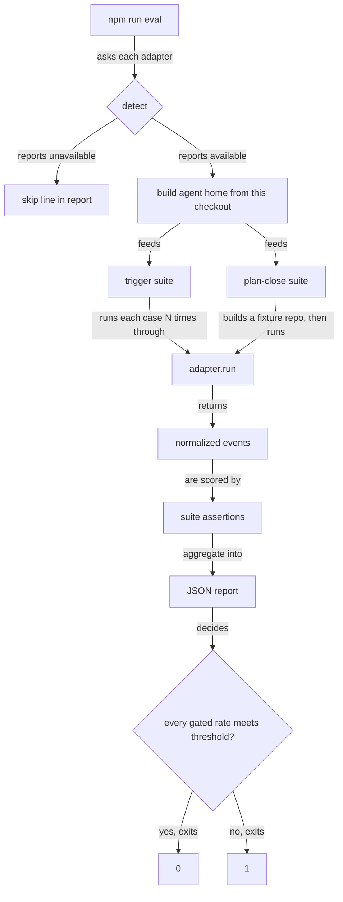

# Live Evals for Skill Routing and Plan Closing

## Summary

Every roborepo test today is deterministic, and none of them runs an agent. So two kinds of claims
have no evidence behind them: that a model picks the right skill for a prompt, and that `/plan-close`
refuses or closes when it should. This plan adds `npm run eval`, an opt-in gate that runs a real
headless agent against fixtures, checks the effects structurally, runs each case N times, and writes
a JSON report per run.

| Suite | Sends | Asserts on |
| --- | --- | --- |
| Trigger | Each prompt in the skill trigger fixtures | Which skill the agent invoked, aggregated into per-skill rates |
| `/plan-close` scenarios | `/plan-close <id>` into a fixture repository | Where the plan file ends up, Git state, the tool-call stream, and whether a fixture listener still runs |

Claude is the first harness. The runner talks to harnesses through adapters so Codex and Gemini can
be added later. The gate costs money, needs an API key, and is non-deterministic, so it never runs
inside `npm run check`.

## Goals

- `npm run eval` runs the trigger suite and the `/plan-close` scenario suite against Claude, N times
  per case, and exits non-zero when a gated rate falls below its threshold.
- When no adapter can run (no CLI on `PATH`, no API key), the runner prints one skip line per
  harness and exits 0. `--require <harness>` makes that case exit 1.
- Every run writes one JSON report that a plan's `## Not tested` entry can cite as evidence.
- Adding a harness means adding one adapter file, with no change to the suites.
- The runner's deterministic parts (stream normalization, scoring, the skip path, the
  never-in-`check` guard) are covered by a `*-check.mjs` suite that runs without an agent.

## Non-goals

- Running evals in CI or inside `npm run check`.
- Codex and Gemini adapters. This plan defines the interface and leaves those two as stubs that
  report `unsupported`.
- Scenario evals for `/plan-write`, `/plan-promote`, and `/plan-start`, apart from the optional
  paired-skill scenario in Phase 5.
- A model-as-judge. Every assertion in this plan is structural. A later plan may add a judge for
  qualitative output such as the close report's prose.
- Moving the trigger fixtures into packages. [[e6f1pknt]] owns that move; this plan reads fixtures
  through a loader so the move only changes the loader.

## Context

### Terms

| Term | Meaning |
| --- | --- |
| Eval | One prompt or scenario sent to a live agent, checked by structural assertions. Not deterministic. |
| Case | One trigger prompt or one `/plan-close` scenario. |
| Run | One execution of a case. A case runs N times (`--repeat`). |
| Adapter | The per-harness module that detects, launches, and normalizes one headless agent CLI. |
| Agent home | The temporary config directory the agent runs with, holding only skills installed from this checkout. |
| Invocation signal | Evidence in the event stream that the agent loaded a skill (see "Detecting a skill invocation"). |

### Current state

| Area | Today | Evidence |
| --- | --- | --- |
| Trigger check | Static. It checks that each trigger phrase appears in the skill description, that each `match` prompt contains a trigger phrase, and that no `nearMiss` prompt does. No prompt reaches a model. | `scripts/cli/skill-trigger-check.mjs`, `manifests/inventory/skill-trigger-tests.json` |
| Trigger fixtures | 6 skills, 14 `match` prompts (4 of them slash commands), 17 `nearMiss` prompts | `manifests/inventory/skill-trigger-tests.json` |
| Fixture pattern | Hermetic HOME, a throwaway Git repository with plans in each lifecycle, the real CLI entry point, real HTTP listeners on macOS | `scripts/test/plan-suite-commands-check.mjs` |
| Skill install into a fixture HOME | `roborepo package enable <id>` under a temporary HOME writes the skill and its command wrapper | `plan-suite-commands-check.mjs`, `package status` section |
| Test discovery | `run-checks.mjs` runs every `scripts/test/*-check.mjs` it finds. `doctor.sh` fails when a file under `scripts/test/` is reached by no runner. | `scripts/test/run-checks.mjs`, `scripts/test/orphan-test-check.mjs` |
| Agent CLIs | `claude`, `codex`, and `gemini` are not on `PATH` in the shell this plan was written from | `command -v` returned nothing |

### Constraints found in the code

These shape the design below. Each was checked against the repository.

1. **The eval files cannot live in `scripts/test/` with a `-check.mjs` suffix.** A bare
   `npm run test:unit` would run them, and the orphan check would require a runner for anything else
   under `scripts/test/`.
2. **The slash commands bypass the Skill tool.** `~/.claude/commands/plan-close.md` says "Read
   `~/.claude/skills/plan-close/SKILL.md`, then follow its workflow". A `/plan-close` prompt can
   therefore show up as a `Read` of that file with no Skill tool call.
3. **The slash-command prompts measure wiring, not routing.** The CLI expands `/plan-write …` before
   the model chooses anything.
4. **The `match` prompts are leading.** They were written to contain description phrases verbatim
   ("help me with beginning implementation from an existing prepared repository plan"), because
   the static check fails any `match` prompt that lacks a trigger phrase. Natural phrasings cannot go
   into `match` without breaking `roborepo skill triggers --check`.
5. **Some near-misses belong to a sibling skill.** "close this plan now that it has merged" is a
   near-miss for `plan-start` and a correct match for `plan-close`.
6. **Disabled paired skills stop a headless `/plan-close`.** The skill asks "Enable it, or skip it
   for this run?" for each disabled paired skill. `technical-writing` and `test-harness` are
   `optional` packages, both `disabled` on the machine this plan was written on, and in headless
   mode the question ends the run before any close.
7. **`/plan-close` commits only when asked.** A successful close leaves a staged rename, and HEAD
   does not move.
8. **`roborepo plans stop-servers` is macOS-only.** It returns `supported: false` elsewhere.
9. **Ancestry cannot prove a squash merge.** `/plan-close` step 6 refuses with
   `landed: unconfirmed` when `git merge-base --is-ancestor` fails, even if the content landed.
   Plan [[age4cm7r]] is in that state today: its branch is not an ancestor of `main`, and
   `git diff main claude/plan-suite-atomic-commands` is empty.
10. **Installed skill copies drift from source.** While this plan was written,
    `~/.claude/skills/plan-write/references/plan-schema.md` differed from
    `globals/packages/plan-write/skills/plan-write/references/plan-schema.md`. An eval that read the
    user's installed copy would measure an old skill.

### This plan's own lifecycle

This plan goes through `/plan-write` → `/plan-promote` → `/plan-start` → `/plan-close`, and that
cycle is the live session [[age4cm7r]]'s `## Not tested` entries wait for. Record what each step
shows in age4cm7r, next to the entry it bears on, and leave the checkboxes to the user.

| Step | age4cm7r entry it bears on | What to record |
| --- | --- | --- |
| `/plan-write` (done) | `technical-writing` disabled → asks to enable or skip | The status check ran and found the package disabled. The user's standing instruction ("load from `globals/packages/`") answered before the question was asked, so the ask and the skip report were not observed. |
| `/plan-start` | Writes a Not tested entry when it skips a check, and runs `roborepo plans start` | Whether the start commit came from `roborepo plans start`, and whether skipped checks became entries |
| `/plan-start` from the Claude Code CLI | `/add-dir` + `cd` makes the write-scope hook treat the worktree as the checkout in use | Observed only if this step runs in the terminal CLI rather than the desktop app |
| `/plan-close` | Refuses on red suite, incomplete plan, unchecked Not tested, unlanded branch; runs `stop-servers` after a landed close | The Phase 4 scenario report, plus this plan's own close. Constraint 9 applies if this branch is squash-merged. |

## Proposed design

### Flow



### Placement

Orchestration and execution live in separate files, and every new file stays under about 200 lines.

```text
scripts/eval/
  run.mjs                    # entry: args, adapter selection, suites, report, exit code
  config.mjs                 # defaults: repeat, thresholds per case kind, minimum gated sample
  report.mjs                 # report shape, threshold evaluation, write
  agent-home.mjs             # builds the agent home: enables packages from this checkout
  harness-adapters/
    index.mjs                # adapter registry
    claude.mjs               # detect, run, normalize
    unsupported.mjs          # stub used for codex and gemini
  trigger/
    fixtures.mjs             # loads trigger fixtures; the only file e6f1pknt's move touches
    suite.mjs                # runs trigger cases
    score.mjs                # pure: classifies one run, aggregates rates
  plan-close/
    scenarios.mjs            # scenario table: fixture builder + expected effects
    suite.mjs                # runs scenarios
    assertions.mjs           # pure: checks effects against expectations
scripts/test/lib/plan-fixtures.mjs   # planDoc, fixtureRepository, git, listen — extracted
scripts/test/eval-runner-check.mjs   # deterministic coverage, runs in the normal suite
```

`scripts/eval/` is not in `package.json` `files`, so it does not ship. `package.json` gains one
script, `"eval": "node scripts/eval/run.mjs"`. The fixture helpers now inline in
`plan-suite-commands-check.mjs` move to `scripts/test/lib/plan-fixtures.mjs`, and both that check
and the eval suite import them.

### Command

```text
npm run eval -- [--suite trigger|plan-close] [--harness claude] [--repeat N]
                [--model <id>] [--skill <id>] [--scenario <name>]
                [--require <harness>] [--max-cost-usd <n>] [--report-dir <dir>]
```

| Flag | Default | Effect |
| --- | --- | --- |
| `--suite` | both | Runs one suite |
| `--harness` | every registered adapter | Restricts to one adapter |
| `--repeat` | 3 | Runs per case |
| `--model` | the harness default | Passed to the adapter. Routing depends on the model, so the report records it. |
| `--require` | none | Exits 1 when that harness is unavailable instead of skipping |
| `--max-cost-usd` | none | Stops starting new runs once reported cost passes the cap; the report marks the run `truncated` |
| `--report-dir` | `eval-reports/` (gitignored) | Where the JSON report goes |

### Adapter interface

Each `harness-adapters/<id>.mjs` has these named exports:

| Export | Takes | Returns |
| --- | --- | --- |
| `id` | — | The harness id, matching its provider id (`claude`) |
| `detect(env)` | The caller's environment | `{ available: true, version }` or `{ available: false, reason }` |
| `run(options)` | `{ prompt, cwd, env, model, allowedTools, stopWhen }` | The raw event list |
| `normalize(rawEvents)` | The raw event list | A `NormalizedRun` |

```text
NormalizedRun
  toolCalls         [{ name, input }]
  skillInvocations  [{ skill, via }]
  finalText, costUsd, durationMs, exitCode, stoppedEarly
```

`detect` is false when the CLI is not on `PATH` or the API key variable is unset; the reason names
which. The suites see only `NormalizedRun`, so they never read a harness's native stream format.

The Claude adapter is expected to run `claude -p <prompt> --output-format stream-json --verbose`
with `--model`, `--allowedTools`, and a permission mode. **None of these flags has been checked
against the installed CLI yet; Phase 0 confirms them.** Codex (`codex exec --json`) and Gemini
(headless `-p`) adapters are stubs in this plan.

### Agent home

Each suite run gets a fresh agent home with nothing from the user's own config, so user hooks, rules,
and stale installed skills cannot change the result (constraint 10).

1. Create a temporary HOME as `plan-suite-commands-check.mjs` does.
2. Run `roborepo package enable <id>` from this checkout for every package under test. The trigger
   suite enables every package that owns a fixture skill at the same time, so sibling skills compete
   as they do in real use. The `/plan-close` suite also enables `technical-writing` and
   `test-harness`, so the paired-skill question (constraint 6) cannot end a scenario; the report
   records which packages were enabled.
3. Put a `roborepo` shim that runs this checkout's `bin/roborepo` first on the agent's `PATH`.
4. Pass the API key through from the caller's environment. Authentication with the real HOME replaced
   is unverified on macOS, where credentials can live in the Keychain. Phase 0 decides between
   swapping HOME and pointing the harness's own config-directory variable at the agent home.

### Detecting a skill invocation

| Signal in the stream | Recorded as |
| --- | --- |
| A Skill tool call whose input names skill `X` | `{ skill: X, via: "skill-tool" }` |
| A file read of `<skills-root>/X/SKILL.md` | `{ skill: X, via: "skill-file-read" }` (the command-wrapper path, constraint 2) |

A run's routed skill is its first invocation signal. A trigger run stops at the first invocation
signal, at the third tool call, or at the end of the turn, whichever comes first, because nothing
after the routing decision affects the score. Adapters without a Skill tool (Codex) emit only
`skill-file-read`.

### Trigger suite

The fixture loader returns each case as `{ skill, prompt, kind }`:

| Kind | Source | One run passes when | Gated by default |
| --- | --- | --- | --- |
| `routing` | non-slash `match` prompts, plus a new optional `liveMatch` array | The routed skill is the target | Hit rate ≥ 0.8 per skill |
| `wiring` | `match` prompts that start with `/` | The target appears in any invocation signal | Hit rate ≥ 0.95 per skill |
| `nearMiss` | `nearMiss` prompts | The target is not invoked; whatever was routed is recorded | False-trigger rate ≤ 0.2 per skill |

`liveMatch` holds natural phrasings that need not contain a trigger phrase (constraint 4). The
static check ignores fields it does not read, so adding it leaves `roborepo skill triggers --check`
green. Each skill must get at least two `liveMatch` prompts before its routing rate is gated. A rate
is gated only when its sample holds at least 6 runs; smaller samples are reported but not gated.

The report also carries a per-skill confusion table of target against routed skill, which shows
sibling routing (constraint 5) rather than counting it as noise.

### `/plan-close` scenarios

Each scenario builds a fixture repository with `scripts/test/lib/plan-fixtures.mjs`: a primary
checkout on `main`, one active plan, a linked worktree named in the plan's `worktree:` field, a
`package.json` whose `test` script passes or fails, and on macOS one HTTP listener in the worktree
and one in the primary checkout. Every plan claim maps to one fixture file (for example, "`src/greet.mjs`
exports `greet`" with that file present), so judging the plan against the code is not ambiguous.
The prompt is `/plan-close <id>`.

| Scenario | Fixture differs from complete by | Expected effects |
| --- | --- | --- |
| `red-suite` | `test` script exits 1 | Plan stays in `active/`; HEAD unchanged; the test command appears in tool calls; no `git mv`; no `stop-servers` call; worktree listener alive |
| `unchecked-task` | One task unchecked and absent from the code | Plan stays in `active/` (it may be edited); HEAD unchanged; no `stop-servers` call; worktree listener alive |
| `unchecked-not-tested` | `## Not tested` has one unchecked entry | Plan stays in `active/`; that entry is still unchecked; no `stop-servers` call; worktree listener alive |
| `unlanded-branch` | Worktree branch has a commit not in `main` | Plan stays in `active/`; HEAD unchanged; `main` does not contain the branch; no `stop-servers` call; worktree listener alive |
| `complete-landed` | — (branch merged by a merge commit, tests pass, Not tested clear) | Plan staged as renamed to `completed/` with HEAD unchanged; `next_action` empty; a `## Verification` section with content; `roborepo plans validate` reports no blocking finding on the moved file; a `roborepo plans stop-servers` call after the `git mv`; worktree listener exited; primary listener alive |

On non-macOS hosts, the listener assertions are replaced by "`stop-servers` called" for
`complete-landed` and "not called" elsewhere, as in `plan-suite-commands-check.mjs`. The agent runs
with a fixed tool allowlist (file reads and edits, `git`, `npm test`, `roborepo`) and permission
checks left on. Phase 0 confirms the exact flag shape.

### Report

```json
{
  "schemaVersion": 1,
  "runId": "20261004T153000Z-claude",
  "commit": "<sha>",
  "dirty": false,
  "harness": { "id": "claude", "version": "<cli version>", "model": "<model id>" },
  "repeat": 3,
  "enabledPackages": ["plan-close", "technical-writing", "test-harness"],
  "suites": {
    "trigger": {
      "skills": {
        "plan-close": {
          "routing": { "passes": 5, "runs": 6, "rate": 0.83, "threshold": 0.8, "gated": true, "pass": true },
          "confusion": { "plan-close": 5, "none": 1 }
        }
      },
      "cases": [{ "skill": "plan-close", "kind": "routing", "prompt": "…", "runs": [{ "routed": "plan-close", "via": "skill-tool", "costUsd": 0.01 }] }]
    },
    "plan-close": {
      "scenarios": {
        "red-suite": { "passes": 3, "runs": 3, "rate": 1, "threshold": 1, "pass": true, "failures": [] }
      }
    }
  },
  "skipped": [{ "harness": "codex", "reason": "codex not on PATH" }],
  "truncated": false,
  "pass": true
}
```

`pass` is `null` when every harness was skipped, so an empty run is never cited as evidence. A
`## Not tested` entry cites a report by scenario name, `runId`, commit, model, and rate. Scenario
thresholds default to 1.0: a close that happens when it should have been refused, even once, is a
defect.

## Affected touchpoints

| Path | Change |
| --- | --- |
| `scripts/eval/**` | New |
| `scripts/test/lib/plan-fixtures.mjs` | New, extracted from `plan-suite-commands-check.mjs` |
| `scripts/test/plan-suite-commands-check.mjs` | Imports the extracted helpers |
| `scripts/test/eval-runner-check.mjs` | New deterministic suite |
| `scripts/test/fixtures/eval/` | Recorded stream transcripts captured in Phase 0 |
| `package.json` | `eval` script |
| `.gitignore` | `eval-reports/` |
| `manifests/inventory/skill-trigger-tests.json` | Optional `liveMatch` arrays |
| `manifests/inventory/README.md` | Describes `liveMatch` and the live suite |
| `docs/internal/testing.md` | A Test Layers row for `npm run eval` |

## Implementation plan

### Phase 0 — Spike the headless contract

- [ ] Capture one `claude -p` stream-json transcript each for a Skill tool call, a command-wrapper
  `SKILL.md` read, and a Bash call, run against a hermetic agent home. Save them under
  `scripts/test/fixtures/eval/`.
- [ ] Decide how the agent home authenticates (HOME swap or the harness config-directory variable)
  and record the decision.
- [ ] Confirm the flags for model, tool allowlist, permission mode, and turn limit, and whether a
  tool call the allowlist denies still appears in the stream.
- [ ] Confirm the adapter can stop a run early by ending the process once the stop condition is met.

### Phase 1 — Runner skeleton

- [ ] `harness-adapters/` with `claude.mjs` and the `unsupported.mjs` stub for codex and gemini.
- [ ] `agent-home.mjs`, `report.mjs`, and `run.mjs` with the skip path and `--require`.
- [ ] `package.json` `eval` script and the `eval-reports/` ignore entry.
- [ ] `eval-runner-check.mjs`: recorded transcripts normalize to the expected `NormalizedRun`; a
  `PATH` with no agent CLI produces a skip line and exit 0, and exit 1 under `--require`; `ci.sh`
  and `check-groups.json` never reference `scripts/eval/`.

### Phase 2 — Extract fixture helpers

- [ ] Move `planDoc`, `fixtureRepository`, `git`, and `listen` into
  `scripts/test/lib/plan-fixtures.mjs`; `plan-suite-commands-check.mjs` passes unchanged in behavior.

### Phase 3 — Trigger suite

- [ ] `trigger/fixtures.mjs` loader with case kinds, `trigger/score.mjs`, `trigger/suite.mjs`.
- [ ] At least two `liveMatch` prompts for each fixture skill; `roborepo skill triggers --check`
  stays green.
- [ ] Scoring covered in `eval-runner-check.mjs` with synthetic runs: routing, wiring, near-miss,
  sibling routing in the confusion table, and the minimum-sample rule.

### Phase 4 — `/plan-close` scenarios

- [ ] `plan-close/scenarios.mjs` with the five scenarios, `assertions.mjs`, `suite.mjs`.
- [ ] Assertions covered in `eval-runner-check.mjs` against synthetic fixture states and recorded
  tool-call lists.
- [ ] One live run of each scenario at `--repeat 3`, with the report attached to this plan's
  Verification and cited in [[age4cm7r]]'s first and fourth Not tested entries.

### Phase 5 — Optional: `/plan-write` paired-skill scenario

- [ ] A scenario with `technical-writing` disabled in the agent home: `roborepo package status
  technical-writing` appears in tool calls and no file is created under `docs/plans/` before the
  turn ends. This is structural evidence for [[age4cm7r]]'s `/plan-write` entry.

### Phase 6 — Docs

- [ ] `docs/internal/testing.md` Test Layers row: command, what it covers, that it costs money and
  is never in `check`.
- [ ] `manifests/inventory/README.md`: `liveMatch`, and how the live suite reads the fixtures.

## Validation

- [ ] `npm run check` passes, and no step in it invokes `scripts/eval/`.
- [ ] `node scripts/test/eval-runner-check.mjs` passes on a machine with no agent CLI.
- [ ] `npm run eval` with no API key prints one skip line per harness, writes a report with
  `pass: null`, and exits 0; with `--require claude` it exits 1.
- [ ] `npm run eval -- --suite trigger --repeat 3` writes a report with per-skill rates and a
  confusion table for all 6 fixture skills.
- [ ] `npm run eval -- --suite plan-close --repeat 3` passes all five scenarios at threshold 1.0 on
  macOS, and the report records the enabled packages and the model.
- [ ] `roborepo skill triggers --check` passes with the new `liveMatch` arrays.

## Risks

| Risk | Mitigation |
| --- | --- |
| Routing rates swing between models and CLI versions | The report records model and CLI version; thresholds are per skill and configurable |
| A vague fixture plan makes `complete-landed` flaky | One claim per fixture file; a failure records the run's final text for diagnosis |
| The agent acts outside the fixture directory | Fixed tool allowlist, fixture as working directory, no permission bypass. A Docker sandbox is a later hardening step. |
| Cost grows with fixtures | `--repeat` default 3, early stop on trigger runs, `--max-cost-usd` |
| [[e6f1pknt]] moves the fixtures mid-work | Only `trigger/fixtures.mjs` reads them |
| This plan is squash-merged and its own `/plan-close` refuses (constraint 9) | Merge with a merge commit, or accept `landed: unconfirmed` until [[a7bslb00]] ships the content-level landed test |

## Decision Log

- **Reports go to a gitignored `eval-reports/`.** Reports change every run; a plan cites a report by
  `runId`, commit, model, and rate rather than linking a tracked file. Reversible by changing the
  default `--report-dir`.
- **Defaults: `--repeat 3`, routing ≥ 0.8, wiring ≥ 0.95, near-miss false-trigger ≤ 0.2, scenarios
  1.0, minimum gated sample 6 runs.** Starting points to tune once real rates exist.
- **Natural prompts go in a new `liveMatch` field rather than in `match`**, because the static check
  requires every `match` prompt to contain a trigger phrase.
- **The `/plan-close` suite enables both paired skills** so the paired-skill question cannot end a
  scenario. The question itself is covered separately by the optional Phase 5 scenario.

## Open Questions

- **Where do eval adapters live?** Recommended: `scripts/eval/harness-adapters/`, because headless
  invocation is a dev-only concern and `scripts/eval/` does not ship. The alternative is a `headless`
  capability on each provider under `scripts/harnesses/<id>/`, which keeps every native harness
  shape in its provider, as `docs/internal/harness-provider-interface.md` prefers, but adds
  dev-only code to the shipped package.
- **Should `/plan-close` scenarios run in Docker?** The fixed allowlist is the baseline in this plan.
  Docker would contain a misbehaving agent completely, but needs the API key and the agent CLI inside
  the image.
