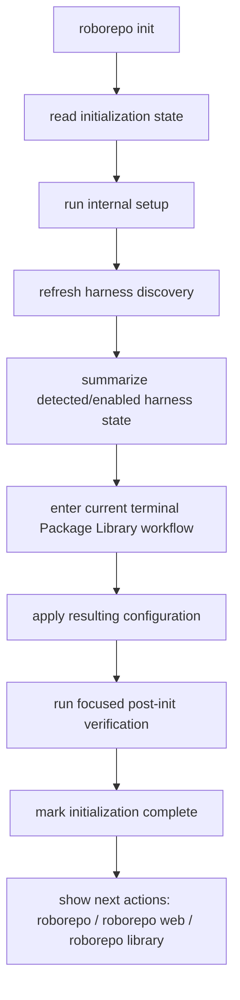
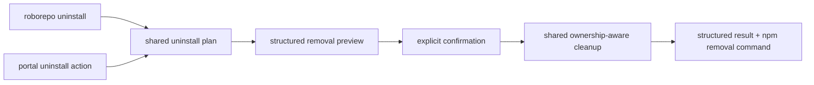

# Make npm Installation Lead Into a Coherent RoboRepo Lifecycle

## Summary

Make the package-installed RoboRepo experience begin and end with a small, understandable command surface.

npm owns the RoboRepo application files. RoboRepo owns initialization, the configuration it projects into supported agent harnesses, its machine-local state, and safe cleanup of those projections. A new installation should therefore require only:

```sh
npm install -g codethings-roborepo-alpha
roborepo init
```

`roborepo init` becomes the user-facing first-run workflow. The existing `setup` command remains an internal primitive for creating workspace/state structures, and `config apply` remains the explicit reconciliation primitive rather than a step a new user must know. A friendly top-level `roborepo library` command opens the same package-management workflow as `roborepo package manage`.

Removal follows the same ownership boundary. `roborepo uninstall` removes RoboRepo-managed machine integration while preserving user-authored workspace content by default, then tells the user how to remove the application with the package manager. The portal exposes the same managed-cleanup workflow.

This plan also makes zero, one, two, or any supported number of harnesses a deliberate first-run and UI state. It does not broaden the definition of harness presence; the existing `harness-presence-signal-expansion` plan still owns that decision.

## Context

The npm package now supplies a real `roborepo` executable without requiring a source checkout. The package smoke test already proves that an installed tarball can run the lower-level sequence `setup`, `harness refresh`, `harness list`, `config apply`, and `doctor`. Those are useful implementation and verification primitives, but they are too much lifecycle vocabulary for a first-time user.

The current CLI already has much of the machinery needed for a simpler product surface:

- `setup` is an internal command backed by `scripts/cli/workspace.mjs`.
- `config apply` re-renders enabled package and harness configuration.
- `package manage` is titled **Package Library** and routes into the live item-level package wizard in `scripts/cli/presets.mjs`.
- `maintenance uninstall` is an advanced hidden command backed by the existing uninstall scripts.
- `scripts/harnesses/state.mjs` persists machine-local provider discovery and enablement state.
- bare `roborepo` currently opens the normal root menu unconditionally. `scripts/cli/main.mjs` still calls `maybeRunPresetOnboarding()` first, but that function (`scripts/cli/presets.mjs`) is now a vestigial no-op: it only strips a legacy `--no-presets-onboard` flag from argv and never runs onboarding. There is no first-run branch anywhere in the startup path.

The current lifecycle still exposes two different ownership models during removal. npm removes the package files it installed, while RoboRepo-generated files and state live elsewhere. Current npm releases do not implement package uninstall lifecycle scripts, so RoboRepo cannot rely on `npm uninstall` to call custom cleanup code. The product must teach and implement that boundary explicitly.

This document continues to own the broader lifecycle scope already assigned to plan `46up8y7a`: apply/reconcile behavior, repair, verification, data preservation, shell integration, replacement, and uninstall. The first phases below prioritize the user-facing lifecycle needed for package installs; the broader hardening remains later work in the same lifecycle plan rather than a competing plan.

## Goals

- Make npm the sole owner of package-mode application install, version replacement, and application removal.
- Add `roborepo init` as the single user-facing first-run workflow.
- Persist explicit initialization state so first-run behavior is not inferred from directory existence.
- Make an interrupted initialization resumable and distinguish it from a completed installation.
- Route a bare interactive `roborepo` invocation into `init` when the installation is not initialized.
- Keep explicit commands available without reinstating the old forced-onboarding gate.
- Keep `setup` internal and keep `config apply` available as an advanced/manual reconciliation primitive.
- Add `roborepo library` as a friendly top-level alias for `roborepo package manage`.
- Do not restore `roborepo onboard` as a public command.
- Allow initialization to succeed with zero detected harnesses.
- Make CLI and portal agent-related surfaces behave correctly for zero, one, two, and N harnesses without hardcoding Claude/Codex pairs.
- Add a public `roborepo uninstall` workflow for RoboRepo-managed cleanup.
- Preserve the portable/user-authored workspace by default during managed cleanup.
- Add the same managed-uninstall action to the portal, backed by the same cleanup service as the CLI.
- Explain during setup and in uninstall documentation that npm application removal does not remove separately stored RoboRepo configuration/workspace content.
- Use the new Mac as a manual acceptance environment for zero-to-N harness permutations after the automated package smoke remains green.

## Non-goals

- Building the dedicated browser onboarding experience or the Browser-versus-Terminal choice. Plan `v6lvuu2` owns that follow-up.
- Changing which preloaded package defaults become live before confirmation. Plan `v6lvuu2` owns staged first-run package selection.
- Reintroducing a public `roborepo onboard` command.
- Renaming or redefining `roborepo update` in this slice. Package mode currently aliases it to `config apply`; a clearer self-update story can be handled separately.
- Broadening harness-presence semantics from strict home existence to executable/config confidence. `harness-presence-signal-expansion` owns that behavior.
- Installing Claude, Codex, Gemini, or other harnesses for the user.
- Having the portal or `roborepo uninstall` remove the npm package itself.
- Publishing a stable npm release or adding Homebrew distribution.
- Rebuilding the entire existing shell-based uninstall implementation before the user-facing lifecycle can ship.

## Current State

### Application and configuration ownership

RoboRepo already separates three roots:

| Layer | Current meaning | Intended lifecycle owner |
| --- | --- | --- |
| `appRoot` | Immutable installed application or development checkout | npm/package manager in package mode; checkout in development mode |
| `workspaceRoot` | Editable portable user workspace; defaults to `<stateRoot>/workspace` | User |
| `stateRoot` | Machine-local RoboRepo state; defaults to `~/.roborepo` | RoboRepo on behalf of the user |

The default placement of `workspaceRoot` under `stateRoot` is important for uninstall: current `remove_runtime_state()` recursively removes the entire state root, so the existing hidden uninstall path cannot be promoted directly as the safe user-facing uninstall workflow. Workspace preservation must be enforced before `roborepo uninstall` becomes public.

### Existing first-run primitives

The current package-oriented sequence is:

```text
setup
→ harness refresh
→ harness list
→ config apply
→ doctor
```

`setup` already has `kind: internal` in the command catalog and only initializes workspace/state structures. `config apply` is a public command that invokes the update script to materialize enabled packages and harness configuration.

`package manage` already reuses the item-level wizard implemented in `scripts/cli/presets.mjs`; its command title is **Package Library**. The old top-level `onboard` command is removed, while the internal `onboard` sub-action remains an implementation detail of the package-management workflow.

### Harness-count behavior

The provider registry currently contains Claude, Codex, and Gemini and is data-driven through `listHarnessProviders()`.

The user-facing surfaces do not all mean the same thing when they say “harness”:

| Surface | Current cohort | Consequence |
| --- | --- | --- |
| `roborepo harness list` | All registered providers + persisted machine state | Correct for showing supported providers and their detected/enabled state |
| Agents `/config` grid | All registered providers | A zero-harness machine still receives one column per registered provider |
| ↳ source of that cohort | `configSnapshotHarnesses()` in `scripts/cli/config.mjs` maps `listHarnessProviders()` straight to `{id, displayName, rulesFile, settingsFile, hooksFile}` | It never reads `harnessStatePath`, so the snapshot carries no detected/enabled signal at all; `portal/config/templates.js` renders one column per entry off `snap.harnesses` |
| Tokens `/tokens` filter | Harnesses observed in telemetry data | Filter is hidden when zero or one harness is observed; N buttons are generated dynamically |
| install/uninstall shell gating | Strict harness home-directory presence | Intentionally narrower than richer discovery confidence |

This plan must not collapse these cohorts into one generic “harness list.” Each surface must state which cohort it presents and render zero/one/N intentionally.

### Existing uninstall behavior

`roborepo maintenance uninstall` is an advanced hidden command. The underlying uninstall code already contains ownership-aware removal for symlinks, generated rules, root config, backups, hooks, package projections, and remnant checks.

The unsafe promotion point is state removal. `remove_runtime_state()` in `scripts/install/uninstall-lib.sh` removes several specific state files, then finishes with a recursive removal of the state root itself:

```sh
remove_path "${state_dir}/command-overrides.json" "remove"
remove_path "${state_dir}/enabled-packages.json" "remove"
remove_path "${state_dir}/telemetry" "remove"
remove_path "${state_dir}/telemetry-backups" "remove"
remove_path "${state_dir}/backups" "remove"
remove_path "${state_dir}" "remove"   # <- takes <stateRoot>/workspace with it
```

`remove_path` runs `rm -rf`, so that final line deletes the default workspace at `<stateRoot>/workspace` along with everything else. A public uninstall must classify state and preserve user-owned workspace content rather than recursively deleting the root.

Note that `workspaceRoot` is only *usually* nested: `scripts/cli/roots.mjs` resolves it from a `workspace-root.json` override before falling back to `path.join(stateRoot, "workspace")`. Cleanup must therefore resolve the effective workspace path rather than assume the nested default, and must handle a relocated workspace that sits entirely outside `stateRoot`.

npm application uninstall is a separate operation:

```sh
npm uninstall -g codethings-roborepo-alpha
```

That removes the npm-managed package, not the separately stored RoboRepo projections and user state. Current npm releases do not provide an uninstall lifecycle hook that RoboRepo can use to automatically bridge those two operations.

## Proposed Design

### 1. Public lifecycle vocabulary

Make the normal user-facing lifecycle small:

| Command | User meaning | Notes |
| --- | --- | --- |
| `roborepo init` | Set up this RoboRepo installation for first use | New public orchestration command |
| `roborepo library` | Browse/change RoboRepo functionality | Friendly alias of `roborepo package manage` |
| `roborepo doctor` | Diagnose installation/configuration health | Existing public diagnostic |
| `roborepo uninstall` | Remove RoboRepo-managed machine integration | Preserves workspace by default; does not remove npm package |
| `npm uninstall -g codethings-roborepo-alpha` | Remove the RoboRepo application | Package-manager operation, not a RoboRepo command |

Keep these implementation primitives available without teaching them as the normal first-run path:

| Primitive | Role |
| --- | --- |
| `roborepo setup` | Internal workspace/state initialization |
| `roborepo config apply` | Explicit desired-state reconciliation |
| `roborepo harness refresh` | Refresh machine harness discovery |
| `roborepo package manage` | Canonical package namespace action behind `library` |

Do not resurrect `roborepo onboard`.

### 2. Explicit initialization state

Add a machine-local state record through `scripts/cli/state-paths.mjs`, for example:

```json
{
  "schemaVersion": 1,
  "workflowVersion": 1,
  "status": "in-progress",
  "startedAt": "ISO-8601",
  "completedAt": null
}
```

The exact filename should live under `stateRoot` and be owned by a focused lifecycle/initialization module. The record must not duplicate package selections, harness discovery state, or workspace contents.

Required states:

| State | Meaning | Bare `roborepo` behavior |
| --- | --- | --- |
| missing | initialization has never started | offer/start `init` |
| `in-progress` | initialization began but did not finish | offer/resume `init` |
| `complete` | core first-run workflow finished successfully | open normal root menu |

Mark initialization complete only after the required initialization workflow succeeds. An exception, Ctrl-C, or user exit before completion leaves the state resumable.

### 3. `roborepo init` orchestration

The first implementation should compose existing primitives rather than duplicate their logic.



Milestone 1 deliberately uses the current terminal Package Library handoff and current package-default semantics. Plan `v6lvuu2` later replaces that handoff with Browser-versus-Terminal choice plus staged package-default review before apply.

`init` must be idempotent. Re-running it after completion should not reset package selections or delete state. It should present a concise already-initialized outcome and allow the user to review setup or open the Library without silently replaying destructive work.

### 4. Bare `roborepo` first-run routing

Do not restore the old forced onboarding gate that blocked arbitrary commands.

Instead:

- bare `roborepo` + interactive terminal + missing/in-progress initialization state routes to `init`;
- bare `roborepo` + completed initialization opens the normal root menu;
- explicit `roborepo init` always enters the initialization workflow;
- explicit diagnostics/help such as `version`, `doctor`, and `--help` remain usable before initialization;
- automation must not be forced through an interactive wizard merely because initialization is incomplete.

Keep the first-run routing in a focused lifecycle module called from `scripts/cli/main.mjs`; do not put initialization business rules into the command resolver or interactive menu renderer.

### 5. `roborepo library` as the friendly package front door

Add a top-level public command:

```sh
roborepo library
```

It must dispatch to the same implementation as:

```sh
roborepo package manage
```

There is one package-management workflow and one source of truth. `library` is vocabulary for users who have not learned the package model yet; `package ...` remains the detailed namespace for list/inspect/enable/disable/reconcile/development operations.

Help/menu presentation should teach both without duplicating them:

```text
Customize
  library       Browse and manage RoboRepo packages
```

`package manage` remains discoverable under the package namespace.

### 6. Zero-to-N harness contract

Initialization must treat zero harnesses as a normal state:

```text
No supported agent harnesses are currently detected.
RoboRepo is initialized; install or launch a supported harness later and refresh discovery.
```

Do not broaden the existing presence signal in this plan. Consume the state already produced by `harness refresh`, and leave richer executable/config/home semantics to `harness-presence-signal-expansion`.

Define presentation cohorts explicitly:

| Surface | Cohort to present | Zero | One | N |
| --- | --- | --- | --- | --- |
| `init` summary | machine discovery state | valid empty message | one named harness | concise list/count |
| `harness list` | supported providers + state | all supported shown as absent/disabled | same table, one detected | same data-driven table |
| Agents primary machine view | persisted discovery entries whose `confidence` is not `absent`; preserve each entry's enabled/disabled state | explicit “no agents detected” state | one provider presentation | generated provider presentation |
| Tokens harness filter | harnesses with observable telemetry | no harness filter + empty-data guidance | no redundant filter | generated all + per-harness controls |
| package/config internals | registered provider catalog where required | may still know all providers | same | same |

The Agents API may retain the full supported-provider catalog for configuration metadata, but the primary user presentation must not imply that every registered provider is installed. Add explicit machine-state fields or a separate presentation list instead of making the browser infer presence from filenames.

Tests must include a synthetic extra provider where the current provider-test seams allow it, so “N” means data-driven rather than exactly the three providers registered today.

### 7. User-facing managed uninstall

Add:

```sh
roborepo uninstall [--dry-run] [--yes] [--delete-workspace]
```

The workflow must preview the ownership boundary before mutation. Interactive execution requires confirmation; noninteractive destructive execution refuses unless `--yes` is explicit. `--dry-run` never mutates.

Default behavior:

| Remove | Preserve |
| --- | --- |
| RoboRepo-managed harness projections | user-authored workspace |
| generated skills/commands/rules that have ownership proof | repositories/project checkouts |
| RoboRepo-owned root-config content when safe | unmanaged harness files |
| disposable machine-local caches/install metadata | drifted/user-modified config that cannot be proven safe to remove |
| RoboRepo-owned shell/profile entries | unrelated shell configuration |

The current broad `rm -rf stateRoot` behavior must be replaced by selective cleanup. Because the default workspace is nested under `stateRoot`, “preserve workspace” must be mechanically true, not just documented.

Cleanup must resolve the effective workspace root the same way `scripts/cli/roots.mjs` does — honoring the `workspace-root.json` override — and handle both placements:

| Workspace placement | Required cleanup behavior |
| --- | --- |
| nested default `<stateRoot>/workspace` | remove state entries selectively; never `rm -rf` the state root itself |
| relocated outside `stateRoot` | leave the relocated tree untouched unconditionally |

#### Workspace disposition policy (resolved)

Two things are easily conflated here and must stay separate:

| Thing | What it is | Policy |
| --- | --- | --- |
| the workspace tree | real user-authored content | preserved by default; deletable only in the nested case, only on explicit opt-in |
| `workspace-root.json` | a machine-local pointer holding a path string | never a separate question; its fate follows the tree |

The pointer is not independently meaningful — it matters only if the workspace it names still exists. Asking about it would make the user answer a second question about a bookkeeping file they have never heard of, immediately after they already expressed intent about their data. Derive it instead:

- workspace preserved → preserve `workspace-root.json`, so a relocated workspace stays discoverable after reinstall;
- nested workspace deleted via explicit opt-in → the pointer describes a path that no longer exists, so remove it too and say so in the result.

**Deletion is offered only for a nested workspace.** A relocated workspace lives at a path the user deliberately chose — possibly a synced or backed-up folder — and RoboRepo did not create that location, so it must not take responsibility for removing it. For a relocated workspace, never offer deletion in the prompt and never honor `--delete-workspace` against it; preserve it, print its path, and let the user delete it themselves.

Interactive prompt shape for the nested case:

```text
Managed cleanup will remove RoboRepo harness projections,
generated rules, and machine-local state.

Your workspace will be preserved:
  ~/.roborepo/workspace  (18 files)

  [Enter] preserve workspace (recommended)
  [d]     also delete workspace
```

`--delete-workspace` is the noninteractive equivalent so automation opts in explicitly rather than being prompted. It is destructive, so it composes with the existing rule: noninteractive deletion refuses unless `--yes` is also explicit. Under `--dry-run` it reports the intended deletion without mutating.

Consequence accepted: default managed uninstall leaves the workspace bytes behind, so it is not a zero-trace removal. That is the intended reading of the ownership thesis — RoboRepo removes what it created, and it did not create the user's workspace content. Users wanting zero trace have `--delete-workspace` and a printed path.

After managed cleanup completes, print the package-manager step:

```text
RoboRepo-managed configuration has been removed.
Your workspace was preserved.

Remove the application with:
  npm uninstall -g codethings-roborepo-alpha
```

Do not have RoboRepo invoke npm on the user's behalf. This keeps package-manager ownership explicit and avoids self-removal/version-manager ambiguity.

`maintenance uninstall` should no longer represent a separate cleanup implementation. Make it an advanced compatibility entry to the same shared cleanup path or replace it with a clear redirect to `roborepo uninstall`.

### 8. Portal uninstall action

Expose **Uninstall RoboRepo** in a Maintenance panel on the existing `/config` surface without creating a new top-level page solely for this feature.

The portal and CLI must consume one shared cleanup planner/executor:



The portal flow must:

1. fetch a dry-run/preview;
2. show what will be removed and what will be preserved;
3. require explicit destructive confirmation;
4. execute the same cleanup semantics as the CLI;
5. return/display the npm removal command;
6. allow the HTTP response to finish before stopping the portal process or deleting its PID state.

Do not shell out from browser JavaScript. Keep mutation handling server-side behind the portal's existing origin/token protection.

### 9. Installation and removal messaging

The package installation itself should not run the old checkout installer.

The practical user workflow is:

```text
npm install -g codethings-roborepo-alpha

RoboRepo installed.
Run `roborepo init` to get started.
```

Do not depend on npm install-script output as the sole onboarding instruction; package-manager script output can be suppressed or restricted. Make the same next-step instruction visible in the package README/install guide and when a user runs bare `roborepo`.

During first-run completion and in uninstall documentation, state the storage boundary plainly:

```text
The npm package and your RoboRepo configuration have separate lifecycles.
Removing the npm package does not remove your RoboRepo workspace or managed harness configuration.
Run `roborepo uninstall` first when you want a full managed cleanup.
```

### 10. Broader lifecycle hardening retained by this plan

After the first-run/uninstall product surface is coherent, continue the still-open lifecycle work already owned here:

- ownership inventory across every harness resource type;
- collision and backup policy;
- moved-checkout repair;
- shell/PATH cleanup;
- same-version reinstall;
- upgrade/downgrade state compatibility;
- dry-run/noninteractive result consistency;
- repository-mode/package-mode parity.

The two previously reproduced narrow removal defects—apply orphan cleanup and package-owned slash-command cleanup—are already fixed and should remain regression coverage, not pending tasks.

## Code Touchpoints

### CLI catalog and orchestration

- `manifests/platform/cli/command-definitions/`
  - add public root definitions for `init`, `library`, and `uninstall`;
  - keep `internal/setup.command.json` internal;
  - route `library` to the same package-management implementation as `package manage`;
  - stop presenting advanced maintenance uninstall as a separate user workflow.
- `scripts/cli/main.mjs`
  - add first-run routing before the normal root menu (the `resolved.kind === "root-menu"` branch);
  - retire the no-op `maybeRunPresetOnboarding()` argv hook rather than stacking new logic beside it;
  - do not reinstate the old global onboarding gate.
- New focused lifecycle/initialization module under `scripts/cli/`
  - read/write initialization state;
  - orchestrate setup, discovery, library handoff, apply, verification, completion;
  - keep command composition separate from execution helpers.
- `scripts/cli/state-paths.mjs`
  - own the initialization-state path.

### Package and configuration

- `scripts/cli/presets.mjs`
  - reuse the current Package Library wizard;
  - do not expose its internal `onboard` token as a public command.
- `scripts/cli/config.mjs`
  - `configSnapshotHarnesses()` currently maps `listHarnessProviders()` with no state input; add the machine cohort by reading persisted discovery state (`harnessStatePath` via `scripts/harnesses/state.mjs`) without losing registered-provider metadata.
- `scripts/cli/package-projection-cleanup.mjs`
  - continue as the ownership-aware package projection cleanup path.

### Harnesses

- `scripts/harnesses/registry.mjs`
- `scripts/harnesses/state.mjs`
- `scripts/harnesses/discovery.mjs`
- `scripts/cli/harness.mjs`
  - keep provider iteration data-driven;
  - consume existing discovery state without redefining presence in this plan.

### Uninstall

- `scripts/install/uninstall.sh`
- `scripts/install/uninstall-lib.sh`
  - split selective machine-state cleanup from workspace preservation;
  - expose structured/shared cleanup behavior usable from the CLI/portal adapter;
  - retain ownership and drift safety checks.
- New focused shared uninstall planner/executor module if required to serve both CLI and portal without duplicating policy.

### Portal

- `scripts/cli/portal-server.mjs`
  - register the protected uninstall preview/execute route or delegate to a focused maintenance route module.
- `scripts/cli/portal-routes-config.mjs` or a new focused maintenance route module
  - keep app-level maintenance out of unrelated rendering code.
- `portal/config/`
  - add the first maintenance action without hand-building multi-element markup in JavaScript;
  - use real HTML `<template>` markup and the existing portal slot-fill conventions.
- `portal/config/templates.js`
  - make provider presentation consume the intended machine cohort.
- `portal/telemetry/app.js`
  - preserve dynamic observed-harness filtering and add/verify zero-data behavior.

### Documentation

- `README.md`
- `docs/user/guides/first-time-setup.md`
- `docs/user/guides/install-workflows.md`
- `docs/user/reference/roborepo-cli.md`
- `docs/user/reference/roborepo.md`

Document the public lifecycle vocabulary and remove first-run instructions that require users to know internal primitives.

## Implementation Plan

### Phase 1 — Pin the public lifecycle contract

- [x] Add an initialization-state path and focused read/write helpers with schema validation.
- [x] Add tests for missing, in-progress, and complete initialization state.
- [x] Add `roborepo init` to the command catalog and keep `setup` internal.
- [x] Implement `init` as a short orchestrator over existing setup/discovery/library/apply/verification functions rather than copying their logic.
- [x] Leave initialization in-progress on interruption or failed required step.
- [x] Make completed `init` idempotent and non-destructive.
- [x] Route bare interactive `roborepo` into `init` only when initialization is missing/in-progress.
- [x] Keep explicit help/version/doctor and automation paths usable without a forced onboarding gate.
- [x] Retire the vestigial `maybeRunPresetOnboarding()` call in `scripts/cli/main.mjs`: replace it with the new first-run routing rather than layering a second startup hook beside a no-op. Keep `--no-presets-onboard` accepted-and-ignored, or drop it deliberately as a documented removal.

### Phase 2 — Add the Library front door

- [x] Add `roborepo library` as a root command that executes the same Package Library workflow as `roborepo package manage`.
- [x] Keep detailed package operations under the `package` namespace.
- [x] Update root help and interactive menu copy to teach **Library** first and **packages** inside that workflow.
- [x] Add command-catalog and PTY coverage proving the alias does not fork behavior.

#### Phases 1-2 implementation notes

Landed on branch `plan-46up8y7a-install-lifecycle`.

| Decision | Reasoning |
| --- | --- |
| `library` and `package manage` share a `packageLibrary` execution preset in `manifests/platform/cli-commands.json` | The plan requires the alias not fork behavior. Duplicating the execution block in two definition files would satisfy that on day one and drift later; one preset makes divergence structurally impossible. |
| `package manage` lost `promoteToRoot` | With `library` at root, keeping the promotion listed the same workflow twice in root help. `package manage` stays reachable and documented under the package namespace. |
| `init` does not call `config apply` after the Library handoff | `presetsOnboard` already applies the selection (and already handles the non-interactive default-apply path), so a following apply would re-run the same update script for no benefit. |
| `maybeRunPresetOnboarding` deleted rather than left in place | It had decayed to an argv filter. `--no-presets-onboard` is still accepted-and-ignored in `main.mjs` so existing scripts do not break on an unknown flag. |
| Corrupt initialization record reads as `missing` | Never-started and unreadable have the same recovery — run `init` — and a malformed state file must not be able to lock a user out of their first run. |

Test-suite changes were setup fixes, not assertion weakening: the PTY checks drive a bare `roborepo`, which now reaches `init` on an uninitialized sandbox, so those sandboxes are seeded already-initialized. Menu assertions that hardcoded a row label or keypress count were re-anchored to indentation and offset, since those shift whenever a primary action is added.

Not yet done in this slice: no documentation updates (Phase 6 owns them), and `roborepo uninstall` does not exist yet, so the `init` completion message describes the storage boundary without yet being able to point at a working managed-cleanup command.

### Phase 3 — Make zero-to-N harness presentation explicit

- [x] Add `machineHarnesses` (or an equivalent explicit presentation field) to the config snapshot without removing the registered provider catalog needed for supported-provider metadata; populate it from persisted discovery entries whose `confidence` is not `absent` and preserve each entry's enabled flag.
- [x] Make the Agents primary provider presentation show a truthful zero state when `machineHarnesses` is empty.
- [x] Verify one-provider and N-provider layouts are generated from data rather than fixed columns.
- [x] Preserve Tokens' observed-telemetry cohort and add a clear zero-data state; keep the harness filter hidden for one observed harness and generated for N.
- [x] Add focused tests for zero, one, two, all currently registered providers, and a synthetic extra provider where the test seam supports it.
- [x] Do not change strict-vs-rich harness detection semantics in this phase.

### Phase 4 — Promote safe managed uninstall

- [x] Characterize the current hidden uninstall against a workspace at the default `<stateRoot>/workspace` path, capturing the existing destructive behavior as a failing test before changing it.
- [x] Remove the final `remove_path "${state_dir}"` from `remove_runtime_state()` and replace recursive state-root deletion with a selective ownership-based cleanup plan that preserves workspace content by default.
- [x] Resolve the effective workspace root through the same `workspace-root.json` override logic as `scripts/cli/roots.mjs`; cover both the nested default and a workspace relocated outside `stateRoot`.
- [x] Implement the resolved workspace-disposition policy: preserve by default; tie `workspace-root.json`'s fate to the tree's rather than prompting for it separately.
- [x] Add `--delete-workspace` opt-in, honored only for a nested workspace, refusing noninteractively without `--yes`, and non-mutating under `--dry-run`.
- [x] Never offer or honor workspace deletion for a relocated workspace; preserve it and print its path.
- [x] Define structured preview/result data shared by CLI and portal adapters.
- [x] Add public `roborepo uninstall` with dry-run/preview and explicit confirmation.
- [x] Repoint or retire `roborepo maintenance uninstall` so there is one cleanup implementation.
- [x] Keep drifted/unmanaged harness content intact and report what was skipped.
- [x] Print the exact npm application-removal command after successful managed cleanup.
- [x] Verify repeated managed uninstall is safe.

### Phase 5 — Add portal cleanup

- [x] Add protected preview and execute endpoints using the existing portal origin/token mutation guard.
- [x] Add an **Uninstall RoboRepo** Maintenance panel to the existing `/config` surface for the first implementation; do not create a new top-level portal page for this action.
- [x] Render removal/preservation preview from structured server data.
- [x] Require explicit destructive confirmation.
- [x] Ensure the response reaches the browser before the portal server stops/removes its own runtime state.
- [x] Display the npm removal command after cleanup.
- [x] Keep workspace deletion out of the portal action entirely: the portal exposes preserve-only cleanup and shows the preserved workspace path. `--delete-workspace` stays a deliberate CLI opt-in rather than a button in a browser.

### Phase 6a — First-run vocabulary documentation

Split from the original Phase 6 and done alongside Phases 1-2: `init` and `library` shipped on the
branch, so leaving their documentation until after Phases 3-5 would have merged behavior that no
document described. The remaining Phase 6b items genuinely depend on later phases.

- [x] Make package-install guidance end with `roborepo init`, not a checklist of internal commands.
- [x] Document `roborepo library` as the normal way to change functionality later.
- [x] Document the first-run routing contract: bare interactive invocation enters `init`, explicit commands are never gated, an interrupted `init` resumes, a completed `init` is a no-op report.
- [x] Correct the stale claim in `docs/user/reference/roborepo.md` that the CLI "gates normal commands until onboarding has completed" — that gate was removed before this plan and the sentence had outlived it.
- [x] Correct `docs/user/guides/install-workflows.md`'s claim that the installer starts the package chooser itself.
- [x] Document that zero detected harnesses is a valid initialization outcome.

### Phase 6b — Uninstall documentation and real-new-Mac acceptance

- [x] Document the two-part uninstall ownership model, including that managed uninstall preserves the workspace by default and that `--delete-workspace` is the explicit nested-only opt-in.
- [x] State that npm removal alone leaves separately stored RoboRepo state/configuration.
- [x] ~~Generate a fresh Packaging 01 transfer artifact from the final tested commit.~~
      **Dropped 2026-08-22**, with the same step in `infra-packaging-01`: the real transition
      installed from the npm registry, and `npm run test:package-install` already packs a fresh
      tarball on every run.
- [x] Run the real-new-Mac harness-count matrix below. **Stage 0 is confirmed on real hardware
      (2026-08-22):** the machine had no harness installed, `init` succeeded, and `roborepo doctor`
      passed.

      **Stages 1–N are covered automatically as of 2026-08-25**, by
      `scripts/test/clean-machine-container-check.mjs`. Each stage builds its machine shape from
      stub executables plus harness home directories in a container, so the states the matrix
      describes are reachable without a new Mac — discovery resolves executables through `PATH`,
      and presence is keyed on the harness home.

      Both halves of the `Verify` column are asserted:

      - **Lifecycle** — `init`, `doctor`, and a clean uninstall at each harness count.
      - **Presentation** — after `harness refresh`, every stage checks the `present` column of
        `roborepo harness detected` per provider. That is what separates stage 1 from stage 2:
        an installed-but-never-launched harness has no home yet and must report `present=0`,
        while a launched one reports `1`. Stage N additionally asserts that all three registered
        providers appear in both `harness detected` and `harness list`, which is the anti-hardcoding
        check — a registry-driven renderer passes it, a Claude/Codex-only one does not.

      Sabotage-verified: inverting the expected `present` value fails stage 1 with
      `FAIL: claude present=0, expected 1`, so the assertion runs rather than passing vacuously.

      Note for anyone re-reading the `Verify` column: it names a `roborepo list` command that does
      not exist. The real surfaces are `roborepo harness list` and `roborepo harness detected`, the
      latter being the tab-separated row source the shell install/uninstall/repair/doctor scripts
      already consume.

      **What hardware would still add**, and why this is closed anyway: a real machine exercises
      real harness binaries rather than stubs, and real per-provider config. The container proves
      the count-dependent behavior — discovery, presentation, lifecycle — which is what this matrix
      was written to find. Hardware now confirms rather than discovers.
- [x] Record any presence-signal observations in `harness-presence-signal-expansion` rather than broadening this plan mid-test.
      **Nothing to hand over (2026-08-25).** This was a scope guardrail for the matrix run rather
      than a unit of work, and the run produced no surprise: strict home-existence presence behaved
      exactly as documented at every stage, including the stage-1/stage-2 boundary where an
      installed-but-never-launched harness reports `present=0`. That is the current signal working
      as designed, not a case for broadening it, so `harness-presence-signal-expansion` keeps its
      scope unchanged.

#### Phases 3-6 implementation notes

| Decision | Reasoning |
| --- | --- |
| Cohort policy extracted to `portal/shared/harness-cohort.js` | The portal's template modules import `/portal/shared/api.js` by absolute browser URL and cannot load in Node. Extracting the DOM-free policy is what makes zero/one/N testable at all — there is no jsdom in this zero-dependency repo. |
| Machine cohort keeps user-disabled providers | A harness the user turned off is still on the machine. Collapsing "disabled" into "absent" would misreport it. |
| `roborepo uninstall` wraps the shell implementation rather than replacing it | Its ownership and drift checks are mature; the plan explicitly warns against a wholesale rewrite. The CLI module owns flags, confirmation, and messaging only. |
| Portal cleanup is preserve-only | `uninstallExecute` pins the delete flag off, so no request shape reaches workspace deletion through the browser. Irreversibly removing authored content should be a typed CLI opt-in, not a button. |
| Portal route tested at the handler, not over HTTP | The first version started a detached `roborepo web` per case; `web stop` could not reap it across sandboxed `HOME`s and the suite hung past 7 minutes. The security-relevant behavior (confirm gate, preserve-only, error mapping) is all handler-side, and the origin/token guard belongs to `portal-server.mjs`, which owns it for every route. |

Two pre-existing bugs surfaced while implementing Phase 4 and are fixed here: `uninstall.sh` ran its
remnant check after a dry run (which removes nothing, so `--dry-run` always exited nonzero), and
that check listed the state root itself, which reports every correct preserve-by-default run as
unclean.

Still open in 6b: stages 1–N of the harness-count matrix, and presence-signal observations.

Updated 2026-08-22. The transfer-artifact item is dropped — the real transition used the npm
registry, so a carried tarball tests a path nobody takes. Stage 0 of the matrix is confirmed on
hardware: a machine with no harness installed ran `init` and `doctor` successfully. That was the
one stage no development machine can produce, and it is the stage that is now done.

The remaining stages no longer need hardware. `test-clean-machine-install-sandbox.md` (`qk4mz7t2`)
drives 0 through N with stub executables in a container, which changes hardware's role from
discovering these behaviors to confirming them.

That same session found a real defect this matrix would not have caught: `roborepo uninstall` left
its own binary behind on a machine whose npm prefix collided with the shell installer's bin
directory, and the surviving binary re-ran onboarding. Fixed, with regression coverage, under
Milestone A of that plan.

### Phase 7 — Continue broader lifecycle hardening

- [x] Complete the resource ownership/removal inventory across skills, commands, MCP, hooks, root config, shell entries, backups, state, and caches.
- [x] Finish collision/back-up policy characterization and deterministic dry-run/noninteractive behavior.
- [x] Finish moved-checkout and stale-path repair coverage.
- [x] Finish shell/PATH deduplication and package-manager-shim ownership cleanup.
- [x] Define same-version reinstall and versioned upgrade/downgrade state behavior.
- [x] Run the same core lifecycle matrix in development and installed-package modes.

#### Phase 7 implementation notes (ownership inventory + collision/backup policy)

Two real defects surfaced, each found by characterizing current behavior against a sandboxed
fixture rather than by reading the code.

**1. `<stateRoot>/runtime` leaked through managed uninstall.** Package runtime assets
(`runtimeAssetDestination` in `scripts/cli/package-harness-config.mjs`) are written to
`<stateRoot>/runtime/<pkg>/`. `pruneRuntimeAssets` removes individual files, but it runs on package
*disable* and leaves the `runtime/` directory; `remove_runtime_state()` never listed it at all.
Managed uninstall therefore left the directory behind, and `check_no_active_remnants` — which sweeps
every child of the state root — then reported it and **exited nonzero**. So the leak did not fail
silently; it made every uninstall on a machine that had ever enabled a package-runtime-asset package report
failure. Fixed by removing `${state_dir}/runtime` in `remove_runtime_state()`.

| Decision | Reasoning |
| --- | --- |
| The inventory is a test, not a prose table | An enumerated removal list is safe but not self-maintaining, which is exactly how `runtime/` was missed. `testEveryDeclaredStatePathIsClassified` parses `state-paths.mjs` (the single declaration point for state-root paths) and fails when a declared path is classified neither owned nor preserved, and separately asserts each owned entry actually appears in `remove_runtime_state()`. A new state path now fails at introduction instead of leaking into a user's state root. |
| Classification is binary | Every state-root child is either disposable machine state roborepo created (removed) or user content and the pointer that follows it (preserved). There is no third category, so a two-list model is complete by construction. |

**2. An invalid conflict policy silently skipped collisions.** The collision dispatch in
`install-lib.sh` has no catch-all `*)` case, and `install-harness.sh` accepted `--on-conflict`
without validating it (unlike `main.sh`, which always has). A typo'd value therefore matched none of
`overwrite|keep|abort`: the colliding path was skipped with no backup, no staged `_update_`, no
warning — and the install still **exited 0**, reporting success while leaving that path
unconfigured. User data was not destroyed (the pre-install backup runs earlier), but the outcome was
a false success and a silently unconfigured harness.

Fixed at both layers deliberately: `install-harness.sh` validates its flag like `main.sh` does, and
`choose_path_conflict_action` re-validates `ROBOREPO_ON_CONFLICT` where it is consumed, because the
env var can be set directly and bypass every entry point's flag parsing.

Dry-run determinism was characterized and found already correct: two dry runs over identical
fixtures produce byte-identical output once the install timestamp is normalized, and mutate nothing.
The remaining difference is the intended `*_update_<TIMESTAMP>` path, not a defect. Noninteractive
installs already default to `--on-conflict=keep` and announce it.

#### Phase 7 implementation notes (moved-checkout and stale-path repair)

`repair.sh` itself was already correct, and characterization confirmed it: installing from one path,
physically moving the checkout, and repairing from the new path re-points the dangling
`~/.local/bin/roborepo` link, rewrites the recorded repo root, and is a no-op on a second run.
Uninstall after a move also correctly reclaims links left by the prior path, via `recorded_repo`.

**The defect found here was not move-specific.** Uninstall exited 1 with roborepo-authored
`CLAUDE.md`/`AGENTS.md` left behind — and a control run with *no* move failed identically. Root
cause: every one of these modules guards its CLI entry point with

```js
if (process.argv[1] === fileURLToPath(import.meta.url)) {
```

`process.argv[1]` is the path as invoked; `import.meta.url` is fully resolved. On macOS a checkout
under `/var/...` resolves to `/private/var/...`, so the comparison is **false**, the entry-point
block never runs, and the CLI **exits 0 having done nothing**. Any symlinked checkout has the same
shape. Three modules shared the bug: `rules-render.mjs`, `root-config-merge.mjs`, `presets.mjs`.

Blast radius is wider than uninstall, because these are shelled out to as subprocesses:

| Caller | Consequence of the silent no-op |
| --- | --- |
| `uninstall-lib.sh` → `rules-render.mjs --remove-managed` | managed rules blocks survive uninstall; the remnant check then fails the run |
| `install-harness.sh` → `rules-render.mjs <harness>` | home rules never rendered on install |
| `doctor.sh` → `rules-render.mjs --check` | health check passes without checking anything |
| `install-lib.sh` → `root-config-merge.mjs` | writes merge output to a temp file that is then `mv`'d over the user's root config — a no-op subprocess means installing an **empty config** |

Fixed with one shared `isMainModule(import.meta.url)` helper in `roots.mjs` (the leaf module all
three can import without a registry cycle) that compares `realpathSync` on both sides. Three
hand-rolled copies of a subtle path comparison is what let this persist, so the helper is shared
rather than fixed three times.

| Decision | Reasoning |
| --- | --- |
| Helper lives in `roots.mjs`, not `paths.mjs` | `paths.mjs` imports the harness registry; `root-config-merge.mjs` deliberately avoids that cycle. `roots.mjs` is the existing leaf module and already imports `fs` and `fileURLToPath`. |
| Falls back to the unresolved path when `realpathSync` throws | Keeps the guard usable at module load for a path that does not exist yet, instead of throwing during import. |
| Regression test drives a symlinked repo root | Reproduces the mismatch without depending on the platform's temp-dir layout, so it still fails on Linux where `/tmp` is not symlinked. |

Separately, `test_onboarding_wizard_toggles_and_applies` in `test-install-collisions.sh` was stale
and had been failing the whole suite since Phases 1-2 of this plan: it still spawned `roborepo
onboard`, which those phases removed. The command exited immediately with its replacement notice, so
every subsequent `expect` send hit a closed spawn id and killed the run under `set -e` — **before
any assertion could print**, which is why the suite failed with no `FAIL:` line and looked like it
simply stopped after the previous test. Repointed at `package manage`, and at the wizard's current
save key (Enter; Esc now returns to the previous menu without applying).

Fixing that one revealed further stale assertions behind it — the suite had been dying too early to
reach them. All were in `test_windows_installer_root_preflight_order`, all from the same commit
(`6e968a2`), which replaced hand-listed per-harness calls in `install-windows.ps1` with a loop over
`$KnownHarnessIds`:

| Stale anchor | Replaced with | Why |
| --- | --- | --- |
| `# Claude managed links` | `# Per-harness managed links` | comment renamed by the refactor |
| `Invoke-ManifestRows "Claude" @("claude")` | `foreach ($id in $KnownHarnessIds)` + `Invoke-ManifestRows $HarnessDisplayNames[$id] @($id)` | the literal pinned an implementation that no longer exists, and pinned the Claude/Codex pair this repo is moving away from |
| `Invoke-ManifestRows "Codex" @("codex")` | (same loop assertion) | as above |

The properties under test are unchanged and still hold: root-config collisions are resolved before
anything is linked, and manifest rows are applied per harness — now asserted against the
data-driven loop, so a newly registered provider keeps working without an edit here.

Both stale tests predate this branch and fail identically on `main`. They are fixed here rather than
left red because the suite is the verification gate for the rest of Phase 7 — with it aborting at
the wizard test, roughly half its cases (70 of 133) never ran at all.

A follow-up commit routed the six remaining hand-rolled entry-point guards through the same helper.
They appeared in four different spellings (`path.resolve(...)` comparisons, a
`` `file://${argv[1]}` `` template, and a `new URL(...).pathname` form), and all six were verified
broken against a symlinked checkout before conversion — `path.resolve()` normalizes a path but does
not resolve symlinks. A test assertion now fails the suite if any module reintroduces the pattern,
so the helper holds by construction rather than by memory.

The same abort-masking dynamic recurred after this branch merged, and is worth recording because the
shape is identical rather than coincidental. `test-install-collisions.sh` began aborting under
`set -e` at an uninstall defect ([[infra-post-merge-integration-review]], commit `a83816e`), which
stopped the run at case 111 of 159 — so the guard assertion described above, which sits later in the
file, never executed. A seventh hand-rolled guard had meanwhile appeared in
`scripts/cli/maintenance-stores.mjs` and went unreported for exactly as long as the suite could not
reach the assertion that would have caught it.

The assertion was correct and did its job the moment the suite ran to completion. The lesson is
about the gate, not the check: a `set -e` suite that aborts converts every later assertion into a
silent pass, so an early failure must be treated as "coverage unknown from here down" rather than
"one test failed." That suite is now in the documented test matrix (`docs/internal/testing.md`),
which it was not when this phase ran.

#### Phase 7 implementation notes (shell/PATH dedup and shim ownership)

Deduplication and shim ownership were both already correct, and characterization confirmed it:

- three consecutive `install-shell-snippets.sh` + `install-global-commands.sh` runs produce exactly
  one PATH export and one marker comment (exact-line matching, not append-on-every-run);
- the PATH line is `repo_root`-independent, so it survives a checkout move without duplicating;
- `check_command_target` recognizes its own link and the recorded prior checkout, silently reclaims
  a dangling link from a moved checkout, and refuses with a merge-review prompt on a genuine
  unmanaged collision. An npm-installed `roborepo` on `~/.local/bin` is preserved, not clobbered —
  the install exits 1 and changes nothing, which is the correct ownership boundary for package mode.

**One defect found: uninstall left dangling shell wiring behind.** `remove_shell_wiring`'s awk filter
matched `source` lines against the *current* `repo_root` only. A profile wired by a checkout that had
since moved or been deleted kept its `source` line while the marker comments around it were stripped
— and uninstall still printed "no active roborepo remnants" and exited 0, so every new shell errored
on the missing file with nothing left to explain why.

The filter now also matches `recorded_repo` (the prior checkout, already resolved in this file) and,
generally, any `source ".../shell/..."` line whose target no longer exists.

| Decision | Reasoning |
| --- | --- |
| Dangling-target test rather than a broader path pattern | It is what makes generalizing safe. A user's own `source` line points at a file that exists, so it is never touched; only a path roborepo can no longer account for is pruned. Verified both directions in the regression test. |
| The `# Harness config shell helpers` marker also triggers the prune | The marker is written verbatim by the installer, so its presence alone is proof roborepo wired this profile — needed to reach a stale line when neither repo root matches. |
| awk local named `quote_end`, not `close` | `close` is a reserved word in the awk shipped with macOS; using it is a hard parse error, which surfaced as uninstall exiting 2 mid-run. |

#### Phase 7 implementation notes (reinstall and upgrade/downgrade state)

Two of the three directions were already correct and are now characterized:

- **same-version reinstall** — two consecutive `main.sh` runs leave harness content byte-identical
  and create zero `*_original_*` / `*_update_*` files. Already asserted by
  `test_idempotency_no_extra_backups`, so no duplicate test was added.
- **upgrade** — a record from an older workflow reads as `complete`, and re-running `init` reports
  "already initialized" and leaves the record byte-for-byte intact. This is what the independent
  `workflowVersion` field was designed for: a newer release recognizes an installation completed
  under an older workflow without a schema migration.

**Downgrade was broken.** Installing an older RoboRepo over a newer one (`npm install -g
codethings-roborepo-alpha@<older>`) made `init` **silently overwrite the newer installation's state**
and replay the entire first-run workflow. The cause is that `readInitializationState` treats any
record it cannot validate as "never started" — correct for a corrupt file, wrong for a newer one.
A newer record is well-formed and meaningful; this build simply cannot interpret all of it.

Reads still degrade to "not initialized" (this build genuinely cannot vouch for the record's shape).
Writes now refuse: `writeInitializationState` throws rather than clobbering a higher `schemaVersion`,
and `init` checks `readFutureInitializationState()` before doing any work so the user gets an
explanation instead of a stack trace from halfway through a partially-mutating workflow.

| Decision | Reasoning |
| --- | --- |
| `--force` also refuses | `--force` means "re-run initialization", not "discard a newer installation's state". Asserted for both `init` and `init --force`. |
| Guard at read-time in `init`, not only at write-time | `beginInitialization()` runs after `init` has already printed and is followed by `setupCommand`; throwing there would abort mid-workflow. Checking first makes the refusal total and the message clean. |
| Newer record still reads as null rather than being surfaced as "initialized" | Reporting it as complete would make this build claim an initialization state it cannot verify. Refusing to write is the narrow fix; pretending to understand the record is not. |

#### Phase 7 implementation notes (development/package mode parity)

The package smoke test drove only the lower-level primitive sequence (`setup`, `harness refresh`,
`harness list`, `config apply`, `doctor`) — the path this plan's own documentation stopped telling
users about. None of the public lifecycle vocabulary the plan added was exercised in package mode at
all, so "works when installed from npm" was verified for a sequence a package-mode user never types.

The smoke test now also runs `init`, a second `init` (idempotence), `library`, and
`uninstall --dry-run` against the real installed tarball, and the same eleven-command matrix was run
in development mode for comparison. Both modes pass identically.

| Decision | Reasoning |
| --- | --- |
| `uninstall` is exercised as `--dry-run` only in the smoke test | A real managed cleanup would delete sandbox state that the test's later assertions (appRoot immutability, coupling scans) still read. The destructive path already has fixture-based coverage in `managed-uninstall-check.mjs`; what package mode adds is proof the command runs at all from an installed tarball. |
| The second `init` asserts "already initialized" | Idempotence is the property most likely to break in package mode specifically, because `setup` has already created the directories — the exact case that must not read as initialization state. |
| Assertions verified with a negative control | Deliberately breaking one assertion made the suite exit 1, confirming the new helper actually executes rather than passing vacuously. Worth doing here because the helper sits behind a long tarball build, where a silently-skipped block would look identical to a pass. |

Note for future runs: `package-install-smoke.mjs` asserts `npm_execpath`, so it must be invoked as
`npm run test:package-install`. Running it directly with `node` fails in setup, before any real
assertion — which reads like a product failure but is not one.

#### Phase 7 follow-up: shared dry-run purity check

A post-implementation audit of the Phase 7 fixes found no regressions from them, but did surface one
pre-existing leak: `workspace-resources.mjs --dry-run` created the entire workspace scaffold.
`applyWorkspaceAssets` threads `dryRun` into its own apply calls, but the `validateWorkspace()` it
calls first ran `initializeWorkspace()` with no `dryRun` at all.

The leak is less interesting than why nothing caught it. "`--dry-run` mutates nothing" was asserted
per-command by hand, so it held only for the roots a given test happened to snapshot — and no test
snapshotted the workspace root around that particular command. That is a checkable invariant being
enforced by whether someone remembers to look.

`scripts/test/lib/assert-dry-run-clean.mjs` now snapshots every root a command could touch, runs it,
and re-snapshots. `scripts/test/dry-run-purity-check.mjs` sweeps every `--dry-run` command, derived
from the command catalog so a newly registered one is covered without editing the test. It caught the
workspace leak mechanically, with a before/after diff naming the exact roots.

Fix: `validateWorkspace` accepts `dryRun` (defaulting to false, so the setup path in `workspace.mjs`
keeps scaffolding as before) and `applyWorkspaceAssets` passes its own flag through.

| Decision | Reasoning |
| --- | --- |
| Built on the existing `hashDirectory` | It already hashes content, mode, and symlink targets, so the check also catches a dry run that rewrites a file to identical bytes with different permissions, or retargets a symlink. A second walker would have been strictly worse. |
| Absent trees compare as a `<absent>` sentinel rather than being skipped | Appearing-from-nothing is precisely the shape of the scaffold leak. Skipping missing roots would have made this exact bug invisible to the sweep built to find it. |
| Commands needing arguments are explicitly skipped with a stated reason | Seven of the fourteen catalog `--dry-run` commands need an id or path. Listing them with reasons makes "not covered here" a visible decision rather than a silent gap. |
| The sweep collects all failures instead of stopping at the first | The point of a sweep is to report the whole surface at once; stopping early would hide later leaks behind the first one. |

Verified clean by the sweep: `init`, `update`, `uninstall`, `config apply`, `config rules render`,
`mcp apply`, `maintenance repair local-config`, and `workspace-resources.mjs` after the fix.

**A review pass over the new helper found a hole in the helper itself.** Its first version watched
six roots — the three harness homes, `~/.local/bin`, the state root, and the workspace — chosen from
what seemed likely rather than from what the installer writes. Grepping `${HOME}/` across
`scripts/install/` showed five more: the four shell profiles and `~/.gitignore_global`, plus
`~/.roborepo-backups` and `~/.agents`. Those omissions mattered specifically: **both removal defects
found earlier in this phase — the dangling `source` line and backup handling — live in exactly the
paths the watcher was not watching.**

Adding them exposed a second defect. `hashDirectory` throws `ENOTDIR` on a plain file, and shell
profiles are files, so `snapshot()`'s catch-all would have returned a constant `<unreadable: ENOTDIR>`
on both sides of every comparison — reporting success for any profile mutation. `snapshot()` now
handles files, directories, and symlinks distinctly, and only `ENOENT` maps to `<absent>`.

A per-root negative control (write into each watched root, assert the helper catches it) now passes
13/13. That control is what turned both holes up; without it the helper would have looked correct
while being blind to the exact class of bug that motivated building it.

That control is now a permanent case in the sweep rather than a one-off command, since it is the
only thing standing between "the watcher passes" and "the watcher works". Verified it still fails
when the watcher regresses: reverting `snapshot()` to the directory-only form makes it report the
profiles as blind, exactly as intended.

#### Known flake: `cli-surface-integration-check` remote-sync menu

Across five full-suite runs the suite reported 395/395 three times and 394/1 twice. Both failures
were the same case, `assertRemoteSyncMenuFlow`, but with *different* assertions:

| Run | Failure |
| --- | --- |
| 4th | `/^> \.\/sync-work-extra\b/m` — the `>` selection marker — matched a row that was present but unmarked |
| 5th | exit status 42 instead of 0, from `git fetch` exiting non-zero inside the fixture |

Diagnosing this took three passes and two wrong answers, so the sampling is recorded in full rather
than just the conclusion:

| Sample | Result | Machine load at the time |
| --- | --- | --- |
| A — 5 isolated runs | 5 pass / 0 fail | low |
| B — 3 "near-isolated" runs | 1 pass / 2 fail | ~30 (a full suite was still running) |
| C — 5 runs | 4 pass / 1 fail | decaying from ~16 |
| D — 12 runs | **12 pass / 0 fail** | ~11 falling to ~4 |
| Full-suite runs | 3 pass / 2 fail of 5 | 2 failures during concurrent suites |

Totals: 22 pass / 3 fail across 25 isolated runs (12%), and **every failure occurred at elevated
load**. Sample B was mislabeled — a full suite was still running during it — which is what produced
the interim "40-50% unreliable, not load-sensitive" reading. That interim conclusion was wrong; load
sensitivity is the explanation the whole dataset supports.

The `git fetch` variant is systematic *within* a failing run: the captured PTY screen shows all three
fixture repos reporting "1 verification failure", including the two that should verify cleanly. That
is consistent with the 20-second `expect` budget being exhausted before three sequential clone+fetch
cycles finish, not with one repo being flaky.

`makeRemoteSyncFixture` seeds three *local bare* repositories under the test's temp dir, so no
network is involved. The PTY also runs with `HOME` pointed at an empty sandbox directory, so git
resolves no user config there — worth checking, but the load correlation is the stronger signal.

It is load-sensitive, and it is not a Phase 7 regression:

- it also fails at the pre-Phase-7 baseline `aac8001` conditions and passed 5/5 there in an earlier
  sampling, so the behavior is not introduced by this branch;
- the Phase 7 diff to `scripts/maintenance/git-remote-sync.mjs` is the `isMainModule` guard and its
  import — nothing that renders the picker, moves the cursor, or runs git. The guard is verified
  separately: the module's entry point runs and reaches its argument parser;
- every other suite, including the full 395-test run, is unaffected.

The distinction matters for release: this is a **pre-existing test-reliability problem in another
plan's area**, not evidence that install-lifecycle behavior is broken. It should not gate merging
Phase 7. It also should not be waved off — 12% on a developer machine becomes far worse on a loaded
CI runner, and an intermittently failing test trains people to re-run until green.

Handoff to plan `k9m4x2q`, which owns the remote-sync picker and has its own worktree: reproduce by
running `node scripts/test/cli-surface-integration-check.mjs` in a loop *while the machine is busy*
(a concurrent `test-roborepo.sh` is enough); on an idle machine it passes 12/12 and the bug is
invisible. The likely fix is raising or removing `assertRemoteSyncMenuFlow`'s 20-second `expect`
budget, which currently has to cover three sequential clone+fetch cycles plus interactive redraws.

Not fixed here. The remote-sync picker belongs to plan `k9m4x2q` (which has its own worktree), and
making this deterministic means having the test wait for a settled frame rather than matching a
substring — that plan's call, not this one's. Recorded so the next 394/1 does not cost someone the
time to re-derive that it is unrelated to install lifecycle.

### Manual smoke checklist before/after publishing

Automated coverage cannot reach these. Ordered by how much each is the *only* evidence for its
surface, not by effort.

| # | Check | Why automation cannot cover it |
| --- | --- | --- |
| 1 | `roborepo web` → `/config` → **Uninstall RoboRepo** panel: preview, confirm, read the result and the printed npm command | The portal cleanup route is tested at the handler only. Starting a detached `roborepo web` per case hung the suite past 7 minutes and stranded processes, because `web stop` cannot reap a server started under a different sandboxed HOME. This is the only shipped surface with no end-to-end coverage. |
| 2 | Bare `roborepo` in a real terminal, on an uninitialized install | First-run routing is asserted through the pure `resolveFirstRunRoute` function and through piped stdin. Neither is a real TTY, and the routing rule keys on interactivity. |
| 3 | `roborepo library`, toggle one package, save with Enter | The wizard's raw-mode keypress handling. The PTY test covers one toggle-and-save path; a human finds the rest. |
| 4 | On a real machine: `npm i -g` → `roborepo init` → `roborepo doctor` | Every sandbox had a synthetic `~/.claude`. A real one has years of user content that no fixture reproduces. |
| 5 | `roborepo uninstall --dry-run` on a real machine, and read the preview | Non-destructive, and the preview is the thing a user is asked to trust before the destructive run. |

Stub executables (a `#!/bin/sh` file named `claude`/`codex`/`gemini` on PATH) are enough to exercise
the `confirmed` discovery branch, so "real harness binaries" is no longer a gap — see
`testUninstallWithConfirmedHarnesses` in `managed-uninstall-check.mjs`. What stubs cannot cover is
item 4: a home directory with real accumulated user content.

Sequencing note: build the npm artifact from the merged commit, not from the feature branch. The
smoke test asserts a clean worktree, and Phase 6b's transfer artifact is specified to come from the
final tested commit.

Merge note: the branch conflicts with `main` in exactly one file — this document — because plan-status
syncs were committed directly to `main` while the implementation worktree kept editing the same file.
No source conflicts. The worktree copy is the superset, so resolve by taking it wholesale; the
`main`-side syncs describe earlier states of the same phases.

## Validation

### Automated behavior

Add focused regression coverage first, then run the existing repository-native checks relevant to the shared lifecycle:

```sh
node scripts/test/cli-command-catalog-check.mjs
node scripts/test/cli-surface-integration-check.mjs
npm run test:harness-cli
npm run test:harness-registry
npm run test:telemetry-portal-state
npm run test:package-lifecycle
npm run test:package-install
bash scripts/doctor.sh --quiet
npm test
```

Required assertions:

- uninitialized bare `roborepo` enters the first-run path in an interactive TTY;
- explicit diagnostic/help commands remain callable before initialization;
- interrupted `init` remains resumable;
- completed `init` is idempotent;
- `library` and `package manage` reach the same package-management implementation and persisted state;
- zero detected harnesses is a successful initialization state;
- Agents and Tokens handle zero/one/N according to their documented cohorts;
- a synthetic additional provider does not require UI/CLI source edits;
- managed uninstall preserves workspace bytes at the default nested location;
- managed uninstall leaves a workspace relocated outside `stateRoot` fully untouched;
- `--delete-workspace` removes a nested workspace, and leaves a relocated one intact;
- `--delete-workspace` without `--yes` refuses noninteractively, and mutates nothing under `--dry-run`;
- `workspace-root.json` survives when the workspace is preserved and is removed when a nested workspace is deleted;
- unmanaged/drifted harness content survives managed uninstall;
- the config snapshot's Agents cohort reflects persisted discovery state, not the raw registered-provider list;
- the portal and CLI produce the same removal plan for the same fixture;
- npm package-install smoke still passes with no harness executables visible.

### Real-new-Mac matrix

Run the package artifact before cloning the repository and observe both CLI and portal after each transition:

| Stage | Machine condition | Verify |
| --- | --- | --- |
| 0 | RoboRepo installed; no supported harness installed | `init` succeeds; Agents zero state; Tokens zero-data state; no crash or fake installed provider |
| 1 | one harness executable installed but never launched | refresh/list/Agents reflect the current discovery contract exactly; record strict-vs-rich surprises without changing semantics here |
| 2 | that harness launched once/home initialized | one-harness CLI and Agents state; package configuration applies safely |
| 3 | second harness installed/initialized | two-harness presentation and filters |
| N | all currently registered providers available | generated N-provider presentation; no Claude/Codex-only assumptions |

Also verify:

```sh
roborepo version
roborepo
roborepo init
roborepo library
roborepo doctor
roborepo web
```

For uninstall, perform the destructive test only after preserving any wanted workspace fixture:

```sh
roborepo uninstall
npm uninstall -g codethings-roborepo-alpha
```

Confirm the application command disappears while the preserved workspace remains readable.

## Acceptance Criteria

- A package-mode user can understand the first-use flow as `npm install` → `roborepo init`.
- `setup` is not presented as a normal user-facing first-run command.
- bare interactive `roborepo` sends an uninitialized installation into `init` and a completed installation into the normal menu.
- initialization state is explicit, versioned, resumable, and separate from package/harness/workspace data.
- zero detected harnesses is a valid completed initialization.
- `roborepo library` and `roborepo package manage` are two entry points to one package-management implementation.
- `roborepo onboard` remains removed from the public CLI.
- agent-related CLI/portal surfaces render zero, one, and N providers according to an explicitly defined cohort rather than hardcoded provider counts.
- `roborepo uninstall` removes only proven RoboRepo-managed machine integration and preserves user-authored workspace content by default.
- workspace deletion is an explicit opt-in available only for a nested workspace; a relocated workspace is never deleted by RoboRepo, and the `workspace-root.json` pointer follows the tree instead of prompting separately.
- the portal exposes the same managed-uninstall semantics and cannot silently delete the npm application.
- successful managed uninstall tells the user to remove the package with npm.
- docs clearly state that npm package removal and RoboRepo-managed state cleanup are separate lifecycle operations.
- the existing package-install smoke and relevant lifecycle/harness/portal tests remain green.

## Completion summary

**Completed 2026-08-26** against `1a2f5fc`. Every acceptance criterion above is met and no tasks
remain.

Phases 1-7 delivered the lifecycle surface: `roborepo init` as the single first-run workflow,
explicit versioned initialization state, `library` and `package manage` as two entry points to one
implementation, cohort-driven zero/one/N provider rendering, and a managed `uninstall` that
preserves user-authored workspace content by default with nested-only deletion as an explicit
opt-in.

Phase 6b's harness-count matrix was the last open item, and it closed without hardware.
`scripts/test/clean-machine-container-check.mjs` builds each stage from stub executables plus
harness home directories in a container, asserting both halves the `Verify` column asks for: the
lifecycle half (`init`, `doctor`, clean uninstall at each count) and the presentation half (the
`present` column of `harness detected` per provider, plus stage N requiring every registered
provider in both `harness detected` and `harness list`). Hardware now confirms rather than
discovers.

The presence-signal item was a scope guardrail rather than work, and produced nothing to hand to
`harness-presence-signal-expansion`: strict home-existence presence behaved as documented at every
stage, including the stage-1/stage-2 boundary where an installed-but-never-launched harness reports
`present=0`.

## Verification

Every command below was run against this repository at the commit named, not quoted from an earlier
session. Where a criterion could be checked directly on the CLI rather than inferred from the plan
text, it was.

### Completion review (2026-08-26, against `1a2f5fc`)

```text
npm run test:package-install                              ok: package install smoke (ephemeral)
node scripts/test/clean-machine-container-check.mjs       6/6 scenarios, exit 0
node scripts/test/managed-uninstall-check.mjs             ok
node scripts/test/harness-registry-check.mjs              ok
node scripts/test/plans-portal-state-check.mjs            ok
bash scripts/doctor.sh --quiet                            104 checks passed
```

CLI surface checked directly rather than inferred from the plan text:

- `roborepo onboard` is gone from the public CLI and redirects to `roborepo package manage`.
- `roborepo uninstall --dry-run` reports `preserve: <workspace> (workspace)` and, in checkout mode,
  states that npm package removal is skipped.

**Known-red elsewhere, and deliberately not treated as blocking.** The full suite reports 418
passed / 2 failed. Both failures are `config: onboarding notice…` cases asserting the copy
`Package selections are saved` while `portal/config/onboarding-state.js` now reads
`Package selections will be saved`. That surface is staged first-run package selection, which this
plan lists as an explicit non-goal owned by `v6lvuu2` (`package-first-run-onboarding`). It is a
one-word copy/test mismatch in another plan's scope, not a regression in this one — recorded here so
a future reader does not mistake a red suite for unfinished lifecycle work.

## Risks

- The default workspace currently sits inside `stateRoot`, and `remove_runtime_state()` ends with `remove_path "${state_dir}"` (an `rm -rf`); any leftover recursive state-root deletion destroys user-authored content despite correct UI copy.
- `workspaceRoot` is overridable via `workspace-root.json`, so cleanup keyed to the nested default silently misclassifies a relocated workspace — in one direction leaving state behind, in the other deleting a tree the user placed deliberately.
- “Registered,” “detected,” “enabled,” “home present,” and “observed in telemetry” are different harness cohorts. Reusing the wrong one can create misleading zero/one/N UI.
- A portal uninstall request can terminate the process serving its own response if shutdown ordering is not explicit.
- Existing shell uninstall logic has mature ownership checks; replacing too much of it at once would increase cleanup risk. Share policy incrementally rather than doing a wholesale rewrite for architectural purity.
- Package-mode `roborepo update` still reads like an application updater even though it aliases `config apply`; leaving the name unchanged is intentional scope control, but documentation must not imply it updates the npm package.
