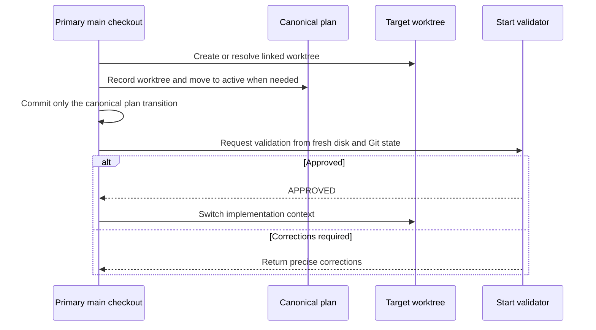

# Associate Active Plans with Their Worktrees

## Summary

Home can show a repository's active plans and its checkout/worktree rows, but it cannot say which
plan belongs to which worktree. Add an optional, portable worktree identifier to plan frontmatter,
carry the same identifier through Runtime's Git context, join the two at repository-overview
composition time, and render a matched active plan beneath its worktree. Active plans with no safe
match remain visible in **Additional Plans**.

The start workflow must establish this relationship in the canonical plan document before an
implementation session enters the worktree. This plan does not begin until the repository-first
Home work on `codex/portal-repository-home-and-detail` has merged into `main`; implementation starts
from that updated `main`, not from the existing in-flight worktree.

## Goals

- Give a plan a portable, optional identifier for one current linked Git worktree.
- Make `plan-start` record and validate that identifier before implementation begins in the
  worktree.
- Associate active plans with Runtime worktree rows by exact identifier, never by branch or
  absolute-path heuristics.
- Preserve every unassociated or ambiguous active plan in an Additional Plans section, shown
  whenever the repository has active plans.
- Keep repository-wide Active and Backlog counts unchanged by presentation grouping.
- Backfill only associations that can be proved from live Git worktree state.

## Non-goals

- Storing absolute worktree paths or treating branch names as worktree identity.
- Requiring every active plan to have a worktree. Planning, blocked work, and manually managed work
  may legitimately remain unassociated.
- Building the machine-local execution registry, session orchestration, `feature_branch` metadata,
  or expanded lifecycle owned by [[plan-lifecycle-suite-workflow-navigation]].
- Replacing Runtime's opaque `rootId`; it continues to identify a checkout path for Runtime and
  repository-registry purposes.
- Changing repository lifecycle counts or showing completed plans as a fallback when no additional
  active plan remains.
- Adding Plan-domain behavior to the shared Runtime checkout-row component.

## Current State

Repository claims were checked against `main` at `a19032d` and against the committed
repository-first Home branch at `0ada45e`, then re-verified on `main` at `388d8cf` after that branch
merged. This section records the state before implementation; see **Implementation Status** for
what changed.

### Plan documents and start workflow

- `modules/plan-docs/index.mjs` already parses arbitrary scalar frontmatter, but
  `buildPlanRecord()` exposes only the current schema fields. A `worktree` scalar would parse and
  then disappear from the public plan record.
- `globals/packages/plan-docs/skills/plan-docs/SKILL.md`, `references/plan-schema.md`,
  `references/workflow-create.md`, and the repair scaffold enumerate the current frontmatter
  contract without a worktree field.
- `globals/packages/plan-docs/skills/plan-docs/references/workflow-start.md` moves a plan to
  `active/` and immediately begins work; it has no worktree-metadata or commit gate.
- `globals/packages/plan-start/skills/plan-start/SKILL.md` creates or reuses a worktree, records its
  path/branch/base/starting commit, and keeps the primary checkout authoritative for plan updates.
  It does not commit a canonical start transition or validate that plan metadata identifies the
  selected worktree before switching execution context.
- Plan discovery deliberately skips linked worktrees, so the plan under the primary checkout is
  the canonical copy visible to Plans.

### Runtime and repository overview

- `modules/repositories/identity.mjs#resolveGitDir()` resolves a checkout's per-worktree `gitDir`,
  shared `commonDir`, and `isWorktree` flag. For a linked worktree, the final `gitDir` segment is
  Git's repository-local administrative worktree name.
- `modules/developer-runtime/git.mjs#collectGitContext()` currently publishes `isWorktree` and
  branch/health facts but not that worktree name.
- On the Home branch, `scripts/cli/repository-overview-sources.mjs` projects Runtime checkouts and a
  compact plan summary. Active plan records include title, key, timestamps, and task counts, but no
  worktree identity.
- `scripts/cli/repository-overview-projections.mjs` composes the Runtime and Plans envelopes by
  repository only; it does not join plans to individual checkouts.

### Home presentation

- On the Home branch, `portal/home/domains.js` creates one standalone **Plans** domain row when
  Active plus Backlog counts are nonzero. It renders all active plans from
  `domains.plans.data.active`.
- `portal/home/templates.js` renders checkout rows through the shared
  `buildRootSection()` component. Home can decorate the returned row without making the shared
  Runtime component depend on Plans.
- `portal/home/index.html` already owns the real `<template>` for plan items. The section label is
  passed from `domains.js`; there is no Plans heading in `index.html` to rename.
- Home does not currently fall back to recently completed plans. The `recent` projection exists,
  but the Home renderer does not consume it.
- Unavailable Plans data and zero counts currently hide the Plans row. This plan initially changed
  that behavior so Additional Plans always rendered; decision 17 restored hiding for unavailable
  data and zero active plans.

### Live migration inventory

The current `git worktree list --porcelain` inventory proves one association relevant to the
existing active plans:

| Plan | Current evidence | Migration behavior |
| --- | --- | --- |
| `jqi1dof` — repository-first Home | Linked worktree and branch `codex/portal-repository-home-and-detail`; Git administrative worktree name `portal-repository-home-and-detail` | Backfill only if the plan is still active and the worktree still exists when migration runs |
| `qk4mz7t2` — clean-machine install sandbox | No matching live linked worktree | Leave `worktree` empty/absent; do not infer one from historical branches |
| `wk7p4n2` — this plan | No implementation worktree yet | Let the implementation start/backfill workflow record the worktree once the new contract exists |

Re-read the live inventory at migration time. This table records reviewed state, not a permanent
claim that a worktree still exists.

## Dependencies and Scope Boundaries

### Merge-before-start gate

Plan [[jqi1dof]] and branch `codex/portal-repository-home-and-detail` are a hard prerequisite. Do
not implement any phase of this plan in that in-flight worktree. After its repository-first Home
changes have merged, update `main`, confirm that `scripts/cli/repository-overview-sources.mjs`,
`scripts/cli/repository-overview-projections.mjs`, the Home modules, and their tests are present on
`main`, then create or resolve a new worktree for this plan from that updated base.

Do not use commit ancestry alone as proof of the merge because a squash merge may preserve the
changes without preserving branch commits. Verify the merged source and tests on `main`.

### Relationship to the lifecycle expansion

[[plan-lifecycle-suite-workflow-navigation]] proposes a larger execution model with a portable
`worktree_id`, feature-branch metadata, a machine-local registry, session launching, and new
lifecycle states. This plan delivers only the narrow relationship Home and the current
`plan-start` workflow need now. The later lifecycle plan must consume or deliberately migrate this
field rather than creating a second simultaneous plan-to-worktree association.

## Proposed Design

### 1. Define one exact, portable worktree identity

Add an optional scalar `worktree` to plan frontmatter. Its value is the repository-local Git
administrative worktree name:

```text
basename(resolveGitDir(checkout).gitDir)
```

Use it only when `resolveGitDir()` reports `isWorktree: true`. For the Home prerequisite worktree,
the value is `portal-repository-home-and-detail`. The value is local to one repository, contains no
absolute path, and is independent of the checked-out branch. Main checkouts have no worktree name
and cannot receive a plan association through this field.

An absent or empty `worktree` means unassociated. New-plan and missing-frontmatter scaffolds include
an empty `worktree:` line, but existing historical plans are not bulk-migrated. `worktree` is not a
universal readiness requirement: an active plan can remain valid without it.

Extend the existing Git identity utility and `collectGitContext()` so Runtime roots carry the same
`worktreeName` value. Test ordinary clones, linked worktrees, and unavailable Git state at the
identity collector rather than reconstructing names in repository-overview code.

### 2. Make start a validated canonical transition

`plan-start` remains the orchestrator for worktree creation/reuse. Plan Docs continues to own the
lifecycle mutation. Coordinate them in this order:



1. Resolve the primary checkout, configured base branch, and target worktree while execution is
   still in the primary checkout.
2. Require the primary checkout to be on `main` and free of unrelated changes. A dirty primary
   checkout is not eligible for an automated start-transition commit.
3. Resolve the target's Git administrative worktree name and write it to the canonical plan.
4. If the plan is in `backlog/`, perform the existing Plan Docs start move to `active/`; if already
   active, update the canonical file in place.
5. Re-read Git status, stage only the old/new canonical plan paths, and commit the plan-only start
   transition on `main`. Do not push.
6. Run the start validator against fresh disk and Git state.
7. Enter the implementation worktree only after the validator returns `APPROVED`.

The validator gets at most three correction passes. It reports precise corrections and refuses the
context switch unless all of these are true:

- the canonical plan is in `active/`;
- `worktree` is nonempty and equals the resolved target's Git administrative worktree name;
- the canonical plan transition is committed on `main`;
- that commit contains only the expected plan metadata/lifecycle path change;
- the primary checkout has no remaining plan-transition diff;
- execution has not already switched into the implementation worktree.

Add `references/start-validation.md` under `plan-start` for this contract. Update the Plan Docs
start reference as well as `plan-start/SKILL.md`, so lifecycle ownership and orchestration do not
contradict each other. Preserve `plan-start`'s boundary against arbitrary lifecycle changes: this
is the one explicit Plan Docs-owned start transition, not general permission to move plans.

### 3. Join plans to worktrees in the repository view model

Carry `plan.worktree` into each compact active plan record and `git.worktreeName` into each Runtime
checkout projection. Associate only active plans and linked worktrees within the same canonical
repository.

The join contract is deliberately lossless:

- exactly one plan plus exactly one linked worktree with the same nonempty name attaches that plan
  to the checkout as `checkout.plan`;
- unmatched plans, plans with an empty name, and plans naming a missing worktree remain in
  `plans.additionalActive`;
- if multiple active plans claim one name, attach none of them and keep all in Additional Plans;
- if multiple Runtime worktrees expose one name, attach no plan to either and keep the plan in
  Additional Plans;
- main checkouts never match;
- unavailable Plans data leaves every checkout unchanged;
- `plans.counts` continues to count all repository plans, including active plans attached to
  worktrees;
- the existing `recent` projection remains unchanged and is not used as an Additional Plans
  fallback.

The browser payload contains only the worktree name, not a new absolute path. Existing checkout
path handling is unchanged by this plan.

### 4. Render associated plans without inverting ownership

Keep plan-item construction in `portal/home/domains.js` and export/reuse one renderer for both
associated and additional plan rows. In `portal/home/templates.js`, decorate the Home checkout
section returned by `buildRootSection()` with a Home-owned subordinate plan row when
`checkout.plan` exists. Add any required multi-element markup as a real `<template>` in
`portal/home/index.html`; do not construct it as nested DOM builder calls or add Plan knowledge to
`portal/developer-runtime/repository-root-row.js`.

The subordinate row opens the same read-only plan drawer as an Additional Plans row and is not
duplicated below.

Render **Additional Plans** while the repository has at least one active plan (revised from
"always render" by decision 17):

- `available`: show repository-wide `Active · Backlog` counts and only
  `plans.additionalActive` rows;
- `partial`: show the available counts/rows plus the envelope's incomplete-coverage message;
- `unavailable`, or zero active plans: omit the section;
- zero additional rows: keep the heading, counts, and all-plans link visible without an empty-state
  placeholder or completed-plan fallback.

### 5. Backfill only proved live associations

After schema, Runtime identity, and start-workflow support land, enumerate live worktrees again.
For each active plan, record `worktree` only when repository state and the plan's implementation
context prove the relationship. At minimum, re-evaluate `jqi1dof`, `qk4mz7t2`, and this plan.
Leave absent values alone when no live match exists; never manufacture an association from a branch
name or historical plan prose.

## Implementation Sequence

### Phase 0 — Confirm the prerequisite merge

- [x] Confirm [[jqi1dof]] and the intended `codex/portal-repository-home-and-detail` changes are on
      updated `main`, including repository-overview sources/projections, Home modules, and tests.
- [x] Start this plan from updated `main` in a new implementation worktree; do not reuse the
      prerequisite worktree.
- [x] Update `reviewed_commit` to the integrated `main` commit reviewed before implementation.

### Phase 1 — Plan schema and Runtime identity

- [x] Add optional `worktree` semantics to
      `globals/packages/plan-docs/skills/plan-docs/references/plan-schema.md`, the creation gates in
      `globals/packages/plan-docs/skills/plan-docs/SKILL.md`, and
      `references/workflow-create.md`.
- [x] Add an empty `worktree:` line to new/missing-frontmatter scaffolds in
      `modules/plan-docs/repair.mjs` without requiring historical plans to be rewritten.
- [x] Expose `worktree` from `modules/plan-docs/index.mjs#buildPlanRecord()` and cover populated,
      empty, and absent values in `scripts/test/plan-docs-check.mjs` and repair coverage.
- [x] Extend `modules/repositories/identity.mjs#resolveGitDir()` and
      `modules/developer-runtime/git.mjs#collectGitContext()` with the Git administrative worktree
      name, including ordinary-clone and linked-worktree tests in
      `scripts/test/developer-runtime-git-check.mjs`.

### Phase 2 — Start transition and validator

- [x] Update `globals/packages/plan-docs/skills/plan-docs/references/workflow-start.md` with its
      lifecycle-owned portion of the transition.
- [x] Rewrite the relevant `plan-start/SKILL.md` steps so metadata, lifecycle movement, explicit
      plan-only staging/commit, and validator approval happen before the context switch.
- [x] Add `globals/packages/plan-start/skills/plan-start/references/start-validation.md` with the
      three-pass validator contract and failure behavior.
- [x] Extend `scripts/test/plan-promote-plan-start-check.mjs` to preserve reference loading,
      ordering, metadata, commit, and validator requirements.

### Phase 3 — Repository association

- [x] Carry plan `worktree` and Runtime `worktreeName` through
      `scripts/cli/repository-overview-sources.mjs`.
- [x] Add the exact, lossless association in
      `scripts/cli/repository-overview-projections.mjs`, producing `checkout.plan` and
      `plans.additionalActive` without changing lifecycle counts.
- [x] Extend `scripts/test/repository-overview-check.mjs` for exact matches, main checkouts,
      missing names, missing worktrees, duplicate plan claims, duplicate Runtime names, and
      unavailable/partial Plans envelopes.

### Phase 4 — Home presentation

- [x] Reuse/export the plan-item renderer in `portal/home/domains.js` and change the standalone
      label to **Additional Plans**.
- [x] Update `portal/home/templates.js` to mount an associated plan beneath its Home worktree row
      without changing the shared Runtime checkout component.
- [x] Add any associated-plan wrapper template to `portal/home/index.html` and style the subordinate
      row in `portal/home/styles.css`.
- [x] Render Additional Plans for available, partial, unavailable, and zero-additional-plan states;
      retain repository-wide counts and never duplicate or substitute a completed plan.
- [x] Extend `scripts/test/portal-ui/portal-ui.spec.mjs` for association, plan-drawer behavior,
      non-duplication, unmatched/conflicting plans, coverage messages, and the empty Additional
      Plans state using semantic locators.

### Phase 5 — Migration, documentation, and verification

- [x] Re-read live worktrees and backfill only proved active-plan associations, including this
      plan's implementation worktree; leave the clean-machine plan unassociated unless new evidence
      exists.
- [x] Update `docs/user/reference/plans-portal.md` and the relevant Home/Runtime user documentation
      with the portable identity, association, and Additional Plans behavior.
- [x] Run focused Plan Docs, plan-start, Runtime Git, repository-overview, and Portal UI checks.
- [x] Run `npm run check` because the change crosses plan schema, shared Runtime data, repository
      aggregation, generated skill validation, and browser behavior.
- [x] Validate this plan against Plan Docs schema, lifecycle, naming, relationships, and the
      technical-writing/code/test rules.

- [x] Decide whether `684a136` stands as this plan's start transition; see decision 12.
- [x] Review and merge `claude/plan-worktree-home-association` into `main`.

## Validation

Run the repository-native checks after their corresponding phase, then the full parity gate:

```text
node scripts/test/plan-docs-check.mjs
node scripts/test/plan-docs-repair-check.mjs
node scripts/test/plan-promote-plan-start-check.mjs
node scripts/test/developer-runtime-git-check.mjs
node scripts/test/repository-overview-check.mjs
npm run test:portal-ui
npm run check
```

In addition to automated checks, inspect the Home payload and browser rendering for one matched
worktree, one unassociated active plan, one conflicting association, and unavailable Plans data.
Confirm no associated plan is duplicated and no new absolute path is introduced by the association
fields.

## Acceptance Criteria

- The prerequisite repository-first Home changes are present on `main` before implementation
  begins, and this plan runs in a new worktree based on that updated `main`.
- Plan records preserve an optional Git administrative worktree name without storing an absolute
  path or using a branch as identity.
- Runtime exposes the same exact name for linked worktrees and no worktree name for the main
  checkout.
- New/repaired plan scaffolds include `worktree:`, while absent values in historical plans remain
  valid.
- `plan-start` cannot enter the implementation worktree until the canonical active plan identifies
  it, a plan-only transition commit exists on `main`, and the bounded validator approves fresh
  state.
- A unique active-plan/worktree match renders beneath that worktree and nowhere in Additional
  Plans.
- Missing, stale, or ambiguous associations leave every affected active plan visible in Additional
  Plans and never attach one arbitrarily.
- Additional Plans remains visible for zero rows and for partial Plans coverage while the
  repository has active plans, with repository-wide lifecycle counts retained. It is omitted when
  there are no active plans or Plans data is unavailable (decision 17).
- Worktrees without plans and active plans without worktrees remain valid and render normally.
- Focused checks, Portal UI coverage, and `npm run check` pass, or any environmental block is
  recorded without claiming completion.

## Implementation Status

Implemented on branch `claude/plan-worktree-home-association`, started from `main` at `388d8cf`
after [[jqi1dof]] merged. The branch merged into `main` as `14b1ed6` (PR #23) on 2026-10-02, and
every task and decision in this plan is closed.

| Phase | State |
| --- | --- |
| 0 — Prerequisite merge | Done. `jqi1dof` is in `completed/`; overview sources/projections, Home modules, and their tests are on `main`. |
| 1 — Schema and Runtime identity | Done. Plan records expose `worktree`; scaffolds emit `worktree:`; `resolveGitDir()` and `collectGitContext()` report `worktreeName`. |
| 2 — Start transition and validator | Done. `plan-start/SKILL.md` gains a Start Transition section; `references/start-validation.md` holds the validator; Plan Docs `workflow-start.md` owns the lifecycle half. |
| 3 — Repository association | Done. `associatePlans()` in `repository-overview-projections.mjs` produces `checkout.plan` and `plans.additionalActive`. |
| 4 — Home presentation | Done. Additional Plans renders while active plans exist (decision 17); an associated plan mounts beneath its worktree through a Home-owned template. |
| 5 — Migration, docs, verification | Done. Backfill value on `main` since `684a136` (not a plan-only commit; accepted exception, see decision 12). Docs updated. Verification below. |

### Migration result

Live inventory re-read during implementation:

| Plan | Result |
| --- | --- |
| `wk7p4n2` — this plan | `worktree: plan-worktree-home-association`, proved by the linked worktree created for this implementation. |
| `qk4mz7t2` — clean-machine install sandbox | No live linked worktree relates to it; left unassociated. |
| `jqi1dof` — repository-first Home | Now `completed`, so it is not joined; not backfilled even though its worktree still exists. |

### Decision log

Decisions made during implementation without stopping, recorded for review:

1. **Field placement.** `worktree:` is the last scaffold line, after `reviewed_commit`.
2. **Value normalization.** The plan record trims a string value and reports `""` for absent,
   empty, or non-string values. No validation finding flags path-like values; exact-equality
   joining already makes a malformed value an unmatched Additional Plan.
3. **Main checkouts.** The overview projection sets `worktreeName` to null whenever
   `isWorktree` is false, even if Git data carried a name, so a main checkout can never match.
4. **Payload shape.** The full active list stays server-side: the Plans envelope carries `counts`,
   `recent`, and `additionalActive`, and each attached plan travels only as `checkout.plan`. Each
   active plan therefore reaches the browser exactly once, so no view can render one in two places.
   (Initially `plans.active` was kept beside `additionalActive`; review found no reader, and the user
   chose to remove it.) Only the Runtime checkout projection carries `plan`; the Git domain
   projection does not.
5. **Missing domains.** Runtime unavailable puts every active plan in Additional Plans; Plans
   unavailable leaves every checkout unchanged.
6. **Which worktrees can match.** Only checkouts Runtime currently lists can receive a plan. A
   stopped worktree of a running repository is not a Runtime root today, so its plan appears in
   Additional Plans. Widening Runtime's root set is out of scope.
7. **Coverage messages.** The envelope message renders as a note above any rows (new
   `tpl-domain-note`); the unavailable state shows no counts.
8. **Subordinate row semantics.** `tpl-checkout-plan` is a `group` named "Plan in this worktree",
   using the plans glyph indented to the checkout's text column (decision 17).
9. **Fresh-worktree fast-forward.** The start transition fast-forwards a worktree created in the
   same run to the transition commit, so the feature branch carries the canonical plan state. A
   reused worktree's branch is left alone.
10. **Validator form.** The validator is an agent-run checklist of Git commands in
    `references/start-validation.md`, not a new `roborepo` command. A deterministic command is a
    possible follow-up if the prose gate proves unreliable.
11. **No feature commits.** Implementation is left uncommitted on the feature branch; this session
    had no instruction to commit.
12. **Backfill not committed by this session.** This session wrote the `worktree` value to the
    canonical copy on `main` and mirrored it to the feature branch without committing, because
    committing was not requested. The value then reached `main` in `684a136`, a user commit that
    also changed `case-study-pack/skills/case-study/SKILL.md`. The association is therefore
    committed, but not as a plan-only transition: validator check 4 would refuse that commit. This
    session began before the start transition existed, so its own start never passed the validator.
    Accepted at completion: `684a136` stands as this plan's start transition. Its `worktree` value is
    correct and has been on `main` since that commit, and the only alternative was rewriting
    published history.
13. **Empty value in the payload.** A plan with no `worktree` carries `""` in the Home payload, the
    same representation as the plan record, rather than converting it to `null` in between.
14. **Privacy wording corrected.** `docs/user/reference/repositories.md` and
    `docs/internal/portal-architecture.md` claimed the Home payload never contains absolute checkout
    paths. The Home plan's actual rule is narrower: identity fields and URLs are path-free, while each
    checkout's path is sent for its tooltip and copy control. Both docs now say that, and the user
    reference also lists the promoted application's Runtime key, which Home uses for route discovery.
15. **Footer slot on the shared checkout row.** At review, Home's plan row repeated the shared row's
    padding and offset. At the user's request, `buildRootSection()` now takes a generic `footer`
    node rendered in a `.repository-root-footer` that owns the glyph-rail grid; Home's plan row spans
    it as a subgrid. The component still knows nothing about Plans.
16. **Loopback Host check (outside this plan's scope, done at the user's request).** Tokenless
    portal reads could in principle be read by a DNS-rebound page. Every request must now name a
    loopback host (`127.0.0.1`, `localhost`, `[::1]`) or carry no `Host` header; others get a 403.
    Covered by two `test-cli.sh` assertions and documented in `docs/internal/portal-architecture.md`.
17. **Home presentation revisions (user request after review).** Three changes supersede parts of
    section 4 above. The worktree plan row is indented so its glyph aligns with the worktree's
    branch text instead of sitting on the glyph rail; it occupies the footer's text column rather
    than spanning it as a subgrid. Additional Plans is omitted when the repository has no active
    plans or Plans data is unavailable, including "Plans has not scanned this repository"; a
    partial-coverage note is therefore shown only alongside active plans. The **all plans** and
    **all activity** links use body ink with an underline instead of the browser's default link
    colors.

### Verification

Run in the implementation worktree on 2026-10-02:

| Check | Result |
| --- | --- |
| `node scripts/test/plan-docs-check.mjs` | passed |
| `node scripts/test/plan-docs-repair-check.mjs` | passed |
| `node scripts/test/plan-promote-plan-start-check.mjs` | passed |
| `node scripts/test/developer-runtime-git-check.mjs` | passed |
| `node scripts/test/repositories-check.mjs` | passed |
| `node scripts/test/repository-overview-check.mjs` | passed |
| `npm run test:portal-ui` | 34 passed, 2 documentation-screenshot specs skipped by design |
| `npm run check` | `CI checks passed`, including the Docker clean-machine suites; Windows installer parity skipped because `pwsh` is not installed |
| `npm run check` on merge commit `942bbf6`, before merging to `main` (2026-10-02) | `CI checks passed`; 422 roborepo tests passed, 0 failed; Windows installer parity skipped because `pwsh` is not installed |

Manual: a hermetic portal rendered Home with one matched worktree, one unmatched worktree, and one
Additional Plan; the matched plan appeared once, beneath its worktree, on the checkout glyph rail.
The Home payload for an association carries only the worktree name; no new path field was added.

Plan Docs validation of this document through `buildPlanSnapshot()` reported `active`, `ready`,
`worktree: plan-worktree-home-association`, and no findings before completion. After the move to
`completed/` it reports `completed`, `ready`, 26 of 26 tasks, and no findings. The
`technical-writing` Validator was not run as a separate pass on the added sections.

## Risks and Open Decisions

- The worktree name is machine-local and disappears when Git removes the linked worktree. This is
  expected: a stale value becomes an unmatched Additional Plan, never a guessed association.
- Git may disambiguate two worktrees with similar directory names by giving their administrative
  directories different names. Both producers must therefore use `resolveGitDir().gitDir`, not a
  checkout-directory basename.
- No material product decision remains open. The later lifecycle expansion still owns whether and
  how to migrate this narrow `worktree` field into its broader execution registry.
