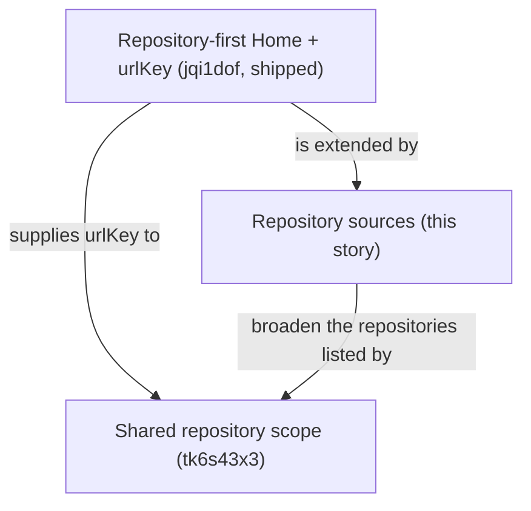
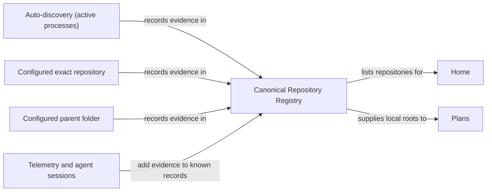
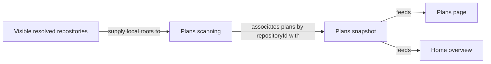

# Repository Sources: Auto-Discovery and Folders

## Summary

Make the canonical repository registry the one place that decides which repositories RoboRepo knows about, and give users one global surface to control how repositories are found.

Repositories become known through repository sources:

- **Auto-discovery of active repos** (primary): RoboRepo watches running dev processes and remembers the repositories they run in. It is an explicit, one-click opt-in and the primary call to action.
- **Folders** (secondary): the user adds an exact repository or a parent folder to discover repositories in.

The coherent user story: *I let RoboRepo find the repositories I work in, optionally point it at more, and every repository then looks and behaves the same regardless of how it was found.* RoboRepo inspects nothing on the machine — no process observation, no folder walks — until the user takes an explicit action that asks for it.

Plans stops owning its own repository universe and inspects the repositories RoboRepo knows about. Choosing which repository a Portal page shows is a separate story, [[tk6s43x3]].

This is a **clean cutover**: existing registry data and Plans discovery settings are discarded rather than migrated (see [§4](#4-source-provenance-and-removal) and [§9](#9-plans-cutover-to-canonical-repositories)).

## Completion Summary

Repository sources, auto-discovery, folder sources, the shared management dialog, Home/Runtime/Plans
onboarding, canonical plan scans, path privacy, and their regression coverage landed on `main` in
squash merge `8aef67f3d670edc5214151c80db8b97d97c6afe9`. Windows folder-source verification is
deliberately deferred to [[l1mz96d9]], which owns the Windows test environment and cross-platform
behavior matrix.

## Relationship to other stories



[[jqi1dof]] has shipped. It delivered Home at `/`, the stable browser `urlKey`, the `/api/home` overview with per-repository Plans coverage, and a reserved Home action slot for **Manage repositories**. This story is **additive to Home**: repositories found through a new source appear on Home automatically because Home already reads the canonical registry.

[[tk6s43x3]] adds the shared `?repository=<urlKey>` filter across Plans, Tokens, and Agents. The two stories ship in either order. Whichever lands second wires the selector's **Manage repositories…** item to this story's dialog.

## Goals

- Ask before observing: auto-discovery of active repos is off until the user enables it, and enabling it is the primary call to action wherever no repositories are known.
- Let users add one exact repository or a parent folder of repositories as a secondary action from a global repository-management surface.
- Present one repository list: users never need to remember which repository was found by auto-discovery and which by a folder.
- Make all repository discovery converge on one canonical registry — no per-domain repository universe.
- Move repository-source configuration out of Plans; retire Plans `discoveryRoots`.
- Make known local repositories automatically eligible for plan discovery without a separate Plans enrollment step.
- Keep repository identity payloads path-free; only the protected source-management surface may read/display configured source paths.

## Non-goals

- The shared repository filter, its selector, and scoped navigation ([[tk6s43x3]]).
- Building Home or the repository detail route ([[jqi1dof]]), or un-parking detail.
- Building the private local-root index or Runtime discovery persistence ([[h4tqm2wz]] shipped both).
- Migrating existing registry contents or Plans `discoveryRoots` (clean cutover).
- Making every discovery source user-configurable.
- Reworking canonical Git identity, alias resolution, or cross-domain `repositoryId` joins ([[canonical-repository-identity-plan-v2]]).

## Core concept model

| Concept | Meaning | Source of truth |
| --- | --- | --- |
| Canonical repository | One logical repository known to RoboRepo | Registry `repositoryId` |
| Repository source | A way RoboRepo is allowed to find repositories: the built-in **auto-discovery** source (active processes), or a user-added exact repo or parent folder | New server-only repository-sources store |
| Auto-discovery | Runtime observing running dev processes and registering the repositories they run in; one switch covers both | Built-in source's `enabled` flag |
| Repository discovery | A configured source creates/updates a canonical repository; telemetry and future agent activity only add evidence to a record a source already created | Registry record `discoveries` |
| Canonical identity/resolution | Resolving many discovery mechanisms to one repository | `modules/repositories/identity.mjs` |
| Local root | One checkout/worktree path for a canonical repository | Private `rootId -> path` index (`registry.localRootPaths`) |

### One canonical repository universe

There must be no Runtime universe, Plans universe, or manually-configured universe — everything converges on the registry.



### Auto-discovery is primary and opt-in

Auto-discovery is the main way repositories become known: start working in a repository and it appears. It is one switch — off means Runtime observes no processes and registers nothing; on means Runtime observes running processes and remembers the repositories they run in. There is no "observe but don't remember" state. [[h4tqm2wz]] already persists a Runtime-discovered repository and its checkout root beyond the process lifetime.

Auto-discovery and folder sources must not create separate records for the same repository — canonical identity/resolution deduplicates them.

### Repository recognition rule

A repository recognized through either auto-discovery or a folder source becomes globally known. When RoboRepo has a valid local root for it, Plans inspects that repository for `docs/plans` without a separate "Include plans" action. Discovering a repository through a folder registers it even with no plan documents; plan files never create a second repository identity.

## Current State

Verified against `585dedb`.

**Already shipped — depend on it, do not rebuild:**

| Capability | Where |
| --- | --- |
| Canonical registry: discovery provenance, opaque local-root IDs, visibility, resolution, activity, aliases, `pinned`, enrollments; atomic `updateRegistry` read-mutate-write with revision bump | `modules/repositories/registry.mjs`, `schema.mjs` |
| Canonical `repositoryId`, normalized remote, alias resolution | [[canonical-repository-identity-plan-v2]] |
| Private `rootId -> absolute path` index, Runtime persisting checkout roots, `deriveLifecycle`, `lastSeenAtFor`, 30-day `ageOutCandidates` | [[h4tqm2wz]]; `registry.localRootPaths`, `modules/repositories/lifecycle.mjs` |
| `/api/home` overview with a per-repository Plans envelope that reports "Plans has not scanned this repository" instead of an authoritative zero | `scripts/cli/repository-overview*.mjs` |
| Reserved Home slot for **Manage repositories** | `.home-action-slot` in `portal/home/index.html` |
| Global ignore: Home and Runtime repository menus offer **Hide**, which sets registry `visibility: hidden` via `POST /api/developer-runtime/repository-visibility`; `PATCH /api/repositories/:id` sets the same field | `portal/home/templates.js`, `portal/developer-runtime/templates.js`, `scripts/cli/developer-runtime.mjs` |
| Bounded repository walk: depth 6, 5 s time budget (`DISCOVERY_TIME_BUDGET_MS` override for tests), 250-repository cap, realpath symlink-cycle guard, `DEFAULT_IGNORED` directory list, dot-directories skipped, stops at a folder containing `.git` or `docs/plans`, reports `errors` and `truncated` | `discoverRepositories` in `modules/plan-suite/index.mjs` |

**Registry constraints that shape this story:**

- The schema is strict: `validateObjectKeys` rejects unknown keys and `loadRegistry` throws on an unknown version.
- `loadRegistry` replaces any registry with a lower `version` by a fresh empty one — no migration, no backup.
- `recordDiscovery` keeps one `discoveries` entry per source kind (`DISCOVERY_SOURCES`, which already includes `manual`), so two configured sources cannot both be recorded on one repository today.

**Gaps this story fills:**

- Auto-discovery has no switch and asks no permission: `loadDeveloperRuntimeSnapshot` (`scripts/cli/developer-runtime.mjs`) schedules a process scan whenever Home or Runtime loads and the snapshot is older than 8 s (`FRESHNESS_MS`), and that scan registers repositories. Home's empty state (`emptyState` in `portal/home/templates.js`) says "Start a local project, then open Runtime".
- There is no global repository-source model; sources cannot be user-configured outside Plans.
- Plans owns the repository universe: `readPlanSettings` reads `discoveryRoots` and `ignoredDirectories` from `<stateRoot>/plan-suite/settings.json`, falling back to `ROBOREPO_PLAN_ROOTS`. `POST /api/plans/settings` (`updatePlanSettings` in `scripts/cli/plans.mjs`) writes them, and the Project Folders panel (`portal/plans/panels.js`), opened from the Plans header's `N Repos` count, edits them.
- `/api/plans` returns the snapshot's `settings` (absolute `discoveryRoots`) and `errors` (absolute `root` paths) to the browser; `publicSnapshot` strips repository roots but not these.
- `enrollRepositoryInPlans()` (`scripts/cli/repositories.mjs`) and `POST /api/repositories/:id/plans-enrollment` add an exact path to Plans discovery roots. No browser code calls the route; only `scripts/cli/telemetry.mjs` wiring and the `repositories-service`/`repositories-api` checks reference it.
- Both the global ignore and Runtime's per-project/app/Compose `hidden` setting are labeled **Hide**.

**Path exposure today:** identity payloads (`repositorySummary`, `repositoryListPayload`, `repositoryDetailPayload`) are path-free. By [[jqi1dof]]'s design, Home's local workspace projection carries each checkout's `projectRoot` for tooltips and copy controls. `/api/plans` exposes discovery-root paths as described above.

**Other evidence producers:** telemetry capture records `source: "telemetry"` evidence only when
its canonical `repository_id` already resolves to a registry record created by auto-discovery or a
folder source. Agent sessions never create repository records. Token data remains available on the
Tokens page before a source finds the repository; the existing sessions attach on the next
repository-list reconciliation after the record appears. Home's `unresolvedActivity` is Runtime
activity only and does not surface unmatched telemetry as a repository.

## Proposed Design

### 1. Repository sources

Introduce server-owned repository-source settings in the repository domain (not Plan Docs). There is one built-in source and any number of user-added ones:

| Source kind | Example | Behavior | Default |
| --- | --- | --- | --- |
| `auto-discovery` (built-in, exactly one) | Active processes | Runtime observes running dev processes and registers the repositories they run in | Off |
| `repository` | `<projects>/client-a/app` | Register only that repository | Added by the user |
| `directory` | `<projects>/personal` | Discover eligible repositories beneath that directory with bounded traversal | Added by the user |

**Decision — auto-discovery is a source, default off.** Modeling it as the built-in source gives users one mental model: turning auto-discovery off behaves exactly like removing a folder (§4). Defaulting it to off means RoboRepo asks before observing anything; the cost is one click, and that click is the primary call to action (§7). Changing the default later is a one-value change.

For user-added sources, the UI may infer the kind only for a path it can read and classify confidently. A missing/unreadable path is `unresolved` at entry; do not auto-classify it. Require the user to choose the intent for an unresolved path, persist that intent, and honor it unchanged on later refreshes — a path becoming readable later must not broaden discovery beyond what the user configured.

**Decision — sources live in their own server-only store, separate from the registry.** A source is user intent; the registry is discovered state. Store source records (stable opaque source ID, kind, path for user-added sources, enabled flag, last refresh status) in a dedicated settings file beside the registry under `<stateRoot>`. The path never crosses the browser boundary except through the protected management surface (§6).

### 2. Bounded folder traversal (move, don't reinvent)

Move `discoverRepositories` and its `DEFAULT_IGNORED` list out of `modules/plan-suite/index.mjs` into the repository domain and keep its existing limits and reporting (see Current State). Directory sources and `roborepo plans repair <root>` (`modules/plan-suite/repair.mjs`) both consume the moved walker; Plans no longer calls it for its own universe.

Keep the existing eligibility rule — a folder containing `.git` or `docs/plans` is a repository root and traversal stops there — so a directory source finds the same repositories the Plans scan finds today. One ignore list moves with the walker; no Plans-only list remains.

### 3. Canonical identity and deduplication

Configured sources resolve into the same canonical identity used everywhere. The same repository discovered through auto-discovery, a `~/projects` parent source, and an exact `~/projects/foo` source must still be **one** canonical repository. Never use a filesystem path alone as public repository identity.

Overlapping sources must not duplicate repositories: `~/projects` and `~/projects/foo` may both be configured, and `foo` still resolves to one canonical repository.

### 4. Source provenance and removal

Keep enough provenance to explain *why* RoboRepo knows about a repository:

```text
foo
Found by: auto-discovery, ~/projects
```

**Decision — per-source provenance lives on the registry record, and the registry goes to v3 with a reset.** Add a configured-source discovery kind whose entries carry the source ID, and key `recordDiscovery` by source kind plus source ID so one repository can hold an entry per configured source. Bump `REGISTRY_VERSION` to 3. The existing lower-version reset in `loadRegistry` discards v2 registries, including pins, hidden state, and allocated `urlKey`s; this loss is accepted for the cutover.

Removal semantics:

1. Removing or disabling a source deletes that source's discovery entries from every record. Turning auto-discovery off is the same operation applied to its `developer-runtime` entries, and also stops Runtime's process scans.
2. A repository that still has other evidence (for example a folder source) stays known and unchanged.
3. A repository left with no evidence is not hard-deleted; the existing `ageOutCandidates` sweep ([[h4tqm2wz]]) marks it stale/aged-out.

Home's **Forget This Repo** (`forgetRepository`, a hard delete) is offered only for a repository with no known checkout. A source-discovered repository always has a local root, so Forget and source refresh do not compete.

### 5. Source errors and missing paths

Source management must gracefully handle: missing path, moved folder, inaccessible folder, repository no longer present, permission failure, traversal timeout or repository-cap truncation, malformed configuration, duplicate source, and overlapping sources. Represent per-source state (`healthy`/`unavailable`/`partial`/`stale`/`error`). One failed source must not invalidate the whole registry.

### 6. Filesystem path privacy (deliberate boundary)

Path rules for the repository surfaces this story touches (Runtime's own payloads are out of scope):

| Surface | Paths allowed |
| --- | --- |
| Identity payloads (`repositorySummary`, list/detail payloads) | Never |
| Home local workspace projection (`projectRoot` per checkout, for tooltip/copy) | Yes — unchanged from [[jqi1dof]] |
| Source-management routes | Yes — configured source paths only |
| `/api/plans` | No, once Plans stops returning `settings` and absolute error roots (§9) |

**Decision — source settings follow the existing path/browser-safe discipline.** The registry already keeps paths in the private `localRootPaths` index while summary payloads whitelist fields. Source settings do the same: paths stay in the sources store and reach the browser only through the management routes; everything else references a source by its opaque ID or a display label. Verifying that ordinary payloads stay path-free is an explicit test step (§Validation).

### 7. Repository management and first-run experience

**Manage repositories…** opens one global management surface — not a Plans-specific panel.

**Decision — a shared dialog, not a new page.** It is opened from Home's `.home-action-slot`, from the Plans header, and from [[tk6s43x3]]'s selector, so it lives in `portal/shared/` and adds no entry to `PAGES` (whose five-entry manifest is pinned by `portal-pages-check`).

The dialog, top to bottom:

| Order | Element | Visual weight |
| --- | --- | --- |
| 1 | Auto-discovery. When off: the **Enable auto-discovery of active repos** button and one sentence on what it observes. When on: a status line (`On · 4 repos found`) and a Turn off control | Primary |
| 2 | Repositories — one list of every known repository, however it was found | Main content |
| 3 | **Add a folder to find more repos** (exact repository or parent folder), then added folders with their status (§5) and repository counts | Secondary |

The repository list never asks the user to track how a repository was found:

- every row offers the same actions (pin, **Ignore repository**) whatever found it;
- provenance is a quiet `Found by:` detail on the row (§4), there to explain, never something to act on;
- ignored repositories sit in a collapsed **Ignored** group with Restore, using the existing `PATCH /api/repositories/:id` visibility mutation.

Folder rows support remove/disable, report unreadable/stale/truncated scans, and offer refresh.

Enabling auto-discovery is the consent step for process observation and starts the first scan immediately. Adding a folder is its own consent, because the user supplied the path. The same hierarchy applies wherever repositories are introduced:

| State | Home | Runtime |
| --- | --- | --- |
| Auto-discovery off, nothing known | Empty state: primary **Enable auto-discovery of active repos**; secondary **Add a folder** link | Same primary button; no process scan runs |
| Auto-discovery on, nothing found yet | "Start a dev server in any repository and it appears here"; secondary **Add a folder** link | Normal, empty |
| Repositories known, auto-discovery off | Directory, with a compact **Enable auto-discovery of active repos** prompt above it | Same primary button; no process scan runs |
| Repositories known, auto-discovery on | Directory; **Manage repositories** in `.home-action-slot` | Normal |

Runtime's process scans run only while auto-discovery is on. When it is off, `loadDeveloperRuntimeSnapshot` schedules no scan.

#### Plans page onboarding

Today Plans runs its own repository onboarding. While the plan-write package is disabled, the package banner is the only call to action. Once it is enabled and no folders are configured, a "No Project Folders configured" banner holds the "Look for all /docs/plans folders in:" form. After folders exist, the header's pencil toggle reopens that form with folder chips. `portal/plans/app.js` chooses between these steps from `snapshot.settings.discoveryRoots`.

After the cutover, Plans keeps its own feature gate and borrows repository onboarding from Home. One call to action is visible at a time:

| Step | Condition | Plans shows |
| --- | --- | --- |
| 1 | plan-write package disabled | Package banner — unchanged |
| 2 | plan-write enabled, no known repositories | The same repository empty state as Home, from one shared template: primary **Enable auto-discovery of active repos**, secondary **Add a folder** (opens the management dialog at its add-folder form) |
| 3 | Repositories known, none scanned yet | "Scanning N repositories for plans…", never "0 plans" |
| 4 | Repositories scanned, no plans found | "No plans found in N repositories", with **Manage repositories…** |
| 5 | Plans found | Plan groups; header "Monitoring N Plans in M Repos", and the count opens **Manage repositories…** |

Unlike Home, Plans does not show the compact auto-discovery prompt in steps 3–5; a page about plans does not nag about discovery once it has repositories.

What happens to the current pieces:

| Today | After |
| --- | --- |
| "No Project Folders configured" banner and inline folder form | Replaced by step 2's shared empty state |
| Header pencil toggle and folder chips | The header count opens the management dialog; added folders are listed there |
| "Look for all /docs/plans folders in:" | **Add a folder to find more repos** — plans inside found repositories are picked up automatically |
| "How folder scanning works" info dialog | Moves next to the dialog's add-folder form; its content stays accurate because the walker and eligibility rule are unchanged (§2) |

### 8. Global ignore vs Runtime hide

Registry `visibility: hidden` is the global "Ignore repository" action, already reachable from Home and Runtime as **Hide**. A globally ignored repository is omitted from the Home directory and normal Plans entries; it stays in the registry, can be restored from the management dialog, and is not un-hidden by later auto-discovery.

Relabel the repository-level action **Ignore repository** in Home and Runtime menus. Runtime's per-project/app/Compose `hidden` setting stays an operational display preference labeled **Hide from Runtime**.

### 9. Plans cutover to canonical repositories

Plans stops owning the repository universe. The behavior changes from *Plans asks which folders to search* to *Plans discovers plans inside repositories RoboRepo knows about.*

Plans keeps: plan discovery within a repository, plan parsing, lifecycle/status, Plans-specific filters. Plans loses: which repositories constitute the user's universe.

**Decision — clean cutover, no settings migration.** Remove `discoveryRoots`, `ignoredDirectories`, `ROBOREPO_PLAN_ROOTS`, `readPlanSettings`/`writePlanSettings`, `POST /api/plans/settings`, and the Project Folders panel in the same change that switches Plans to canonical repositories. The Plans header's repository count opens **Manage repositories…** instead. Users re-add folders there. Test fixtures and `scripts/dev/docs-screenshots.mjs` seed repository sources instead of Plans settings.

After the cutover, Plans scans the canonical set:



For every visible, resolved repository with a valid local root, Plans inspects every checkout — the main checkout and each worktree — and associates records by canonical `repositoryId`. A repository without `docs/plans` is valid and contributes zero plans.

**Decision — read every checkout; the main checkout's copy is canonical.** Copies of a plan in different checkouts are matched by plan `id`. Only the plan's own worktree (its `worktree` field) is compared with the main copy by content hash; other worktrees mostly hold older copies of main and never mark a plan. The main checkout is the one `mainCheckoutPath` resolves from Git's common directory, not the registry's first-registered (`primary`) root, which can be a worktree.

| Plan exists in | Plans page shows | Edits (priority, lifecycle) write to | Divergence warning |
| --- | --- | --- | --- |
| Main checkout only | Main copy | Main checkout | None |
| Main and the plan's worktree, identical | One record | Main checkout | None |
| Main and the plan's worktree, different | Main copy, marked "differs in worktree `<name>`" | Main checkout | Yes, on that plan |
| Main and any other worktree | One record | Main checkout | None |
| Worktree only (for example, created during implementation) | Worktree copy, labeled with the worktree name | That worktree | None |

The divergence warning is a finding on the affected plan, not a page-level banner, so a repository with active implementation shows one marker per diverging plan instead of global noise. Editing the main copy matches `plan-start` and `plan-close`, which make lifecycle changes on the base branch. The snapshot carries per-repository scan state so the Plans page and Home's existing coverage envelope read the same truth: a repository not yet scanned is reported as such, never as zero plans.

## Server and API changes

Extend the existing repository service/API rather than creating parallel state:

| Capability | Route/function |
| --- | --- |
| List/add/remove/disable sources; enable/disable auto-discovery; refresh discovery | New source-management routes under `/api/repositories/` |
| Ignore/restore repositories | Existing `PATCH /api/repositories/:id` |
| Retire | `POST /api/repositories/:id/plans-enrollment`, `POST /api/plans/settings` |

New mutation routes use the existing loopback-origin + token guard in `portal-server.mjs`.

## Code Touchpoints

Keep new modules focused by responsibility: a sources store (persistence and validation), the moved traversal walker (execution), and source refresh orchestration in `scripts/cli/repositories.mjs`, which sequences the walker, identity resolution, and registry writes.

### Repository domain

- `modules/repositories/schema.mjs` — v3: configured-source discovery kind with source ID.
- `modules/repositories/registry.mjs` — `recordDiscovery` keyed by kind plus source ID; source-removal helper.
- `modules/repositories/enrollment.mjs` — retire `plansSourceCoverage`/`planPlansEnrollment`.
- `modules/repositories/summary.mjs` — path-free source/root status for browser payloads.
- `modules/repositories/index.mjs` — export the new source and traversal APIs.
- New: sources store; traversal walker moved from `modules/plan-suite/index.mjs`.

### Repository service and routes

- `scripts/cli/repositories.mjs` — source refresh orchestration; retire `enrollRepositoryInPlans()`; keep it dependency-injectable.
- `scripts/cli/portal-routes-repositories.mjs` — source-management routes; retire `/plans-enrollment`.
- `scripts/cli/telemetry.mjs` — handler wiring for the new routes; drop `enrollRepositoryInPlans` and `updatePlanSettings`.
- `scripts/cli/portal-server.mjs` — preserve mutation guards.

### Plans

- `modules/plan-suite/index.mjs` — remove settings and the walker; build snapshots from canonical repositories with per-repository scan state.
- `modules/plan-suite/repair.mjs` — consume the moved walker.
- `scripts/cli/plans.mjs`, `scripts/cli/portal-routes-plans.mjs` — drop `settings` and absolute error roots from `/api/plans`; remove `/api/plans/settings`.
- `scripts/cli/repository-overview-sources.mjs` — read the snapshot's per-repository scan state in `plansByRepository`.
- `portal/plans/panels.js` — remove `createRootsPanel`; move `createInfoModal`'s scanning explainer to the shared dialog.
- `portal/plans/index.html` — remove the `#settings` banner, `#root-form`, `#roots-toggle`, and `#info-modal`; render the shared repository empty state.
- `portal/plans/app.js` — choose the §7 Plans onboarding step from the plan-write package state, known repositories, and per-repository scan state instead of `snapshot.settings.discoveryRoots`; point the header count at the management dialog.

### Home and Runtime

- `portal/home/index.html`, `portal/home/app.js` — wire `.home-action-slot` to the management dialog; render the auto-discovery prompt.
- `portal/home/templates.js` (`emptyState`, `tpl-home-empty`) — empty states from §7.
- `portal/home/templates.js`, `portal/developer-runtime/templates.js`, `portal/developer-runtime/index.html` — **Ignore repository** vs **Hide from Runtime** labels.
- `scripts/cli/developer-runtime.mjs` — schedule process scans only while auto-discovery is on.
- `portal/developer-runtime/app.js`, `portal/developer-runtime/index.html` — off-state call to action.

### Shared portal

- New shared ESM module for the management dialog, with markup in real HTML `<template>` elements.
- New shared repository empty-state template used by Home and Plans, so their onboarding copy and actions cannot drift.

### Tests, fixtures, and docs

- `scripts/test/plan-suite-check.mjs`, `plan-suite-commands-check.mjs`, `repositories-service-check.mjs`, `repositories-api-check.mjs`, `scripts/test/portal-ui/portal-ui.spec.mjs` (`setPlanRoots`) — seed repository sources instead of Plans settings.
- Test fixtures and portal-ui specs that rely on Runtime discovering repositories implicitly — enable the auto-discovery source in their setup, since it now defaults to off.
- `scripts/dev/docs-screenshots.mjs` — replace `ROBOREPO_PLAN_ROOTS`; enable auto-discovery.
- `docs/user/reference/repositories.md` — replace "No repository setup is required" with the opt-in and folder flow; restore of ignored repositories moves to the management dialog.
- `docs/user/reference/runtime.md` — process observation runs only while auto-discovery is on.
- `docs/user/reference/plans-portal.md` — replace the discovery-root sections with repository sources.
- `docs/internal/portal-architecture.md` — route table.

## Implementation Plan

### Phase 1 — Registry v3 and sources store

- [x] Bump `REGISTRY_VERSION` to 3 with a configured-source discovery kind carrying a source ID; key `recordDiscovery` by kind plus source ID.
- [x] Add the server-only sources store: the built-in `auto-discovery` source (default off), stable source IDs, explicit `repository`/`directory` kinds, enabled flag, per-source status; require a chosen intent for unresolved paths.
- [x] Gate Runtime process scans on the auto-discovery source.

### Phase 2 — Source discovery engine

- [x] Move `discoverRepositories` and `DEFAULT_IGNORED` into the repository domain; point `repair.mjs` at it.
- [x] Resolve exact repositories and walk directory sources; deduplicate against canonical identity, including overlapping sources.
- [x] Write repositories, local roots (`localRootPaths`), and per-source discovery entries; record errors, timeouts, and truncation as source status.
- [x] Implement source removal per §4.
- [x] Add a concurrent-refresh regression test: Runtime discovery and source refresh updating the same repository.

### Phase 3 — Source management APIs

- [x] List/add/remove/disable sources; enable/disable auto-discovery; refresh.
- [x] Keep path-bearing data in the management routes only (§6); reuse the mutation guard.

### Phase 4 — Management UX

- [x] Build the **Manage repositories…** dialog in the §7 order: auto-discovery block (primary), one repository list with `Found by:` details and an Ignored group, then **Add a folder to find more repos** (secondary) with folder status, remove/disable, and refresh.
- [x] Open it from Home's `.home-action-slot`.
- [x] Implement the Home and Runtime states from §7, with **Enable auto-discovery of active repos** as the primary action whenever auto-discovery is off.
- [x] Relabel **Ignore repository** vs **Hide from Runtime**.

### Phase 5 — Plans cutover

- [x] Build Plans snapshots from every checkout of visible repositories with valid local roots, with per-repository scan state; update `plansByRepository`.
- [x] Merge copies by plan `id` per §9: main copy canonical, per-plan divergence finding, worktree-only plans labeled and edited in their worktree.
- [x] Remove `discoveryRoots`, `ignoredDirectories`, `ROBOREPO_PLAN_ROOTS`, `/api/plans/settings`, and the Project Folders panel; stop returning `settings` and absolute error roots from `/api/plans`.
- [x] Implement the §7 Plans onboarding steps with the shared repository empty state; point the header count at the management dialog; move the scanning explainer into the dialog.
- [x] Retire `enrollRepositoryInPlans()`, `/plans-enrollment`, and `plansSourceCoverage`/`planPlansEnrollment`.
- [x] Reseed test fixtures and `docs-screenshots.mjs` through repository sources.

### Phase 6 — Docs

- [x] Update `docs/user/reference/plans-portal.md`, `docs/user/reference/repositories.md`, `docs/user/reference/runtime.md`, and `docs/internal/portal-architecture.md`.
- [x] Verify no identity payload or `/api/plans` response contains an absolute path.

Adjust sequencing if implementation inspection identifies a stronger order.

Implemented on `claude/portal-repository-sources` in the order above. Where the code landed:

| Piece | Location |
| --- | --- |
| Registry v3, per-source discovery entries, `removeDiscoveries` | `modules/repositories/schema.mjs`, `registry.mjs` |
| Sources store (schema, persistence, mutators) | `modules/repositories/sources-schema.mjs`, `sources.mjs` |
| Bounded walk and source-path classification | `modules/repositories/discovery-walk.mjs` |
| Source refresh orchestration, execution units, management payload | `scripts/cli/repository-sources.mjs`, `repository-source-refresh.mjs`, `repository-sources-payload.mjs` |
| Runtime gate | `scripts/cli/developer-runtime.mjs` |
| Plans scan of known repositories and their checkouts | `modules/plan-suite/canonical-scan.mjs`, `checkouts.mjs` |
| Manage repositories dialog, shared empty state, auto-discovery prompt | `portal/shared/repository-sources-partial.html`, `repository-sources-dialog.js`, `repository-sources-templates.js`, `repository-sources-api.js`, `repository-sources.css` |

## Validation

Use focused checks while iterating, then the exhaustive unit run and the CI gate. `npm run check`'s `ci` group does not include the repository, Plans, or overview checks, so `npm run test:unit` must run separately.

```text
npm run test:unit -- --filter repositories
npm run test:unit -- --filter plan-suite
npm run test:unit -- --filter repository-overview
npm run test:unit -- --filter developer-runtime
npm run test:unit -- --filter portal-pages
npm run test:portal-ui
npm run test:unit
npm run check
```

Latest completion-level verification (2026-10-05):

- `npm run test:unit` — 124/124 suites passed.
- `npm run test:portal-ui` — 51 passed, with the two opt-in documentation screenshot cases skipped.
- `npm run check` — passed, including doctor, CLI, collision, package-install, clean-machine, and browser gates.
- `git diff --check` — passed.
- `roborepo plans validate` — zero blocking findings; the Home refresh behavior is now user-confirmed. Windows folder verification is deferred to [[l1mz96d9]].

## Verification

- `npm run --silent test:unit -- --filter repositories` — 7/7 repository and source checks passed.
- `npm run test:portal-ui` — 52 passed; 2 documentation screenshot cases were intentionally skipped.
- `npm run check` — stopped before plan-relevant checks because the current checkout has stale
  generated Plan Promote commands and a stale skill-invocation audit document; these are unrelated
  to this plan's implementation and are not release or publication requirements for closing it.
- `roborepo plans validate` — zero findings before the lifecycle move.
- The squash landing check compared `main` with `claude/portal-repository-sources`: the only
  differences are plan/config synchronization files; the implementation files changed by the
  worktree are present with matching content on `main`.
- The user confirmed the Home refresh behavior manually; the remaining Windows check is explicitly
  deferred to [[l1mz96d9]].

Add focused coverage for observable behavior:

- a v2 registry loads as an empty v3 registry;
- with auto-discovery off (the default), loading Home or Runtime runs no process scan and registers nothing; enabling it starts a scan; disabling it stops scans and removes its discovery entries;
- a repository found by both auto-discovery and a folder appears once, with identical actions and both sources in `Found by`;
- source add/remove/refresh, bounded-traversal limits, and overlapping sources yielding one repository;
- source removal leaving a repository known through other evidence intact, and an evidence-less repository aged out rather than deleted;
- missing/inaccessible/moved source paths producing per-source state without failing other sources;
- concurrent Runtime discovery + source refresh updating the same repository;
- a Runtime-discovered repository remaining usable for Plans after its process goes offline;
- plan discovery for a known repository without enrollment, with explicit "not scanned" state before first scan;
- each §9 checkout case: identical copies collapse to one record; a differing worktree copy marks the main copy and edits still write to the main checkout; a worktree-only plan is labeled and edited in its worktree; the main checkout is found through Git even when a worktree was registered first;
- `discoveryRoots` settings and `ROBOREPO_PLAN_ROOTS` no longer affecting Plans;
- global ignore/restore surviving Runtime rediscovery; Runtime-only hide remaining distinct;
- no absolute paths in identity payloads or `/api/plans`; source paths only on management routes;
- agent sessions never creating a repository record, but adding telemetry evidence after
  auto-discovery or a folder creates the matching record, including repositories without a Git remote.

Cover the §7 first-run states on Home and Runtime (Enable as the primary action, Add a folder as secondary), each Plans onboarding step with one call to action visible at a time, and the management dialog in the Playwright suite (`scripts/test/portal-ui/`).

## Decision Log

Decisions made during implementation (plan-start), each with the alternatives considered.

| Decision | Alternatives | Why |
| --- | --- | --- |
| Source orchestration lives in a new `scripts/cli/repository-sources.mjs`, with execution units in `repository-source-refresh.mjs` and the dialog payload in `repository-sources-payload.mjs`. | Grow `scripts/cli/repositories.mjs` as the Code Touchpoints listed. | `repositories.mjs` was already near the file-size cap; the split keeps orchestration and execution apart (code-style). `repositories.mjs` keeps discovery recording and the browser-safe bridge. |
| The sources store is `<stateRoot>/repositories/sources.json`, version 1. A malformed or unknown-version file is renamed to `sources.json.invalid-<timestamp>` and sources reset to defaults, with a `loadError` the dialog shows. | Throw on load; silently overwrite. | Throwing would take Home, Runtime, and Plans down with one bad file (§5); silent overwrite loses the user's intent without a trace. |
| Source status adds `pending` ("Not scanned yet") to the five states §5 named. | Report a never-refreshed source as `healthy` or `stale`. | Either would claim a refresh that never ran. |
| Folders refresh on add, on enable, and on explicit Refresh only. | A periodic walk; a walk on every Plans refresh. | A broad folder costs up to 5 s per walk; nothing in the plan asked for background walks. |
| A partial walk (time or repository cap, or unreadable subfolders) and an unavailable source only add evidence; they never remove it. | Treat every refresh as complete. | An incomplete walk is not evidence a repository left. Caught while validating the docs: unreadable subfolders initially dropped evidence. |
| With auto-discovery off, the Runtime refresh still reads Git for checkouts the registry already knows (folder-found repositories), but observes no process or container, synthesizes no portal instance, and registers nothing. The switch is re-read just before recording, so a scan in flight when the user turns it off records nothing. | Skip the refresh entirely while off. | Runtime would otherwise show nothing for folder-found repositories. The re-check closes a race found in the browser: an in-flight scan restored evidence that turning off had just removed. |
| Plans includes `local:` (unresolved) repositories with recorded checkouts; one whose checkouts are all unreadable is `unavailable`. | Plans reads `resolution: resolved` repositories only, as §9's wording suggested. | `resolution` only distinguishes Git-remote from local repositories. Excluding local ones would drop plans-only folders Plans has always read. |
| Checkouts come from Git's administrative files (`<commonDir>/worktrees/*/gitdir`) unioned with registered roots. A second independent clone is treated like a worktree and labeled with its directory name. | `git worktree list` per repository; registered roots only. | No subprocess per repository per scan; registered roots alone miss worktrees nothing has observed. |
| Only the first checkout and plans found in no other checkout get full plan records; every other copy is matched from its frontmatter `id` and a content hash. | Build a full record for every copy. | Measured on this repository (11 checkouts, about 120 plans each): full records everywhere took 29.6 s on the first scan, blocking the portal and timing out `docs-screenshots.mjs`; the light pass takes 3.3 s, the same order as scanning the main checkout alone. |
| Every checkout's plan records share `repository.id = stableKey(repositoryId)`, and relationship findings key on it. | Keep the per-root id. | Per-root ids made a worktree-only plan a separate repository for grouping, filtering, and dependency resolution. |
| Plans onboarding step 3 reads `Not scanned yet: N repositories` instead of `Scanning N repositories for plans…`. | The plan's copy. | The snapshot is built synchronously, so the only unscanned case is a repository with no readable checkout; "Scanning…" would never resolve. |
| Runtime's repository menu keeps its existing local hide, relabeled **Hide from Runtime**, and gains **Ignore repository**. | Turn the existing item into the registry ignore. | Current State said the Runtime menu's Hide set registry visibility; it actually hid the repository's members in Runtime settings only. Keeping both matches §8 without removing working behavior. |
| The dialog's Pin, Ignore, and Restore call the existing `POST /api/developer-runtime/repository-pinned` and `repository-visibility` routes. | `PATCH /api/repositories/:id`. | Same mutation Home already uses, and it refreshes Runtime's cached snapshot; the portal client has no PATCH helper. |
| Source mutations are POST routes (`/api/repositories/sources`, `/sources/refresh`, `/sources/:sourceId/enabled`, `/sources/:sourceId/remove`) that answer errors as `{ error: { code, message } }`. | REST verbs. | `portalPostJson` is the portal's mutation helper and keeps `err.code` only for structured bodies; the dialog branches on `INTENT_REQUIRED`. |
| **Manage repositories** shows in Home's action slot whenever repositories are known, in both auto-discovery states. | Only while auto-discovery is on, as §7's table lists. | Folders must stay reachable while auto-discovery is off and repositories are known. |
| `/api/home`, `/api/plans`, and the Runtime snapshot carry `autoDiscovery: { enabled }`. | Each page fetches the management route. | The management route carries source paths; pages that only need the flag should not receive them (§6). |
| The Plans cached snapshot is rebuilt after every source change and after auto-discovery's first scan. Repositories that later Runtime scans register show as "not scanned" on Home until the next Plans refresh. | Rebuild Plans on every Runtime refresh. | A Plans scan of every checkout on each 8-second Runtime poll is disproportionate; "not scanned" is the honest interim state §9 asks for. |
| `/api/plans` scan errors carry the repository name, checkout label, repository-relative path, and an error code, not filesystem error messages. | Pass messages through. | Filesystem messages embed absolute paths (§6). |
| **User decision:** only the plan's own worktree (its `worktree` field) can mark a plan as differing from the main copy; every other worktree is ignored for that check. | A. any content difference in any worktree marks the plan (§9 as first written); B. mark copies a worktree changed since its merge base; C. mark copies newer than main's. | Raised as an open question: under A, worktrees that were only behind main marked 26 of this repository's 120 plans, with 151 markers in total. Main and the plan's worktree are where a plan changes; with this rule the repository shows 3 markers, each on a plan in its own worktree. |
| **User decision:** agent sessions add telemetry evidence only to repository records auto-discovery or a folder already created; they never create Home entries. | Keep telemetry as an independent repository source; hide telemetry-only records only in Home; defer to a follow-up plan. | The opt-in repository-source model should define the Home and Plans universe. Tokens reads session data directly, so unmatched usage remains visible and attaches once a source creates the same canonical record. Local repositories match because capture and folder refresh both derive `local:` IDs from the checkout realpath. |
| The documented folder-walk time budget is 5 s. | Keep the previous "~2.5 s" text. | The code has always used 5000 ms. |
| Windows folder-source verification is deferred to [[l1mz96d9]]. | Confirm it in this story without a Windows environment. | This repository has no Windows environment; the follow-up establishes a Windows CI environment and a complete cross-platform behavior matrix instead of treating the unsupported check as a permanent manual requirement here. |

## Open Questions

None.

## Not tested

- [x] Turning on auto-discovery from Home's empty state on a clean install lists the first scan's repositories within the next Home refresh request after the enable action—normally the 10-second poll, although the source dialog may force an immediate refresh. Confirmed by the user; the Playwright spec mocks the request, because a real scan observes the host machine's processes.

## Risks

| Risk | Mitigation |
| --- | --- |
| The v3 reset discards pins, hidden state, and `urlKey`s; bookmarked `/repositories/<urlKey>` URLs may resolve differently | Accepted for the cutover; `urlKey` allocation is deterministic from display name, so most keys recur |
| Users lose configured Project Folders | Accepted; re-add through **Manage repositories…** |
| Opt-in adds a first-run step before RoboRepo shows anything | Enable is the primary action on every empty surface and starts a scan immediately; flipping the default is a one-value change |
| A broad parent folder hits the 5 s budget or 250-repository cap | Report `partial` source state; never present a truncated scan as complete |

## Acceptance Criteria

- RoboRepo observes no processes and walks no folders until the user enables auto-discovery or adds a folder.
- **Enable auto-discovery of active repos** is the primary action on Home, Runtime, and the management dialog whenever auto-discovery is off; adding a folder is always secondary.
- Repositories found by auto-discovery and by folders share one canonical registry and appear in one list with identical actions; how a repository was found is shown only as a `Found by:` detail.
- Users can globally add an exact repository and a parent repository folder.
- Directory discovery is bounded; overlapping sources do not create duplicate canonical repositories.
- Source removal does not delete repositories still known through other evidence.
- Missing/inaccessible sources fail gracefully with per-source state.
- Plans no longer owns repository-universe settings; `discoveryRoots`, `ROBOREPO_PLAN_ROOTS`, and the Project Folders panel are gone.
- Plans consumes canonical repositories and exposes explicit per-repository scan state before a repository is scanned.
- Plans reads every checkout, shows one record per plan with the main checkout's copy canonical, and marks only the plans whose own worktree's copy differs.
- Plans keeps its plan-write gate, then shows the same repository empty state as Home when no repositories are known; it has no folder form of its own.
- Home automatically benefits from newly discovered/configured repositories; its only changes are the §7 empty states and the auto-discovery prompt.
- Telemetry and agent activity never add a repository to Home or Plans on their own; existing session evidence attaches after auto-discovery or a folder finds the repository.
- Source configuration is managed globally through one management dialog.
- Identity payloads and `/api/plans` carry no absolute paths; configured source paths appear only on source-management routes.
- `npm run test:unit`, `npm run test:portal-ui`, and `npm run check` pass.
