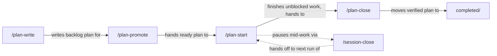

# Plan Suite Walkthrough

## Purpose

The plan suite keeps repository plans in Markdown and gives each step of a plan's life its own
slash command. The Plans page gives you one local place to browse those plans across repositories
and copy the command a plan needs next.

Use it when you want to:

- find active, backlog, completed, archived, or unclassified plans across local repositories
- write a plan, prepare it, implement it in an isolated worktree, and close it when the work lands
- keep Markdown files as the source of truth instead of moving plans into a database

## What You Get

| Piece | Always available? | What it does |
| --- | --- | --- |
| Plans page | Yes | Local `/plans` portal view for discovering, filtering, rendering, and copying plan context |
| Plan suite | Optional packages | Five slash commands, one per lifecycle step |

| Command | What you get |
| --- | --- |
| `/plan-write` | Create a plan, or revise an existing one, including bringing it up to date with the repository |
| `/plan-promote` | Review and prepare a plan for development |
| `/plan-start` | Implement a plan in an isolated worktree until no unblocked work remains |
| `/plan-close` | Verify finished work and move the plan to `completed/` or `archived/` |
| `/session-close` | End a chat: review and commit the session's work, write the handoff note |

No command takes a mode argument. Each one does one thing, so typing `/plan-` lists every step.

## Typical Workflow



1. Run `roborepo web`, open `/plans`, and add a discovery root.
2. Enable the plan suite from the Plans page banner.
3. Run `/plan-write` to create a backlog plan.
4. Run `/plan-promote` on it to check it against the repository and resolve open decisions.
5. Run `/plan-start` to implement it in its own worktree.
6. If you stop mid-work, run `/session-close`; the handoff note tells the next chat where to resume.
7. When the work has merged, run `/plan-close`.

## Enable The Plan Suite

The Plans page shows an onboarding banner until the suite is enabled. Its button enables all five
commands at once, and each command in the list has a **Details** button that shows that command's
skill. The Agents page lists the same five under **Plan Suite**, with a toggle for the whole
section.

From the CLI, enable each package:

```sh
roborepo package enable plan-write
roborepo package enable plan-promote
roborepo package enable plan-start
roborepo package enable plan-close
roborepo package enable session-close
```

## `/plan-write`

Creates a plan, or updates an existing one. The request decides which:

| Request | Work |
| --- | --- |
| No plan owns the work yet | Creates a backlog plan in `docs/plans/backlog/`, with a fresh opaque `id` and a namespaced filename |
| An existing plan, to change scope or design | **Revises** it, following your intent |
| An existing plan, after work happened | **Syncs** it from evidence: ticks a task only when the code proves it done, records untested gaps, and updates `next_action` and `reviewed_commit` |

`/plan-write` never moves a plan between lifecycle folders. It validates every plan it writes with
`roborepo plans validate`, and pairs with `technical-writing` for the prose.

## `/plan-promote`

Reviews an existing plan before development: checks its claims against the code, fixes stale
details, and asks you only about decisions with real tradeoffs. It stops before implementation and
does not change the plan's lifecycle.

## `/plan-start`

Implements a plan in an isolated linked worktree. It:

1. creates or safely reuses a worktree under the repository's configured `worktreeRoot`;
2. runs `roborepo plans start`, which records the worktree in the plan, moves a backlog plan to
   `active/`, makes one plan-only commit on the base branch, and validates the result;
3. works through every unblocked task without stopping for check-ins;
4. records untested work in the plan's `## Not tested` section as it goes;
5. reports once at the end, with every open question in one batch.

The first run in a repository asks you to confirm where worktrees go. Later runs reuse that answer.
In Claude, each run also asks once for access to the worktree folder, then works inside it, so edits
there do not prompt one file at a time.

## `/plan-close`

Closes one plan, and refuses rather than closing on incomplete evidence. In order, it:

1. runs the repository's test command and stops on a failure;
2. checks every claim in the plan against the code;
3. decides complete, incomplete, blocked, superseded, or abandoned;
4. refuses while any `## Not tested` entry is unchecked;
5. refuses until the work has landed in the base branch;
6. moves a complete plan to `completed/` with a Verification section, or an abandoned or superseded
   one to `archived/` with the reason;
7. after closing a complete plan, stops the dev servers still running in its worktree and lists
   them.

Step 7 stops only processes listening on a port whose working directory is inside the plan's
linked worktree. It never touches the primary checkout, agent sessions, shells, or editors, and it
sends `SIGTERM` only: a server that ignores it is reported, not killed. You can run the same step
yourself with `roborepo plans stop-servers <plan>`; add `--dry-run` to list without stopping.

A merge the command cannot prove from Git ancestry, such as a squash merge, is reported as
`landed: unconfirmed` and refused for now.

## `/session-close`

Ends a chat: reviews the code the session changed, syncs docs and any plan the session touched,
commits the session's work, and writes a handoff note for the next chat. It runs only when you ask.

## Not Tested

A plan can carry a `## Not tested` section: checkboxes for work that exists but that no test
covers.

```markdown
## Not tested

- [ ] The report line renders a per-skill tally. Requires a live session; no test can read agent output.
```

`/plan-start` and `/plan-write` add entries as gaps appear. Only you clear one: confirm it by hand
and check it off, or delete it with the reason in the plan's `## Decision Log`. `/plan-close`
refuses to close a plan while any entry is unchecked.

## Paired Skills

Suite commands load helper skills such as `technical-writing`, `code-style`, and `test-harness`.
Each is its own optional package. When one a command needs is disabled, the command asks whether to
enable it or skip it for that run, and names any skipped skill in its report.

## Open The Plans Page

Start the local portal:

```sh
roborepo web
```

Open:

```text
http://127.0.0.1:4317/plans
```

The page is local-only and uses the same loopback portal server as Config and Telemetry.

## Add Discovery Roots

A discovery root can be either:

- one repository, or
- a directory whose immediate children are repositories

Examples:

```text
~/projects
~/work/client-a
~/src/specific-repo
```

The scanner walks each root up to 6 levels deep and treats the first folder containing `.git` or
`docs/plans` as a repository. Inside each repository it reads:

```text
docs/plans/**/*.md
```

Hidden folders and common build folders (`node_modules`, `dist`, `build`, and similar) are skipped.
See [Discovery](../../../reference/plans-portal.md#discovery) for the exact limits.

Discovery roots are saved under `~/.roborepo/plan-suite/settings.json`. Installs from before the
plan suite saved them under a different folder that is no longer read, so add your roots again.

## Plan File Layout

Plan lifecycle comes from folders:

```text
docs/plans/backlog/
docs/plans/active/
docs/plans/completed/
docs/plans/archived/
```

Files directly under `docs/plans/*.md` still appear, but they are shown as `unclassified`.
The portal does not silently treat them as backlog.

Recommended frontmatter:

```yaml
---
id: stable-plan-id
priority: high
next_action: Implement the next concrete task
blocked_by: []
depends_on: []
related: []
reviewed_commit:
worktree:
---
```

Leave `worktree:` empty. `/plan-start` fills it with the linked worktree's Git administrative name
when implementation begins, which lets Home show the plan as that worktree's row. See
[Worktree association](../../../reference/plans-portal.md#worktree-association).

Use Markdown checkboxes for executable work:

```md
- [ ] Add the parser fixture
- [x] Define the schema
```

Headings and checkboxes inside fenced code blocks are examples, not plan structure.

## Browse And Filter

The Plans page supports:

- search across title, ID, path, next action, blockers, repository name, and warnings
- repository, lifecycle, priority, blocked, readiness, review-state, and health filters
- lifecycle grouping: Active, Backlog, Completed, Archived, Unclassified
- document rendering with metadata, warnings, and task lists

Review state is conservative. `possibly-stale` means the repository changed after the plan's
`reviewed_commit`; it does not prove the plan's specific files are stale.

## Copy Actions

The Plans page copies prompts; it never runs a command and never moves a plan for one. Paste the
prompt into Claude or Codex in that repository, and the command does the work, including any move
between lifecycle folders and the commit that records it.

Each card leads with one command button:

| Plan | Button | Copies |
| --- | --- | --- |
| Backlog | **Start** | `/plan-start` |
| Active, every task checked | **Close** | `/plan-close` |
| Active, never reviewed or possibly stale | **Update** | `/plan-write` |
| Any other active plan | **Continue** | `/plan-start`, which resumes in the plan's worktree |

Each plan's menu lists every command that fits its lifecycle:

| Lifecycle | Actions |
| --- | --- |
| Backlog | **Promote** (`/plan-promote`), **Start** (`/plan-start`) |
| Active | **Continue** (`/plan-start`), **Update** (`/plan-write`), **Close** (`/plan-close`) |

Every menu also copies the plan's path and a portable prompt: a self-contained summary for a chat
without repository access. Without the suite enabled, the menu offers repository-aware and portable
prompts with no command.

The lifecycle dropdown on each plan is a manual override that moves the file without committing.
`/plan-start` refuses to run while that move is uncommitted, so prefer the Start button.

## Current Limits

- The portal edits plan files in only two ways: changing a plan's `priority`, and moving a plan
  between lifecycle folders. All other plan edits happen in your editor or through the suite.
- A move into a lifecycle whose requirements the plan does not meet is rejected with a list of
  what is missing. **Move anyway** files it regardless.
- Manual refresh is the v1 update model.
- No database, daemon, cloud sync, direct editor, or automatic LLM prioritization is included.

See [Plans Portal Reference](../../../reference/plans-portal.md) for exact behavior.
