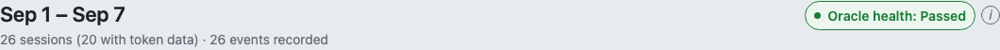
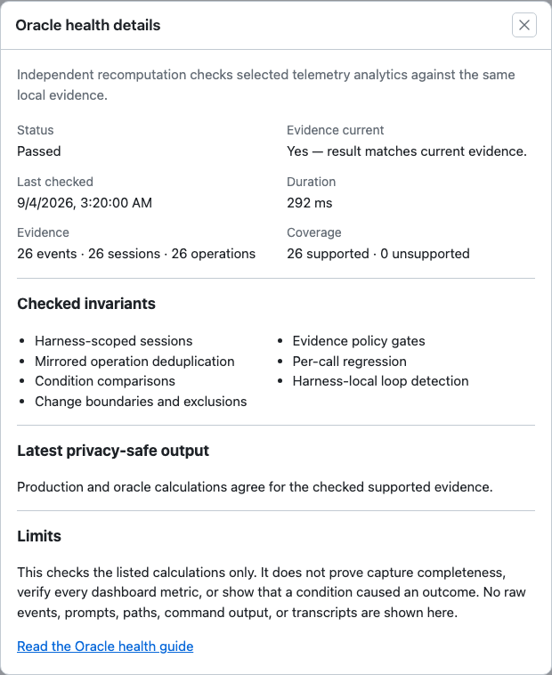

# Tokens page user guide

The **Tokens** page (`/tokens`) helps you investigate token usage, repeated work, and the
conditions observed around problems. Start with an action item, inspect its evidence, and
record a change when you want to compare later sessions.

Screenshots in this guide use fictional sample data. Their numbers illustrate how to read
the page; they are not performance claims about a model, package, or real project.

## Open the Tokens page

Run:

```sh
roborepo web
```

Choose **Tokens** in the portal navigation. With the default port, the page is at
`http://127.0.0.1:4317/tokens`; use the address printed by the command if your port differs.

Telemetry is opt-in and stored locally. If the page asks you to **turn on telemetry**, enable
it and run a session in an installed agent harness. Until live data is available, the page can
show a report labeled **simulated tracking report**. Recording changes requires live telemetry.

## Oracle health

The **Oracle health** badge beside the report period compares selected analytics with an
independent recomputation over the same current local evidence. Open **Oracle health details** for
freshness, duration, aggregate evidence counts, coverage, checked invariants, and the latest
privacy-safe result.





| Status | Meaning |
| --- | --- |
| **Passed** | The production analyzer and independent oracle agree for every supported checked row, and the result matches the current evidence. |
| **Checking** | A comparison is running and no current result is available yet. |
| **Stale** | Evidence changed after the last comparison. The prior result remains visible in the details but is not current. |
| **Partial** | Covered values agree, but some required evidence could not be interpreted independently. |
| **Unavailable** | No complete comparable input could be evaluated, or the isolated comparison could not run. |
| **Failed** | The two implementations disagree on at least one covered field for the current evidence. |

The live oracle checks harness-scoped sessions, mirrored operation deduplication, condition
comparisons, change boundaries and exclusions, evidence gates, per-call regression, and
harness-local loop detection. It does not prove that capture is complete, verify every dashboard
metric, or show that a condition caused an outcome. The badge reports the local runtime comparison;
the deterministic CI oracle remains a separate build-time guardrail.

The details contain only aggregate counts and allowlisted status categories. They do not expose raw
events, prompts, transcripts, file paths, command output, or replayable JSONL. The Tokens report
continues working when oracle health is unavailable.

## Find a problem worth investigating

Read the page from top to bottom:

| Section | What to do |
| --- | --- |
| **Identifiable waste** | Look at flagged token usage for this week and all time. Each turn is counted once, under its largest source, so the sources add up to the total. These are identified patterns, not a complete accounting of every avoidable token. |
| **Action items** | Start with a finding and follow its suggested investigation. |
| **Investigate** | Expand a problem type or **Recent problem sessions** to inspect evidence. Recent sessions start collapsed, combine findings from the same session, and scroll within a bounded list. |
| **Do problems follow a condition?** | Compare problem rates with and without a known condition. |
| **What happened, in order** | Use the event ledger to see when problems and changes were observed. |
| **Your changes** | Record a change and inspect its before/after comparison. |
| **Agent-ready prompt** | Copy the summarized evidence into an agent session for further investigation. |
| **Full data** | Inspect supporting lists, sessions, and data-quality information. |

### Session detail

Recent rows show the repository once, short model and harness chips, and a resource count.
Open **Session details** for resource names, attribution, coverage, and the recommended next step.
The dialog puts that next step first in a labeled fact grid. Where a transcript remains available,
it can also show the heaviest turns. Captured findings remain visible when a transcript is missing.
A resource labeled **configured** or **available** was observed in configuration; that label does not prove it
was used in the session.

### Testing efficiency

Expand **Are you over-testing?** to inspect repeated full-suite runs, targeted-versus-full
activity, and unchanged failure patterns. Use the evidence to decide whether a smaller check
would help the next investigation. These warnings are report-wide, so they do not become a
session-level condition rate or marker comparison.

## Compare conditions

Conditions can include a model, repository, harness, configured package, or available skill.
Full-width category cards show supported deviations under **Cheaper** and **More expensive**,
one row per condition with its percentage, an info icon for the raw counts, and a **Sessions**
button that opens the matching sessions. Two links sit under the columns. **Full outcomes** shows
raw rates, cohort denominators, neutral outcomes, and unknown coverage, including items that have no
supported deviation. **More evidence needed** opens a popup listing comparisons that are too small
for a percentage, with what each still needs. A small sample is never labeled as no difference.
A column with nothing to report shows a dash.


Read a comparison as a rate, not just a count. In this example:

- **With the condition:** 3 affected sessions out of 12, or 25%.
- **Without the condition:** 9 affected sessions out of 12, or 75%.
- **Unknown:** 2 sessions have insufficient condition evidence and belong to neither cohort.

The relative difference is about **67% fewer with the condition**: `(25% − 75%) / 75%`.
It is an observed association. It does not show that the condition caused the difference.


Percent deviations require at least **10 sessions and 3 affected sessions in each cohort**.
Below those floors, use the raw rates and denominators. A missing cohort makes the comparison
unavailable; a zero baseline does not produce an infinite percentage. The cards use a working
±20% display band, which is not a test of statistical significance.

Conditions overlap: a session may belong to a model, repository, and several package or skill
comparisons. Do not add the cards together as if each represented different sessions.

## Use the event ledger

The **What happened, in order** ledger lists observed problems and changes newest first, with event icons, readable
dates, repository scope, and available event details. Open a problem to inspect its session.
Select **Show more** to reveal another 12 rows. Problem rows open session details; marked
changes jump to their comparison under **Your changes**. The scope note describes
which automatic changes are supported and keeps global markers separate from session context.

A configured ambient-package change is shown when a changed resource configuration is first
observed by a session. That timestamp is not the exact edit time. Skills-only and app-version
changes do not produce ambient-change rows. Same-ID file-content edits require the separate
revision-fingerprinting feature.

Timestamp ties may have a stable display order without proving whether an event happened
before or after a recorded change. Boundary comparisons exclude unresolved ties.

## Record a change

In **Your changes**, select **+ Mark a change**:

1. Give the change a short, recognizable title.
2. Choose **I am making this change now** for something you are changing now, or **I made this change earlier**
   to record an earlier change. For an earlier change, set its effective time.
3. Choose all repositories or a specific repository.
4. Select the problem kinds to watch: spikes, loops, or read warnings. Over-testing can be
   selected, but its comparison is currently unavailable because its evidence is report-wide.
5. Optionally attach a related finding, then select **Record change**.


To correct a record, select **Edit change**. The correction supersedes the earlier record while
preserving history.

## Interpret the result of a change


| State | Meaning |
| --- | --- |
| **Recorded** | The change is saved, but no eligible observations are available for its scope yet. |
| **Collecting** | More eligible sessions are needed for the comparison. |
| **Comparison available** | Both before and after cohorts meet the comparison's sample requirement. Read the rates and counts. |
| **Can't compare fairly** | Scope or boundary evidence is insufficient, or the selected finding has no supported comparison unit. |

Sessions that span the boundary and observations with unresolved timestamp ties are excluded
and counted separately. In the example, the affected-session rate rises from **4/13** to
**8/13** after the change. That is a reason to investigate; it is not proof the change caused
more read warnings. “Comparison available” is not a verdict that a change helped.

The **Marked changes** summary links to the full evidence in **Your changes**, avoiding a second
copy of the same rates. The **Your changes** cards show watched event kinds and repository scope
together. Available comparisons show before/after affected-session rates, denominators, ambiguous and spanning counts,
and association-only wording. Collecting and unavailable results explain what evidence is missing.
Equal rates say **No observed change**. Small event counts say **Early signal** and ask for more evidence; larger samples suggest
monitoring an improvement or inspecting a possible regression.

## When a result is missing

| What you see | What it means / what to try |
| --- | --- |
| Simulated report | Enable telemetry and collect live agent sessions. |
| Unknown condition coverage | Telemetry cannot establish presence or absence. More samples cannot repair missing historical evidence, but new captures may have usable snapshots. |
| More evidence needed | Open the popup for the raw rates and what is still missing. Too few sessions or affected sessions prevent a percentage claim. |
| No clear difference | No comparison crosses the display band with sufficient evidence. Focus on stronger signals. |
| Comparison group missing | Collect sessions with and without that condition; unresolved context stays excluded. |
| Partial or unavailable token coverage | Read valid/eligible counts before interpreting averages. Missing usage is not zero usage. |
| Change still collecting | Continue collecting comparable sessions before and after the effective boundary. |

For structured condition evidence in the terminal:

```sh
roborepo telemetry report --conditions
```

## Related guides

- [Daily Use](./setup-and-daily-use.md)
- [Telemetry Service Reference](../reference/telemetry.md) — capture, retention, schemas, and CLI details.
- [Screenshot library](../../images/tokens/README.md) — light/dark assets and regeneration instructions.
