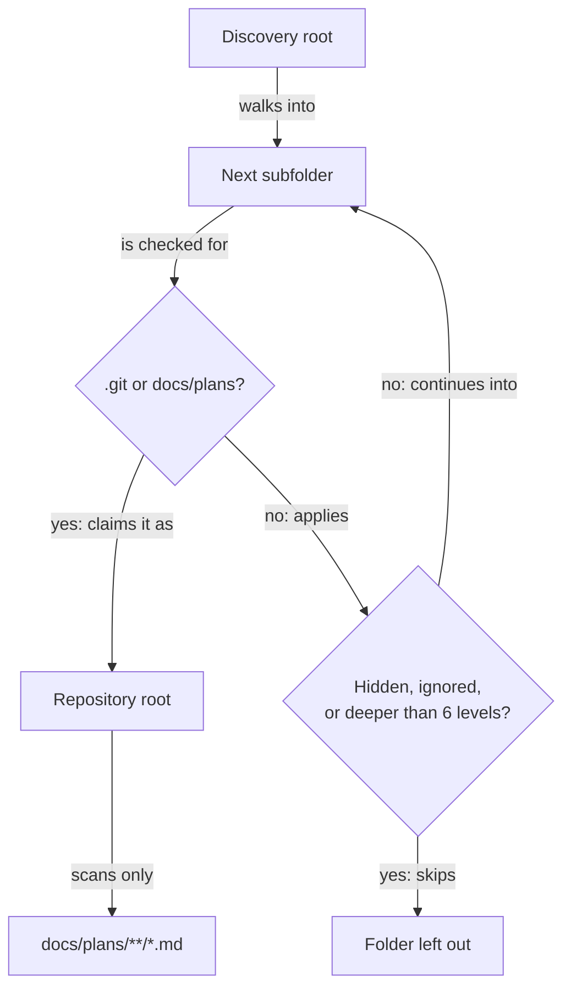

# Plans Portal Reference

## Purpose

The Plans portal is a built-in RoboRepo portal page for local Markdown planning documents. It is
paired with the optional plan suite: five packages that each install one agent-facing command,
`/plan-write`, `/plan-promote`, `/plan-start`, `/plan-close`, and `/session-close`.

## Concept Model

| Noun | Meaning | Source of truth |
| --- | --- | --- |
| Discovery root | Local directory configured by the user | `path.join(stateRoot, "plan-suite", "settings.json")` or `ROBOREPO_PLAN_ROOTS` |
| Repository | The first directory found while walking a discovery root that contains `.git` or `docs/plans` | filesystem |
| Plan | Markdown file under `docs/plans/**/*.md` | repository file |
| Lifecycle | Folder under `docs/plans` | path, not frontmatter |
| Readiness | Deterministic validation result | parser/validator |
| Review state | Relationship between `reviewed_commit` and Git HEAD | Git metadata |

Lifecycle folders:

```text
backlog
active
completed
archived
```

Root-level `docs/plans/*.md` files are reported as `unclassified`.

## What The Portal Writes

The portal changes plan files in two ways only: changing a plan's `priority` rewrites that
frontmatter line, and moving a plan renames the file into another lifecycle folder. Both check that
the file has not changed since the page loaded it. Discovery roots you add are saved to RoboRepo
state, not to any repository.

## Discovery

Resolution order:

1. Saved settings at `path.join(stateRoot, "plan-suite", "settings.json")`. Earlier installs saved
   roots under a different folder that is no longer read; add them again.
2. `ROBOREPO_PLAN_ROOTS`, split by the platform path delimiter.
3. Empty roots.

For each discovery root, the scanner walks down through subfolders until it finds a repository:



A claimed repository's own subfolders are never scanned as repository candidates.

Directories are skipped during the walk (not descended into) if they:

- start with `.` (hidden), or
- match the ignored-directory list: `node_modules`, `.git`, `vendor`, `dist`, `build`, `.cache`,
  `coverage`, `.next`, `.venv`, `__pycache__` by default (`ignoredDirectories` in settings)

Limits:

- maximum document size for rendering/prompt embedding: 1 MiB
- maximum candidate repositories per refresh: 250
- maximum plan files per repository: 500
- maximum traversal depth: 6 levels below the discovery root
- wall-clock time budget per discovery call: ~2.5s, after which the walk stops and the result is
  marked `truncated: true`

Hidden files, editor swap files, backup suffixes, and symlink escapes outside the repository boundary
are skipped. The walk also guards against symlink cycles by tracking each directory's realpath and
never descending into one already visited.

Linked Git worktrees are skipped as repository candidates. `/plans` treats the primary checkout's
`docs/plans` files as the canonical source, while implementation workflows that run inside linked
worktrees mirror plan-status edits back to that primary checkout.

## Plan Parsing

Frontmatter supports a strict YAML-compatible subset:

```yaml
key: scalar
key: []
key:
  - item
```

Supported managed fields:

- `id`
- `priority`
- `next_action`
- `blocked_by`
- `depends_on`
- `related`
- `reviewed_commit`
- `worktree`

Unsupported syntax produces warnings rather than guessed behavior. Duplicate keys, invalid IDs,
invalid priority values, and non-array relationship fields are warnings.

The Markdown parser extracts:

- H1 title
- headings
- Markdown checkbox tasks
- excerpt

### Worktree association

`worktree` is optional. When set, it holds Git's administrative name for the linked worktree
implementing the plan — the `<name>` in `.git/worktrees/<name>`, not the checkout directory and not
the branch. It never holds a path. New and repaired plans get an empty `worktree:` line; older plans
without the line stay valid. `plan-start` records the value, commits it to the plan on the base
branch, and validates it before implementation moves into the worktree.

Home uses the value to show an active plan as its worktree's checkout row. Anything short of one
exact match leaves the plan as its own row with a badge: **not started** for an empty value, and
**worktree not running** for a worktree that is stopped, no longer exists, or is claimed by two
plans. See [Repositories](repositories.md#repository-cards).

## Validation

Readiness requires:

- H1 title
- frontmatter `id`
- frontmatter `priority`
- Summary section
- Goals or desired outcome section
- Current state or Context section
- Proposed design or Implementation plan section
- Validation, Acceptance criteria, or Success criteria section
- `next_action` for backlog and active plans

Other warnings include:

- unclassified root-level plan file
- duplicate plan IDs in a repository
- missing dependencies
- self-dependency
- completed plans with unchecked tasks, blockers, or next action
- oversized documents

Warnings are surfaced in the list view and document drawer. They do not move files automatically.

Section requirements are matched by heading label against a synonym list, so `Purpose` satisfies
Summary, `Current behavior` satisfies Context, and so on.

## Moving A Plan That Is Not Ready

Moving a plan into a lifecycle whose requirements it does not meet is rejected, the file stays
where it is, and the dialog lists every problem with its fix. From there you can:

- **Copy prompt to resolve warnings** — a prompt that tells an agent to fix the document, leave the
  file where it is, and keep the plan ID.
- **View Plan** — open the document.
- **Move anyway** — file it regardless.

Readiness is advisory. Confirming **Move anyway** re-submits with validation bypassed, so a document
that predates the schema can still be filed.

## Git Metadata

For Git repositories, the scanner attempts to collect:

- HEAD
- branch
- last commit date for each plan file
- file status
- review state from `reviewed_commit`

Review states:

| State | Meaning |
| --- | --- |
| `never-reviewed` | no `reviewed_commit` |
| `current` | `reviewed_commit` equals HEAD |
| `possibly-stale` | `reviewed_commit` is an ancestor of HEAD |
| `unknown` | commit is missing, unavailable, or not in current history |

Repositories without Git remain browsable.

## Package Integration

The plan suite is five optional packages: `plan-write`, `plan-promote`, `plan-start`, `plan-close`,
and `session-close`. The Plans page gates its workflow actions on `plan-write`, and its onboarding
banner enables all five in one request through the config section's bulk endpoint.

When `plan-write` is disabled:

- `/plans` remains available, behind the onboarding banner
- copy path and repository-aware or portable prompts remain available
- workflow prompt actions stay hidden

When enabled:

- each package installs one manual skill and its generated slash-command wrappers for Claude,
  Codex, and Gemini
- `/plans` shows each lifecycle's actions: Promote and Start for backlog plans; Continue, Update,
  and Close for active plans
- each card leads with one command button: Start for backlog plans, and Close, Update, or Continue
  for active plans
- every action copies a prompt; the page never runs a command or moves a plan for one

## CLI

Suite skills run these commands rather than re-deriving the rules they implement:

| Command | What it does |
| --- | --- |
| `roborepo plans validate [<plan>] [--json]` | Reports the deterministic findings the Plans page shows, for one plan (by id or path) or every plan in the current repository. Exits 1 when a blocking finding remains. |
| `roborepo plans start <plan> --worktree <name> [--base <branch>] [--json]` | Records the worktree in the plan, moves a backlog plan to `active/`, makes one plan-only commit on the base branch, and validates the transition. Run from the primary checkout. |
| `roborepo plans stop-servers <plan> [--dry-run] [--json]` | Sends `SIGTERM` to the processes listening on a port from inside the plan's linked worktree, then reports each as `stopped`, `still-running`, `gone`, `changed` (PID reused), or `failed`. A plan without a worktree stops nothing. Exits 1 when a server survives or cannot be signalled. macOS only, like Runtime discovery. |
| `roborepo package status <id> [--json]` | Prints one package's `available`, `enabled`, and live `status`, so a suite skill can tell a disabled helper skill from a drifted one. |

## Not Tested Entries

A plan's `## Not tested` section lists built work that no test covers, one checkbox per entry.
Unchecked entries on an active or completed plan produce the `UNCONFIRMED_NOT_TESTED` finding, and
`/plan-close` refuses to close a plan while any remain. Headings and checkboxes inside fenced code
blocks never count as plan structure.

The Plans page uses the normalized package catalog state. It does not inspect skill symlinks directly.

## Security And Privacy

- The portal binds to loopback only.
- The browser never sends file paths; the server reads only plans it discovered itself.
- Discovery roots scope repository discovery only.
- Plan records do not expose absolute repository paths.
- Portable prompts use repository name, relative path, metadata, warnings, and bounded excerpts.
- The browser does not execute document scripts, and writes only the changes described in
  [What The Portal Writes](#what-the-portal-writes).
