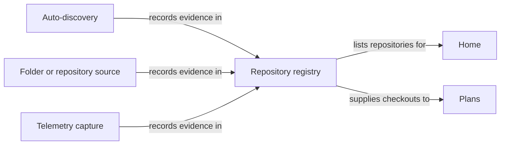
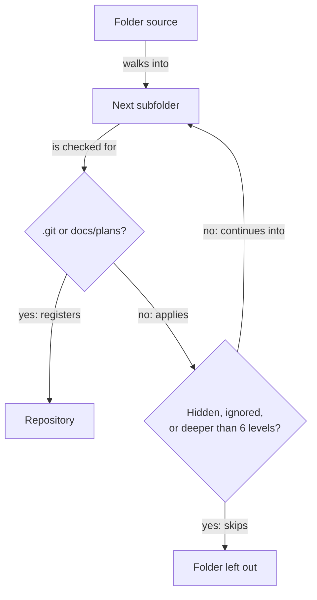

# Repositories in the Portal

The portal Home page is a directory of the repositories RoboRepo already knows about. Settings
is the durable place to review repository discovery and the other cross-portal setup choices. It puts
active checkouts and their running applications first, then links each repository to a persistent
detail page at `/repositories/<urlKey>`.

## Open the directory

Run:

```sh
roborepo web
```

The command opens `/`. On a new machine the directory is empty until you tell RoboRepo how to find
repositories. RoboRepo inspects nothing on the machine — no process observation and no folder walk —
until you take one of the two actions the empty state offers:

- **Enable auto-discovery of active repos** (primary) — RoboRepo watches the dev servers and
  containers you run and remembers the repositories they run in.
- **Add a folder** (secondary) — RoboRepo registers one exact repository, or every repository it
  finds inside a parent folder.

Every repository then looks and behaves the same, however it was found.

## Repository sources

A repository source is a way RoboRepo is allowed to find repositories. There is one built-in source
and any number of folders you add.

| Source | Finds | Default |
| --- | --- | --- |
| Auto-discovery | The repositories your running dev servers and containers run in | Off |
| Repository | That one repository | Added by you |
| Folder | Every repository beneath the folder, using the bounded walk below | Added by you |

Telemetry capture is not a repository source. An agent session adds evidence to a repository a
source already found, so its token usage is attributed there, but it never adds a repository on its
own. A repository you only use with agents appears once auto-discovery or a folder finds it, and its
earlier sessions attach to it then.



The same repository found by several sources is one repository: identity comes from the Git remote
(or, without one, from the checkout), never from which source found it. Overlapping folders such as
`~/projects` and `~/projects/app` therefore still produce one `app`.

### Manage repositories

**Manage repositories** opens one dialog from Settings, Home's heading, the repository count in the
Plans header, and the empty states. Top to bottom it shows:

1. **Auto-discovery** — the Enable button with a sentence explaining that it permits observation of
   active apps and automatic repository enrollment, or, when on, a status line such as
   `On · 4 repos found` and **Turn off**.
2. **Repositories** — one list of every known repository. Each row offers **Pin** and **Ignore
   repository**, whatever found it. A quiet `Found by:` line explains the sources, for example
   `Found by: auto-discovery, ~/projects`. Ignored repositories sit in a collapsed **Ignored** group,
   each with **Restore**.
3. **Add a folder to find more repos** — then each added folder with its state, kind, repository
   count, and **Refresh**, **Disable**, and **Remove**. **How folder scanning works** explains the
   walk.

A path RoboRepo can read is classified for you: a folder with `.git` or `docs/plans` is a repository,
any other folder is a folder of repositories. A path that is missing or unreadable when you add it
asks which of the two it is. That answer is kept on every later refresh, so a path that becomes
readable never broadens into a folder walk you did not ask for.

### Folder walk

A folder source walks down through subfolders until it finds a repository, and never scans a found
repository's own subfolders as candidates:



| Rule | Value |
| --- | --- |
| Maximum depth below the folder | 6 levels |
| Time budget per walk | 5 seconds |
| Maximum repositories per walk | 250 |
| Skipped folder names | names starting with `.`, and `node_modules`, `.git`, `vendor`, `dist`, `build`, `.cache`, `coverage`, `.next`, `.venv`, `__pycache__` |
| Linked Git worktrees | not registered on their own; the main checkout stands for the repository |

The walk tracks each folder's real path and never descends into one twice, so symlink cycles end.

### Source states

A folder is refreshed when you add it, enable it, or select **Refresh**. One failed source never
affects the others or the registry.

| State | Meaning |
| --- | --- |
| Not scanned yet | The source has not been refreshed. |
| Healthy | The last refresh read everything it was asked to. |
| Partial | The walk ran out of time or reached the repository cap, or some subfolders could not be read. Repositories it did not reach keep their earlier evidence. |
| Unavailable | The path is missing, moved, or unreadable. |
| No repository here | A repository source's path no longer holds a repository. |
| Error | The refresh failed for another reason. |

### Turning off and removing sources

Turning a source off and removing it have the same effect on repositories:

1. The source's evidence is removed from every repository. Turning auto-discovery off also stops
   Runtime's process scans.
2. A repository still found by another source stays known and unchanged.
3. A repository left with no source is not deleted. It stays listed (the dialog notes `No current
   source`), and the 30-day ageing sweep hides it once it has not been seen for 30 days.

**Forget This Repo** on Home is offered only for a repository with no known checkout, so it never
competes with a source that would find the repository again.

### Ignore repository

**Ignore repository** — on Home's card menu, Runtime's repository menu, and the Manage repositories
list — hides a repository everywhere: Home's directory and normal Plans entries leave it out, and
later auto-discovery does not bring it back. Restore it from the dialog's **Ignored** group, or from
Runtime's settings.

Runtime's **Hide from Runtime** is different: it only tucks running apps or Compose stacks away on the
Runtime page and changes nothing about the repository.

## Directory order

Home uses the same lifecycle facts as Runtime. It orders repositories as follows:

1. pinned;
2. active;
3. idle, most recently seen first;
4. stale.

Activity that Runtime cannot associate with a canonical repository appears separately as unresolved
activity. It is not promoted into a repository card.

## Repository cards

Each card combines a compact view of several domains:

- **Workspace and Git** — every known main checkout and worktree is named by its branch when
  available. Dirty state, ahead/behind counts, and base-branch drift appear on the same row.
- **Running application** — a checkout's promoted primary application is a clickable port. A host
  development server and a Compose-backed application behave the same here. Secondary ports and
  hosting diagnostics remain on Runtime.
- **Plans** — below the main checkout, every active plan gets one row, ahead of the remaining
  worktrees. The plan title opens the plan drawer, and its completion ring or **done** sits beside it.
  - A plan whose `worktree` field names a linked worktree Home shows becomes that worktree's row: the
    plan title replaces the branch label, a worktree button opens the branch, worktree name, and path
    (each with its own copy action) plus any dirty, ahead/behind, or drift facts, and the port, Links,
    and Git warning stay where the checkout row puts them. The match is exact: the plan's value must
    equal the worktree's Git administrative name, exactly one active plan must claim it, and exactly
    one known worktree must carry it. Branch names and checkout paths are never used to guess.
  - Any other plan is its own row with a badge: **not started** when it names no worktree, and
    **worktree not running** when the worktree it names is stopped, missing, or claimed twice.
  - Worktrees no plan claimed follow as ordinary checkout rows.
  - One unlabeled line closes the list with the repository's Active and Backlog counts and an
    **all plans** link, and says so when Plans coverage is partial. A repository with no active
    plans, or one Plans has not scanned, lists its worktrees as plain checkout rows with no plan
    rows or counts. Completed plans never appear.
- **Tokens** — recent repository-associated session warnings appear while token tracking is on and a
  cached Tokens analysis is available. With tracking off, Home shows no warnings, even if earlier
  captures are still on disk, which matches the Tokens page.
- **Agents** — repository-scoped agent configuration is currently unavailable and is labeled that
  way.

Cards with more than five checkouts put the additional rows in an expandable section. An open
section and a focused control are not rebuilt during polling, so keyboard position and expanded
state remain stable.

## Repository detail

Select a repository name or its **Details** link to open `/repositories/<urlKey>`. The URL is
bookmarkable and browser Back/Forward navigation works normally. The detail page includes:

- browser-safe identity and discovery provenance;
- all known checkouts, Git state, and promoted application links;
- repository-level Git warnings;
- active/backlog plan counts and plans changed in the last seven days;
- recent Tokens warnings and their severity;
- the current Agents availability state;
- links to the full Runtime, Plans, Tokens, and Agents pages.

Those domain links are currently unscoped. Repository-scoped domain navigation can be added without
changing the detail URL or its stable `urlKey`.

An unknown or hidden key renders an explicit unavailable page and the overview API returns 404.

## Status and freshness

Runtime, Plans, and Tokens refresh independently. Each domain therefore carries its own status:

| Status | Meaning |
| --- | --- |
| `available` | Cached data is present. |
| `partial` | Data is present, but coverage or collection was incomplete. |
| `stale` | The latest refresh failed and last-known data is retained. |
| `unavailable` | No usable data is currently cached for that domain. |

One unavailable domain does not remove the repository or block the other sections. Home and detail
poll cached summaries every ten seconds; those polls do not start Runtime discovery, a Plans scan,
or Tokens analysis.

## Privacy boundary

Repository identity is path-free. Repository ids, summaries, browser keys, and URLs never contain an
absolute path, so they mean the same thing on every machine and are safe to paste into a chat or an
issue. A repository with no Git remote gets an opaque `local:` id derived from its path rather than
the path itself.

Checkout paths are machine-local facts, and the browser receives them only as checkout details and
as source paths in the Manage repositories dialog. The
Home payload includes each known checkout's path for its tooltip and copy button. It is never used
as identity and never appears in a URL. The portal listens on `127.0.0.1` only and answers only
requests addressed to a loopback host name, so the payload is served to this machine's browser and
not to other websites open in it.

Repository pages receive an allowlisted payload: the display name, stable browser key, lifecycle,
branch and worktree identity, selected Git facts, checkout paths as above, and the promoted
application's origin and Runtime key, which Home uses to discover that application's routes. A
linked worktree's identity is its Git administrative name, which contains no path. The payload does
not include:

- absolute paths in repository ids, browser keys, or URLs;
- the canonical internal repository id in the URL;
- Runtime keys for anything other than a checkout's promoted application;
- secondary ports, PIDs, container ids, or Compose internals;
- telemetry prompts or transcript content.

The browser key is allocated once and remains stable if the repository display name changes.

Configured source paths reach the browser only through the `/api/repositories/sources` routes, which
the Manage repositories dialog reads, and are shown there with your home folder written as `~`.
Every other payload refers to a source by its opaque id or label.

## Registry compatibility

The registry uses schema version 3, which records each source's evidence separately. When RoboRepo
first encounters an older registry (version 1 or 2), it replaces it with a fresh version 3 file. It
does not migrate or back up the old file. Sources repopulate repository facts, but earlier pins,
ignored/restored choices, aliases, timestamps, local-root ownership, and allocated browser keys are
discarded. Browser keys are allocated from display names, so most return unchanged. Plans folders
configured before repository sources existed are not carried over; add them again under **Manage
repositories**.

An unknown future schema version is rejected instead of being overwritten.

Repository sources are stored beside the registry in `~/.roborepo/repositories/sources.json`. A
malformed file is set aside as `sources.json.invalid-<timestamp>`, sources reset to their defaults,
and the dialog says so.
